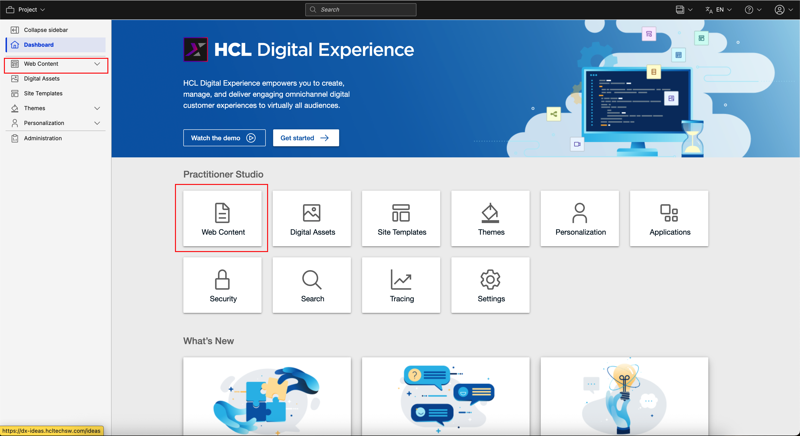
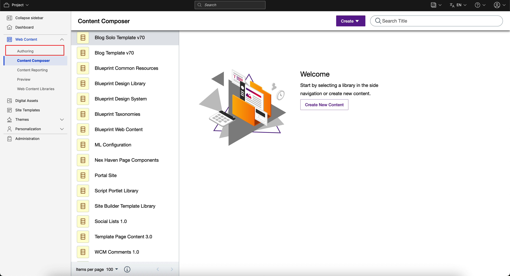
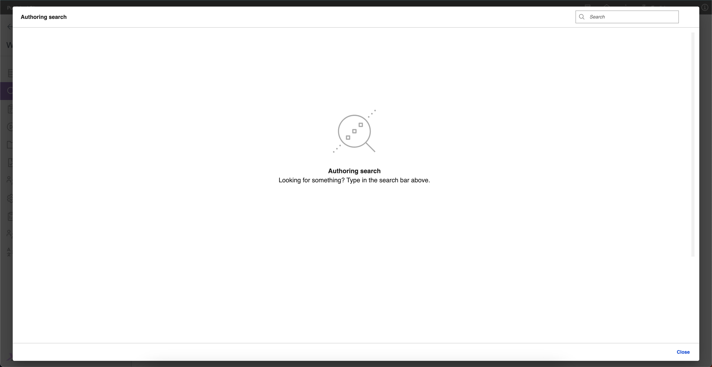

# Accessing Search V2 Authoring

This section provides steps on how to access the Search V2 Authoring page and portlet.

## Prerequisite

Starting from HCL Digital Experience (DX) 9.5 CF227, you can enable Search V2 Authoring. For instructions on how to install Search V2 Authoring manually on supported environments, refer to [Installing HCL Digital Experience 9.5 Search V2 Authoring](./installation.md).

After configuring the image in your HCL DX 9.5 CF227 deployment, you can access Search V2 Authoring from the Practitioner Studio interface.

!!! note
    Authentication is required to access the Search page. The search results displayed will depend on your assigned user role.

## Accessing Search V2 Authoring from Practitioner Studio

To access Search V2 Authoring from the Practitioner Studio, log in to your HCL Digital Experience 9.5 platform and navigate to **Web Content** from the Practitioner Studio homepage or the side navigation panel.

Open the side navigation panel, and select **Authoring**.

Refer to the Search V2 Authoring user interface below and click the search button to open the search dialog.

## The Search V2 Authoring UI

The Search V2 Authoring UI has the following components:

-   **Search Header** - This section includes the page title and a button to open the search dialog.
-   **Search Dialog** - This section includes an input field in the dialog header for entering your query. The dialog body displays a data grid with search results and pagination, while the dialog footer provides a Close button.
-   **Search Data Grid** - This section displays the search results in a table with columns headers for Title, Name, Status, Authors, Last modified, and Location. Hovering over a column header reveals a sort icon, allowing you to sort the results in ascending or descending order. Each row includes an edit icon to open the item in Edit mode and a three-dot icon to reveal additional options such as Read mode or Preview mode.
-   **Pagination** - This component displays the current number of rows per page and the total number of pages for the search results. You can adjust the number of rows per page or navigate to the next, previous, first, or last page.
