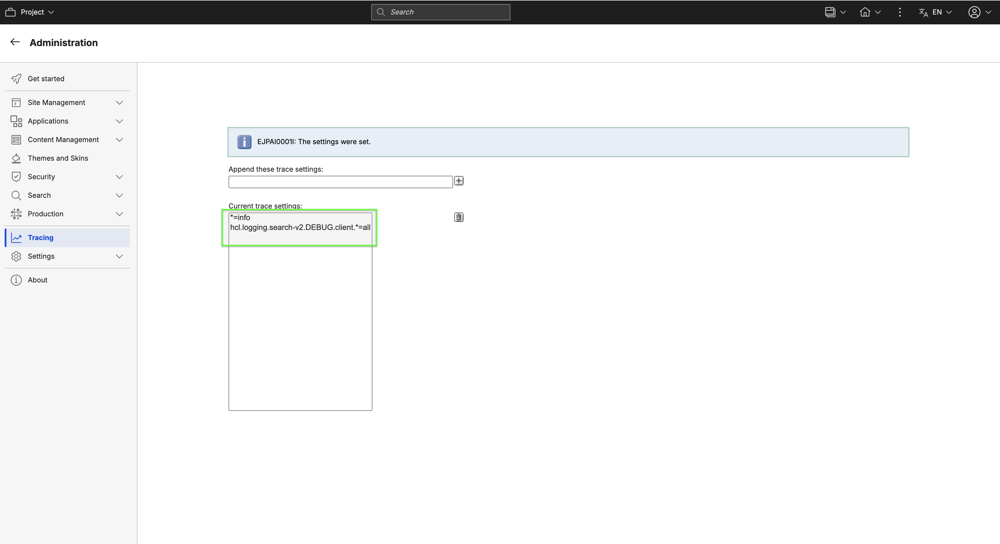
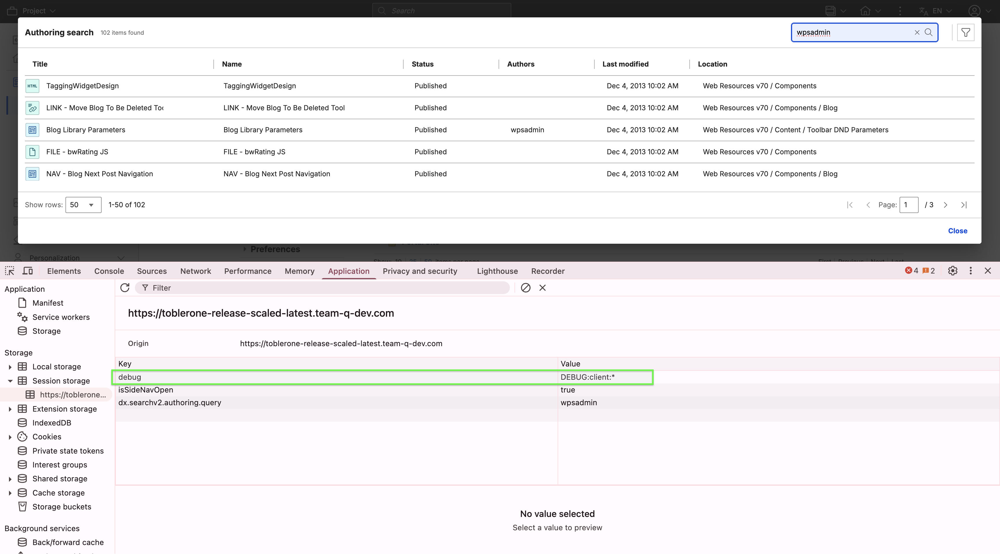

# Accessing Search V2 Authoring

This section provides steps on how to access the Search V2 Authoring page and portlet.

## Prerequisite

Starting from HCL Digital Experience (DX) 9.5 CF227, you can enable Search V2 Authoring. For instructions on how to install Search V2 Authoring manually on supported environments, refer to [Installing Search V2 Authoring](./installation.md).

After configuring the image in your HCL DX 9.5 CF227 deployment, you can access Search V2 Authoring from the Practitioner Studio interface.

!!! note
    You must be authenticated to access the SearchV2 Authoring page. The search results displayed will depend on your assigned user role.

## Accessing Search V2 Authoring from Practitioner Studio

Refer to the following steps to access Search V2 Authoring from the Practitioner Studio. 

1. Log in to your HCL DX 9.5 platform then select **Web Content** from the side navigation panel. Alternatively, you can click the **Web Content** card from the Practitioner Studio homepage.

    

2. In side navigation panel, select **Authoring**.

    

3. Click **Search** on the upper-right corner of the Authoring page. This will open the Search V2 Authoring dialog.

    

## The Search V2 Authoring UI

The Search V2 Authoring UI has the following components:

- **Search Header** - This section includes the page title and a button to open the search dialog.
- **Search Field** - This section includes an input field for entering your query.
- **Search Data Grid** - This section displays the search results in a table with columns headers for Title, Name, Status, Authors, Last modified, and Location. Hovering over a column header reveals a sort icon, allowing you to sort the results in ascending or descending order. Each row includes an edit icon to open the item in Edit mode and a three-dot icon to reveal additional options such as Read mode or Preview mode.
- **Pagination** - This section displays the current number of rows per page and the total number of pages for the search results. You can adjust the number of rows displayed per page or navigate to the next, previous, first, or last page.
- **Advance Search Filter** – The Advanced Search Filter panel helps you narrow down search results. It has a toggle to enable or disable it, a header with a close icon, and an Attribute Selector where you can choose the search scope: Description, Title, Type, or All attributes (default).

    You can add specific filters from the Add Search Filter dropdown, including:

    - **Author**: Search for users or groups by typing at least three characters.
    - **Status**: Filter by Draft, Published, or Archived.
    - **Last Modified**: Select from preset date ranges or define a custom range.

Applied filters appear in the panel and can be removed individually or all at once with the Clear button. The Apply button refreshes results based on the applied filters. The system only displays items that match all selected conditions.

- **Troubleshooting/Logging/Tracing via DX tracings** - With the following tracing string the full loging could be enabled for the whole search V2 application. DEBUG is also showing the ERROR and INFO log level. INFO is also showing the ERROR log level.

    - **Full logging** hcl.logging.search-v2.DEBUG.client.*=all
    - **Logging only for all search V2 components** hcl.logging.search-v2.DEBUG.client.ui.*=all
    - **Logging only for all AC web-componets** hcl.logging.search-v2.DEBUG.client.web-components-lib.*=all

    

- **Troubleshooting/Logging/Tracing DX session storage** - With the following session storage entry the logging could be enabled for the whole search V2 application. DEBUG is also showing the ERROR and INFO log level. INFO is also showing the ERROR log level.

    - **Full logging** Key: debug Value: DEBUG:client:*
    - **Logging only for all search V2 components** Key: debug Value: DEBUG:client:ui:*
    - **Logging only for all AC web-componets** Key: debug Value: DEBUG:client:web-components-lib:*

    