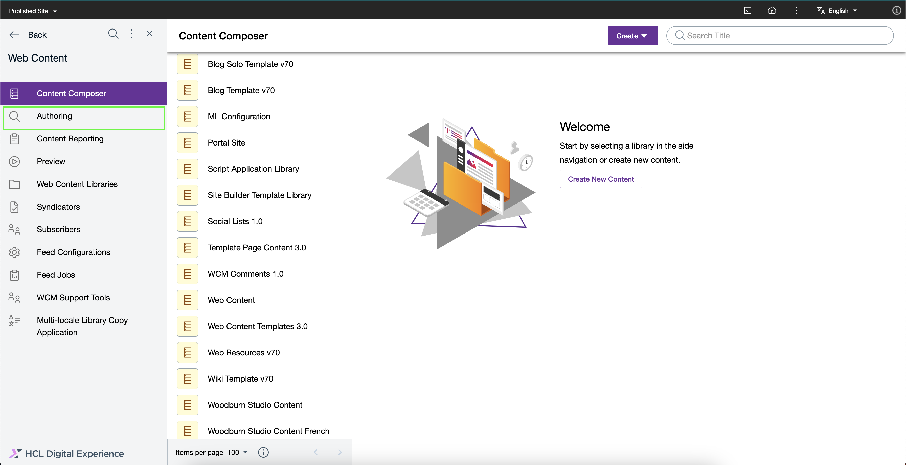
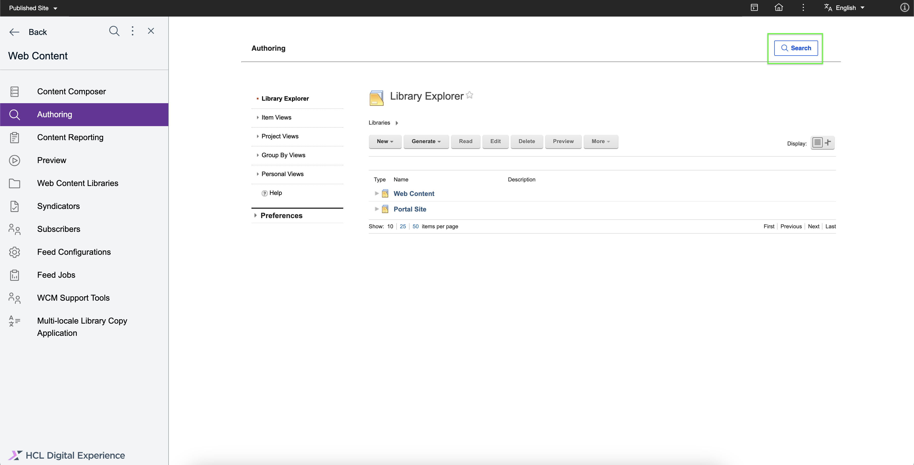
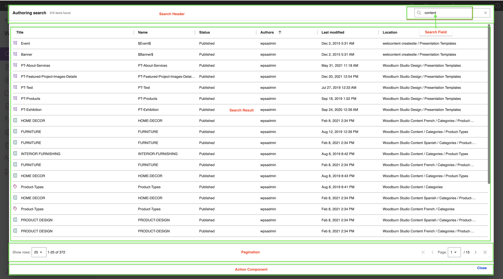

# Accessing Search V2 Authoring

This section provides steps on how to access the Search V2 Authoring page and portlet.

## Prerequisite

Starting from HCL Digital Experience (DX) 9.5 CF227, you can enable Search V2 Authoring. For instructions on how to install Search V2 Authoring manually on supported environments, refer to [Installing HCL Digital Experience 9.5 Search V2 Authoring](./installation.md).

After configuring the image in your HCL DX 9.5 CF227 deployment, you can access Search V2 Authoring from the Practitioner Studio interface.

!!! note
    You must be authenticated to use the Search page. The search results will vary based on your current user role.

## Accessing Search V2 Authoring from Practitioner Studio

To access Search V2 Authoring from the Practitioner Studio, log in to your HCL Digital Experience 9.5 platform, and select **Web Content** from the Practitioner Studio homepage or side navigation panel.

Open the side navigation panel, and select **Authoring**.

See the Search V2 Authoring user interface below.

## The Search V2 Authoring UI

The Search V2 Authoring UI has the following components:

-   **Search Header** - This section contains the title of the page and a button that opens the search dialog.
-   **Search Dialog** - This section displays input field where you can type your query in the dialog header. In the dialog body, the search data grid with results and pagination will be displayed. In the dialog footer, a Close button is available.
-   **Search Data Grid** - This component displays the search results in a table form with columns such as title, name, status, author, last modified date, and location. On hover of each column header, a sort icon appears that you can click to change the sorting of results. On each result row, there is an edit icon that will open the item on Edit mode, as well as an overflow menu icon, that opens a menu where you can select Read or Preview mode when you open the item.
-   **Pagination** - This component shows the current number of rows per page and the number of available pages for the search results. You can change the number of rows per page or navigate to next page, previous page, first page, and last page.
