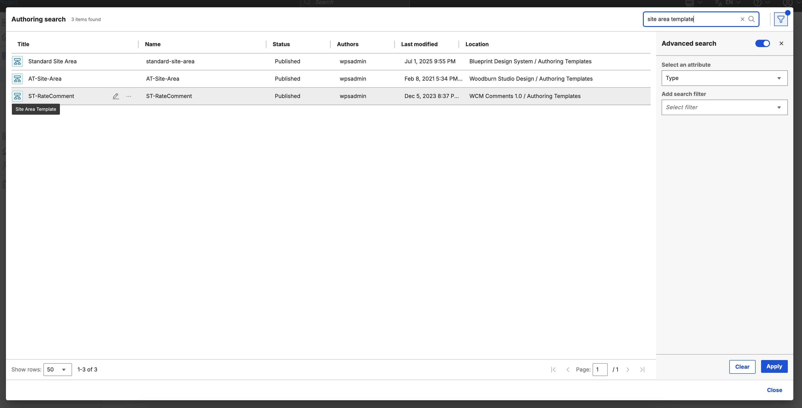

# Limitations of Search V2 Authoring

Take note of the following limitations when using Search V2 Authoring:

## Searchable Fields

- Advanced search filters are not currently supported.

### Content and Indexing

- Currently, the Authoring Search feature of Document Conversion Services only supports JCR content.

- It does not support content stored in the Digital Asset Management (DAM) repository.

## Basic Actions

- Currently, only Edit, Read, and Preview actions are available for search result items.

## Bulk Action

- Bulk actions are not currently supported.

## Localization

- The UI is only available in English.

## Accessibility

- To ensure full accessibility on the Search page, the user's browser-specific settings for keyboard navigation must be enabled.

    See the keyboard navigation setting for Firefox.
    {: style="height:600px"}

    See the keyboard navigation setting for Safari.

    {: style="height:600px"}

## Delete

- When an item is deleted, it might still show up in search results as the Web Content Manager (WCM) does not instantly push deletion updates. The item will appear until the next [crawler run](../search/searching_local_portal/srccrwlindxsite.md) updates the search index.

- The Delete feature is disabled if the user is working on a project.

## Advanced Search Filter

- When filtering results by **Author**, you must type at least three characters to begin searching for users or groups.
- The search function is not case-sensitive, but it is sensitive to spelling errors.

    {: style="height:600px"}
