# Using Search V2 Authoring

Use Search V2 Authoring to generate search results from a JCR content source. This section explains how to create a set of search results using Search V2 Authoring.

## Prerequisites

- Starting with HCL Digital Experience (DX) 9.5 CF227, you can enable Search V2 Authoring. For detailed instructions on manually installing Search V2 Authoring in supported environments, refer to [Installing and Deploying Search V2 Authoring](./installation.md).

- For instructions on how to access the Search V2 Authoring UI, refer to [Accessing Search V2 Authoring](./access.md).

## Generating a set of search results

Search results are generated based on the keywords or phrases entered in the search input field. A JCR content source is pre-configured for use with Search V2 Authoring.

1.  Log in to your HCL DX 9.5 platform then select **Web Content** from the side navigation panel. Alternatively, you can click the **Web Content** card from the Practitioner Studio homepage.

    

2.  In side navigation panel, select **Authoring**.

    

3.  Click **Search** on the upper-right corner of the Authoring page. This will open the Search V2 Authoring dialog.

    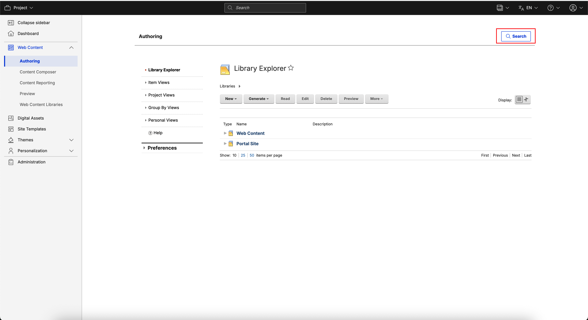

    See the Search V2 Authoring interface.

    

4.  In the Search V2 Authoring user interface, enter your search terms on the **Search** field, then press **Enter**. In the following example, the term "content" is searched.

    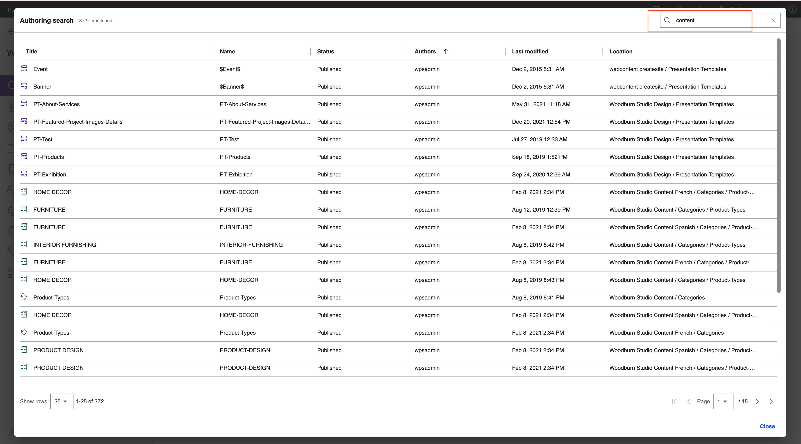

5.  View the search results generated. You can see the total number of search results in the upper-left corner of the dialog. In the following example, the term "content" generated 372 search results. Below the table of results, you can also see more detailed pagination information. 

    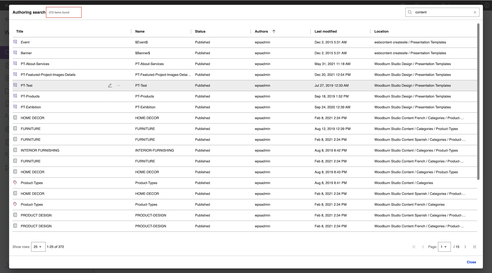

6.  To navigate through the search results, adjust the page size and current page at the bottom of the page.

    1. Click the **Show rows:** dropdown then select **25**.

        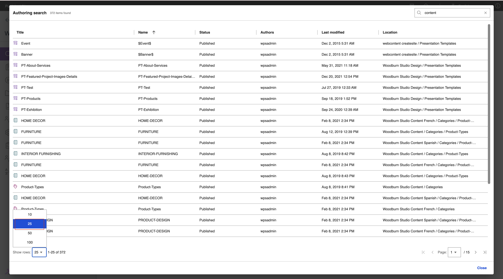

    2. Click the dropdown with label **Page:** and select "2".

        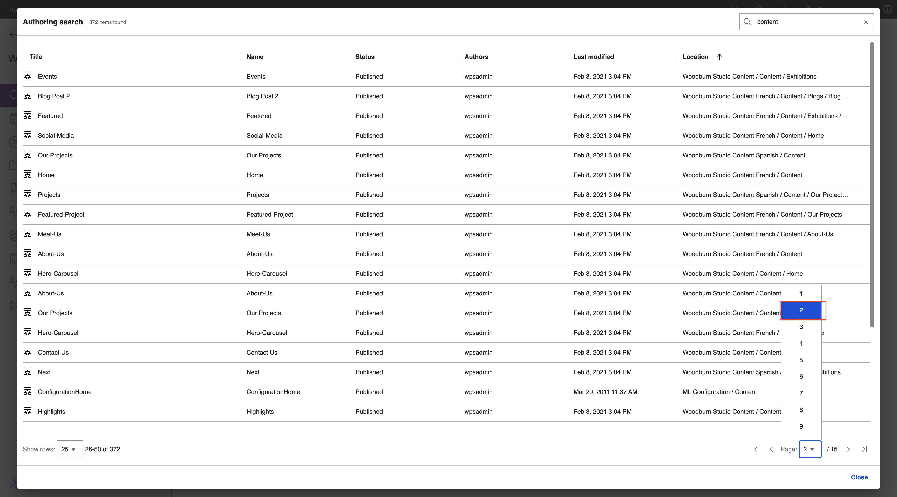

7.  Hover over a column header such as "Title" and click on the sorting icon that appears. Search by **title** in an **ascending** order.

    

8.  **To Edit an Item**: Hover over a result item row and click on the Edit icon.

    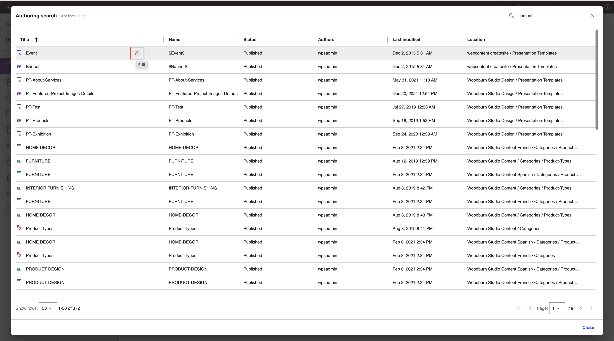

9.  Reopen the SearchV2 Authoring dialog by clicking on the header button.

    

10. **To See more actions for the Item**: Hover over a result item row and click on the overflow menu icon or icon with triple dots.

    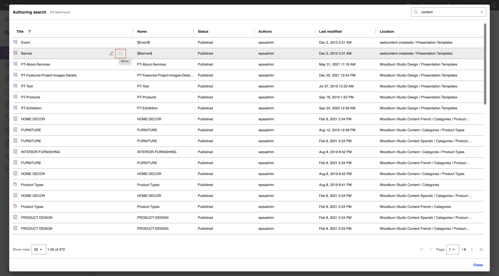

11. **To Open an Item**: Click on Read option to open the item in the same tab under Read mode.

    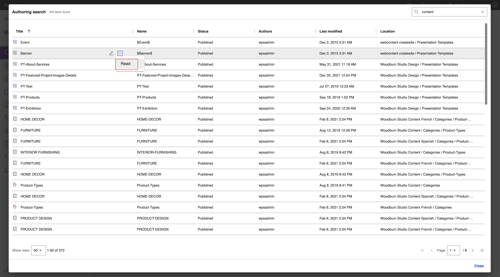

12. Reopen the SearchV2 Authoring dialog by clicking on the header button.

    

13. **To See more actions for the Item**: Hover over a result item row and click on the overflow menu icon or icon with triple dots.

    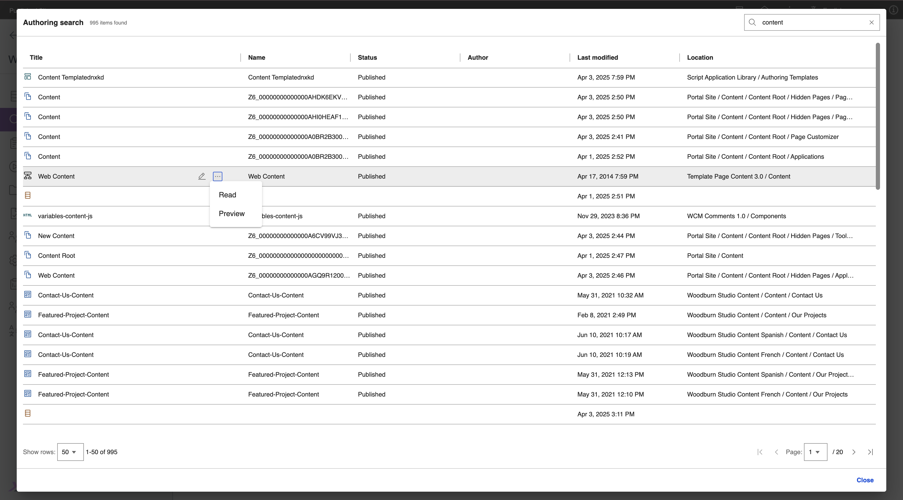

14. **To Preview an Item**: Click on Preview option to open the item in a new tab under Preview mode.

    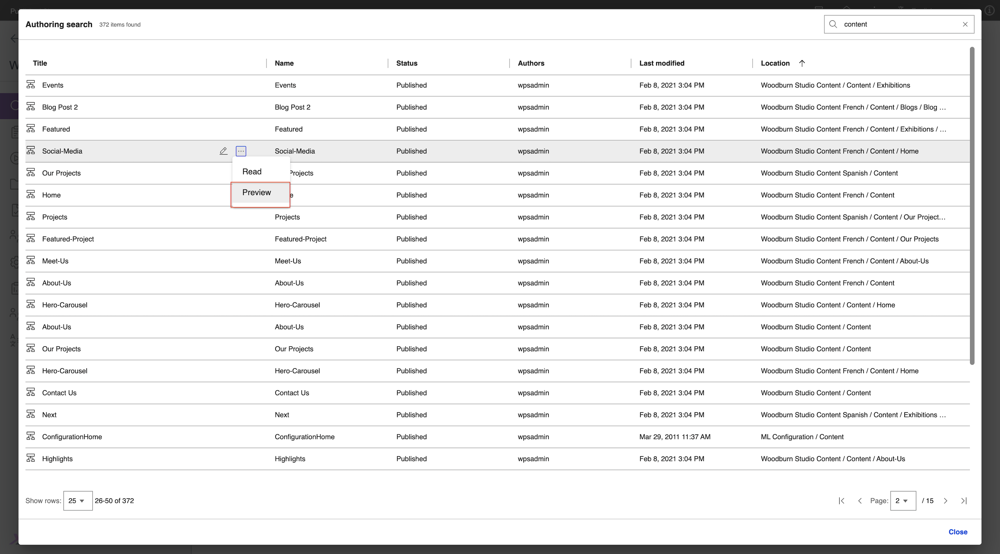

## Other search result scenarios

- If the search term yields no results, the following message is displayed.
    
    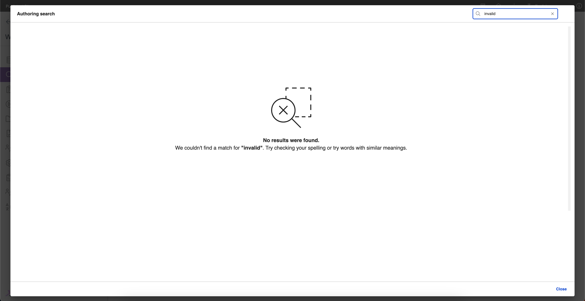

- If the search engine is down or unavailable, the following message is displayed.
    
    