Using Search V2 Authoring

Use Search V2 Authoring to generate search results from a JCR content source. This section explains how to create a set of search results using Search V2 Authoring.

## Prerequisites

- Starting with HCL Digital Experience (DX) 9.5 CF227, Search V2 Authoring can be enabled. For detailed instructions on manually installing Search V2 Authoring in supported environments, refer to [Installing HCL Digital Experience 9.5 Search V2 Authoring](./installation.md).

- For instructions on how to access the Search V2 Authoring UI, refer to [Accessing HCL DX 9.5 Search V2 Authoring](./access.md).

## Generating a set of search results

A set of search results is generated based on the keywords or phrases you enter in the Search input field. A JCR content source has already been pre-configured for the Search V2 Authoring.

1.  Log in to your HCL DX 9.5 platform then select **Web Content** from the Practitioner Studio homepage or side navigation panel.

    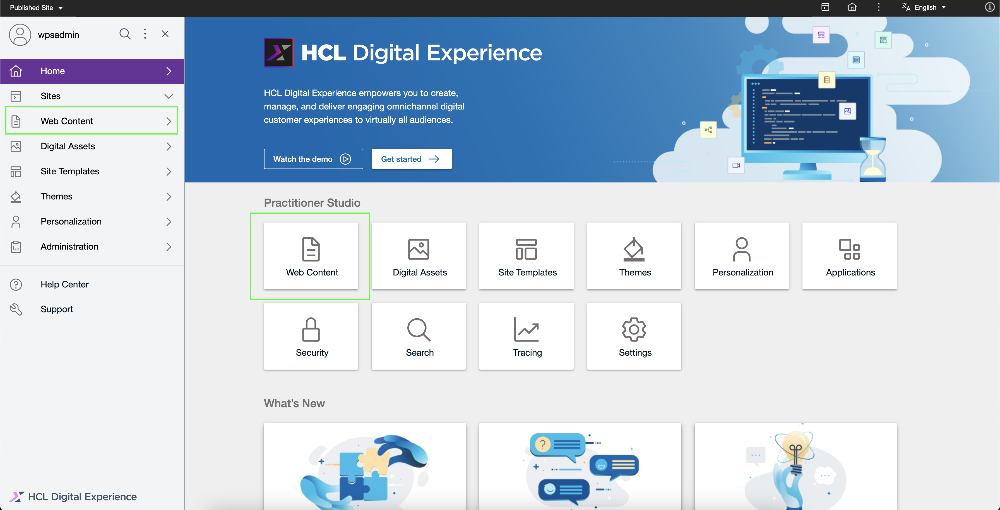

2.  Open the side navigation panel, and select **Authoring**.

    

3.  Click on the **Search** button on the header and view the SearchV2 Authoring user interface.

    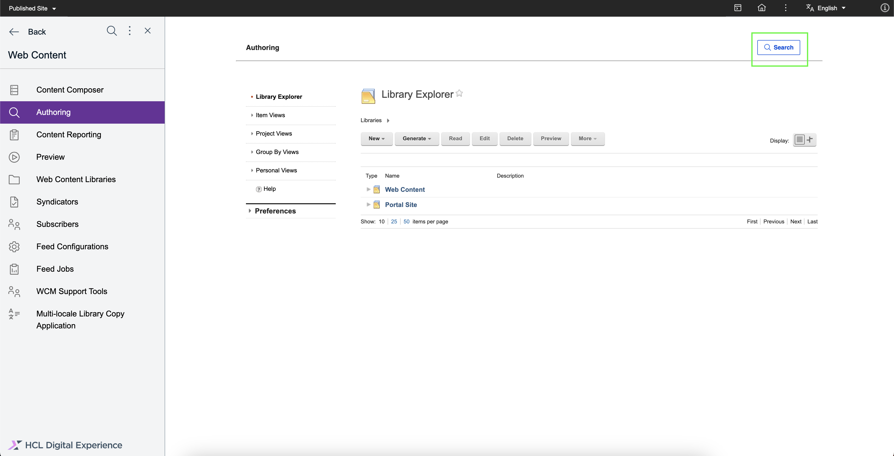

    

4.  In the Search V2 Authoring user interface, enter your search terms on the **Search** field, then press **Enter** on your keyboard. In the example below, the term "content" is searched.

    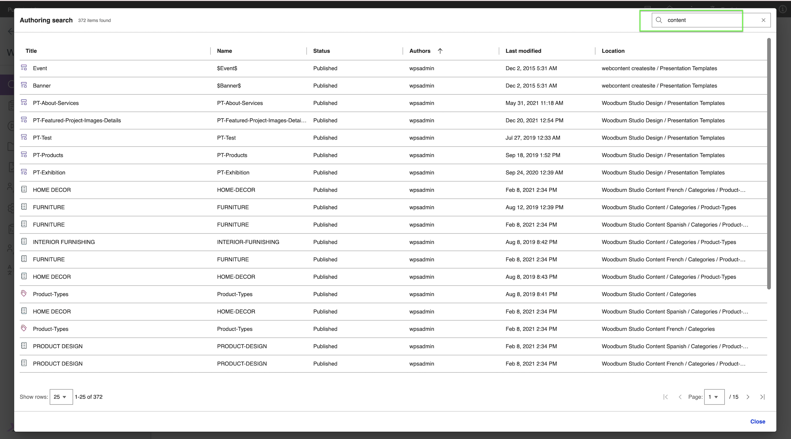

5.  View the search results generated. Beside the dialog title, you can see the total number of results found for the search term. Below the table of results, you can also see more detailed pagination information. In the example below, the term "content" generated 372 search results.

    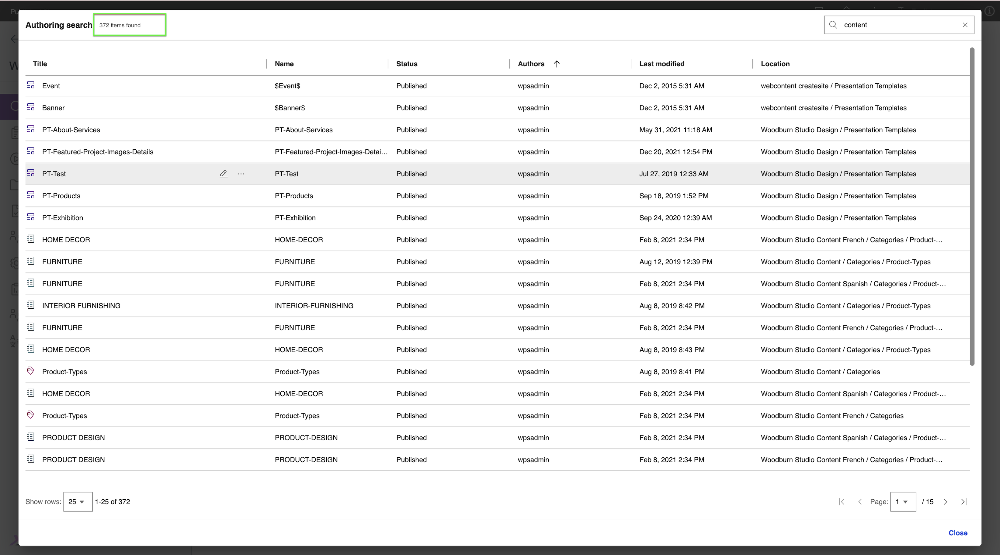

6.  Navigate thru the search results by changing the page size and current page.

    1. Click the dropdown with label **Show rows:** and select "25".

        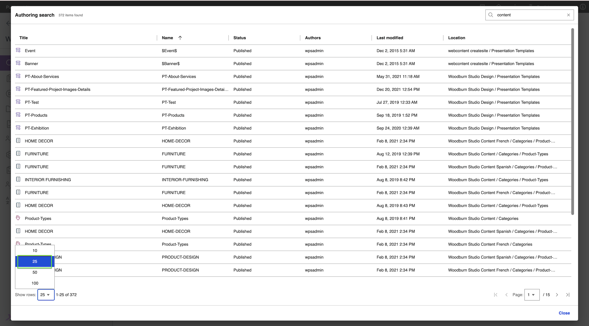

    2. Click the dropdown with label **Page:** and select "2".

        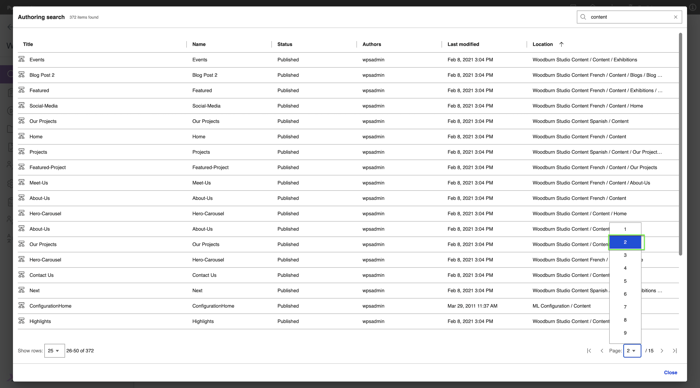

7.  Hover over a column header such as "Title" and click on the sorting icon that appears. Search by **title** in an **ascending** order.

    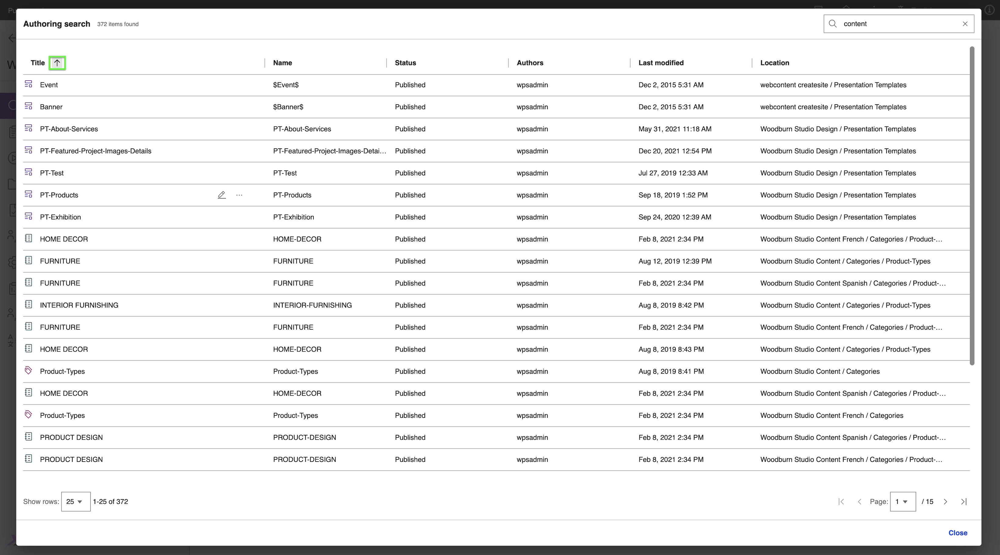

8.  **To Edit an Item**: Hover over a result item row and click on the Edit icon.

    

9.  Reopen the SearchV2 Authoring dialog by clicking on the header button.

    

10. **To See more actions for the Item**: Hover over a result item row and click on the overflow menu icon or icon with triple dots.

    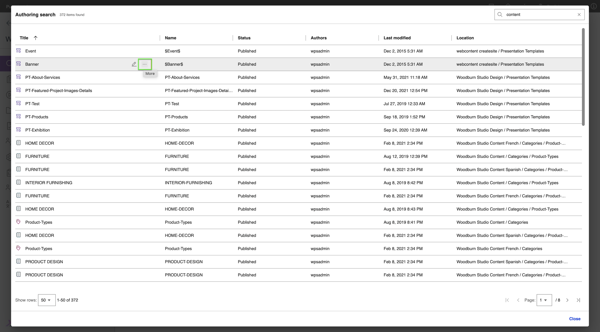

11. **To Open an Item**: Click on Read option to open the item in the same tab under Read mode.

    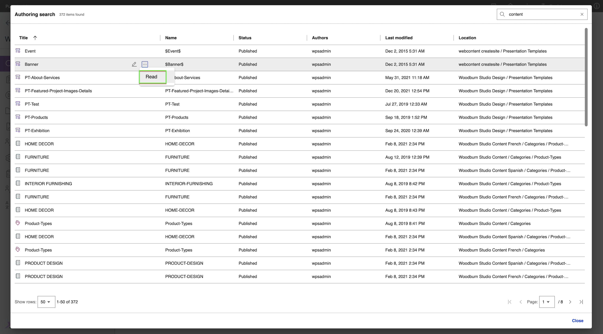

12. Reopen the SearchV2 Authoring dialog by clicking on the header button.

    

13. **To See more actions for the Item**: Hover over a result item row and click on the overflow menu icon or icon with triple dots.

    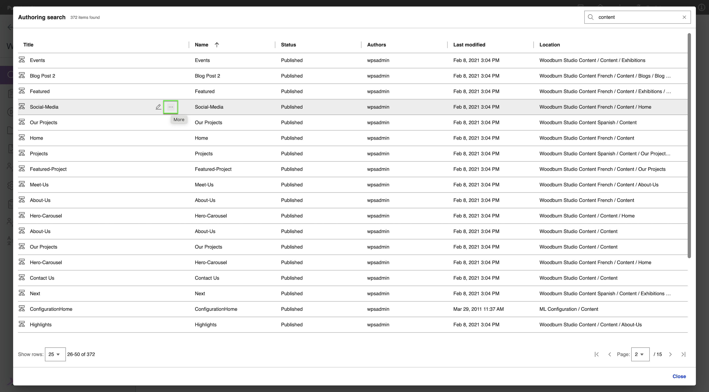

14. **To Preview an Item**: Click on Preview option to open the item in a new tab under Preview mode.

    

## Other search result scenarios

- If the search term yields no results, the following message is displayed.
    
    

- If the search engine is down or unavailable, the following message is displayed.
    
    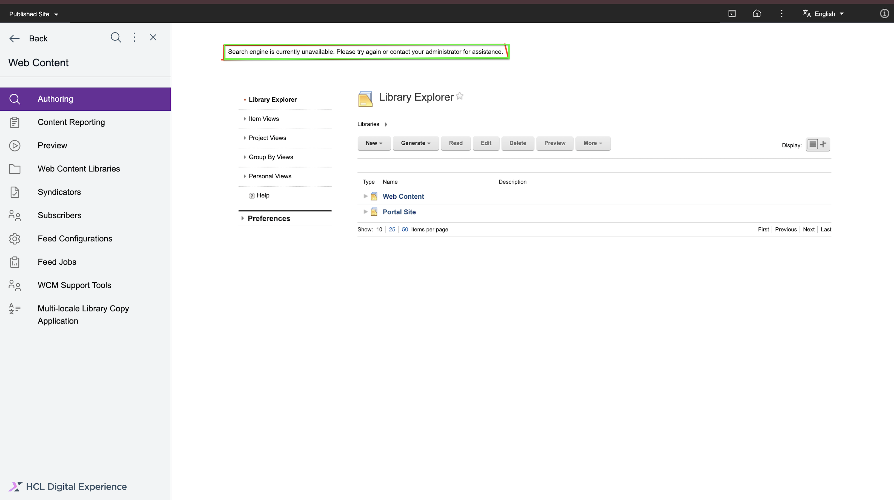