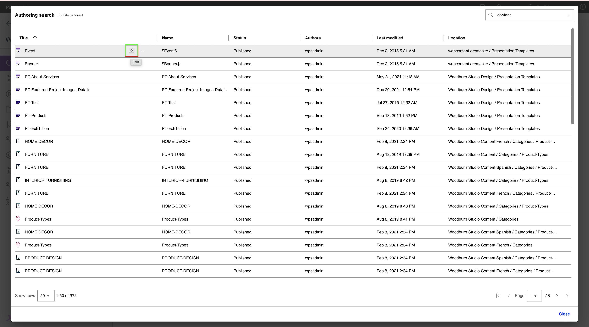
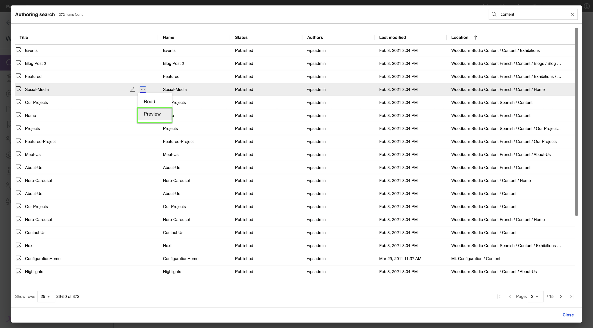
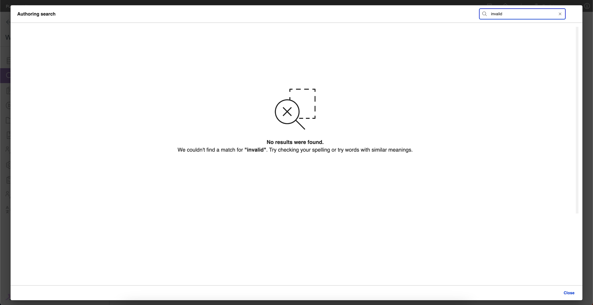

# Using Search V2 Authoring

Use Search V2 Authoring to generate search results from a JCR content source. This section explains how to create a set of search results using Search V2 Authoring.

## Prerequisites

- Starting with HCL Digital Experience (DX) 9.5 CF227, you can enable Search V2 Authoring. For detailed instructions on manually installing Search V2 Authoring in supported environments, refer to [Installing and Deploying Search V2 Authoring](./installation.md).

- For instructions on how to access the Search V2 Authoring UI, refer to [Accessing Search V2 Authoring](./access.md).

## Generating a set of search results

Search results are generated based on the keywords or phrases entered in the search input field. A JCR content source is pre-configured for use with Search V2 Authoring.

1. Log in to your HCL DX 9.5 platform then select **Web Content** from the side navigation panel. Alternatively, you can click the **Web Content** card from the Practitioner Studio homepage.

    

2. In the side navigation panel, select **Authoring**.

    

3. Click **Search** on the upper-right corner of the Authoring page. This will open the Search V2 Authoring dialog.

    

    See the Search V2 Authoring interface.

    

4. In the Search V2 Authoring user interface, enter your search terms on the **Search** field, then press **Enter**. In the following example, the term "content" is searched.

    

5. View the search results generated. You can see the total number of search results in the upper-left corner of the dialog. In the following example, the term "content" generated 372 search results. Below the table of results, you can also see more detailed pagination information. 

    

6. To navigate through the search results, adjust the page size and current page at the bottom of the page.

    1. Click the **Show rows:** dropdown then select **25**.

        

    2. Click the dropdown with label **Page:** and select "2".

        

7. To sort the results in ascending or descending order, hover over a column header and click the sorting icon that appears. In the following example, the **Title** header is sorted in **ascending** order.

    

8. To edit a search result item, hover over a result and click the **Edit** icon.

    

9. To see more actions for an item, hover over a result and click the **More** three-dot icon.

    

10. To open an item, hover over the result then click **More > Read**.

    

11. To preview an item in a new tab, hover over the result then click **More > Preview**.

    

12. To delete an item, hover over the result then click **More > Delete**.

    For more information, see [Deleting an item from the result](./usage.md#deleting-an-item-from-search-results).

## Other search result scenarios

- If the search term yields no results, the following message is displayed.

    

- If the search engine is down or unavailable, the following message is displayed.

    

## Deleting an item from search results

Starting from CF229, you can now delete items from the search results. To delete an item, refer to the following steps:

1. Hover over the search result item you want to delete, then click **More > Delete**.

    

2. On the confirmation page, review the item to be deleted and its warning message. To proceed, click **Delete**.

    A different warning will appear depending on the item type.

    Warning for site areas and libraries:

    

    Warning for all other item types:

    

    After confirming the deletion, a success message will be displayed:

    

    If the deletion failed, one of the following messages will be displayed:

    - Failed due to existing references to the item
        

    - Failed due to non-existing item
        

## Advanced Search Feature

- Beginning with CF230, the Advanced Search Filter feature enables users to refine search results by applying multiple filter criteria, such as Author, Status, and Last Modified. This functionality helps efficiently narrow down large data sets.

1. To access the advanced search filters, click the **filter icon** at the top-right corner of the page.

    

2. By default, the advanced search filters are **disabled**. Click the **toggle button** to enable them.

    

3. After enabling, user can choose an attribute from the **Select an attribute** dropdown and a filter from the **Add search filter** dropdown.

    

4. Users can select an attribute from the dropdown list, which contains four options: **Description, Title, Type, and All attributes**. By default **All attributes** will be selected.

    

5. To add a filter, open the **Add search filter** dropdown and select from **Author**, **Status**, or **Last Modified**. Only filters that have not already been selected will appear in the list.

    

6. When you select the **Author** filter, you can search for authors by users or groups. Use the available attributes in the attribute list to find users and groups as needed. To remove the Author filter, click the **remove** button next to the 'Author' label.

    

7. To search for a user or group, begin by typing at least **3 characters** in the user or group field. You can refine your search by selecting specific attributes, such as user roles or group types. As you enter text, a dynamic list of matching users or groups will appear—simply choose the desired option from the suggestions to add it to your filter.

    

8. After selecting users or groups, click the **Apply** button. The results will display as shown below.

    

9. To add a **Status filter**, select **Status** from the Add search filter dropdown.

    {: style="height:600px"}

10. Once the Status filter is applied, results will be updated as shown below.

    

11. To add a **Last Modified filter**, select **Last Modified** from the Add search filter dropdown.

    

12. Select a **Start Date** in the Last Modified field.

    {: style="height:600px"}

13. Select an **End Date** in the Last Modified field.

    {: style="height:600px"}

14. After selecting the Start Date and End Date, click **Apply** to view the filtered results.

    {: style="height:600px"}

15. To clear all applied filters and reset the results, click the **Clear button**.

    {: style="height:600px"}

16. To close the advanced search filter panel, click the **close icon**.

    

17. You can combine multiple filters to refine your search results even further. For example, applying the **Author**, **Status**, and **Last Modified** filters together will display only those records that meet all selected criteria, helping you quickly find the most relevant content.

    

18. At any point, filters can be removed individually using the **remove button** next to each filter, or reset entirely using the **Clear button**.

    

19. Users can turn off the **toggle switch** at any time to disable the Advanced Search Filter. Once turned off, all previously applied filters will be removed and no longer affect the search results.

    
