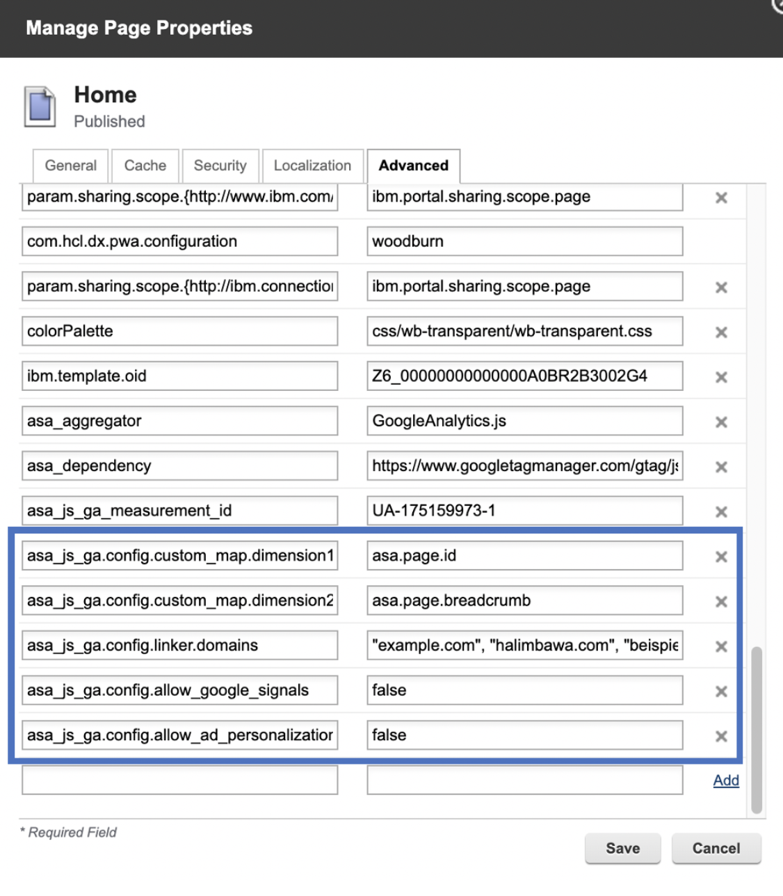
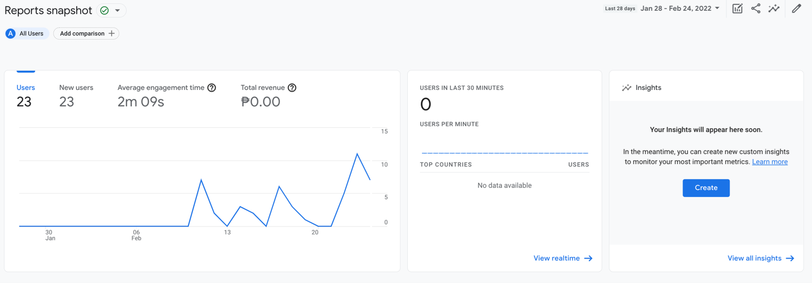

# Integrate Google Analytics with HCL Digital Experience

This section includes information set up integration of Digital Experience sites with Google Analytics and to view the resulting web analytics tracking to assess the effectiveness of your DX site pages with end user audiences.

[Google Analytics](https://analytics.google.com) provides ways for website owners to collect data on the visitors of their website, their activity and their interactions.

Complete the following steps to integrate Google Analytics to the HCL Digital Experience platform and to apply the integration to assess the effectiveness of DX sites with your target user audiences.

## Installation

HCL Digital Experience utilizes the platform [Active Site Analytics](../../../deployment/manage/monitoring/analyze_portal_usage/index.md) framework, which includes application scripts, called Aggregators, to collect page interactions data sent to external web analytics services for analysis. HCL DX administrators and page owners can manage the aggregators. They can assign an aggregator to one or more DX labels or pages.

In HCL DX 9.5 CF19 and higher, a new Active Site Analytics aggregator for Google Analytics is available.

## Adding an Active Site Analytics aggregator to a DX site page

Obtain a Google Analytics account with ability to connect to your Digital Experience site.

1.  Add the DX GoogleAnalyticsAggregator.js to the **HCL DX theme profile**.

    In HCL DX 9.5 CF19 and higher, the GoogleAnalyticsAggregator.js file is located in the PortalServer\_root/doc/js-samples directory.

    -   If using a WebDAV-based theme, copy the GoogleAnalyticsAggregator.js file to mycontenthandler/dav/fs-type1/theme/\{your-custom-theme\}/js.
    -   If using a WAR-based theme, include the GoogleAnalyticsAggregator.js file in the static theme WAR file.
    For example, when using a WAR-based theme, the location of the GoogleAnalyticsAggregator.js file after installing to the <YourTheme\> WAR file will be deployed under `wp_profile`:

    wp\_profile/installedApps/<cell\>/<YourTheme.ear\>/<YourTheme.war\>/themes/<YourTheme\>/js

    Refer to the file tree below how the custom theme app will be deployed:

    ```
    wp_profile
        ---> installedApps
            ---> <cell>
                ---> <YourTheme.ear>
                    ---> <YourTheme.war>
                        ---> themes
                            ---> <YourTheme>
                                ---> js
                                    ---> GoogleAnalyticsAggregator.js
    ```

2.  Add the DX GoogleAnalyticsAggregator.js to the **HCL DX theme profile**.

    !!! note
        The theme profile used by the page\(s\) needs to include `wp_analytics` or at least `wp_analytics_aggregator`.

    -   **HCL DX without Practitioner Studio installed:**

        a. On **Site Manager**, select **Page** \> **Page Settings** \> **Page Properties** \> **Advanced**

        b. Go to **Manage Pages** portlet, click the Administration menu icon. Then, select **Portal User Interface** \> **Manage Pages**.

    -   **HCL DX 9.5 with Practitioner Studio installed:**

        a. Select **Administration** \> **Site Management** \> **Pages** to access the **Manage Pages** interface.

        

        b. Locate the page to which you want to assign the aggregator. Use the **Manage Pages** portlet to locate the page.

        !!! note
            The page must be located as a child of the portal content root.

        c. Select **Edit Page Properties** for the page that you selected.

        !!! note
            You cannot add an Active Site Analytics aggregator to the content root. Edit Page Properties is not available for the content root.

        d. To expand the available choices, click the plus sign \(+\) icon next to **Advanced Options**.

        e. Click **I want to set parameters**.

        f. In the field **New parameter**, type a string that starts with `asa_aggregator` or `asa_dependency`. Values that correspond to names that start with the string `asa_aggregator` are added to the page body, names that start with `asa_dependency` are added to the head. Both the aggregators and dependencies are added to the portal page in alphabetical order according to the Java method `Collections.sort()`.

        g. In the **New** value field, type the name of the aggregator script file, in this case: GoogleAnalyticsAggregator.js.

        h. Click **Add**.

        i. Verify that the new parameter is added to the list.

        j. Repeat steps F - I for all aggregators and dependencies.

        k. Click **OK** to return to the main Page Properties screen.

        l. Click **OK** to save your changes and return to the Manage Pages screen.

    !!! note
        Child pages inherit the script that is set on the parent page. If you want to use a different aggregator on a child page, follow the same procedure that is previously addressed for the child page to make the appropriate assignment. If you want to block inheriting the aggregator setting from the parent page, follow the same procedure, but leave the value empty. As a result, the page has no aggregator that is assigned any longer, and all child pages of the parent page inherit the new setting.

3.  Log in to your Google Analytics account and obtain the `GA_MEASUREMENT_ID` in your Google Analytics Dashboard. It is also referred to as **Tracking ID**.

    Example:

    

4.  Add the following metadata in your target HCL DX page\(s\) properties:

    -   `asa_dependency`: https://www.googletagmanager.com/gtag/js?id=GA\_MEASUREMENT\_ID
    -   `asa_aggregator`: GoogleAnalyticsAggregator.js
    -   `asa_js_ga_measurement_id`: GA\_MEASUREMENT\_ID
    Example:

    

    Optionally, you can register the Active Site Analytics tags/microformats as custom dimensions or metrics in the Google Analytics Dashboard and configure the aggregator to use your custom map. See [Google Analytics Custom Dimensions & Metrics](https://support.google.com/analytics/answer/2709828).

    For a list of Active Site Analytics tags associated with HCL DX site pages that can be tracked by the Google Analytics Aggregator, see [How Active Site Analytics data is represented in the portal](../../../deployment/manage/monitoring/analyze_portal_usage/user_behavior_by_asa/collecting_analytics_data/how_asa_data_is_represented_in_portal/index.md) and [Supported aggregator tags](../../../deployment/manage/monitoring/analyze_portal_usage/user_behavior_by_asa/collecting_analytics_data/how_asa_data_is_represented_in_portal/sa_asa_aggr_tags.md).

    

5.  Access the HCL Digital Experience site page analytics from Google Analytics analyze HCL DX site activity.

    After installing and configuring the aggregator to track analytics from specific HCL DX site pages using the steps above, DX content authors and site owners with access to Google Analytics can view the DX site activity tracked and reflected in Google Analytics Dashboard's real-time reports as an increase in the pageviews and active users.

    See the following example:

    

    Refer to the [Analytics tags and site promotions](../../../deployment/manage/monitoring/analyze_portal_usage/user_behavior_by_asa/analytics_tags_site_promo/index.md) topics for more information on how to add additional tags and site promotions in addition to the out-of-the-box ones.


## Using the Active Site Analytics Aggregator for Google Analytics to track DX deployment user sessions

Google Analytics can be used to track user session consumption in HCL Digital Experience deployments. A user session is defined as the number of web sessions or other online interactions, by anonymous or authenticated users interacting with a Digital Experience deployment, including API calls that deliver DX site content to users. A user session begins when a user authenticates with or visits a DX deployment and interacts with website pages and can include multiple website page views. By default, a user session ends when the user interaction with the DX deployment is idle for 30 minutes or until the user ends the interactions by explicitly closing their authentication or web page views session in the DX website. Refer to the Google Analytics documentation for additional information about [How a web session is defined in Universal Analytics](https://support.google.com/analytics/answer/2731565).

Using integration with Google Analytics and Digital Experience deployments, user session tracking is configured through the use of tags with scripts that track the page view requests for each website.

After completing the previous integration steps with the Active Site Analytics Aggregator for Google Analytics and your target DX deployments, you can use Google Analytics dashboards to view the user sessions data.

## Google Analytics Dashboards

As shown in examples above, Google Analytics Dashboards present collections of widgets that allow you to quickly visualize data collected to measure interactions with your deployment sites. An additional example is presented below.



Refer to the Google Analytics documentation for additional information about [Google Dashboards](https://support.google.com/analytics/answer/1068216?hl=en#zippy=%2Cin-this-article).

## View user sessions data for Digital Experience deployment

To view the user sessions information for the DX deployment website from the Google Analytics dashboard that you have integrated with, go to the **Audience** tab in the left-side column of the Google Analytics dashboard, then click **Overview** \> **Sessions**. See the following example:


!!! note
    By default, the user session presents the data for the last 7 days. To revise that time frame, configure the timeline option located in the top-right corner of the dashboard, for example, **Last 30 Days**. Once the time is configured, the data below the graph will present the total number of sessions in the last 30 days.

## Configuration options for the HCL DX Google Analytics Aggregator

HCL DX administrators, content authors and site owners may optionally discontinue Google Analytics tracking of HCL DX pages, without removing the page metadata \(`asa_dependency`\) by adding the following ‘opt-out’ metadata in to the DX page\(s\) properties:

```
asa_js_ga.optout: true
```

This step will programmatically set the following window property:

```
window['ga-disable-GA_MEASUREMENT_ID']  = true
```

See [Disable Google Analytics measurement](https://developers.google.com/analytics/devguides/collection/gtagjs/user-opt-out) for additional information.


