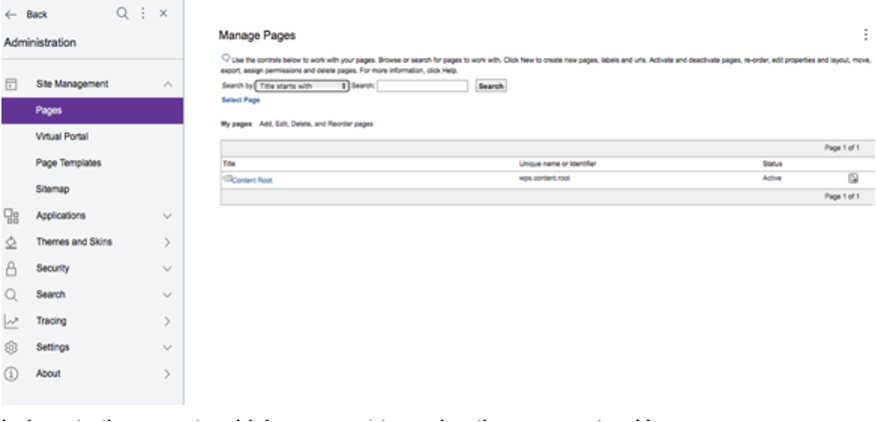
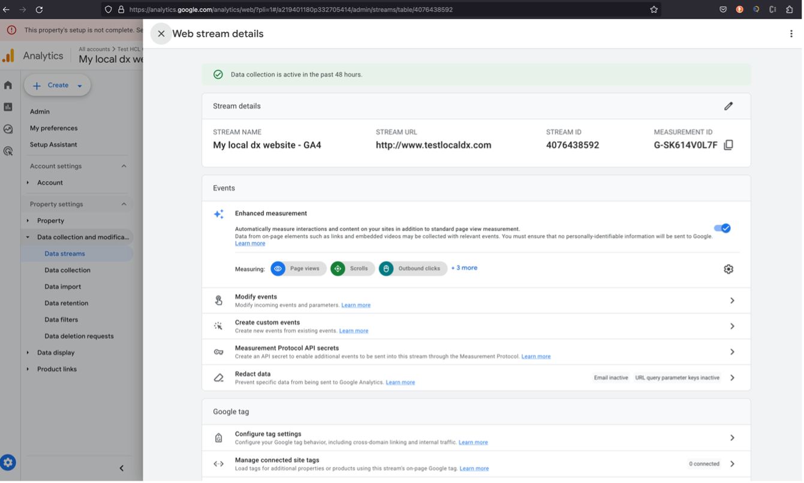
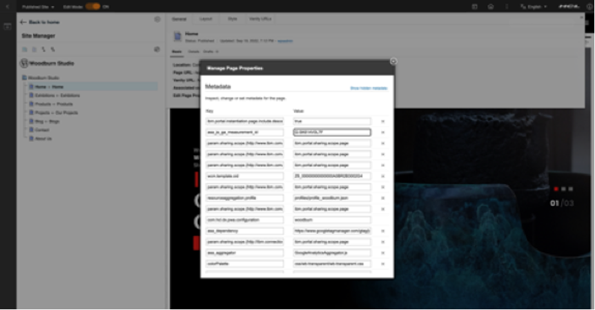
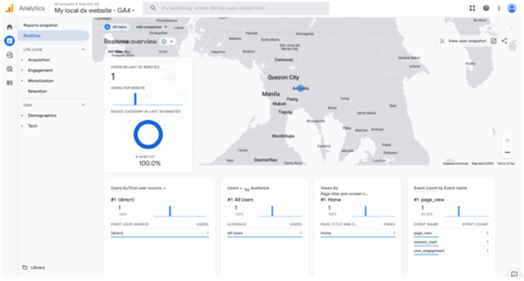
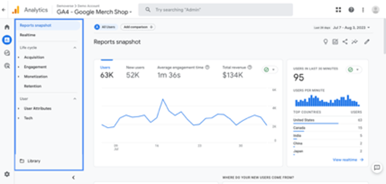
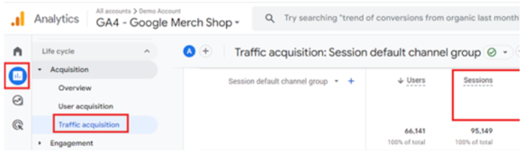

# Integrating Google Analytics 4 with HCL Digital Experience

[Google Analytics 4](https://support.google.com/analytics/answer/10089681) (GA4) has replaced Universal Analytics effective July 2023. For more information, refer to the [Google Analytics notice document](https://support.google.com/analytics/answer/11583528?hl=en). 

GA4 provides ways for website owners to collect data on the visitors of their website such as their activities and interactions. With this tool, you can view the resulting web analytics tracking and assess the effectiveness of your Digital Experience (DX) site pages with end user audiences. Refer to the following steps to use GA4 with [HCL DX](https://www.hcl-software.com/dx).

## Installing Google Analytics 4

HCL DX utilizes the platform [Active Site Analytics](../../../deployment/manage/monitoring/analyze_portal_usage/index.md) framework. This framework includes application scripts called Aggregators to collect page interactions data sent to external web analytics services for analysis. HCL DX administrators and page owners can manage the aggregators. They can assign an aggregator to one or more DX labels or pages.

In HCL DX 9.5 CF19 and higher, a new Active Site Analytics aggregator for Google Analytics is available, and you may also use this with GA4. For more information, see [[GA4] Set up Analytics for a website and/or app](https://support.google.com/analytics/answer/9304153?hl=en&ref_topic=9303319).

## Adding an Active Site Analytics aggregator to a DX site page

Obtain a Google Analytics account with ability to connect to your Digital Experience site.

1.	Add the DX GoogleAnalyticsAggregator.js to the **HCL DX theme profile**.

    In using HCL DX 9.5 CF19 and higher, the GoogleAnalyticsAggregator.js file is located in the PortalServer_root/doc/js-samples directory.
    
    - If using a WebDAV-based theme, copy the GoogleAnalyticsAggregator.js file to mycontenthandler/dav/fs-type1/theme/{your-custom-theme}/js.
    - If using a WAR-based theme, include the GoogleAnalyticsAggregator.js file in the static theme WAR file. For example, when using a WAR-based theme, the location of the GoogleAnalyticsAggregator.js file after installing to the <YourTheme> WAR file is deployed under wp_profile:

        wp\_profile/installedApps/<cell\>/<YourTheme.ear\>/<YourTheme.war\>/themes/<YourTheme\>/js

    Refer to the following file tree that shows how the custom theme app is deployed:

    ```
    wp_profile
        ---> installedApps
            ---> <cell>
                ---> <YourTheme.ear>
                    ---> <YourTheme.war>
                        ---> themes
                            ---> <YourTheme>
                                ---> js
                                    ---> GoogleAnalyticsAggregator.js
    ```

2. Add the DX GoogleAnalyticsAggregator.js to the page configuration.

    !!!important
        The theme profile used by the pages must have `wp_analytics` or at least `wp_analytics_aggregator`.

    - For HCL DX without [Practitioner Studio](../../practitioner_studio/index.md) installed, there are two options:

        - If you are using Site Manager:
        
            1. Switch the **Edit Mode** button to **ON**

            2. Click the menu icon of the page to open more actions.

            3. Go to **Open Page Settings > Edit Page Properties**.

            4. In **Manage Page Properties**, go to the **Advanced** tab. 

            5. Set the parameters in the **Key** and **Value** fields. 

        - If you are not using Site Manager:

            1. Go to **Administration** and select your page (for example, a Virtual Portal).
        
            2. Click the **Open portal administration** icon. 

            3. Under **Portal User Interface**, select **Manage Pages**.

            4. In **Manage Pages**, select the page you want to add the parameters to.

            5. Set the parameters.  

    - For HCL DX 9.5 with [Practitioner Studio](../../practitioner_studio/index.md) installed:

        

        1. Go to **Administration > Site Management > Pages** to access the **Manage Pages** interface.

        2. Locate the page where you want to assign the aggregator. Use the **Manage Pages** portlet to locate the page. 

            The page must be located as a child of the portal content root.

        3. Click **Edit Page Properties** for the page selected. 
        
            !!!note
                You cannot add an Active Site Analytics aggregator to the content root. **Edit Page Properties** is not available for the content root.

        4. To expand the available choices, click the plus sign (+) icon next to **Advanced Options**.

        5. Click **I want to set parameters**.

        6. In the **New parameter** field, enter a string that starts with `asa_aggregator` or `asa_dependency`. Values that correspond to names that start with the string `asa_aggregator` are added to the page body and names that start with `asa_dependency` are added to the head. Both the aggregators and dependencies are added to the portal page in alphabetical order according to the Java method `Collections.sort()`.

        7. In the **New value** field, enter the name of the aggregator script file. For example, GoogleAnalyticsAggregator.js.

        8. Click **Add**.

        9. Verify that the new parameter is added to the list.

        10. Repeat steps **f** to **i** for all aggregators and dependencies.

        11. Click **OK** to return to the main **Page Properties** screen.

        12. Click **OK** to save your changes and return to **Manage Pages** screen.

    !!!note
        Child pages inherit the script that is set on the parent page. If you want to use a different aggregator on a child page, follow the same procedure for the child page to make the appropriate assignment. If you want to block inheriting the aggregator setting from the parent page, follow the same procedure, but leave the value empty. As a result, the page has no aggregator that is assigned any longer, and all child pages of the parent page inherit the new setting.

3.	Log in to your [Google Analytics 4](https://marketingplatform.google.com/about/analytics/) account and obtain the `GA_MEASUREMENT_ID` in your Google Analytics Dashboard. It is also referred to as **Tracking ID** or **Measurement ID**.

    Example:

    
 
4.	Add the following metadata in your target HCL DX page properties:

    - `asa_dependency`: https://www.googletagmanager.com/gtag/js?id=GA_MEASUREMENT_ID
    - `asa_aggregator`: GoogleAnalyticsAggregator.js
    - `asa_js_ga_measurement_id`: GA_MEASUREMENT_ID
    
    Example:

    

    Optionally, you can register the Active Site Analytics tags or microformats as custom dimensions or metrics in the Google Analytics Dashboard and configure the aggregator to use your custom map. See the [GA4 Custom Dimensions & Metrics](https://support.google.com/analytics/answer/10075209?sjid=13677223371736029582-NA) for more information. 

    For a list of Active Site Analytics tags associated with HCL DX site pages that can be tracked by the Google Analytics Aggregator, see the topics [How Active Site Analytics data is represented in the portal](../../../deployment/manage/monitoring/analyze_portal_usage/user_behavior_by_asa/collecting_analytics_data/how_asa_data_is_represented_in_portal/index.md) and [Supported aggregator tags](../../../deployment/manage/monitoring/analyze_portal_usage/user_behavior_by_asa/collecting_analytics_data/how_asa_data_is_represented_in_portal/sa_asa_aggr_tags.md).
 
5.	Access the HCL DX site page analytics from the Google Analytics Dashboard [Realtime Report](https://support.google.com/analytics/answer/9271392?sjid=2012704651258872253-NA) to analyze HCL DX site activity. Take note that the Realtime Report is new with GA4. For an overview, see [Overview of Google Analytics reports](https://support.google.com/analytics/answer/9212670?hl=en&ref_topic=12153537,12153943,2986333,&sjid=2012704651258872253-NA&visit_id=638356755288911187-1947930948&rd=1).
    
    After installing and configuring the aggregator to track analytics from specific HCL DX site pages, DX content authors and site owners with access to Google Analytics can view the DX site activity. Site activity is tracked and reflected in Google Analytics Dashboard's [GA4] Real-time reports as an increase in the page views and active users.

    See the following example:

    
 
    Refer to the [Analytics tags and site promotions](../../../deployment/manage/monitoring/analyze_portal_usage/user_behavior_by_asa/analytics_tags_site_promo/index.md) topics for information on how to add additional tags and site promotions in addition to the out-of-the-box ones.

## Using the Active Site Analytics Aggregator for Google Analytics 4 to track DX deployment user sessions

You can use GA4 to track user session consumption in HCL DX deployments. 

A user session is the number of web sessions or other online interactions by anonymous or authenticated users interacting with a DX deployment. This includes API calls that deliver DX site content to users. A user session begins when a user authenticates with or visits a DX deployment and interacts with website pages. This can include multiple website page views. By default, a user session ends when the user interaction with the DX deployment is idle for 30 minutes or until the user ends the interactions by explicitly closing their authentication or web page views session in the DX website. Refer to the Google Analytics 4 documentation for additional information about [how a web session is defined in GA4](https://support.google.com/analytics/answer/12798876?sjid=13677223371736029582-NA).

Using integration with Google Analytics 4 and DX deployments, user session tracking is configured through the use of tags with scripts that track the page view requests for each website.

After completing the integration steps with the [Active Site Analytics Aggregator for Google Analytics and your target DX deployments](#adding-an-active-site-analytics-aggregator-to-a-dx-site-page), you can use Google Analytics dashboards to view the user sessions data.

For more information, see [Create a new Google Analytics 4 property](https://support.google.com/analytics/answer/9304153?hl=en&ref_topic=9303319).

## Google Analytics 4 Reports

Google Analytics 4 Reports present collections of widgets that allow you to quickly visualize data collected to measure interactions with your deployment sites. See the following example.



Refer to the Google Analytics documentation for additional information about [Google Analytics 4 Reports](https://support.google.com/analytics/answer/9212670?hl=en&ref_topic=12153537,12153943,2986333,&sjid=2012704651258872253-NA&visit_id=638356755288911187-1947930948&rd=1).

## Viewing user sessions data for DX deployment

For information on how session IDs and numbers are generated when events are started, refer to the Google Analytics Help topic [About Analytics Sessions](https://support.google.com/analytics/answer/9191807?hl=en#:~:text=In%20Analytics%2C%20a%20session%20initiates,long%20a%20session%20can%20last.). 

Session and User metrics are calculated through an estimation. Google Analytics provides a number of [session metrics](https://support.google.com/analytics/answer/9143382#session-metrics&zippy=%2Cattribution%2Cdemographics%2Cecommerce%2Cevent%2Cgaming%2Cgeneral%2Cgeography%2Clink%2Cpage-screen%2Cplatform-device%2Cpublisher%2Ctime%2Ctraffic-source%2Cuser%2Cuser-lifetime%2Cvideo%2Cadvertising%2Cpredictive%2Crevenue%2Csearch-console%2Csession) such as *Session*, *Engaged sessions*, and *Engaged sessions* per user. With these metrics, you can see data about the number of sessions that have started on your site or app.

For example, to view the user sessions information for the DX deployment website from the Google Analytics 4 Report options, access and configure the [Traffic acquisition report](https://support.google.com/analytics/answer/12923437?hl=en&ref_topic=13818299&sjid=3244629504972276520-NA). This report shows new and returning users. After the report source is configured with adjustments for the timeout interval to align with user session defaults of 30 minutes, the data below the graph presents the total number of sessions. See the following example from the Google Analytics 4 Reports – Traffic acquisition report.  



## Configuration options for the HCL DX Google Analytics Aggregator

HCL DX administrators, content authors and site owners may optionally discontinue Google Analytics tracking of HCL DX pages, without removing the page metadata (`asa_dependency`) by adding the following ‘opt-out’ metadata in to the DX page properties:

``asa_js_ga.optout: true``

This step programmatically sets the following window property:

``window['ga-disable-GA_MEASUREMENT_ID']  = true``

## Disclaimers

This report is subject to the [HCL Terms of Use](https://www.hcl.com/terms-of-use){:target="_blank"} and the following disclaimers:

The information contained in this report is provided for informational purposes only. While efforts were made to verify the completeness and accuracy of the information contained in this publication, it is provided AS IS without warranty of any kind, express or implied, including but not limited to the implied warranties of merchantability, non-infringement, and fitness for a particular purpose. In addition, this information is based on HCL’s current product plans and strategy, which are subject to change by HCL without notice. HCL shall not be responsible for any direct, indirect, incidental, consequential, special or other damages arising out of the use of, or otherwise related to, this report or any other materials. Nothing contained in this publication is intended to, nor shall have the effect of, creating any warranties or representations from HCL or its suppliers or licensors, or altering the terms and conditions of the applicable license agreement governing the use of HCL software.

References in this report to HCL products, programs, or services do not imply that they will be available in all countries in which HCL operates. Product release dates and/or capabilities referenced in this presentation may change at any time at HCL’s sole discretion based on market opportunities or other factors, and are not intended to be a commitment to future product or feature availability in any way. The underlying database used to support these reports is refreshed on a weekly basis. Discrepancies found between reports generated using this web tool and other HCL documentation sources may or may not be attributed to different publish and refresh cycles for this tool and other sources. Nothing contained in this report is intended to, nor shall have the effect of, stating or implying that any activities undertaken by you will result in any specific sales, revenue growth, savings or other results. You assume sole responsibility for any results you obtain or decisions you make as a result of this report. Notwithstanding the [HCL Terms of Use](https://www.hcl.com/terms-of-use){:target="_blank"}, users of this site are permitted to copy and save the reports generated from this tool for such users own internal business purpose. No other use shall be permitted.


