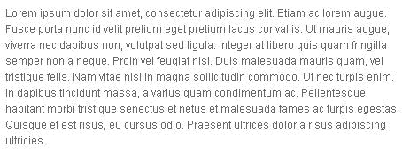
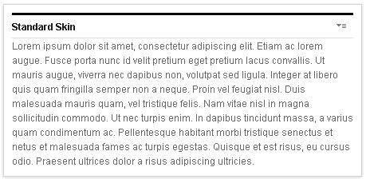

# Default skins

The default theme includes these skins that can be used as a basis for creating custom skins: Hidden, Standard, and NoSkin.

-   **Hidden skin**

    Is the default skin. In view mode, this skin does not display the title bar or any decorations. In edit mode, the skin displays the title bar and decorations around the portlet. This skin was created for WCM content that is exposed on external facing websites, where edit mode is not likely to be shown to users so the title bar is hidden. However, when an administrator or user that has access to edit the WCM portlet, they can put a page into edit mode and configure the portlet.

Figure 1. Hidden Skin in view mode.

Figure 2. Hidden Skin in edit mode.

-   **Standard skin**

    Displays the portlet title bar in both edit and view mode. The title bar shows the title of the portlet and the skin action menu. This skin imitates the default skin from past releases.

Figure 3. Standard Skin.

-   **NoSkin skin**

    The NoSkin skin does not show the title bar or any decorations around the portlet. This skin is used if you do not need to show the skin actions.

???+ info "Related information:"
    - [Themes, profiles, and skins](../../../create_sites/website_building_blocks/themes_profiles_skins/index.md)

