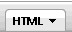
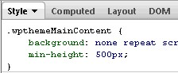
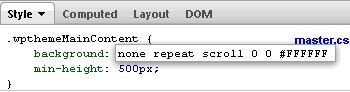

# Updating your custom style

After you create a theme style, use this procedure to apply a customized look and feel to the theme.

Do not edit the HCL Digital Experience 8.5 theme CSS style sheets directly, because these changes might be lost during a fix pack upgrade. Instead, create the CSS class in a new style sheet belonging to your custom theme.

1.  Apply the custom style to a page.

    1.  On the page that you want to apply the style, turn on **Edit Mode**.

    2.  Click the **Page** \> **Styles** on the toolbar.

    3.  Click the custom style.

2.  Write the new styles.

    1.  Open a portal page that has your theme and custom style applied.

    2.  Use a tool, like Firebug, to select and inspect the style rules that you want to change.

    3.  After determining the styles that you want to override in the theme, copy the overrides to the custom style sheet on WebDAV.

3.  Apply the custom style sheet to your entire page structure.

    1.  Figure out the root page for the area on which you want to apply the custom style. To apply to the entire site, select the **Content Root**.

    2.  Add metadata on the root page with a key of colorPalette and a value pointing to your custom style sheet in relation to the theme directory on WebDAV.

        For example: css/custom/custom.css.

4.  Using Firebug to inspect the CSS file.

    1.  Open the Firebug plug-in in a Mozilla Firefox browser.

    2.  Click the element selection icon  in the Firebug menu bar.

    3.  Click the area on the page that you want to change.

    4.  Check that the correct area is selected in the HTML tab.

        

    5.  Look at the **Style** tab to inspect all the CSS files that are applied to the HTML element.

        

    6.  Edit the CSS file in the **Style** tab until the HTML element looks how you want it to. To edit an attribute click the text.

        

    7.  After you determine that the new value applied has the appearance that you want, copy the CSS file that you changed in the **Style** tab into the custom style sheet.

-   **[Style definitions](themeopt_cust_styledef.md)**  
Customize your theme with these definitions.

**Related information**  

[Get Firebug](https://getfirebug.com)

