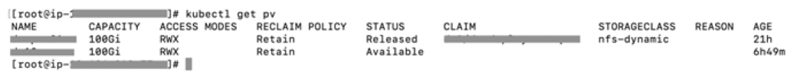
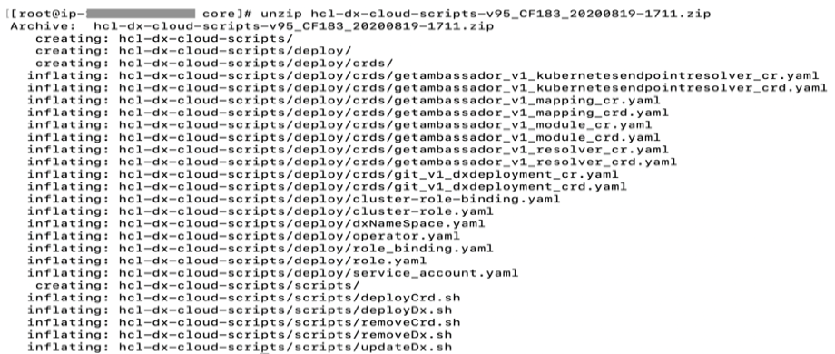

# Deploying DX CF19 and CF191 release Containers to Google Kubernetes Engine \(GKE\)

Learn how to deploy HCL Digital Experience \(DX\) 9.5 CF19 and CF191 release containers along with Ambassador to Kubernetes, as verified in [Google Kubernetes Engine \(GKE\)](https://console.cloud.google.com/marketplace/details/google-cloud-platform/container-engine).

**Note:** Refer to the latest HCL DX 9.5 Container Release CF19 and CF191 and Update file listings in the [Docker deployment](../containerization/docker.md) topic.

## About this task

Follow these steps to deploy HCL Digital Experience 9.5 CF19 and higher container release along with Ambassador to Kubernetes, as verified in [Google Kubernetes Engine \(GKE\)](https://console.cloud.google.com/marketplace/details/google-cloud-platform/container-engine). This deployment relies heavily on Kubernetes Operators for full functionality.

**Note:** Reference the latest HCL DX 9.5 Container Release and Update file listings in the [Docker deployment](../containerization/docker.md) topic.

## Prerequisites

Prior to using the procedure below, it is assumed that the HCL DX Administrator is generally experienced in using Kubernetes. Additionally, the DX Administrator must have the appropriate access to the target environment. If not, following are some preliminary steps that need to be taken.

-   The following installed on your system:
    -   [Docker](https://hub.docker.com/)
    -   [kubectl](https://cloud.google.com/kubernetes-engine/docs/quickstart)
    -   [Google Cloud SDK](https://cloud.google.com/sdk/)
-   Setup `KUBECONFIG` to refer to the target server. This will ensure any `kubectl` commands executed locally affect the target environment.
-   Use `kubectl get {pods, pv, storageclass}` to get appropriate information from the artifacts running in the target Kubernetes environment.

    

-   Volume requirement:
    -   Requires an AccessMode of **ReadWriteMany**
    -   Requires a minimum of **40 GB**, with the default request set to **100 GB**
    -   RECLAIM POLICY = Retain

        **Note:** HCL Digital Experience is input-output \(I/O\) intensive and requires a high performing file system for optimization.


## Download containers

1.  Download files to your local

    Download and extract the contents of the HCL DX 9.5 CF19 package to the local file system.

    

2.  Change directory

    Open a terminal window and change to the root directory of the extracted package.

3.  Docker load

    Load the containers into your Docker repository:

    -   ```
docker load < hcl-dx-core-image-v95_xxxxxxxx-xxxx.tar.gz
```

    -   ```
docker load < hcl-dx-ambassador-image-v95_xxxxxxxx-xxxx.tar.gz 
```

    -   ```
docker load -i hcl-dx-cloud-operator-image-v95_xxxxxxxx-xxxx.tar.gz
```

    -   ```
docker load -i hcl-dx-redis-image-xxx.tar.gz
```

        **Note:** Either **`-i`** or **`<`** works for the load command. In case you encounter an error when using one, try running the command using the other.

        

4.  Docker tag and push

    Get the Docker images in your local Docker repository to your target Kubernetes system by tagging and pushing them appropriately. If you used `docker load` to get your images on the target environment, proceed to the next step.

    Syntax for tagging:

    ```
    docker tag <local image:tag or image id> <destination image:tag>
    ```

    Syntax for pushing:

    ```
    docker push <image:tag>
    ```


## Deployment

1.  Unzip and extract

    Extract the HCL DX deployment scripts onto your environment as follows:

    ```
    unzip hcl-dx-cloud-scripts-v95_CFxxx_xxxxxxxx-xxxx.zip
    ```

    

2.  Change directory

    Change to the extracted files directory, ./hcl-dx-cloud-scripts.

    ```
    [root]$ cd  ./ hcl-dx-cloud-scripts
    ```

3.  Modify deploy/operator.yaml

    Modify deploy/operator.yaml and update the configuration based on your repository image and tag.

    

    **Note:** For deployment of DX 9.5 CF183 and higher, ensure the operator.yaml is updated with names and tags used in your private repository: cloud operator image name, cloud operator tag, Redis repo, Redis image name, and Redis tag.

    -   \# Replace this with the built image name

        ```
        image:`REPOSITORY_NAME`/`cloud-operator:95_184`
        ```

        ...

    -   ```
name:`REDIS_DOCKER_REPO`
 value: `"myrepo.dx.com"`
```

    -   ```
name: `REDIS_IMAGE`
 value: `"ambassador-redis"`
```

    -   ```
name: `REDIS_TAG`
 value: `"95_184"`
```

4.  Custom resource definition

    Install the DxDeployment custom resource definition.

    **Notes:**

    -   Do not modify the git\_v1\_dxdeployment\_crd.yaml file.
    -   Customize the ./deploy/crds/git\_v1\_dxdeployment\_cr.yaml file, if required.
    Use either of the following commands:

    -   ```
kubectl create -f hcl-dx-cloud-scripts/deploy/crds/git_v1_dxdeployment_crd.yaml
```

    -   ```
./scripts/deployCrd.sh
```

5.  Persistence volume

    Create \(or have the Kubernetes Administrator create\) a persistent volume and storage class where the AccessMode must be **ReadWriteMany** and the persistent volume reclaim policy must be **Retain**.

    

6.  Deploy

    Execute the `deployDx.sh` script to create the namespace, install the project scoped service account, role, role binding, operator, and deployment, run the deployDx.sh script.

    ```
    ./scripts/deployDx.sh NAMESPACE REPLICAS REPOSITORY IMAGENAME IMAGETAG VOLUMENAME STORAGECLASS DBTYPE INGRESSIMAGE INGRESSTAG
    ```

    -   **NAMESPACE** - the project or the namespace to create or use for deployment. This namespace will be used in subsequent commands.
    -   **REPLICAS** - the number of initial instances for the deployment.
    -   **REPOSITORY** - your local repository, the repository used by Kubernetes.
    -   **IMAGENAME** - the name of the dxCore image, as added to the repository above.
    -   **IMAGETAG** - the tag for the target image as added to the repository above.
    -   **VOLUMENAME** - the volume to be used by the deployment for persistence, this must use **AccessMode** **ReadWriteMany**.
    -   **STORAGECLASS** - the storage class name used to create the persistent volume.
    -   **DBTYPE** - the database type. By default, and initially, this is Derby. HCL DX 9.5 uses Apache Derby, Oracle Database, IBM DB2, or Microsoft SQL Server. Acceptable values are `derby`, `oracle`, `db2`, or `msSql`.
    -   **INGRESSIMAGE** - The image name to use for ambassador \(Native K8s\).
    -   **INGRESSTAG** - The image tag to use for ambassador \(Native K8s\)

        For example:

        ```
        $  ./scripts/customer/deployDx.sh dx11 1 us.gcr.io/dx-gcp-l2com/dxcontainer dxen v95_CF183_20200819 dx-pv11 standard derby ambassador 154 
        ```

        


## Generate a TLS Certificate

1.  Create a TLS certification to be used by the deployment:
    -   For development purposes:
        -   Using OpenSSL, you can create a private key:

            ```
            'openssl genrsa -out my-key.pem 2048'
            ```

        -   Using OpenSSL, you can create a certificate signed by the private key:

            ```
            'openssl req -x509 -key my-key.pem -out my-cert.pem -days 365 -subj '/CN=my-cert'
            ```

    -   Create a TLS certification:

        ```
        $ kubectl create secret tls dx-tls-cert --cert=my-cert.pem --key=my-key.pem -n dx11 
        ```

        **Note:** The default name is the `dx-tls-cert` this can be changed in the configuration. In the example, `dx11` is the Kubernetes namespace. You can set your preferred namespace, but you must consistently use this namespace in subsequent commands. See the [Customizing your Container deployment](customization.md) topic for more information on customizing your deployment.


## Check the deployment status

1.  Check the status of the deployment. The following command can be used from the external IP from the Google GKE load balancer to access the deployment.

    ```
    $ kubectl get all -n <your name space>
    ```

    

    The deployed system will be available at `https://external-ip/wps/portal`. For example, `https://40.76.169.27/wps/portal/`

    


## Install the Experience API, Content Composer, and Digital Asset Management components to GKE

1.  Create a config map with the same name as the `dx statefulset`. By default, the `dx statefulset`is `dx-deployment`, as shown in this example:

    `kubectl create configmap dx-deployment -n dx11`

    

2.  Edit the configmap, add the following data, and update the **values**based on your image tags:

    ```
    data:
      dx.deploy.openldap.enabled: 'true'
      dx.deploy.openldap.tag: dx-183
      dx.deploy.openldap.image: dx-openldap
      dx.deploy.experienceapi.enabled: 'true'
      dx.deploy.experienceapi.tag: dx-183
      dx.deploy.experienceapi.image: ring-api
      dx.deploy.contentui.enabled: 'true'
      dx.deploy.contentui.tag: dx-183
      dx.deploy.contentui.image: content-ui
      dx.deploy.dam.enabled: 'true'
      dx.deploy.dam.volume: releaseml
      dx.deploy.dam.storageclass: dx-deploy-stg
      dx.deploy.dam.persistence.tag: dx-183
      dx.deploy.dam.persistence.image: persist
      dx.deploy.dam.imgprocessor.tag: dx-183
      dx.deploy.dam.imgprocessor.image: image-processor
      dx.deploy.dam.tag: dx-183
      dx.deploy.dam.image: dam
      dx.deploy.dam.operator.tag: dx-183
      dx.deploy.dam.operator.image: hcl-dam-operator
      dx.deploy.host.override: “false”
    
    ```

    **Note:** The Digital Asset Manager container requires one volume \(specified in the configmap under `dx.deploy.dam.volume`\). The Digital Asset Manager persistence containers require one self-provisioned volume per pod which by default are set to minimum of 2 minimum and a maximum of 5 pods.

    You can also create the config map in a YAML file and deploy it with the following instructions \(example\):

    ```
    kubectl create -f my_config_map.yaml -n dx11
    ```

    .

3.  After creating the config map, deployment will go into ‘*init’* mode, and restart a couple of times after the new options are configured. You can check the status via the command line using the command \(example\):

    ```
    kubectl get pods -n dx11
    ```

    


See the following section for additional information:

-   [Install Experience API, Content Composer, and Digital Asset Management](https://help.hcltechsw.com/digital-experience/9.5/containerization/install_config_cc_dam.md)

## Update the HCL Digital Experience 9.5 GKE deployment

1.  To update the deployment, run the `updateDx.sh` script with updated values:

    ```
    ./scripts/updateDx.sh NAMESPACE REPLICAS REPOSITORY IMAGENAME IMAGETAG VOLUMENAME STORAGECLASS DBTYPE INGRESSIMAGE INGRESSTAG
    ```

    -   **NAMESPACE** - the project or the namespace to create or use for deployment.
    -   **REPLICAS** - the number of initial instances for the deployment.
    -   **REPOSITORY** - your local repository, the repository used by Kubernetes.
    -   **IMAGENAME** - the name of the dxCore image, as added to the repository above.
    -   **IMAGETAG** - the tag for the target image as added to the repository above.
    -   **VOLUMENAME** - the volume to be used by the deployment for persistence, this must use **AccessMode** **ReadWriteMany**.
    -   **STORAGECLASS** - the storage class name used to create the persistent volume.
    -   **DBTYPE** - the database type. By default, and initially, this is Derby. HCL DX 9.5 uses Apache Derby, Oracle Database, IBM DB2, or Microsoft SQL Server. Acceptable values are `derby`, `oracle`, `db2`, or `msSql`.
    -   **INGRESSIMAGE** - The image name to use for Ambassador \(Native K8s\).
    -   **INGRESSTAG** - The image tag to use for Ambassador \(Native K8s\).

        For example:

        ```
        $ ./scripts/updateDx.sh test-mynamespace 1 REPO_NAME dxen v95_CF183_20200818-1342 dx-pv-11 dx-deploy-stg derby ambassador 154
        ```

2.  Once the database is transferred, the **DBTYPE** will need to be updated so you can scale the instances higher. Additionally, once the database is transferred, the number of replicas could be increased.

    See [Customizing your Container deployment](customization.md) for more information on customizing your deployment.


## Delete the HCL Digital Experience 9.5 GKE deployment

1.  Removing the entire deployment requires several steps, this is by design.
    -   To remove the deployment in a specific namespace, run the `removeDx.sh` script:

        ```
        ./scripts/removeDx.sh NAMESPACE
        ```

        -   **NAMESPACE** - the project or the namespace created or used for deployment.
2.  To remove a namespace, use any of the following commands:
    -   Kubernetes command:

        ```
        'kubectl delete -f dxNameSpace_**NAMESPACE**.yaml'
        ```

        where **NAMESPACE** is the namespace to be removed

3.  The persistent volume associated to the deployment needs to be cleaned up by your Administrator. To reuse a persistent volume, see the following steps:
    -   Open the persistent volume in a visual editor \(vi\) using the
        -   Kubernetes command:

            ```
            kubectl edit pv your_volume
            ```

    -   Remove the `claimRef` section:

        ```
        claimRef:
           apiVersion: v1
           kind: PersistentVolumeClaim
           name: dx-deploy-pvc
           namespace: your_namespace
           resourceVersion: "488931120"
           uid: ebd58361-0e2a-11ea-b02e-02f8fe687954
        ```

    -   Ensure you get the `'persistentvolume/your_volume edited'` message.
    -   You may need to manually remove any data remaining from the previous deployment.

**Parent topic:**[Deploying HCL Digital Experience Containers to Google Kubernetes Engine \(GKE\)](../containerization/google_gke.md)

