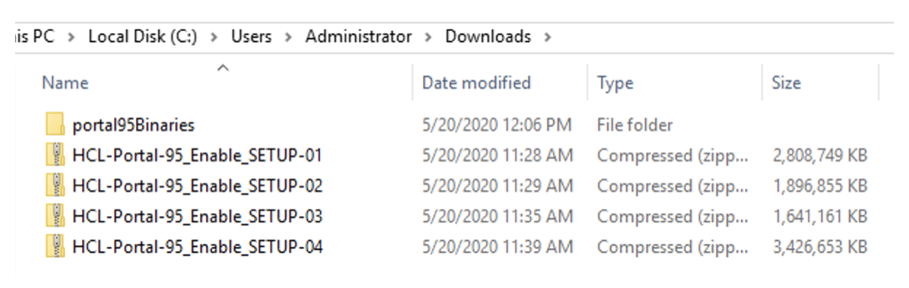
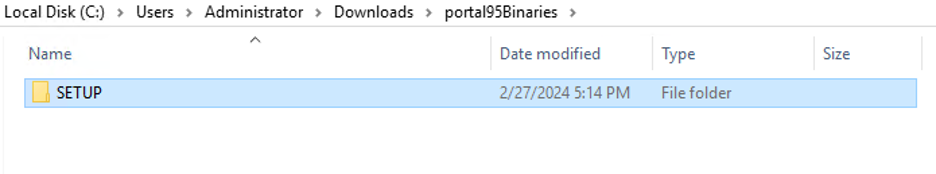
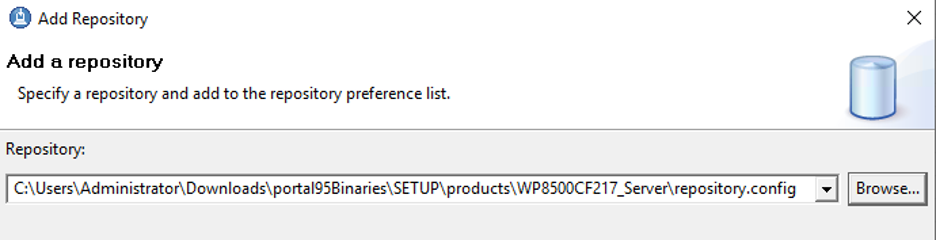
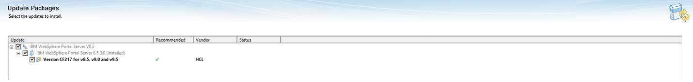
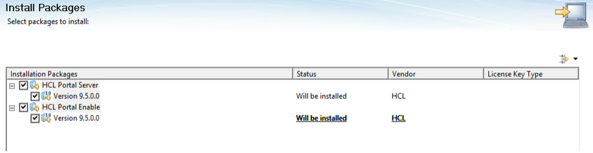

# Installation and upgrade for customers running on DX 8.5 on WAS 8.5/9.0 and Java SDK 7.0 or 8.0

This guide shows how to upgrade your HCL Digital Experience (DX) or Web Content Manager 8.5 environment to HCL DX or Web Content Manager 9.5. Information on how to either stay at IBM WebSphere Application Server ND 8.5.x or migrate the WAS layer to IBM WebSphere Application Server ND Version 9.0.5.x is also available.

## Preparing the environment

Before you install HCL Digital Experience, review the [hardware and software requirements](../../../../get_started/system_requirements/index.md) to ensure that you have the supported versions of prerequisite and co-requisite software and the required hardware.

Make sure to also review the [detailed requirements article](https://support.hcltechsw.com/csm?id=kb_article&sysparm_article=KB0013514){target="_blank"} to ensure that your system meets or exceeds the minimum requirements provided by HCL.

### Preparing your operating system for installation

- [Preparing your AIX operating system](../installing_dx/aix/prep_os-AIX.md)

- [Preparing your Linux operating system](../installing_dx/linux/prep_os-linux.md)

- [Preparing your Windows OS](../installing_dx/windows/prep_os-windows.md)

## Getting the software

Obtain the product software from the [HCL Software Licensing Portal](https://hclsoftware.flexnetoperations.com/flexnet/operationsportal/logon.do){target="_blank"}.

Additional guidance is available here: [Step-by-step guide on downloading HCL Digital Experience products](https://support.hcltechsw.com/csm?id=kb_article&sysparm_article=KB0077878){target="_blank"}.

1. Sign in to the HCL Software Licensing Portal.

2. Identify the HCL DX (Portal and or WCM) 8.5 offering you currently have so you can obtain the correct corresponding HCL DX 9.5 offering package.

    !!! note
        There are several different HCL Digital Experience 9.5 offerings. Your purchased entitlements license determines which offerings are listed as available to download.

    Example package names for the different Portal 9.5 offerings are:
    
    - HCL Portal Express v9.5 Multiplatform
    
    - HCL Portal Server v9.5 MP
    
    - HCL Portal Enable v9.5 Multiplatform
    
    - HCL Portal Extend v9.5MP

    - HCL Customer Experience Suite v9.5
    
    - HCL Employee Experience Suite v9.5
    
    - HCL Digital Experience Cloud Native v9.5.x
    
    In this example, we are using the HCL Portal Enable v9.5 Multiplatform.

3. Click on the HCL Portal Enable v9.5 Multiplatform package.

4. On the package page, there is a long list of parts/components but you only need to download the following four files:

    - HCL-Portal-95_Enable_SETUP-01-SL.zip
    
    - HCL-Portal-95_Enable_SETUP-02-SL.zip

    - HCL-Portal-95_Enable_SETUP-03.zip

    - HCL-Portal-95_Enable_SETUP-04.zip

    !!! note 
        The listed zip files contain all the software required to upgrade Portal 8.5 to Portal 9.5 following Portal 8.5 upgrade to [the latest available cumulative fix](../../../../whatsnew/index.md).

### Preparing the files for installation

1. After downloading the parts, create a parent folder where the files are to be extracted. You can name it as "portal95binaries" as shown in the following example:

    

2. Extract the .zip files to the created parent folder. After all four (4) files are extracted, you should have a folder called "SETUP" under your parent folder: 

    

3. Navigate to the **SETUP** folder. There is a Product folder that holds the files and repositories for Portal 8.5/9.0 and Portal 9.5. 

    

## Upgrading Portal 8.5 to the latest available Combined Cumulative Fix

Read the installation instructions and additional system consideration before applying a cumulative fix (CF) to a stand-alone, cluster, remote search, and farm portal installation or to roll back the CF.

There are several different methods to install the CF as stated in [Combined Cumulative Fix strategy](../../../../get_started/plan_deployment/traditional_deployment/roadmaps/rm_install_deployment/rm_cf.md#what-is-continuous-delivery). The following sample procedure uses a Graphical User Interface.

HCL DX offerings such as Portal Enable, Portal Server, and Web Content Manager must be upgraded to the latest available CF to support the installation of HCL Portal Server or other DX offerings to v9.5.

The following upgrade example uses CF217 and has been extracted into the products directory of the HCL DX v9.5 repository.

### Prerequisites

Stop the Portal Server and ConfigWizard to proceed with the upgrade.

1.	Open a cmd prompt and navigate to <wp_profile_root>/bin.
2.	Run stopServer.bat WebSphere_Portal.
3.	When prompted, enter Portal credentials.
4.	Navigate to <AppServer_root>/profiles/cw_profile/bin.
5.	Run stopServer.bat server1.
6.	When prompted, enter ConfigWizard credentials.

Before proceeding with the upgrade, it is recommended to take a backup of your system. Review the following resources for more details:

- [Backup and restore](../../../../deployment/manage/backup_restore/index.md)
- [How to Backup HCL Portal](https://www.youtube.com/watch?v=3cjA9IUMJow)

### Steps

The following upgrade steps use CF217. Make sure to use the CF version that applies to you.

1. Open IBM Installation Manager (IIM) and under **File > Preferences > Repositories**, add the following repository:

    

    !!!note
        Remove the previous repository entries.

2. Click **OK**.

3. Within IIM, select **Update** icon, then select the Portal package.

    

4. Click **Next**.

5. Select the CF217 package.

    

    !!!note
        You must stop the Portal Server or ConfigWizard to proceed. For more information, see [Prerequisites](#prerequisites).

6. Click **Next**.

7. Review validation results. Click **Next**.

8. Accept the terms of licensing agreement. Click **Next**.

9. Review the features that are about to be installed. Click **Next**.

10. Click **Update**.

    Note that only the Portal binaries are updated to CF217 at this point. The IIM only manages the binaries so you must run a Portal script to upgrade the profile.

11. Upgrade the profile.

    1. Ensure that the WebSphere_Portal server is stopped on the profile you want to upgrade.
    
    2. Execute the following command from within the path of the profile to configure:

        - Unix/Linux: ```<profile_root>/PortalServer/bin/applyCF.sh -DPortalAdminPwd=<password> -DWasPassword=<password>```
        - Windows: ```<profile_root>\PortalServer\bin\applyCF.bat -DPortalAdminPwd=<password> -DWasPassword=<password>```

12. Validate if the server is updated to CF217. Log in and check the About WebSphere Portal and see if it says CF217.

## Upgrading Portal 8.5 to Portal 9.5

Make sure the server is stopped before doing the following steps.
        
1. Add the appropriate HCL DX offering v9.5 repositories to IIM.

    This example uses the Enable offering. For this offering, add the Server and Enable repository.

    For other offerings, refer to the following table to know which repository should be added for each offering:

    |Offering| Required repository|
    |---------|------------|
    |Enable Offering|Server and Enable|
    |Express Offering|Express|
    |Extend Offering|Extend and Server|
    |Server Offering|Server|
    |Web Content Manager Offering|HCL Web Content Manager Server|
    |Customer Experience Suite Offering|HCL Web Content manager and/or Portal Server|
    |Employee Experience Suite Offering|HCL Web Content Manager and/or Portal Server|
    |Digital Experience Cloud Native Offering|HCL Web Content Manager and/or Portal Server|

    

    !!!note
        Remove the previous repository entries.

2. Click **OK**.

3. Within IIM, click the **Install** option. Select both packages.

    

4. Accept the terms of licensing agreement. Click **Next**.

5. Use the existing HCL DX v8.5 package. Click **Next**.

6. Enter the Admin user id and password for WebSphere Application Server and Portal Server.
Click **Next**.

7. Review the summary information. Click **Install**.

    !!!note
        During the installation process, a series of ConfigEngine tasks is run to upgrade Portal 8.5 to 9.5. Upgrading the profile after is not required.

8. After the installation is complete, verify that you can access your Portal in an internet browser by navigating to: http://myportal.hcl.com:10039/wps/portal.

    Check the About HCL Digital Experience portlet to make sure it says 9.5. 

    

This completes the upgrade to HCL DX Portal or to Web Content Manager 9.5 standalone.

## (Optional) Migrating your IBM WebSphere Application Server to 9.0.5

WebSphere Application Server 9.0.5 is only supported on HCL DX 9.5. You must first upgrade to HCL DX 9.5 before you migrate to IBM WebSphere Application Server 9.0.5.

Refer to [Migrating an HCL Digital Experience cluster to IBM WAS 9.0.5](https://help.hcltechsw.com/digital-experience/9.5/was/ug_wasclus95.html) to proceed with the migration process. 
    
##  Installing the latest supported version of IBM WebSphere SDK Java Technology

Starting with HCL Digital Experience Combined fix pack 12, you can change your SDK Java Technology Edition to version 8.0.

- For AIX: [Upgrading the SDK](../installing_dx/aix/sdk_upgrade-AIX.md)
- For Linux: [Upgrading the SDK](../installing_dx/linux/sdk_upgrade-linux.md)
- For Windows: [Upgrading the SDK](../installing_dx/windows/sdk_upgrade-windows.md)

## HCLSoftware U learning materials

For an introduction and a demo on how to upgrade your HCL Digital Experience deployment to the latest Cumulative Fix, go to [Upgrade the HCL Digital Experience software](https://hclsoftwareu.hcltechsw.com/component/axs/?view=sso_config&id=3&forward=https%3A%2F%2Fhclsoftwareu.hcltechsw.com%2Fcourses%2Flesson%2F%3Fid%3D1461){target="_blank"}.
