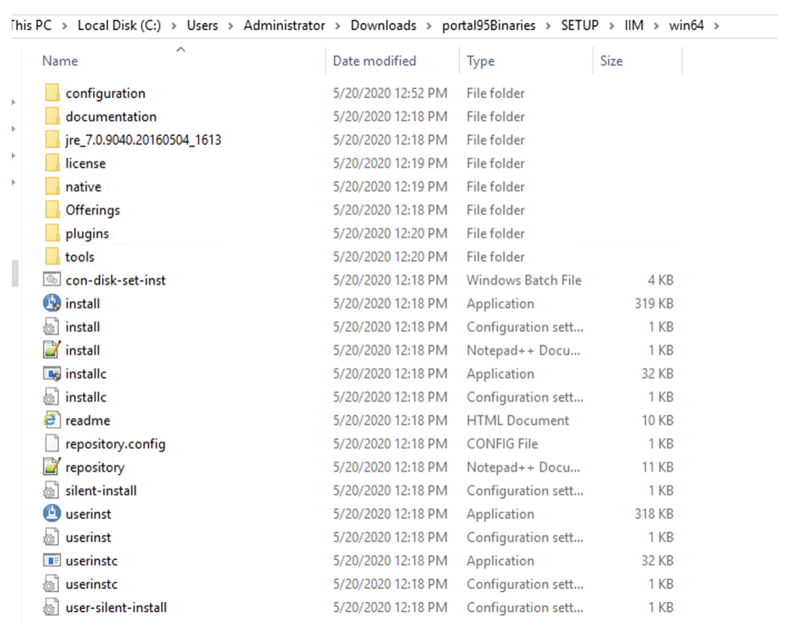
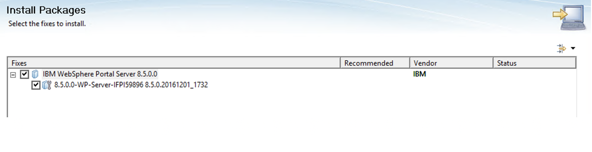

# Installation and upgrade for new HCL Digital Experience customers

HCL Digital Experience 9.5 can run on top of IBM WebSphere Application Server Version ND 9.0.5 using the following installation path. This guide is meant to provide a step-by-step information for the setup and installation of a standalone HCL Portal 9.5.

## Preparing the environment
Before you install HCL Digital Experience, review the [hardware and software requirements](../../../../get_started/system_requirements/index.md) to ensure that you have the supported versions of prerequisite and co-requisite software and the required hardware.

Make sure to also review the [detailed requirements article](https://support.hcltechsw.com/csm?id=kb_article&sysparm_article=KB0013514) to ensure that your system meets or exceeds the minimum requirements provided by HCL.

### Preparing your operating system for installation

- [Preparing your AIX operating system](../installing_dx/aix/prep_os-AIX.md)

- [Preparing your Linux operating system](../installing_dx/linux/prep_os-linux.md)

- [Preparing your Windows OS](../installing_dx/windows/prep_os-windows.md)

## Getting the software
Product software can be obtained from the [HCL Software Licensing Portal](https://hclsoftware.flexnetoperations.com/flexnet/operationsportal/logon.do).

Additional guidance is available here: [Step-by-step guide on downloading HCL Digital Experience products](https://support.hcltechsw.com/csm?id=kb_article&sysparm_article=KB0077878).

1. Sign in to the HCL Software Licensing Portal.

2. Identify the Portal 9.5 offering you want to install.

    !!! note 
        There are several different Portal 9.5 offerings. Your license determines which offerings you will see listed as available to download.

    Example package names for the different Portal 9.5 offerings are:

    - HCL Portal Express v9.5 Multiplatform

    - HCL Portal Server v9.5 MP

    - HCL Portal Enable v9.5 Multiplatform

    - HCL Portal Extend v9.5MP

    In this example, we will use HCL Portal Enable v9.5 Multiplatform.

3. Click on the **HCL Portal Enable v9.5 Multiplatform** package.

4. On the package page, you will see a long list of parts/components but you only need to download the following four files:

    - HCL-Portal-95_Enable_SETUP-01.zip

    - HCL-Portal-95_Enable_SETUP-02.zip

    - HCL-Portal-95_Enable_SETUP-03.zip

    - HCL-Portal-95_Enable_SETUP-04.zip

    !!! note 
        The zip files above contain all the software required to install:

        -  Portal 9.5 including Installation Manager

        - WebSphere Application Server
        
        - Portal CF17, etc.

### Preparing the files for install

1. Once you have the parts downloaded, create a parent folder wherein the files are to be extracted. You can name it as portal95binaries as shown in the example below:
    

2. Extract the .zip files to the created parent folder. Once all four (4) files are extracted, you should have a folder called SETUP under your parent folder as shown below: 

3. Navigate to the **SETUP** folder, there should be a Product folder that holds the files and repositories for WAS 9.0.x, JDK 8.0.x, Portal 8.5.0.0, CF17 for Portal 8.5, Portal 9.5, and iFix PI59896. 

## Installing HCL Digital Experience 8.5 with IBM WebSphere Application Server ND Version 9.0.5 and JDK Version 8 using the IBM Installation Manager

This guide was written using Windows as the base operating system, however the steps/concepts listed in this guide are independent of the operating system. The only significant difference is that for Windows, you must use the batch file commands instead of the UNIX shell commands listed in this guide.

For example, 

UNIX:

`./ConfigEngine.sh config-ch-integ`

And Windows:

`ConfigEngine.bat config-ch-integ`

Also, it is recommended to use the Command Prompt (`cmd.exe`) on Windows instead of PowerShell.

!!! note 
    The installation steps below were done using a graphical user interface. There are other ways to install Portal server, via the console or a response file. If you prefer either one of these methods, please refer to the following documentation resource:

    Documentation resource: [Installing the HCL Digital Experience software](../installing_dx/index.md)

### File system paths

The following tags are used to reference common file system paths:

- `<AppServer_root> - The root path of the AppServer directory. For example C:\IBM\WebSphere\AppServer`

- `<PortalServer_root> - The root path of the PortalServer directory. For example C:\IBM\WebSphere\PortalServer`

- `<wp_profile_root> - The root path of the wp_profile directory. For example C:\IBM\WebSphere\wp_profile`

### Troubleshooting

The following logs were used to troubleshoot errors encountered through the guide:

- `<IM_DATA_DIR>/logs`

- `<IM_DATA_DIR>/installed.xml`

- `<IM_DATA_DIR>/installed.xsl`

- `<IM_DATA_DIR>/installRegistry.xml`

- `<wp_profile root>/logs`

- `<wp_profile root>/ConfigEngine/log/ConfigTrace.log`

- `<AppServer root>/logs`

The following location is defined IM_DATA_DIR:

- In UNIX: /<user_home>/var/ibm/InstallationManager

- In Windows: C:\ProgramData\IBM\Installation Manager

In any case of problems during the installation, please collect the above data and contact [HCL Software Support](https://support.hcltechsw.com/csm?id=kb_article&sysparm_article=KB0013608).

### Installing IBM Installation Manager

The IBM Installation Manager (IIM) is a tool you can use to install and maintain your software packages. Wizards guide you through the steps that you must take to install, modify, update, roll back, or uninstall your IBM or HCL products.

To install IIM, navigate to `C:\Users\Administrator\Downloads\portal95Binaries\SETUP\IIM folder`.

Within that folder, there are multiple IIM binaries for their relevant operating systems.

For this guide, install a Windows 2012 R2 system and navigate to the win64 folder. 

From here, run the install.exe file.

1. You should see the following window appear: 

2. Select **Next**. Agree to the licensing terms and select **Next** again.

3. Set install path for **IIM**: 

4. Select **Next**. Review the install summary and select **Install**.

5. When the installation is complete, select the **Restart Installation Manager** button.

### Install the Portal 8.5 Base

With a fresh install of Portal v9.5, the first step is to install the base Portal 8.5 with WAS 9.0.5 , JDK 8.0.5, and PI59896. Due to the continuous deployment model and how the product has been architected, this is not a one step install. Portal v9.5 is not applied until Portal 8.5 base has been installed and upgraded to CF17.

!!! note 
    The iFix PI59896 is required so that Portal 8.5 is in an installable state with WAS 9.0.x and JDK v8.

This is a temporary step while Portal environment is being built up to the final goal of Portal 9.5 on WAS 9.0.5. Portal 8.5 is NOT supported on WAS 9.0.5 as a final configuration.

1. Open IBM Installation Manager (IIM) and under **File > Preferences > Repositories** and select the **Add Repository** button. 

2. In the next IIM Window, we need to navigate to the repository.config file. Navigate to **portal95Binaries\SETUP\products\WASND905** and select the file as shown in the next image: 

    Continue adding the following repositories noted below: 

    !!! reminder 
        For the iFix PI59896, point the repository to the zip file itself.

    Then, select **OK**.

3. Within IIM, select **Install** icon, then highlight all the items listed. 

    !!! note 
        Due to the way WAS defines the SDK as a co-requirement, we get two entries for SDK. Both entries are the same package and only one needs to be selected. 

    Select **Next**.

4. Select iFix listed. 

    !!! warning 
        This iFix is required for Portal 8.5 to be installed while on WAS 9.0 using JDK8.

    Select **Next**.

5. Accept terms of licensing agreement. Then select **Next**.

6. Set location of IMShared. 

    Select **Next**.

7. Set the path you wish the WAS and Portal package to be installed. 

    !!! note
        The WebSphere Application Server package installation path will need to be customized as it tries to put it under the Program Files folder by default.

    Select **Next**.

8. Select the translations you wish to use. 

    Select **Next**.

9. Review the packages that are going to be installed. 

    Select **Next**.

10. Enter the user id and password for the **ConfigWizard** admin user. This user is used to access the configuration wizard for when you do your database transfer, or create your cluster, etc. 

    Select **Next**.

11. Enter the user id and password for the Portal Admin user. This is your Admin user for logging into Portal Administration page or the WAS admin console. 

    Select **Next**.

12. Final review the package information. 

    Select **Next**.

13. When the installation is finished, select the **None** option for **"Which program do you want to start?”** and click **Finish**. 

    Verify that you can access your Portal in an internet browser by navigating to: http://myportal.hcl.com:10039/wps/portal.

While you have successfully installed HCL Portal v8.5 with WebSphere Application Server 9.0.5 using JDK 8.0.5, please note you are still in an **UNSUPPORTED** state.

## Install the latest Fixpack update (CF17 or later) using IBM Installation Manager to upgrade HCL Digital Experience to CF17 or later

Portal now needs to be upgraded to CF17 to support the installation of HCL Portal 9.5.

We will need to stop the Portal Server and ConfigWizard to allow us to proceed with the upgrade.

1. Open a Command Prompt and navigate to <wp_profile_root>/bin.

2. Run:

    `stopServer.bat HCL Portal and HCL Web Content Manager`

3. Enter Portal credentials when prompted.

4. Navigate to <AppServer_root>/profiles/cw_profile/bin.

5. Run:

    `stopServer.bat server1`

6. Enter ConfigWizard credentials when prompted.

Before proceeding, HCL highly recommends that you take a backup of your system. Please review the following links for further details.

    - Documentation resource: [Backup and restore](../../../manage/backup_restore/index.md)

    - Documentation resource: [How to backup HCL Portal [Video]](https://www.youtube.com/watch?v=3cjA9IUMJow)

1. Open IBM Installation Manager (IIM) and under File > Preferences > Repositories, add the following repository as shown in the image below: 

    !!! Reminder
        Remove the previous repository entries.

    Select **OK**.

2. Within IIM, select **Update** icon, then select the Portal package. 

    Select **Next**.

3. Select CF17 package. 

    !!! Reminder 
        You must stop Portal Server/ConfigWizard to proceed.

    Select **Next**.

4. Review validation results. Select **Next**.

5. Accept terms of licensing agreement. Then select **Next**.

6. Review **Features** that are going to be installed. Select **Next**.

7. Select **Update**.

**At this point, only the Portal binaries have been updated to CF17**. The IIM only manages the binaries so we will need to run a Portal script to upgrade the profile.

### Updating the profile

- Ensure the HCL Portal and HCL Web Content Manager server is stopped on the profile you intend to upgrade.

- Execute the following command from within the path of the profile to configure:

    - Unix/Linux: <profile_root>/PortalServer/bin/applyCF.sh -DPortalAdminPwd=<password> -DWasPassword=<password>

    - Windows: <profile_root>\PortalServer\bin\applyCF.bat -DPortalAdminPwd=<password> -DWasPassword=<password>

Validate if the server has been updated to CF17. Log in and check the about HCL Portal and see if it says CF17.

## Install HCL Digital Experience 9.5 using IBM Installation Manager

Make sure the server is stopped before doing the following steps:

1. Add the HCL Portal 9.5 repositories to IIM.

    In this case, we are using the Enable offering so you need the following repo: Server and Enable.

    For the other offerings, this is what you need for each:
    
    - Enable Offering: needs Server and Enable repo
    
    - Express Offering: needs Express repo
    
    - Extend Offering: needs Extend and Server repo
    
    - Server Offering: needs Server repo 
    
    

    !!! Reminder
        Remove the previous repository.

    Select **OK**.

2. Within IIM, select the **Install** option. Select both packages. 

    Select **Next**.

3. Accept terms of licensing agreement. Then select **Next**.

4. Use existing Portal 8.5 package. 

    Select **Next**.

5. Enter Admin user id and password for WebSphere Application Server and Portal Server. Then select Next.

6. Review Summary. Select **Install**. 

    !!! note
        During the installation, a series of ConfigEngine tasks are run to upgrade Portal 8.5 to 9.5 so upgrading the profile after is not required.

7. When the installation is finished, you should now be able to verify that you can access your Portal in an internet browser by navigating to: 

    - http://myportal.hcl.com:10039/wps/portal.

    - Check the About WebSphere Portal portlet to make sure it says 9.5.

This completes the upgrade to HCL Portal 9.5 standalone.

## HCLSoftware U learning materials

For an introduction and a demo on how to upgrade your HCL Digital Experience deployment to the latest Cumulative Fix, go to [Upgrade the HCL HCL Digital Experience software](https://hclsoftwareu.hcltechsw.com/courses/lesson/?id=1461).