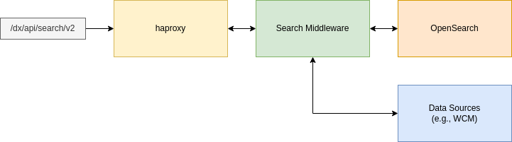
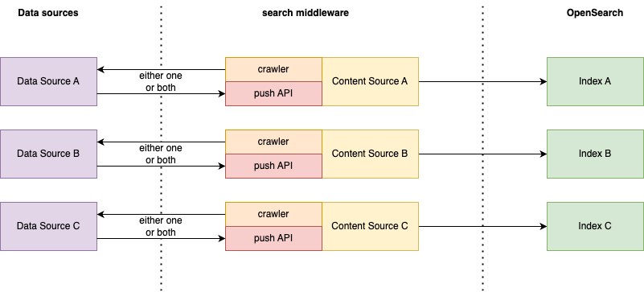

# Architectural Overview

Know more about the different components of the DX search based on OpenSearch and how they are used.

## Key goals

The DX search based on OpenSearch is designed with the weaknesses of the existing search in mind. The following properties are considered:

- **High Availability**: The existing search solution using Remote Search in clustered environments does not provide any high availability features. The Remote Search server is a singleton instance that represents a single point of failure. The new OpenSearch-based implementation allows to have multiple nodes running at the same time and is resilient against single node outages.

- **Scalability**: Since Remote Search is a single instance, the only way to scale is vertically. This is a limited approach because a single instance cannot use an infinite amount of hardware resources. The new OpenSearch-based implementation allows to deploy multiple nodes which enables load balancing for heavy, search-related workloads. It is also possible to have separate nodes for data ingress and querying, allowing for further scaling flexibility.

- **Kubernetes native deployment**: The OpenSearch-based implementation uses existing proven Kubernetes patterns and technologies that work well in such an environment.

## Current capabilties

The DX search based on OpenSearch in its first version is not yet integrated in any of the search UIs inside DX. It provides a REST API where you can index WCM content based on the WCM Seedlist and perform queries using the [OpenSearch Query Syntax](https://opensearch.org/docs/latest/query-dsl/). If you only need search capabilities inside the DX search UIs, you do not need to deploy OpenSearch.

## Main components



### OpenSearch nodes

In a search deployment, the OpenSearch nodes form the backbone of the implementation. The OpenSearch nodes are part of a StatefulSet that store the search indexes and all contained data. OpenSearch performs replication of data between the nodes, allowing for high availability of the search index.

### Search middleware nodes

To provide a usable REST API and perform additional logic on top of search indexes, a search middleware is established to act as a mediator between the data sources and OpenSearch.

The search middleware performs the following functions:

- ACL lookup and access control for search results
- Crawlers for data sources
- REST API for document management, configuration, and search queries

## Content sources

A content source represents a search index that contains data from a specific data source (for example, WCM). Each content source has its own independent search index inside OpenSearch. This ensures that indexing documents from different data sources does not cause conflicts with duplicate IDs. With OpenSearch, you can still perform search queries over all existing indexes, which enables a separation of indexed data while retaining all search capabilities.



Having multiple content sources also enables easy scoping of search queries. If only the data of a particular data source should be considered during a search, the scope for that query can be limited to the ID of the corresponding content source inside the search. This limits the search query to that single search index.

### Crawlers

Depending on the type of content source, it might be required to pull data from the data source. In this case, the search provides capabilities to crawl the target data source using a built-in crawler. You can configure crawlers per content source basis and they will automatically store the pulled documents inside the search index of the associated content source.

### Push API

Every content source provides access to the stored documents through the Push API. With the Push API, you can:

- Retrieve single documents by ID
- Partially or fully update single documents by ID
- Partially or fully update multiple documents in bulk by IDs
- Delete single documents by ID
- Delete multiple documents in bulk by IDs
- Create new single documents
- Create new documents in bulk

In addition, developers and search administrators can manipulate the stored data inside the search without access to the search indexes inside OpenSearch. It also enables the push of content that might not be possible to crawl.

## Indexed documents

Documents that are stored inside a content source contain a defined set of metadata and the document data itself. The general schema for a document looks like this:

```json
{
    "lastIndexed": 1712828704213,
    "firstIndexed": 1712828704213,
    "acls": [],
    "created": 1564176483000,
    "updated": 1564176483000,
    "documentObject": {
        ...
    }
}
```

- The `documentObject` contains the document's real data. Its properties vary depending on the type of content source and the fields that are indexed.

- The `lastIndexed` and `firstIndexed` fields are maintained by the search. These fields display the corresponding timestamps of last indexing and first indexing, respectively. 

- The fields `acls`, `created`, and `updated` are provided by the data source.

A document that does not contain any ACLs will be considered public and do not have any visibility restrictions.

## Search queries

The OpenSearch-based implementation allows for queries using the existing [OpenSearch syntax](https://opensearch.org/docs/latest/query-dsl/). Each query is enriched with an ACL check and a possible scoping to content sources.

You can limit a search query to a list of content sources or cover all content sources. The result will match your query from all scoped content sources.

Refer to the following sample search query:

```json
{
  "query": {
    "must": [
      {
        "match": {
          "documentObject.title": "HCL DX"
        }
      }
    ]
  },
  "page": 0,
  "pageSize": 100,
  "scope": [
    "43abdea1-bf63-4c16-b681-1e278c4949e8"
  ]
}
```

## Deployment structures

Deployments can vary in size and structure, based on the use case.

### Non-split - single node

The smallest deployment of the search consists of a single OpenSearch node and a single search middleware Node. This provides a slim, bare minimum deployment that can be used for development, testing, and small footprint deployments. This deployment has no high availability and no scalability and is not recommended for production use.

### Non-split - multi node

To achieve high availability, you can opt for the non-split multi-node deployment. Both OpenSearch and the search middleware run with multiple Pods, with the number of Pods configurable.

### Split - multi node

The most granular deployment is the split multi-node deployment. There are dedicated types of nodes for OpenSearch and search middleware.

OpenSearch:

- Index Manager
- Data

Search middleware:

- Data
- Query

You can individually scale each type of node, enabling you to scale according to the incoming workload.
