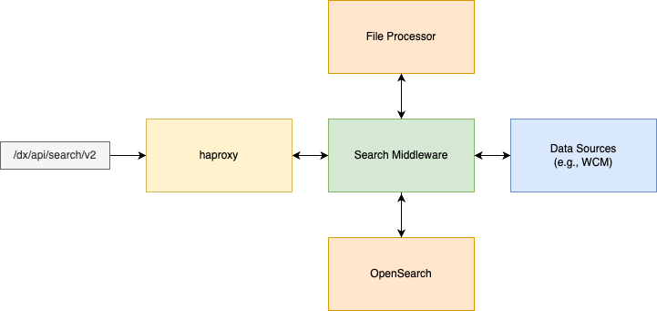

# Architectural Overview

## Key goals

The new search for DX has been designed with the weaknesses of the existing search in mind. The focus was set on the following properties:

- High Availability: The existing search solution using Remote Search in clustered environments does not provide any high availability features. The Remote Search server is a singleton instance that and thus represents a single point of failure. The new OpenSearch based implementation allows to have multiple nodes running at the same time and is resilient against single node outages.

- Scalability: Since Remove Search was a single instance, the only way to scale was vertically. This is a fairly limited approach, since a single instance can not use an infinite amount of hardware resources. The new OpenSearch based implementation allows to deploy multiple nodes which enables load balancing for heave search related workloads. Furthermore it is possible to have separate nodes for data ingress and querying, allowing for further scaling flexibility.

- Kubernetes native deployment: The new search uses existing proven Kubernetes patterns and technologies that work well in such an environment.

## Main components



### OpenSearch nodes

In a search deployment the OpenSearch nodes form the back-bone of the new implementation. The OpenSearch Nodes are part of a StatefulSet that will store the search indexes and all contained data. OpenSearch performs replication of data between the nodes, allowing for high availability of the search index.

### Search Middleware nodes

To provide a usable REST API and perform additional logic on top of search indexes, a search middleware has been established that will act as a mediator between the Data Sources and OpenSearch.

The search middleware performs the following functions:

- ACL lookup and access control for search results
- Crawlers for Data Sources
- REST API for Document Management, Configuration and Search Queries

## The Concept of Content Sources

A Content Source represents a search index that contains data from a specific Data Source e.g., WCM. Under the covers, each Content Source has its own independent search index inside OpenSearch. This ensures that indexing documents from different Data Sources will not cause conflicts with duplicate IDs or similar. OpenSearch still allows to perform search queries over all existing indexes, which enables a separation of indexed data while still retaining all search capabilities.


Having multiple Content Sources also enables easy scoping of search queries. If only the data of a particular Data Source should be considered during a search, the scope for that query can be limited to the ID of the corresponding Content Source inside the search and thereby limiting the search query to that single search index.

### Crawlers

Depending on the type of Content Source it might be required to pull data from the Data Source. In this case, the search provides capabilities to crawl the target Data Source using a built in Crawler. Those Crawlers can be configured on a per Content Source basis and will automatically store the pulled documents inside the search index of the associated Content Source.

### Push API

Every Content Source provides access to the stored documents via the Push API. This allows to:

- retrieve single documents by ID
- partially or fully update single documents by ID
- partially or fully update multiple documents in bulk by IDs
- delete single documents by ID
- delete multiple documents in bulk by IDs
- create new single documents
- create new documents in bulk

This API enables application developers and search administrators to manipulate the stored data inside the search without actual access to the real search indexes inside OpenSearch.

It also enables the push of content that might not be possible to crawl.

## Indexed Documents

Documents that are stored inside a Content Source contain a defined set of metadata and the document data itself. The general schema for a document looks like this:

```json
{
    "lastIndexed": 1712828704213,
    "firstIndexed": 1712828704213,
    "acls": [],
    "created": 1564176483000,
    "updated": 1564176483000,
    "documentObject": {
        ...
    }
}
```

The `documentObject` contains the documents real data and its properties will vary on the type of Content Source and the fields that are indexed.

The `lastIndexed` and `firstIndexed` fields are maintained by the Search and will reflect the corresponding timestamps of first indexing and last indexing. The fields `created` and `updated` are provided by the data source, which is true for the `acls` field too.

A document that does not contain any ACLs will be considered public and do not have any visibility restrictions.

## Search queries

The new search implementation allows for queries that are using the existing OpenSearch syntax. Each query will be enriched with an ACL check and a possible scoping to a or many Content Sources.

A search query can be limited to a list of Content Sources or cover all Content Sources. The result will be a mixed results matching your query from all scoped Content Sources.

An example search query would look like this:

```json
{
  "query": {
    "must": [
      {
        "match": {
          "documentObject.title": "HCL DX"
        }
      }
    ]
  },
  "page": 0,
  "pageSize": 100,
  "scope": [
    "43abdea1-bf63-4c16-b681-1e278c4949e8"
  ]
}
```

## Deployment structures

Deployments can vary in size and structure, based on the use-case.

### Non-split - single node

The smallest deployment of the new Search consists of a single OpenSearch Node and a single Search Middleware Node. This provides a slim, bare minimum deployment that can be handy for development, testing and small footprint deployments. This deployment has no high availability or no scalability and therefore is not recommended for production use.

### Non-split - multi node

To achieve high availability, the non-split multi node deployment can be chosen. Both OpenSearch and the Search Middleware run with multiple Pods, with the count of Pods configurable.

### Split - multi node

The most granular deployment is the split multi node deployment. There are dedicated types of nodes for OpenSearch and Search Middleware.

OpenSearch:

- Index Manager
- Data

Search Middleware:

- Data
- Query

Each type of Node can be scaled individually, which allows to scale based on the workload that is coming in.
