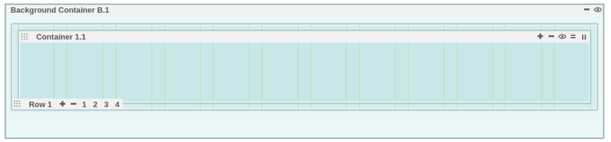
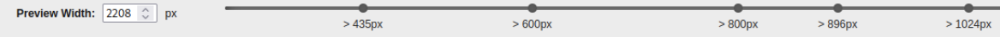

# Custom Layout Editor

This topic explains how to define a page using a custom layout and how to edit the layout of such a page.

Beginning with HCL Digital Experience (DX) CF198 and later, the Layout tab on the page properties dialog has been augmented with a **Customizable Layout**, which, when selected, launches a new out-of-the-box (OOB) layout editor called Custom Layout Editor. It is distinct from the previous (and still available) statically defined layouts. With HCL DX CF198 and later releases, the Custom Layout Editor is installed out-of-the-box with the [Simple](../../../../../../build_sites/themes_skins/simple_theme/index.md) and [Portal 8.5](../../../../../../build_sites/create_sites/website_building_blocks/themes_profiles_skins/themeopt_defaultparts.md) themes, and can be added to custom (for example, “user-written”) themes as well. The goal of the new Custom Layout Editor is to allow creating a custom layout without having to add additional HTML and CSS to their themes. The Custom Layout Editor also allows the layout to be customized through a GUI and instantly previewed.

With the Custom Layout Editor, a page designer can create a page layout in HCL DX that differs from the "static" layouts previously available. The static layouts include 1 column, 2 column equal, 2 grid, etc. There are 11 of these static layouts available today in HCL DX, apart from a “custom layout.” A “custom layout” represents a layout created with the custom layout editor. See [Layout Styles](https://help.hcltechsw.com/digital-experience/8.5/ctc/ctc_arch_css_layout.html) for more information.

The goal of a custom layout is to allow the page designer to create a custom look and feel (for example, as many rows and columns) for his page. These columns may be different widths (relative to other), however, that is not a requirement.

## Custom Layout Editor usage

Note that the Custom Layout Editor is designed for a site designer to edit the layout of a page or create a new layout template. Therefore, you should always create and save a custom layout, and exit the Custom Layout Editor before attempting to add content to a page created with the Custom Layout Editor.

## Custom theme installation and conversion

Even though the Custom Layout Editor is available in CF198 and later with the Simple and Portal 8.5 themes, existing user-written themes require changes to take advantage of this new function. Installation of HCL DX 9.5 CF198 or later versions does not automatically give existing user-written themes the ability to use the Custom Layout Editor. To enable the Custom Layout Editor, refer to the following steps.

There is a profile in every theme which enumerates all the modules that are used by that theme. For example, in the Portal 8.5 theme, these files are in the WebDAV repository under the `fs-type1/themes/default85theme/profiles` directory. The `profile_deferred.json` has been updated to include changes needed for the custom layout editor. In CF198, the `profile_deferred.json` file includes the following additions: `wp_gridlayout` to the `moduleIDs` section, and `wp_toolbar_gridlayout_inlineedit` to the `deferredModuleIDs` section. Profiles included in a customer written theme need to be updated to include the same changes described above for the theme to support custom layouts.

These changes should be made to every profile in the theme if pages based on that theme are to have access to the **Customizable Layout**.

Also, the XMLAccess deployment file for a custom theme now needs the following line added:

```
<parameter name="ibm.portal.shelf.layout.json.layoutEditor" type="string" update="set"><![CDATA[dav:fs-type1/system/layouts.json]]></parameter>
```

Note that this parameter would be set the same for themes not using WebDAV. This file exists in a directory outside of any particular theme and is part of the CF198 install.

The XMLAccess exports of the deployment files for both the Portal 8.5 theme, as well as Simple theme can be used as a guide for updating a custom theme.

If one is writing a theme from “scratch” after having already installed the cumulative fix containing the custom layout editor (HCL DX CF198 or later), files copied from the Portal 8.5 theme, or the Simple theme should likely already have the profile updates described above. However the theme deployment file would still need to be updated.

## Using the Custom Layout Editor

As delivered, the Custom Layout Editor is available in the Portal 8.5 theme and the Simple theme. Users of the Custom Layout Editor must have administrator privileges (log in as Administrator role, for example, wpsadmin or equivalent). If a previously created page is based on one of the out-of-box themes, start by turning on **Edit Mode** and then navigate to **Open Page Settings > Layout** for your page. Select the **Customizable Layout** icon as the page layout. Close the page settings toolbar once **Customizable Layout** is selected.

From “Edit Mode” on the page upon which you just selected **Customizable Layout**, a small dialog box will be displayed, as follows:


In this  example, the Portal 8.5 theme is shown in the dialog box. Clicking on the **Edit** button in that dialog box launches the layout editor. The dialog box now looks like this:


### Buttons on the Edit dialog

There are seven buttons on the Custom Layout Editor “Edit” dialog. From left to right:

- **Edit**: The **Edit** button has no effect in this case. When in “pressed” mode, this indicates that the user is in Custom Layout Edit mode.

- **Toggle Gridline**: This button allows the user to toggle the display of vertical lines in the layout container in sizing the container.

- **Toggle Content**: This button allows the user to display portlets in the container on the page.

- **Reset**: When pressed, any unsaved changes to the displayed layout will be reverted to the original layout of the page. Changes made during this edit session are cancelled.

- **Save Page**: This allows the user to save the current page layout without exiting this layout session. This action only affects the current page.

- **Save As Layout Template**: This allows the user to save the currently displayed layout as a new “named” layout. In the future, the new layout can be selected at “page setting” time in the page layout dialog (just as 1 column, for example).

    !!!note
        Any changes not saved using the **Save As Layout Template** button are lost.

- **Done**: This allows the user to exit the custom layout design session.

### Containers and rows

Clicking the **Edit** button on a page with the Customized Layout selected presents this initial view of the page:



There are several icons which have various functions. The two important objects in the custom layouts are “Containers” and “Rows”. Containers are the object that houses portlets placed on the page. Rows contain columns, which in turn have containers. Within each container, there are controls to add more containers to the current row. Within each row are controls to add more rows.

To the far right of the “Container”, a user may perform the following actions by hovering and clicking on any of the five icons:

- The plus icon or **+** adds another container to the same row.
- The minus icon or **-** removes the current container.
- The view or eye icon hides the current container.
    !!!note
        If there is more than one container in the current row, hiding the container produces a small “circle” with the container name.
- The equals icon or **=** split a container vertically. Clicking this adds a new container vertically (in the current column) under the current container.
- The 2-bar icon or **||** splits a container horizontally. Clicking this will add a new container in a new column in the current row. This also divides the current column containing the current container in half and adds a new container.

Note that each row container may actually have more than one row of containers based on the width of the screen and the width of the container.

The bottom of each row displays icons where the user can select a specific row and perform the following actions:

- The plus icon or **+** adds a new row to the layout.

- The minus icon or **-** removes the current row from the layout.

- The row number icons (**1**, **2**, **3**, **4**) allows the user to modify the row to contain this number of columns as indicated. Note that these create 1, 2, 3 or 4 equal-width columns (depending on user selection). The user may also drag and drop each column to create any desired width.

    However, clicking on one of the row numbers after changing the column width will resize the column width in that row, effectively negating the custom sizes previously selected.

- When selecting columns sizes (or the number of columns per row), if a container is too wide to fit in the currently selected column width, it will be moved below its current position. For example, if three columns are filled with three containers, and then one changes the columns from **3** to **2**, the right most container moves down (to a new column) since it no longer fit above.

### Breakpoint selector

When in a custom layout and in Edit mode, the breakpoint selector is located at the bottom of the screen like this:



The function of the breakpoint selector is to associate different custom layouts with different screen sizes. Different screen sizes are associated with different type devices so mobile phone or laptop views may display differently.

When selecting a breakpoint from the bottom (for example, screen size), the user is now editing a layout for that screen size. If selecting another screen size (at the bottom), accept the "default" layout shown or override it above in the editor. Now, when selecting the previous breakpoint size, it will show the layout chosen earlier. And when sliding the breakpoint to the previous "small" size, you get the layout you picked for that size. Otherwise, when you slide the breakpoint to a size that you didn't override in the editor, you get the "default" layout for that size.

Note that different browsers have different "default" layouts when a defined layout is not presented.

## Authorization

Users need different roles to perform the following actions:

- Administrator role on the pages to modify the layout and save the pages
- Administrator role on the portals to save a page layout as the new system layout
- User role or higher to view pages

## Staging

Generally, the page layout that is stored and leveraged on a page is staged as part of the page, therefore, using syndication of the managed pages or `xmlaccess`, the data is transferred.

But, if you are storing the layout as a new layout and want to leverage it on the target server in an edit mode, then the layout is saved as a system layout. Hence, in this case, the `webdav system layouts.json` file [https://myserver.hcl.com/wps/mycontenthandler/dav/fs-type1/system/layouts.json](https://myserver.hcl.com/wps/mycontenthandler/dav/fs-type1/system/layouts.json) must be manually staged.