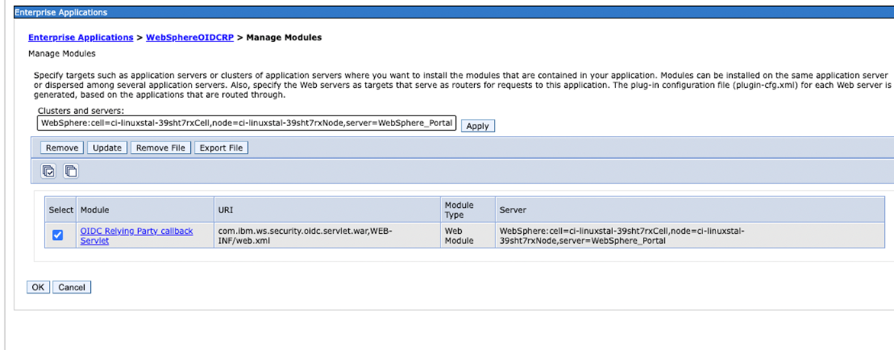

# Setting up OIDC for HCL Digital Experience

## Configuring OIDC Authentication for DX

The following steps configure your HCL Digital Experience (DX) installation to leverage OpenID Connect (OIDC) based authentication with an OIDC compatible Identity Provider (IdP), such as Keycloak. This means that DX is turned into a relying party (RP) towards your IdP and the IdP is trusted for authentication assertions.

### What is this about?

An increasing number of enterprises are leveraging IdPs to manage the identities, access rights, and authentication flows of their customers, employees, and partners towards their applications and IT landscape. Common IdP solutions and services include Microsoft Azure Active Directory, Okta, Auth0, or Keycloak. Each of the available solutions has unique takes and capabilities that may make them a good choice or fit over another, but all of them focus on common and standardized authentication strategies - most notably OIDC.

OIDC serves as a modern authentication and authorization protocol designed to enhance digital security and user experience, particularly in the realm of identity and access management (IAM). Operating as an extension of the OAuth 2.0 framework, OIDC merges the strengths of OAuth's access delegation capabilities with identity verification, resulting in a comprehensive solution.

At its core, OIDC streamlines the process of confirming user identities and authorizing their access to digital resources. It achieves this through the establishment of a trust relationship between the Identity Provider and the relying party (a web application or service, such as HCL Digital Experience). Users initiate the process by presenting their credentials to the IdP, which validates their identity. Subsequently, the IdP issues tokens, including the ID token which acts as proof of authentication, and the access token which grants access to protected resources. This allows supporting capabilities like Single Sign-On (SSO) across multiple applications, prolonged and uninterrupted user sessions, and enabling seamless collaboration across organizations while maintaining a secure identity exchange with granular control over data sharing. The protocol's flexibility accommodates diverse use cases, from mobile applications to single-page web apps.

HCL DX and HCL Digital Solutions (DS) products as a whole recognize the benefits of and requirements to OIDC and thus support it. The following document provides an initial set of instructions to get started and enable HCL DX for it.

HCL DX in particular has a vast set of capabilities relating to authentication, such as [custom authentication filters](../../../config_portal_behavior/auth_filters/index.md), [transient users](../authentication/integrate_oid/index.md), [step-up authentication](../authentication/stepup_auth/enabling_stepup_auth/stepup_auth_prop.md), a customizable login UI through portlets and more. Some of those capabilities require additional steps or are by design incompatible with standard OIDC-based authentication and access flows and may not work out of the box. This documentation will be updated and extended with additional configuration steps and strategies to get them working or clearly outline their limitations.

If you are interested in the transient users functionality as part of OIDC, refer to the documentation [Integrating with Transient Users with OpenID Connect](../authentication/integrate_oid/index.md).

### Overview of required configuration tasks

On a high level, the following tasks must be executed to establish this configuration:

1. Install the OIDC RP Trust Association Interceptor (TAI) for WebSphere.

2. Configure the OIDC RP TAI against your IdP.

3. Update WebSphere Application Server (WAS) security properties to match the new TAI requirements.

4. Add the server certificate to the WAS trust store to allow internal HTTPS communication.

5. Update the DX logout flow for OIDC.

6. Configure DX VMM to match OIDC identities.

7. Set up the login link from DX to your IdP.

8. Validate everything is working as expected.

### What implications does this have?

Please be aware that configuring OIDC as the authentication protocol has certain implications to how features behave and have to be used or configured. Some of those implications are:


- Only users in the repository of the IdP can authenticate via OIDC. Users in other repositories, such as administrative users in the file registry, must bypass OIDC to authenticate.

- This procedure requires that the IdP and HCL DX leverage the same user repository. Alternatively, there is an option for [Integrating with Transient Users with OpenID Connect](../authentication/integrate_oid/index.md). 

<!-----This is subject to be elaborated on as part of this documentation in a later iteration.-->

- Creating users or allowing them to sign up through DX might be blocked due to the user management being relocated to the IdP as the primary orchestrator.

### Additional information

Use this procedure as a general reference and make adjustments to accommodate the environment and application requirements. In some cases, there are additional configuration options that alter the values to input or require steps to be conducted slightly differently. The following assumptions have been made:

- There is only one hostname in use (this might differ in some cases, for example, if you are using Virtual Portals).

- The default context root /wps/portal (and /wps/myportal) are used, with `myportal` being the secured URL.

- The login property to identify users is the mail attribute.

- The cloud native distribution of DX is used.

- An IdP is set up and configured. Required details like the client id or secrets are available to configure during the tasks in this document.

- [Keycloak](https://www.keycloak.org/) is used as the IdP. The OIDC layer looks mostly the same with any other IdP but this is not guaranteed due to the extensive landscape of providers.


## Installing the OIDCRP TAI

1. Install the OIDC RP Trust Association Interceptor (TAI). For more details, refer to [Configuring an OpenID Connect Relying Party](https://www.ibm.com/docs/en/was-nd/9.0.5?topic=users-configuring-openid-connect-relying-party).


    ```
    kubectl exec -it dx-deployment-core-0 bash -n dxns

    cd /opt/HCL/AppServer/bin
    ./wsadmin.sh -f installOIDCRP.py install dockerNode WebSphere_Portal
    Username: wpsadmin
    Password: wpsadmin

    ...
    ADMA5013I: Application WebSphereOIDCRP installed successfully.

    ```

2. Open IBM WebSphere Application Server Integrated Solutions Console and go to **Applications > Application types > Enterprise Applications > WebsphereOIDCRP > Manage modules**.

3. Select available module and click “Apply” then “OK”. 

### Restarting the server / DX core to apply all changes

Restart the server (that is, the DX core JVM) to load the newly installed OIDC RP TAI. This is required for the next configuration steps. Restarting the server can be done in various ways, for example, through the ConfigEngine:

```
kubectl exec -it dx-deployment-core-0 bash -n dxns
/opt/HCL/wp_profile/ConfigEngine/./ConfigEngine.sh stop-portal-server
```

## Configuring the OIDC RP TAI against your IdP

The following configuration allows the OIDC TAI to contextualize which requests should be intercepted and how to treat them. In particular, this configuration is tightly connected to the IdP realm and client configuration.

The interceptor can be configured in the IBM WebSphere Application Server Integrated Solutions Console under **Security > Global Security > Web and SIP security > Trust association > Interceptors**.

1. Click **New..** button to create a new interceptor with the **Interceptor class name**.

    `com.ibm.ws.security.oidc.client.RelyingParty`.

    !!! note
        If the interceptor already exists, click on it to access the configuration properties instead of creating it again.

2. Add the following custom properties:

    |Name|Value|
    |-----|---|
    |provider_1.identifier|	hcl|
    |provider_1.clientId	|hcl-dx-oidc-client|
    |provider_1.clientSecret|	<CLIENT_SECRET>|
    |provider_1.authorizeEndpointUrl	|https://<HOSTNAME>/realms/hcl/protocol/openid-connect/auth|
    |provider_1.tokenEndpointUrl	|https://<HOSTNAME>/realms/hcl/protocol/openid-connect/token|
    |provider_1.interceptedPathFilter|	/wps/myportal|
    |provider_1.excludedPathFilter|	/ibm/console,/ibm/console.*|
    |provider_1.issuerIdentifier	|https://<HOSTNAME>/realms/hcl|
    |provider_1.signatureAlgorithm	|RS256|
    |provider_1.jwkEndpointUrl	|https://<HOSTNAME>/realms/hcl/protocol/openid-connect/certs|
    |provider_1.userIdentifier	|email|
    |provider_1.userDefaultIdentifierFirst	|false|
    |provider_1.scope	|openid|
    |provider_1.signVerifyAlias	|hcl-dx-oidc-client|
    |provider_1.useJwtFromRequest	|IfPresent|
    |provider_1.createSession	|true|
    |provider_1.verifyIssuerInIat	|true|
    |provider_1.audiences	|ALL_AUDIENCES|
    |provider_1.setLtpaCookie	|true|
    |provider_1.callbackServletContext	|/oidcclient|
    |provider_1.mapIdentityToRegistryUser	|true|

    !!! note
        Make sure to replace the <HOSTNAME> and <CLIENT_SECRET> placeholders with your respective details. The client secret is available through your IdP client configuration. Also, ensure other properties match your environment configuration. For example, the path filter matches your DX context, the OIDC URLs match your IdP endpoint structure, and the right client id is used.

3. Click **Apply** and **OK**. To continue the changes, click **Save** directly to the master configuration in the alert message.

## Updating WAS security properties

Some custom properties have to be updated to match the OIDC TAI config and its expected behavior. To do, go to **Security > Global security > Custom properties**.

1. Delete the property `com.ibm.websphere.security.DeferTAItoSSO` if it exists. 

2. Add or update the following properties:

    |Name|Value|
    |-----|----|
    |com.ibm.websphere.security.customLTPA2CookieName	|LtpaToken|
    |com.ibm.websphere.security.customSSOCookieName	|LtpaToken2|
    |com.ibm.websphere.security.disableGetTokenFromMBean	|false|

3. To continue the changes, click **Save**.

## Adding the hostname/server certificate to the WAS trust store

In order to allow internal HTTPS communication with your IdP, you must add the hostname (FQDN) to the WebSphere trust store.

1. In the IBM WebSphere Application Server Integrated Solutions Console, navigate to **Security > SSL certificate and key management > Key stores and certificates > NodeDefaultTrustStore > Signer Certificates > Retrieve from port**.

2. Set the following properties:

    |Name|	Value|
    |-----|------|
    |Host	|hostname (FQDN)|
    |Port	|443|
    |Alias	|hcl-idp (Note: same as provided in above interceptor property)|

3. Click **Retrieve signer information**. This loads the certificate details.

4. Click **OK**, and **Save** to the master configuration.

## Updating the DX Logout flow for OIDC

1. In the IBM WebSphere Application Server Integrated Solutions Console, navigate to **Resources > Resource Environment > Resource Environment Providers > WP ConfigService > Custom properties**.

2. Add or update the following properties:

    |Name	|Value|
    |------|------|
    |redirect.logout	|true|
    |redirect.logout.ssl	|true|
    |redirect.logout.url	|https://<HOSTNAME>/auth/realms/hcl/protocol/openid-connect/logout?post_logout_redirect_uri=https://<HOSTNAME>/wps/portal&client_id=hcl-dx-oidc-client|

3. To continue the changes, click **Save**.

## Configuring DX VMM to match OIDC identities

### Setting the login property to mail

First, set the login property to `mail` to match the identity attribute coming in from your IdP. To do this,

1. Go to the IBM WebSphere Application Server Integrated Solutions Console.

2. Navigate to **Security > Global security > User account repository > Configure... > <LDAP_ID>**

3. Set the field for **Federated repository properties for login** to `mail`.

3. Then, click **OK** and **Save** to the master configuration.

### Updating IBM WebSphere Application Server sub-component Virtual Member Manager (VMM) to map user attributes

1. After setting the login property to `mail`, this change must be worked into the WAS wimconfig.xml as well. 

    !!! note 
        This requires a manual update of the file, make sure to back the file up as this might otherwise corrupt your instance.

    ```
    kubectl exec -it dx-deployment-core-0 bash -n dxns

    cd /opt/HCL/wp_profile/config/cells/dockerCell/wim/config/
    # Create a backup
    cp wimconfig.xml wimconfig.xml.backup

    # Start editing the wimconfig.xml
    vi wimconfig.xml

    ```

2. From here, find the `userSecurityNameMapping` config attribute in the realmConfiguration and change the value of property `propertyForOutput` to `uniqueName` as outlined below:

    ```

    # before
    <config:userSecurityNameMapping propertyForInput="principalName" propertyForOutput="principalName"/>

    # after
    <config:userSecurityNameMapping propertyForInput="principalName" propertyForOutput="uniqueName"/>
    ```

3. Make sure to save the changes.

### Restarting the server / DX core to apply all changes

Finally, restart the DX environment (specifically, the DX core JVM) for the changes to take effect. Restarting the server can be done in various ways, for example, through the ConfigEngine:

```
kubectl exec -it dx-deployment-core-0 bash -n dxns
/opt/HCL/wp_profile/ConfigEngine/./ConfigEngine.sh stop-portal-server
```

The restart takes a few minutes to complete.

## Setting up login link from DX to your IdP

To properly invoke the OIDC flow, make sure that the login link pushes you to the `/wps/myportal` URL which was set up to be interceptor in the OIDC configuration. This involves multiple steps within the DX administration view.

### Detaching the existing login option

First, detach the existing login option by changing its unique name:

1. Navigate to the portal site `https://<HOSTNAME>/wps/portal` and log in as the admin user (wpsadmin:wpsadmin).

2. Click the **home icon** dropdown to open the applications menu and click **Administration**.

3. On the **Administration** page, expand the menu on the top left and navigate to **Site Management > Pages**.

4. On the **Manage Pages** page, search for **login** (Search by: Title starts with; Search: login). This should find the **Login** (wps.Login) page.

5. Click **Edit Page Properties** icon (first action in the row). This brings you to the **Edit page: Login** configuration page.

6. In the **Unique Name** field, edit the value and rename `wps.Login` to `wps.Login.default`. Click **OK**.

### Creating the new IdP specific login option

Create the new login option that maps to `/wps/myportal`. This action will be set to be accessible to anonymous users:

1. In **Manage Pages** page, click **Select Page** link.

2. Click **Content Root** page and click **Home** page.

3. Click the **New URL** button.

4. Set **Title** to `Login-IdP`.

5. Make sure the radio button for **A link to a Web page with the following URL** is selected.

6. Set the url to `https://<HOSTNAME>/wps/myportal`.

7. Click **OK**.

8. On the **Manage Pages** page, select **Home** page. Make sure you see the newly added **Login-IdP** URL. In the same row, click the **Set Page Permission** action.

9. On the **Resource Permissions** page, find the **User** row and click **Edit Role** action.

10. Click **+ Add** button, 

11. Check the box next to **Anonymous Portal User** and click **OK**. The **Anonymous Portal User** role now appears in the **Resource Permissions** panel.

### Mapping the new IdP specific login to use it

Update the unique name of the new IdP specific login page so that pages referring to the login option leverage it:

1. On the left side navigation, go to **Settings > Custom Unique Names** and select **Pages** resource type.

2. Search for the **Login-IdP** page and click **Edit unique name for Page** button in the respective row.

3. In the **Unique name** field, set the value to `wps.Login` and then click **OK**.

## Testing the OIDC login flow

1. Log out or open a private browser and navigate to `https://<HOSTNAME>/wps/portal`.

2. Click **Log in**.
   This directs you to the IdP instance login view.

3. Log in with user `jjones1:password`.
    You are directed to DX and logged in as user `jjones1`.

4. Navigate to `https://<HOSTNAME>/wps/myportal/Practitioner/Home` and confirm the displayed user is `jjones1`.
