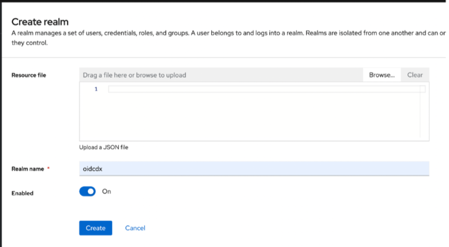
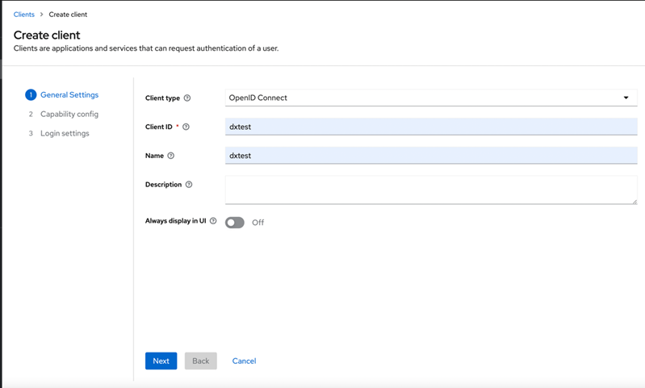
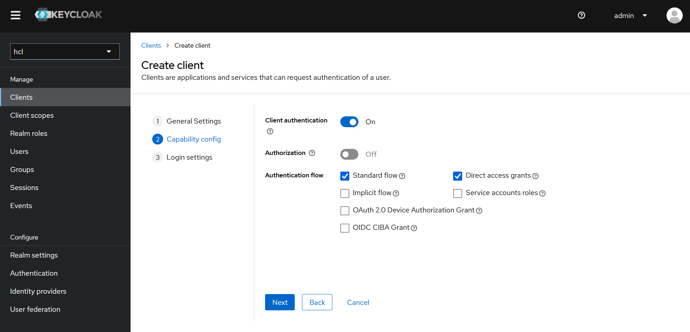
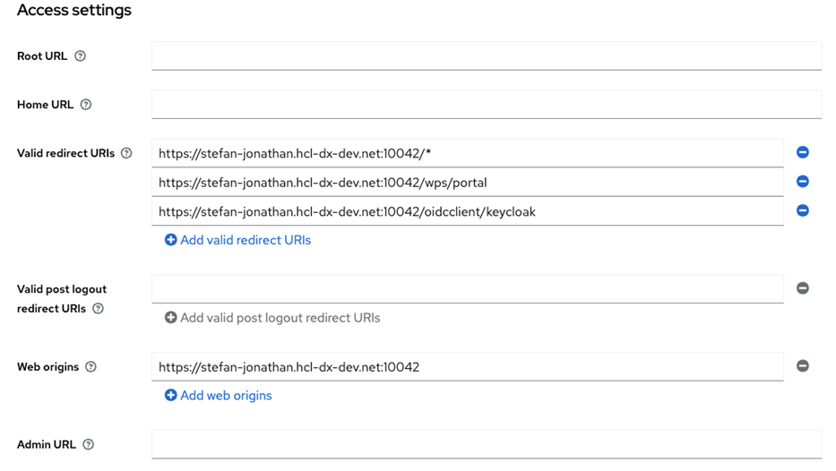
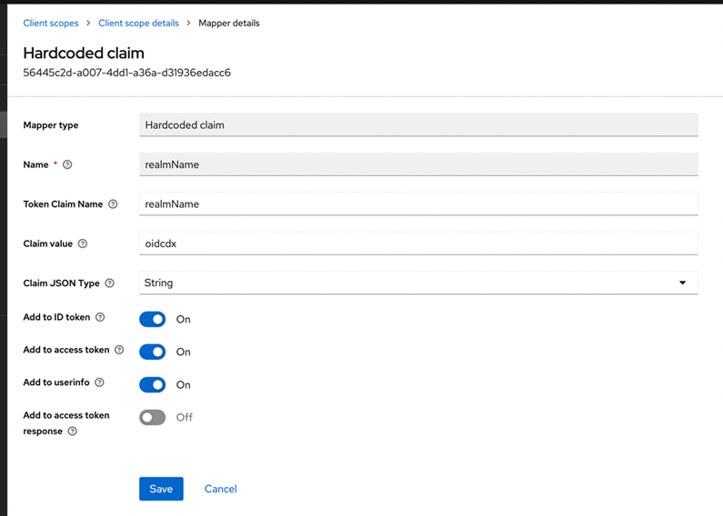
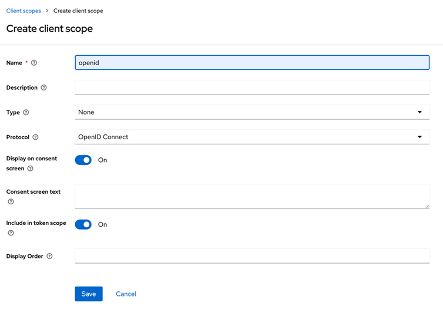
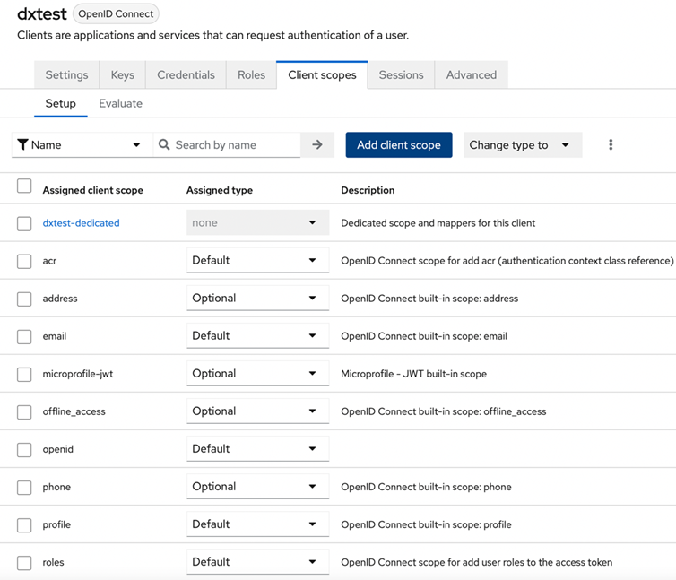

# Configuring Keycloak as an OIDC IdP for HCL Digital Experience

This document provides information on the configuration of Keycloak as an OIDC Identity Provider against HCL Digital Experience (DX) as a relying party. The configuration entails the setup of a realm, user federation, client, custom claims for client scopes and respective mappers to wire those claims.

For the HCL DS Keycloak service the required settings/configuration already are in place and get rolled out during deployment. They should still be validated once before proceeding to ensure everything is understood and properly set up. Customers certainly can set up their own realm and client as needed using below steps, or adjust the once created by default.

For default configuration, skip the remaining steps and continue to [Updating WebSphere to support OIDC Authentication for DX](./dx-update-webshpere-for-oidc.md).

1. Go to the admin console and login: `<HOSTNAME>/auth/admin>`

    - Login should be admin : admin

2. From the top left dropdown, select **Create Realm** and add a new realm name.
3. Click **Create** (for example we are using oidcdx):

    

4. Go to the **Clients Section > Create Client** and add the following values:
    1. In **General Setting** page add the following values:
        - Client ID: dxtest
        - Name: dxtest

        - Click **Next**.

        

    2. In the **Capability config** page,  check the **Client authentication** options and click “Next”.

        

    3. In the **Access setting** page, enter the following URLs in **Valid redirect URIs** section and click “Save”:

        1. (Only use this one for dev) `<HOSTNAME>/*`
        2. `<HOSTNAME>/oidcclient/keycloak`
        3. `<HOSTNAME>/wps/portal`

        

5. Create client scope Mapper for realmName: Go to {realm} -> Client scope -> roles -> Add mappers -> By Configuration -> Hardcoded Claim

    - Fill in the values in the following fields:

      - Name = realmName
      - Token Claim Name = realmName
      - Claim Value = {realm} (change this as per your realm. For example: oidcdx)
      - Claim JSON Type = String
      - Check Add to ID token
      - Check Add to access token
      - Check Add to userinfo
      - Click Save.

    

6. Add openid client scope (if not available), select Client Scopes -> Create Client

    - Name: openid
    - Click “Save”

    

7. Add openid client scope to client (if not added), select Clients -> dxtest(client name) -> client scopes -> add client scope -> select openid -> Add as default.

    

## What's next

Once you have configured Keycloak, you can now look at [Updating WebSphere to support OIDC Authentication for DX](./dx-update-webshpere-for-oidc.md) for further instuctions.
