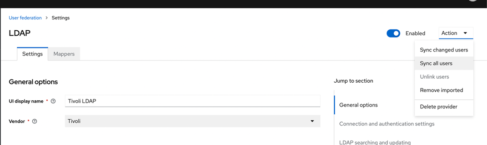
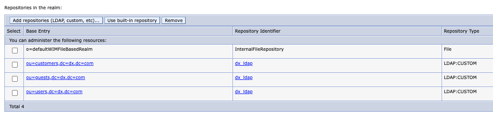

# Setting up OIDC for HCL Digital Experience with VMM and Virtual Portals

This document provides instructions on how to configure HCL Digital Experience (DX) with Keycloak. The use of Virtual Portals including user-scopes for individual portals through VMM (Virtual Machine Manager) and multi-realms.

## Overview of tasks and intent

The purpose of this section is to set up an HCL DX environment with multiple Virtual Portals that uses Keycloak as an IdP. The Keycloak is set up with different realms and clients to divide different groups of users (here, differentiated into **users**, **customers** and **guests**). For this, an OpenLDAP instance is prepared to contain the users in a structure that allows separating them into different scopes. Later, both Keycloak and DX are configured against an OpenLDAP instance for user federation. DX is then configured against Keycloak through OIDC and lastly, Virtual Portals and VMM config are laid out to set up the different spaces within DX.

Before you begin, please ensure you have carried out the steps mentioned in [Updating WebSphere to support OIDC Authentication for DX](./dx-update-webshpere-for-oidc.md).

Follow the steps to execute the configuration:

1. [Add OpenLDAP for user federation](#adding-the-openldap-as-user-federation)
2. [Configure Keycloak OIDC auth for DX](#configure-different-oidc-providers-for-the-virtual-portals)
3. [Setting up the Virtual Portals and realms](#setting-up-the-virtual-portals-and-realms)

## Adding the OpenLDAP as user federation

Add the OpenLDAP to your native kube environment and make sure to uncheck the `DISABLE_OPENLDAP` option in the [Reserve a native-kube EC2 instance](../../../deployment/examples/keycloak-dx-native-kube.md#reserve-a-native-kube-ec2-instance) step.

Follow the steps to execute and use the OpenLDAP setup:

- Populate the LDAP with test users
- Run DX Config Engine to prepare the Virtual Member Manager for the new users and LDAP
- Validate that users are recognized in WebSphere
- Configure Keycloak user federation with OpenLDAP

### Adding the test users to OpenLDAP container

Prepare a test_users.ldif file and make sure the file contains the desired test users. We recommend using the contents list provided in the [sample OpenLDAP LDIF](./openldap-test-users-ldif.md).
After creating the file, copy it into the open ldap pod:

```sh
kubectl cp test_users.ldif dx-deployment-open-ldap-0:/home/dx_user/ -n dxns
```

Open OpenLDAP pod and import them to its database:

```sh
kubectl exec -it dx-deployment-open-ldap-0 -n dxns -- sh

/var/dx-openldap/bin/./ldapadd -h $HOSTNAME -p 1389 -f /home/dx_user/test_users.ldif -x -D cn=dx_user,dc=dx,dc=com -w p0rtal4u -v
```

This will set up users in three organizational units:

- `jjones1` to `jjones5` (password `password`) in ou `users`
- `ccustomer1` to `ccustomer5` (password `password`) in ou `customers`
- `gguest1` to `gguest5` (password `password`) in ou `guests`

### Copying the properties to the DX Core container

Prepare the file [wkplc.properties](../resources/wkplc.properties) on your machine. Copy the file into the DX core pod:

```sh
kubectl cp wkplc.properties dx-deployment-core-0:/opt/HCL/wp_profile/ConfigEngine/properties/ -n dxns
```

### Running the ConfigEngine tasks to configure OpenLDAP to DX

Open the core pod to execute the ConfigEngine and validate and update the user federation. This will set user federation for the OpenLDAP on WAS and allow DX to recognize the users.

```sh
kubectl exec -it dx-deployment-core-0 bash -n dxns

/opt/HCL/wp_profile/ConfigEngine/./ConfigEngine.sh validate-federated-ldap
/opt/HCL/wp_profile/ConfigEngine/./ConfigEngine.sh wp-create-ldap
/opt/HCL/wp_profile/ConfigEngine/./ConfigEngine.sh reregister-scheduler-tasks
/opt/HCL/wp_profile/ConfigEngine/./ConfigEngine.sh wp-set-entitytypes
/opt/HCL/wp_profile/ConfigEngine/./ConfigEngine.sh wp-update-federated-ldap-attribute-config
/opt/HCL/wp_profile/ConfigEngine/./ConfigEngine.sh stop-portal-server
```

### Ensure that test users show in the WAS Admin console

- Log into the WAS Administration console at `https://<HOSTNAME>/ibm/console`.
- Expand 'Users and Groups' in the left hand navigation tree.
- Click on the 'Manage Users' link.

## Configuring the Keycloak OIDC auth for DX

Learn how to setup a Keycloak client for DX and configure the DX installation on the server to leverage OpenID Connect (OIDC) based authentication with Keycloak. This means that DX is turned into a Relying Party (RP) to Keycloak serving as its identity provider (IDP).

!!!note
    The steps are also outlined in a bit more detail in [Configuring OIDC for HCL Digital Experience](./index.md).

### Configuring the Keycloak client for DX

The full configuration here entails the setup of a realm, user federation, client, custom claims for client scopes and respective mappers to wire those claims, and is explained in detail in the document. (kindly add the document link)

- First, log in to Keycloak at `https://<HOSTNAME>/auth/admin` with user `admin` and password `admin`. Select the realm `hcl` in the top left dropdown.

- You can import the initial realm keycloak feature, which provides a predefined set of configurations.

- **(Optional)**: Keycloak provides a **Partial import** feature to leverage additional predefined configurations:

    1. Navigate to **Realm setting**, click the **Action** dropdown and select **Partial import**. Download the [native-kube-hcl-realm-client-config.json](../resources/native-kube-dx-users-realm-client-config.json) and upload it in the dialog.

    1. This should properly recognize the file and list various resources to import (users, clients, realm and client roles). Select all of them and select **Overwrite** in the if-exists dropdown.

    1. Click **Import** to apply the configuration and add respective resources. This leads to a summary view that lists the added and overwritten resources. Review the changes to ensure there are no obvious errors and click **Close**.

- Click on the **Clients** tab and select the client ID link. For example, Client ID:`hcl-dx-oidc-client`.

- Under the **Valid redirect URIs** and **Web Origins** fields, replace `localhost` with the `HOSTNAME` for in environment, for example, `https://localhost/wps/myportal` to `https://native-kube-transient.team-q-dev.com/wps/myportal` and `https://localhost:443/oidcclient/hcl` to `https://native-kube-ki.team-q-dev.com:443/oidcclient/hcl`.

!!!note
    The context path for the `https://native-kube-ki.team-q-dev.com:443/oidcclient/hcl` redirect URI is dynamically constructed by WAS with a combination of the following TAI custom properties referenced further `provider_1.identifier = hcl` and `provider_1.callbackServletContext = /oidcclient`. **Make sure to include the port `443` in the url with `/oidcclient/hcl` as that's how WAS constructs it!**

#### Sync users from LDAP

The import creates the `DX OpenLDAP` in the user federation. As a final step, you need to sync the users to make them available in Keycloak. To do this, navigate to **User Federation > DX OpenLDAP**.

Click the **Action** dropdown in the top right corner of the provider and select the “Sync all users” option.
This shows the new users added to your Keycloak instance.



## Setting up the Virtual Portals and realms

This section will setup DX Virtual Portals to provide multiple groups of pages/sites under different contexts. In addition, multiple realms are configured to scope the Virtual Portals to different user groups. Lastly, the Keycloak authentication service is leveraged to differentiate between different realms/Virtual Portals and show login UIs catered to the different user groups.

To establish this setup, the following high-level tasks are conducted:

- [Prepare the WebSphere federated user registry to understand different user scopes](#prepare-the-websphere-federated-user-registry-to-understand-different-user-scopes)
- [Creating the multiple realms within the Virtual Member Manager](#creating-the-multiple-realms-within-the-virtual-member-manager)
- [Creating the Virtual Portals with respective user realms in DX](#creating-the-virtual-portals-with-respective-user-realms-in-dx)
- [Creating the new realms and clients mapping to Virtual Portals in Keycloak](#creating-the-new-realms-and-clients-mapping-to-virtual-portals-in-keycloak)
- [Configure different OIDC providers for the Virtual Portals](#configure-different-oidc-providers-for-the-virtual-portals)
- [Validate your changes and setup](#validate-your-changes-and-setup)

### Prepare the WebSphere federated user registry to understand different user scopes

To split the user federation into multiple parts, you need to adjust the unique distinguished name of the base entry from `dc=dx,dc=com` to `ou=users,dc=dx,dc=com`:

- go to the WAS Administration console.
- navigate to Security > Global Security.
- in the **User account repository** section, click on **Configure**.
- in the **Repositories in the realm:** table, click on the **dc=dx,dc=com**.
- change the unique distinguished name to `ou=users,dc=dx,dc=com` and click **OK**.

In addition, add two more base entries to scope our customer and guest users. To do this, in the same **Federated repositories** overview:

- Click **Add repositories (Example LDAP, custom).**
- Select the **dx_ldap**  as **Repository**.
- Set the unique distinguished name to `ou=guests,dc=dx,dc=com` and click **OK**.
- Repeat the same step and set the unique distinguished name to `ou=customers,dc=dx,dc=com`.



### Creating the multiple realms within the Virtual Member Manager

The overall task is based on the following DX docs and capabilities - [Adding realm support](https://opensource.hcltechsw.com/digital-experience/CF212/deployment/manage/security/people/authentication/user_registry/cfg_realm/).
This task is streamlined for the native-kube environment and provides the updates to the underlying configuration layer - the `wimconfig.xml`.

- To get started, identify the `wimconfig.xml`, create a backup and open it in edit mode:

    ```sh
    kubectl exec -it dx-deployment-core-0 bash -n dxns
    cd /opt/HCL/wp_profile/config/cells/dockerCell/wim/config/
    cp wimconfig.xml wimconfig.xml.backup
    vi wimconfig.xml
    ```

- Identify the existing `PersonAccount` section established during the [initial OpenLDAP configuration](#running-the-configengine-tasks-to-configure-openldap-to-dx):

    ```xml
    <config:supportedEntityTypes defaultParent="ou=users,dc=dx,dc=com" name="PersonAccount">
      <config:rdnProperties>uid</config:rdnProperties>
    </config:supportedEntityTypes>
    ```

    Add the following additional `PersonAccount` elements:

    ```xml
    <config:supportedEntityTypes defaultParent="ou=customers,dc=dx,dc=com" name="PersonAccount">
    <config:rdnProperties>uid</config:rdnProperties>
    </config:supportedEntityTypes>
    <config:supportedEntityTypes defaultParent="ou=guests,dc=dx,dc=com" name="PersonAccount">
    <config:rdnProperties>uid</config:rdnProperties>
    </config:supportedEntityTypes>
    ```

- Identify the existing default `realm`:

    ```xml
    <config:realmConfiguration defaultRealm="defaultWIMFileBasedRealm">
      <config:realms delimiter="/" name="defaultWIMFileBasedRealm" securityUse="active">
      ...
      </config:realms>
    </config:realmConfiguration>
    ```

- Within the `realmConfiguration`, create the following peer `realms`:

    ```xml
    <config:realms delimiter="/" name="userRealm" securityUse="active" allowOperationIfReposDown="false">
    <config:participatingBaseEntries name="o=defaultWIMFileBasedRealm"/>
    <config:participatingBaseEntries name="ou=users,dc=dx,dc=com"/>
    <config:uniqueUserIdMapping propertyForInput="uniqueName" propertyForOutput="uniqueName"/>
    <config:userSecurityNameMapping propertyForInput="principalName" propertyForOutput="externalName"/>
    <config:userDisplayNameMapping propertyForInput="principalName" propertyForOutput="principalName"/>
    <config:uniqueGroupIdMapping propertyForInput="uniqueName" propertyForOutput="uniqueName"/>
    <config:groupSecurityNameMapping propertyForInput="cn" propertyForOutput="externalName"/>
    <config:groupDisplayNameMapping propertyForInput="cn" propertyForOutput="cn"/>
    </config:realms>
    <config:realms delimiter="/" name="customerRealm" securityUse="active" allowOperationIfReposDown="false">
    <config:participatingBaseEntries name="o=defaultWIMFileBasedRealm"/>
    <config:participatingBaseEntries name="ou=customers,dc=dx,dc=com"/>
    <config:participatingBaseEntries name="ou=guests,dc=dx,dc=com"/>
    <config:uniqueUserIdMapping propertyForInput="uniqueName" propertyForOutput="uniqueName"/>
    <config:userSecurityNameMapping propertyForInput="principalName" propertyForOutput="externalName"/>
    <config:userDisplayNameMapping propertyForInput="principalName" propertyForOutput="principalName"/>
    <config:uniqueGroupIdMapping propertyForInput="uniqueName" propertyForOutput="uniqueName"/>
    <config:groupSecurityNameMapping propertyForInput="cn" propertyForOutput="externalName"/>
    <config:groupDisplayNameMapping propertyForInput="cn" propertyForOutput="cn"/>
    </config:realms>
    <config:realms delimiter="/" name="guestRealm" securityUse="active" allowOperationIfReposDown="false">
    <config:participatingBaseEntries name="o=defaultWIMFileBasedRealm"/>
    <config:participatingBaseEntries name="ou=guests,dc=dx,dc=com"/>
    <config:participatingBaseEntries name="ou=customers,dc=dx,dc=com"/>
    <config:uniqueUserIdMapping propertyForInput="uniqueName" propertyForOutput="uniqueName"/>
    <config:userSecurityNameMapping propertyForInput="principalName" propertyForOutput="externalName"/>
    <config:userDisplayNameMapping propertyForInput="principalName" propertyForOutput="principalName"/>
    <config:uniqueGroupIdMapping propertyForInput="uniqueName" propertyForOutput="uniqueName"/>
    <config:groupSecurityNameMapping propertyForInput="cn" propertyForOutput="externalName"/>
    <config:groupDisplayNameMapping propertyForInput="cn" propertyForOutput="cn"/>
    </config:realms>
    ```

- Save the changes.

#### Restart the server or DX core to apply all changes

Restart the DX environment through the following commands:

```sh
kubectl exec -it dx-deployment-core-0 bash -n dxns
/opt/HCL/wp_profile/ConfigEngine/./ConfigEngine.sh stop-portal-server
```

The restart will take some minutes to complete.

### Creating the Virtual Portals with respective user realms in DX

To create a Virtual Portal, login as the DX admin user `wpsadmin:wpsadmin` through the WAS console at https://&lt;HOSTNAME&gt;/ibm/console/login.do:

!!!note
    There is an open issue where the admin cannot log in to the DX login anymore since it no longer exists in the OpenLDAP and Keycloak does not know about it, hence logging in through the WAS console.

- Navigate to the DX landing page at https://&lt;HOSTNAME&gt;/wps/portal.
- Click on the **home icon** (Open applications menu) dropdown and click on **Administration**.
- On the **Administration** page, expand the menu on the top left and navigate to **Site Management > Virtual Portal**.
- On the **Virtual Portal Manager** page, click on **New Virtual Portal**.
- Fill in the **Create New Virtual Portal** form with the following details:

    | Name | Value |
    | --- | --- |
    | Virtual portal title | woodburnstudio-vp-users |
    | URL Context: /wps/portal/ | woodburnstudio-vp-users |
    | User realm | userRealm |
    | Initial admin user group: (a valid user realm must be specified first) | useradmingroup |
    | Default theme | Portal 8.5 |

- Click on **OK** to initiate the creation process.
  !!!note
      You might encounter a **504 Gateway Time-out** error message. In this case, navigate back to https://&lt;HOSTNAME&gt;/wps/portal/Practitioner to continue the process. This is an expected behaviour in environments that are not leveraging a DB2 instance behind the scenes (for example, simple native-kube environments).

- Navigate back to the **Virtual Portal Manager** page, to confirm the virtual portal is created successfully.

Follow the same steps two more times for the guest and customer users. For this, use the following virtual portal title/url context and user realm:

- `woodburnstudio-vp-guests` and realm `guestRealm`
- `woodburnstudio-vp-customers` and realm `customerRealm`

### Creating the new realms and clients mapping to Virtual Portals in Keycloak

We will set up two realms for employees (mapping to users) as well as for customers and guests. The customers and guests share the same realm but will leverage individual clients.

Use the same **Partial import** feature that was already leveraged in the [Configuring the Keycloak client for DX](#configuring-the-keycloak-client-for-dx) step.

#### Creating the realms

- First, log in to Keycloak at `https://<HOSTNAME>/auth/admin` with user `admin` and password `admin`. Then, open the realm dropdown on the top left and click on **Create Realm**.

- Set the realm name to `dx-users` and import the provided file [native-kube-dx-users-realm-client-config.json].(./resources/native-kube-dx-users-realm-client-config.json). Click on **Create** to create the realm. This will set up the realm with all configuration.

- Create the second realm with the name `dx-customers-guests` and the provided file [native-kube-dx-customers-guests-realm-client-config.json](../resources/native-kube-dx-customers-guests-realm-client-config.json).

 !!! note
      After setting up both realms and user federation, make sure to [Sync users from LDAP](#sync-users-from-ldap), for LDAP to recognize all users in the LDAP scope.

### Configure different OIDC providers for the Virtual Portals

Configure the new realms and clients as additional providers into the OIDC TAI the same way as in [Configure the OIDC TAI](./dx-update-webshpere-for-oidc.md#configuring-the-oidc-rp-tai-against-your-idp):

- Log in to the WAS console and navigate to **Security > Global Security > Web and SIP security > Trust association > Interceptors  > com.ibm.ws.security.oidc.client.RelyingParty**.

- Add the following custom properties:

    | Name | Value |
    | --- | --- |
    | provider_2.identifier | dx-users-realm |
    | provider_2.clientId | dx-users-oidc-client |
    | provider_2.clientSecret | DDkql5HAZYvIFyv2zG0qm4PJrSKt44ts |
    | provider_2.authorizeEndpointUrl | https://&lt;HOSTNAME&gt;/auth/realms/dx-users/protocol/openid-connect/auth |
    | provider_2.tokenEndpointUrl | https://&lt;HOSTNAME&gt;/auth/realms/dx-users/protocol/openid-connect/token |
    | provider_2.interceptedPathFilter | /wps/portal/woodburnstudio-vp-users |
    | provider_2.excludedPathFilter | /ibm/console,/ibm/console.* |
    | provider_2.issuerIdentifier | https://&lt;HOSTNAME&gt;/auth/realms/dx-users |
    | provider_2.signatureAlgorithm | RS256 |
    | provider_2.jwkEndpointUrl | https://&lt;HOSTNAME&gt;/auth/realms/dx-users/protocol/openid-connect/certs |
    | provider_2.userIdentifier | email |
    | provider_2.useDefaultIdentifierFirst | false |
    | provider_2.scope | openid |
    | provider_2.signVerifyAlias | dx-users-oidc-client |
    | provider_2.useJwtFromRequest | IfPresent |
    | provider_2.createSession | true |
    | provider_2.verifyIssuerInIat | true |
    | provider_2.audiences | ALL_AUDIENCES |
    | provider_2.setLtpaCookie | true |
    | provider_2.callbackServletContext | /oidcclient |
    | provider_2.mapIdentityToRegistryUser | true |
    | provider_3.identifier | dx-customers-guests-realm-customers |
    | provider_3.clientId | dx-customers-oidc-client |
    | provider_3.clientSecret | mUAgyTfvvzkUmLXSivEEVvPJtjmGq3Sw |
    | provider_3.authorizeEndpointUrl | https://&lt;HOSTNAME&gt;/auth/realms/dx-customers-guests/protocol/openid-connect/auth |
    | provider_3.tokenEndpointUrl | https://&lt;HOSTNAME&gt;/auth/realms/dx-customers-guests/protocol/openid-connect/token |
    | provider_3.interceptedPathFilter | /wps/portal/woodburnstudio-vp-customers |
    | provider_3.excludedPathFilter | /ibm/console,/ibm/console.* |
    | provider_3.issuerIdentifier | https://&lt;HOSTNAME&gt;/auth/realms/dx-customers-guests |
    | provider_3.signatureAlgorithm | RS256 |
    | provider_3.jwkEndpointUrl | https://&lt;HOSTNAME&gt;/auth/realms/dx-customers-guests/protocol/openid-connect/certs |
    | provider_3.userIdentifier | email |
    | provider_3.useDefaultIdentifierFirst | false |
    | provider_3.scope | openid |
    | provider_3.signVerifyAlias | dx-customers-oidc-client |
    | provider_3.useJwtFromRequest | IfPresent |
    | provider_3.createSession | true |
    | provider_3.verifyIssuerInIat | true |
    | provider_3.audiences | ALL_AUDIENCES |
    | provider_3.setLtpaCookie | true |
    | provider_3.callbackServletContext | /oidcclient |
    | provider_3.mapIdentityToRegistryUser | true |
    | provider_4.identifier | dx-customers-guests-realm-guests |
    | provider_4.clientId | dx-guests-oidc-client |
    | provider_4.clientSecret | BZ8iNMR8IztWQDbMNe54FPj2i2tx0sYN |
    | provider_4.authorizeEndpointUrl | https://&lt;HOSTNAME&gt;/auth/realms/dx-customers-guests/protocol/openid-connect/auth |
    | provider_4.tokenEndpointUrl | https://&lt;HOSTNAME&gt;/auth/realms/dx-customers-guests/protocol/openid-connect/token |
    | provider_4.interceptedPathFilter | /wps/portal/woodburnstudio-vp-guests |
    | provider_4.excludedPathFilter | /ibm/console,/ibm/console.* |
    | provider_4.issuerIdentifier | https://&lt;HOSTNAME&gt;/auth/realms/dx-customers-guests |
    | provider_4.signatureAlgorithm | RS256 |
    | provider_4.jwkEndpointUrl | https://&lt;HOSTNAME&gt;/auth/realms/dx-customers-guests/protocol/openid-connect/certs |
    | provider_4.userIdentifier | email |
    | provider_4.useDefaultIdentifierFirst | false |
    | provider_4.scope | openid |
    | provider_4.signVerifyAlias | dx-guests-oidc-client |
    | provider_4.useJwtFromRequest | IfPresent |
    | provider_4.createSession | true |
    | provider_4.verifyIssuerInIat | true |
    | provider_4.audiences | ALL_AUDIENCES |
    | provider_4.setLtpaCookie | true |
    | provider_4.callbackServletContext | /oidcclient |
    | provider_4.mapIdentityToRegistryUser | true |

- Click on the **Apply** and **OK**. Click on the **Save**  to save the changes in the master configuration in the alert message.

#### Restart the server / DX core to apply all changes

Restart the DX environment through the following commands:

```sh
kubectl exec -it dx-deployment-core-0 bash -n dxns
/opt/HCL/wp_profile/ConfigEngine/./ConfigEngine.sh stop-portal-server
```

### Validate your changes and setup

Verify that everything is working as intended. With this setup you have established four different login scenarios that extend into respective URLs:

1. **https://&lt;HOSTNAME&gt;/wps/portal**

    This page is your general landing page and allows anonymous access. By clicking login, you are forwarded to https://&lt;HOSTNAME&gt;/wps/myportal, which is the configured OIDC login interceptor for your first configuration. This relates to the `hcl` realm and the `dx-oidc-client` client. It allows the entire user base of the LDAP as users to authenticate.

1. **https://&lt;HOSTNAME&gt;/wps/portal/woodburnstudio-vp-users**

    This is your first virtual portal. It relates to your user base under `ou=users`, the realm `dx-users` and the client `dx-users-oidc-client`. This virtual portal is fully protected and forces the users from this group to be authenticated.

1. **https://&lt;HOSTNAME&gt;/wps/portal/woodburnstudio-vp-customers**

    This is your second virtual portal. It relates to your user base under `ou=customers` as well as `ou=guests`, the realm `dx-customers-guests` and the client `dx-customers-oidc-client`. This virtual portal is fully protected and allows the users from this group to be authenticated.

1. **https://&lt;HOSTNAME&gt;/wps/portal/woodburnstudio-vp-guests**

    This is your third virtual portal. It relates to your user base under `ou=customers` and `ou=guests`, the same realm `dx-customers-guests` and the client `dx-guests-oidc-client`. This virtual portal is fully protected and allows the users from this group to be authenticated. Users logged in to either client `dx-customers-oidc-client` and `dx-guests-oidc-client` can access the other respective virtual portal without an additional login, but only require a redirect through the Keycloak UI (immediately continuing with a valid session).

### Additional and optional steps

There are more things that you can consider here, for example, setting up proper login URLs and adding links to the virtual portals within your pages.
