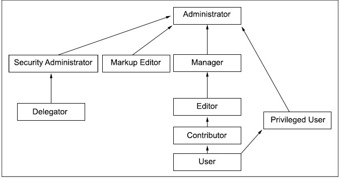

# Roles

Roles provide task permissions for users on resources. For example, Editor is a role that allows users to view, modify, and create resources. Roles are denoted as Role@Resource; for example, Editor@Portal Page.

Roles are organized in a hierarchy. Roles are organized in a hierarchy. Roles that are higher in the hierarchy generally inherit the permissions of child roles. For example, to install web modules the Editor role on the virtual resource `Web Modules`, `Editor@Web Modules`, is the minimum role assignment for this operation. The Manager role is higher in the hierarchy than the Editor role. For this reason, the Manager role includes the permissions of the Editor role. The `Manager@Web Modules` role also allows users to install web modules.

The following table describes the different allowed actions for roles:

|Role|Allowed Actions|
|----|---------------|
|Administrator|Unrestricted access on resources, which includes creating, configuring, and deleting resources. Administrators can also change the access control settings on resource; in other words grant other people access to those resources.|
|Security Administrator|Creating and deleting role assignments on resources. The Security Administrator role allows the user to act as a delegated administrator for that resource. The Security Administrator can delegate a subset of their privileges to other people according to the Delegated Administration Policy topic. For example, a user with Security Administrator and Editor roles can assign the Editor role to other people. The Security Administrator role on a resource does not give view or edit access to the resource.|
|Delegator|Assigning the Delegator role to principals \(users and groups\) allows roles to be granted to them. Having the Delegator role on other resources, such as specific portlets, is not useful. The set of roles that can be granted to those principals is defined through the Security Administrator and Administrator roles. For example, a user has a Delegator role on the SalesTeam user group but no Delegator role on the Managers user group. Therefore, this user can grant roles only to the SalesTeam or individual members of the SalesTeam user group but not to the Managers user group. The Delegator role on a resource does not give direct access to the resource. The purpose of the Delegator role is to allow the granting of roles to users or groups. Therefore, assigning the Delegator role on resources or resource types that are not users or user groups does not grant those users more privileges.|
|Can run as User \(user impersonation\)|After you enable the Impersonation feature, you can assign a user the Can run as User role. It allows them to view pages, portlets, and other portal components as another user. Support specialists can use this role to troubleshoot.|
|Manager|Creating new resources and configuring and deleting existing resources that are used by multiple users.|
|Editor|Creating new resources and configuring existing resources that are used by multiple users.|
|Markup Editor|Changing the HTML source for static portal pages.|
|Contributor|Viewing portal content and creating new resources. The Contributor role does not include the permission to edit resources. You can create only new resources. For example, a user is granted the Contributor role on the Template Category Teamspace. The user cannot modify the category itself but can create new templates in this category.  **Note:** This role is only available for the following resources:  - Application Templates  - Application Template Categories  - Application Template Root  - Policies  - All HCL Web Content Manager related documents|
|Privileged user|Viewing portal content, customizing portlets and pages, and creating new private pages.|
|User|Viewing portal content. For example, viewing a specific page.|
|No role that is assigned|Cannot interact with resource.|

## Inheritance

Resources are part of a hierarchy. By default, each resource in the hierarchy inherits the role assignments of its parent resource. This inheritance reduces the administration work. When you assign a group to a role on a parent resource, the group automatically acquires that same set of allowed actions for all child resources.

For example, suppose that a user, Mary, is a member of the Sales group. You can give Mary Editor access to the Market News page and all child pages by granting the `Editor@Market News Page` role to the Sales group. All members of the Sales group implicitly acquire the `Editor@Market News Page` role. All members of the Sales group also inherit the Editor role on all child pages of the Market News page in the resource hierarchy. So, members of the Sales group automatically inherit the role `Editor@USA Market News Page`.

Inheritance through the resource hierarchy can be blocked at any level to provide more granular access control.

## Role Assignments

Roles are assigned to users and groups that are contained in the user registry. Roles can be assigned by someone with the necessary authorization, such as the portal administrator, in any of three ways:

-   Explicitly assigned to an individual user
-   Implicitly assigned through group membership. If a group has a role, all members of the group automatically acquire the role. Nested groups \(groups that are members of another group\) inherit role assignments from their parent groups.
-   Inherited through a role assignment on a parent resource. By default, roles on a resource automatically apply to all child resource unless role blocks are used.

Users and groups can have multiple roles on the same resource. For example, a user might have both the Editor and Manager roles on a particular page. One of these roles might be inherited through the resource hierarchy and the other might be explicitly assigned. If two roles in the same hierarchy are assigned for a user for the same resource, the higher role takes precedence. For example, if a user has the Manager and Editor role on a resource, the Manager role takes precedence over the Editor role.

Assign roles to individual users only in exceptional cases. Add or remove users from groups to reduce the number of role mappings and simplify maintenance.

## Ownership

Each resource can have a dedicated owner. The resource owner can be a single user or a single user group. When a user creates a resource, such as a page, the user automatically becomes the initial owner of that resource. For non-private resources, ownership provides the same set of allowed actions as the Manager role. For private resources, ownership provides the same set of allowed actions as the Privileged User role. This user can also delete the resource. For both non-private and private resources, these actions include the ability to delete the resource. Private resources can be owned only by users, not by user groups. It is not possible to define roles on private resources, and resource ownership cannot be inherited.

You can use the XML configuration interface or the Resource Permissions portlet to change the owner of a resource.

## Private pages

A private page can be accessed only by its owner. Privileged Users \(users assigned the `Privileged User` role\) can explicitly create new private pages that are accessible only by themselves. Additionally, a Privileged User on a non-private page can personalize the page and create new private pages underneath it. Customizing a non-private page usually creates a private copy of the corresponding non-private page. Any changes that a Privileged User makes to a non-private page are not accessible by other users.

**Note:** Private pages cannot be controlled by an external security manager. Access control for private pages is always internally controlled by HCL Digital Experience.

## Traversal support

Users with role assignments on the resources `Page` or `URL Mapping` get the implicit permission to go to those resources. These users can go through all parent resources of those resources. Users see only the title of those resources. The corresponding resource content remains inaccessible unless those users have further role assignments that grant them normal access to those resources.

???+ info "Related information"
    - [Automatically grant page access to community members](../../../../../../../extend_dx/integration/connections/configuration/cfg_community_pages/commpages_delegate_access.md)
    - [Delegated Access Control Administration](../d_acc_cntl_admin.md)

