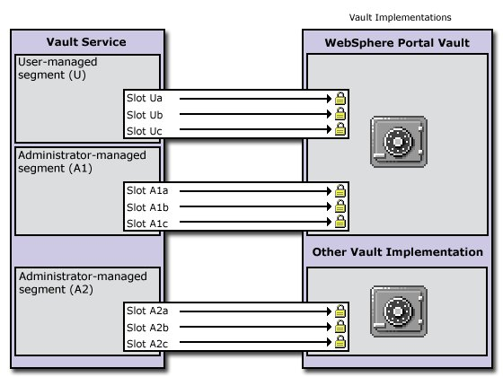

# Portlet authentication

For resources protected by the portal, HCL Digital Experience uses CORBA credentials and an encrypted LTPA cookie to authenticate users. However, for backend systems that require their own authentication, portlets need to provide some form of authentication to access these remote applications. To provide a single sign-on user experience, portlets must be able to store and retrieve user credentials for their particular associated application. Then, they use those credentials to log in on behalf of the user. HCL DX supports the use of a credential vault where users and administrators can safely store credentials for authentication. Portlets that are written to extract the user's credentials from the vault can hide the login challenge from the user.

The credential vault provides exactly this function. Portlets can use it through the credential vault portlet service \(CredentialVaultService\). See [Portlet services](wpsptservice.md) for an overview of portlet services and how to access them. The following sections provide more information about the credential vault.

-   [Credential vault organization](#vault_org)
-   [Vault segments](#v_segments)
-   [Vault slots](#cred_slots)
-   [Credential objects](#cred_objects)
-   [Credential vault usage scenarios](#use_scenarios)
-   [Credential vault samples](#samples)
-   [Changing the credential vault encryption](#encrypt)

## Credential vault organization

The portal server's credential vault is organized as follows:

-   The portal administrator can partition the vault into several vault segments. Vault segments can be created and configured only by portal administrators.
-   A vault segment contains one or more vault slots. Vault slots are the "drawers" where portlets store and retrieve a user's credentials. Each slot holds one credential.
-   A vault slot is linked to a resource in a vault implementation.
    -   A vault implementation is the place where users credentials are stored. Examples of vault implementations include the default database vault or the Security Access Management Family lock box.
    -   The resource within the vault implementation corresponds to an application or backend system that requires its own authentication. Examples of resources include Lotus Notes, personnel records, or a bank account.

## Vault segments

A vault segment is flagged to be either administrator-managed or user-managed. While portlets \(on behalf of a portal user\) can set and retrieve credentials in both types of segments, they can create vault slots only in user-managed vault segments. The following figure shows how administrator-managed vault segments can be distributed among different vault implementations. There is only one user-managed vault segment, and it is in the default-customization vault that is provided by HCL DX.



## Vault slots

The credential vault that is provided by HCL DX distinguishes between four different types of vault slots:

-   Vault Slots in administrator-managed vault segments:
    -   A **system slot** stores system credentials where the actual secret is shared among all users and portlets. It is a **shared slot** that belongs to an administrative segment. This slot type can be created through the Credential Vault administrative portlet, by adding a slot in an administrator-managed vault segment and mark it as shared.
    -   An **administrative slot** allows each user to store a secret for an administrator-defined resource \(for example, Lotus Notes\). It is an **unshared slot** that belongs to an administrative segment. This slot type can be created through the Credential Vault administrative portlet, by adding a slot in an administrator-managed vault segment and do not mark it as shared.
-   Vault Slots in user-managed vault segments:
    -   A **shared user slot** stores user credentials that are shared among the user's portlets. It is a **shared slot** that belongs to the user segment. Use the Credential Vault portlet to create the shared slot. Set **shared slot** to true.
    -   A **portlet private slot** stores user credentials that are not shared among portlets. It is an **unshared slot** that belongs to the user segment. Use the Credential Vault portlet to create the shared slot. Set **shared slot** to false.

The following table shows the constraints applicable for the available vault slot types:

|Vault Slot Type|Segment type|Shared|Creation through|Secret Sharing|
|---------------|------------|------|----------------|--------------|
|System Slot|administrator-managed|true|Credential Vault administrative portlet|one secret per system - shared among all users and portlets|
|Administrative Slot|administrator-managed|false|Credential Vault administrative portlet|one secret per user - shared among all of user's portlets|
|Shared User Slot|user-managed|true|Credential Vault portlet service|one secret per user - shared among all of user's portlets|
|Portlet Private Slot|user-managed|false|Credential Vault portlet service|one secret per user and portlet entity - not shared among portlets|

## Credential objects

The credential vault portlet service returns credentials in form of credential objects. The following are the base interface classes for all credential objects:

-   **Standard portlet API**

    ```
    com.ibm.portal.portlet.service.credentialvault.credentials.Credential
    ```


Passive credential objects are containers for the credential's secret. Portlets that use passive credentials need to extract the secret from the credential and do all the authentication communication with the backend itself. Passive credential objects use the following sample \(pseudo\) code:

```xmp
Object userSecret = credential.getUserSecret();

  < portlet connects to backend system authenticates using the user's secret >

  < portlet can use the connection to communicate with the backend application >

  < portlet takes care of logging at the backend >

```

All credential types that are available within the portal are registered in a credential type registry. HCL DX provides a small set of credential types, but extra credential objects can be registered in this registry.

The **PassiveCredential** interface inherits from the Credential base interface. The following topics describe the different types of passive credential objects that are provided by HCL DX:

-   **Passive Credential Objects:**

    -   **SimplePassive**

        This credential object stores secrets in the form of serializable Java objects. As the vault service does currently not support binary large object \(BLOB\) secrets, it is intended for future use only.

    -   **UserPasswordPassive**

        Credential object that stores secrets in the form of **userid/password** pairs.

    -   **JaasSubjectPassive**

        Credential object that stores secrets in form of javax.security.auth.Subject objects. Again, this kind of secret cannot currently be stored by the vault service. It is used as a transient credential that is not persisted but taken from the user's session.

    -   **BinaryPassiveCredential**

        Credential object that stores secrets in the form of a byte array.

-   **Storing credential objects in the PortletSession**

    Credential objects do not implement `java.io.Serializable` - they cannot be stored in the `PortletSession` for security reasons. The credential classes store the actual credential secret as one of their private attributes. Therefore, the secret might be found by anyone who has access to the application server session database.

    However, you can store a credential object in `PortletSession` if you ensure sure that it is not serialized in a clustered environment. One way is to define a credential container class that stores the actual credential object as a transient member. This container object can then be stored in the `PortletSession` without any problems. You must make sure to check whether the credential object got lost during serialization and in this case retrieve it from the vault again.

    ```xmp
    import com.ibm.portal.portlet.service.credentialvault.credentials.Credential;
    
    public class CredentialSessionContainer implements java.io.Serializable
    {
       private transient Credential credential = null;
    
       public void setCredential(Credential cred) {this.credential = cred;}
    
       public Credential getCredential() {return credential;}
    
       public boolean hasCredential() {return credential != null;}
    }
    
    ```


## Credential vault usage scenarios

Portlets that need a credential to complete their service have two options:

1.  Use an existing slot that is defined by the portal administrator in an administrator-managed vault segment.
2.  Create a slot in the user-managed vault segment.

The option that you choose depends on how the portlet used. Generally, the best solution hides the technical details of the credential vault from users. The following are some example scenarios for the use of slots.

-   **Intranet Lotus Notes mail portlet**

    -   A company has an intranet employee portal. Each portal user has a Lotus Notes mail server account and a Lotus Notes mail portlet is deployed and pre-configured on one of the employee's default portal pages.
    -   Design solution.
    -   The Notes mail portlet needs to store the user's Notes password. As most users use this portlet, the administrator needs to create a "Lotus Notes Credential Slot" for it through the Credential Vault administrative portlet. Using the portlet's configure mode, the administrator sets the vault slot ID for all portlet entries. The portlet allows users to set their personal Notes password in edit mode. The portlet can store each user's password in the credential vault.
    -   If the company uses a Domino® server within the same single sign-on domain as portal, it is possible to use an LTPAToken Credential based on the user's JAAS Subject. This credential offers access to the domino server through an authenticated connection that reuses the user's LTPA token.
-   **Stock of inventory portlet**

    A company's buying department runs a portal that integrates different legacy applications. One of these applications is a mainframe-ordering application that directly connects to the systems of the suppliers. Several employees use the ordering portlet. However, the mainframe application is secured by a single system ID; it does not support several user accounts.

    Design solution: The ordering portlet needs to access the ordering application under the system ID. The administrator configures the vault slot ID during portlet deployment. The portal administrator therefore creates a vault slot in an administrator-managed vault segment and marks it as a system credential. The administrator uses the **Credential vault** portlet to store the ordering system ID and password in this slot. The buying department's employees do not have to be concerned with credentials at all.

-   **Internet Mail federating POP3 portlet**

    An Internet community portal offers, among other features, a mail-federating portlet that can be used by a portal user to collect mail from a number of POP3 mail accounts.

    Design solution: The mail federating portlet is just another feature of the community portal and thus is likely to be used only by some of the portal users. Furthermore, it is not clear how many accounts a user wants to federate. Therefore, it does not make sense for the portal administrator to create a vault slot for this portlet. Instead, the portlet provides users with a comfortable configuration in edit mode. Users can add as many POP3 mailboxes as necessary. The portlet creates a vault slot for each of the user's mailboxes in the user-managed vault segment.

    Theoretically, a user might configure two instances of the portlet on a page, one for business accounts and one for private mail accounts. Therefore, and because it most likely does not make sense to share the user's mail credentials with other portlets, the portlet created vault slots are better marked as portlet private.


## Credential vault samples

The credential vault samples section contains sample code for using the credential vault service. See the *Portlet API Javadoc* documentation for information about the `CredentialVaultService` methods.

-   **Standard portlet example from Rational Application Developer**

    When you use the portlet wizard in Rational Application Developer to create portlets that use the credential vault portlet service, the wizard generates a SecretManager class for you that handles common tasks. The session bean that is generated by the wizard includes getters and setters for the secret type and vault slot name. The following examples show code that might be generated for you, depending on your selections, when you create a JSR 168 portlet project.

    **Note:** This code is only a demonstration of how you can use the credential vault. Any code that is generated must be further customized for your specific application requirements.

    1.  Retrieve the credential vault portlet service.

        This code is placed in the init\(\) method of the SecretManager and is called from the init\(\) of the main portlet class. See [Accessing portlet services](wpsaccpserv.md) for general information about how portlet services are retrieved with JNDI.

        ```xmp
        
        public static void init(PortletConfig config) throws PortletException {
          try {
            if( vaultService == null ) {
              Context ctx = new InitialContext();
              PortletServiceHome cvsHome = 
                (PortletServiceHome)ctx.lookup("portletservice/com.ibm.portal.portlet.
                   service.credentialvault.CredentialVaultService"); 
              if (cvsHome != null) {
                vaultService = (CredentialVaultService)cvsHome.getPortletService
                  (CredentialVaultService.class);
              }
            }
          } catch (Exception e) {
            throw(new PortletException("Error on init()", e)); 
          }
        }
        
        
        ```

    2.  Set the credential.

        The portlet's processAction\(\) method gets the USERID and PASSWORD parameters on the action request from the edit JSP. If both parameters are not null, then they are used to set the credential.

        ```xmp
        
        if( request.getParameter(USER_SUBMIT) != null ) {
           // Set userId/password text in the credential vault
           PortletSessionBean sessionBean = getSessionBean(request);
           if( sessionBean!=null ) {
              String userID   = request.getParameter(USERID);
              String password = request.getParameter(PASSWORD);
              // save only if both parameters are set
              if(userID!=null && password!=null && !userID.trim().equals("") && 
                !password.trim().equals("")) {
                 try {
                    SecretManager.setCredential(request,sessionBean,userID,password);
                 }
                 catch (Exception e) {
                    //Exception Handling
                 }
              }
           }
        }
        
        
        ```

        The setCredential\(\) method in the SecretManager class determines whether the portlet can write to the slot and if the slot ID has content. If so, it uses the setCredentialSecretUserPassword\(\) method of the credential vault service to set the credential to the slot.

        ```xmp
        
        public static boolean setCredential(PortletRequest portletRequest,
                                            PortletSessionBean sessionBean,
                                            String userID,
                                            String password)  throws PortletException {
        try {
           if( isWritable(sessionBean) ) {
              String slotId = getSlotId(portletRequest,sessionBean,true); // create
                slot if necessary
              if( slotId != null ) {
                 vaultService.setCredentialSecretUserPassword(slotId,userID,password.
                toCharArray(),portletRequest);
                 return true;
              }
           }
        }
        catch( CredentialVaultException e) {
        			//Exception Handling
        }
        return false;
        }
        
        
        ```

    3.  Get a slot for storing the user's credentials.

        The setCredential\(\) method calls this method to either create a new slot or use an existing, accessible slot.

        -   The slot name is set as a portlet preference so that it can be changed by the administrator to any slots created with the portal administration interface.
        -   For a portlet private slot, this method creates a new slot if the slot name from the portlet preferences is null. The createNewSlot\(\) method is another custom method of SecretManager that uses to createCredentialSlot\(\) method of the credential vault service. This method can create non-system slots and returns a CredentialSlotConfig object. The slotID of the new slot is stored in the portlet preferences and is used to update and retrieve the portlet private credentials.
        -   For a shared slot, this method searches for a shared resource name from accessible slots. If a shared slot is not available, it creates a new slot.
        ```xmp
        
        private static String getSlotId(PortletRequest portletRequest, 
                                        PortletSessionBean sessionBean, 
                                        boolean bCreate)  throws PortletException {
           String slotId = null;
           String slotName = sessionBean.getVaultSlotName();
           switch( sessionBean.getSecretType() ) {
              case SECRET_PORTLET_PRIVATE_SLOT:
                 PortletPreferences prefs = portletRequest.getPreferences();
                 String prefsKey = ".slot."+portletRequest.getRemoteUser()+".
                   "+slotName;
                 slotId = prefs.getValue(prefsKey,null);
                 if( slotId==null && bCreate ) {
                    slotId = createNewSlot(portletRequest,slotName, true);  // 
                      create private slot
                    if( slotId != null ) {
                       try {
                          prefs.setValue(prefsKey,slotId);
                          prefs.store();
                       }
                       catch( Exception e ) {
                          throw(new PortletException("Error on PortletPreferences.
                            store()", e));
                       }
                    }
                 }
                 break;
              case SECRET_SHARED_SLOT:
                 try {
                    Iterator it = vaultService.getAccessibleSlots(portletRequest);
                    while( it.hasNext() ) {
                       CredentialSlotConfig config = (CredentialSlotConfig)it.next() ;
                       //searches for shared resource name
                       if( config.getResourceName().startsWith(slotName ) ) {
                          slotId = config.getSlotId();
                          break;
                       }
                    }
                    if( slotId==null && bCreate )
                        slotId = createNewSlot(portletRequest,slotName,false);  
                          // create shared slot
                 }
                 catch( CredentialVaultException e) {
                 // exception handling goes here
                 }
                 break;
              default:
                 slotId = slotName;
                 break;
           }
           return slotId;
        }
        
        
        ```

    4.  Retrieving the credential

        Both the doView\(\) and doEdit method call getCredential\(\) from the SecretManager. For the case of passive credentials, this portlet sets the USERID and PASSWORD returned from this method as attributes on the request.

        ```xmp
        StringBuffer userId = new StringBuffer("");
        StringBuffer password = new StringBuffer("");
        try {
           SecretManager.getCredential(request,sessionBean,userId, password);
        }
        catch( Exception e ) {
           getPortletContext().log("Exception on SecretManager.getCredential(): "+e.getMessage());
        }
        request.setAttribute(USERID,userId.toString());
        request.setAttribute(PASSWORD,password.toString());
        
        
        ```

        The getCredential\(\) method of SecretManager handles UserPasswordPassiveCredential types. The type of credential is set as an Integer in the portlet preferences. The getCredential\(\) method of the credential vault service is used to obtain the credentials that are stored in the slot.

        ```xmp
        public static void getCredential(PortletRequest portletRequest,
                                         PortletSessionBean sessionBean,
                                         StringBuffer userid, 
                                         StringBuffer password) throws PortletException {
           try {
              String slotId = getSlotId(portletRequest,sessionBean,false);
                 if( slotId != null ) {
                    UserPasswordPassiveCredential credential = 
                       (UserPasswordPassiveCredential)vaultService.getCredential
                          (slotId,CredentialTypes.USER_PASSWORD_PASSIVE,new 
                            HashMap(),portletRequest);
                    if( credential != null) {
                       userid.append(credential.getUserId());
                       password.append(String.valueOf(credential.getPassword()));
                    }
                 }
           }
           catch( CredentialVaultException e) {
           // exception handling goes here
           }
        }
        
        
        ```


## Changing the credential vault encryption

HCL DX supports plugging in different vault adapters for the storage and retrieval of credentials. The default vault adapter that is included with HCL DX stores user credentials in the portal configuration database. By default, the passwords are only obfuscated, but not encrypted. There is an encryption plug point to encrypt the passwords with a custom encryption. The following sections provide custom build encryption logic that can be plugged into the existing credential vault infrastructure.

Customizing encryption

To write a customized encryption exit for the default vault adapter, you must implement the EncryptionExit interface that is provided by HCL DX and then deploy it.

To create and use a custom encryption exit

1.  Write a class that implements this public SPI interface: com.ibm.portal.portlet.service.credentialvault.spi.EncryptionExit.


    ```
    {
    /**This method is called during portal start up*/
    public void init() throws CredentialVaultException;
    /**This method is called during portal shut down*/
    public void destroy();
    /**Encrypts the password. The password is only stored encrypted. After
    *getting it from the store it needs to be decrypted.*/
    public char[] encryptPassword(char[] password) throws CredentialVaultException;
    /**Decrypts the password as a char[]*/
    public char[] decryptPassword(char[] password)throws CredentialVaultException;
    }
    ```

2.  To deploy the new class to HCL DX, create a JAR file with the new encryption exit class.
3.  Set the name of your adapter file properties in the file: <wp\_root\>/shared/app/config/services/VaultService.properties to default.config=defaultvault.properties.
4.  Create a file defaultvault.properties with the following content: encryptionExit=com.yourcompany.YourEncryptionExit
5.  Deploy the code to the HCL DX. For more information about how to deploy the code to the HCL DX, see *Extending HCL DX class path*.
6.  Restart HCL DX.

    After you restart the portal server, the default vault adapter reads the changed configuration and instantiates the new encryption exit class by using its init\(\) method. All read and write access on the credential vault that is handled by the default vault adapter now uses the custom encryption exit for passwords from user id/password credentials. Binary credentials are not encrypted.

    **Important:** If you change the encryption logic of your portal, existing passwords that are already stored in the credential vault becomes unusable because they are still encoded with the default logic. Therefore, it is preferable to plug in your custom encryption logic before you use the system in production. Existing passwords must be manually reentered by the portal users to adopt the new encryption logic. After you reenter the password, it uses the custom encryption exit so that passwords can be retrieved correctly again.


**Related information**  


[Configuring a Credential Vault for overlay reports ](../admin-system/sa_asa_overlay_cfg_crd_vlt.md)

