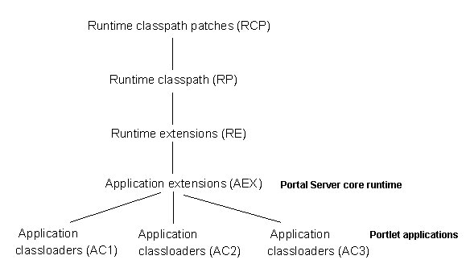

# Creating a simple portlet

To create a simple portlet, you must write the portlet code, compile Java source, create the JAR file, write the portlet descriptors, set up the WAR file directory structure, and package and deploy the portlets.

Before you begin developing portlets, set up an environment that makes the tasks of writing, compiling, and testing portlets easier. Rational® Application Developer includes a test environment that you can use to run and debug your portlets without having to manually deploy them to the server. You can set up the run time environment for debugging portlets on the local development machine or on a remote server. Refer to the documentation for Rational Application Developer for complete setup instructions.

Rational Application Developer provides wizards to help you build, test, and deploy portlets using all of the APIs and related classes and interfaces available in the portlet run time environment. You can also build portlets using your own development environment and tools. If you are not using wizards to develop portlets, the following topics describe the mechanics of building a simple portlet.

## Writing the portlet code

The Hello World portlet provides an introduction to writing your first portlet. The portlet is provided along with the source in the HCL Portlet Samples package, which is available from the portlet catalog by searching for `navcode 1WP10017Z`. See [Sample portlets](jsrsamp.md) for more information. Hello World provides the fewest methods that are required for a portlet. It uses the portlet response object to write simple output directly to the portal page.

```xmp

package com.ibm.wps.samples.jsr;

import javax.portlet.*;
import java.io.*;

public class HelloWorld extends GenericPortlet {
	
   public void init (PortletConfig portletConfig) throws UnavailableException, PortletException
   {
      super.init(portletConfig);
   }

   public void doView(RenderRequest request, RenderResponse response)
                      throws PortletException, IOException
   {

      // set return content type 
      response.setContentType("text/html");
      PrintWriter writer = response.getWriter();
      writer.println("<p class='wpsPortletText'>Hello Portal World!</p>");
    }

}

```

## Compiling Java source

Compile your Java source files. Before you compile your Java source, set the class path for the compiler to find the JAR files for any portlet packages that your portlet uses by running the following command:

-   AIX® HP-UX Linux™ Solaris: ./setupcmdLine.sh
-   IBM i: setupcmdLine.sh
-   Windows™: setupcmdLine.bat
-   **z/OS®:** setupcmdLine.sh

The following JAR files must be set in the class path to compile portlets:

-   **Standard portlets**

    |JAR file|Purpose|
    |--------|-------|
    |`portletapi_20.jar`|This file complies with the Java Portlet Specification Version 2.0.|
    |`public_api.jar`|Use this file if you use services from the Public API Javadoc package.|
    |`public_api.jar + public_spi.jar`|Use this file if you use services from the Public SP Javadoc package.|

    These files are in the directory [PortalServer\_root](../reference/wpsdirstr.md#wp_root)/doc/compile.

-   **HCL DX portlets**

    |JAR file|Purpose|
    |--------|-------|
    |`wp.pe.api.legacy.jar`|HCL Portlet API|
    |`wp.portletservices.api.legacy.jar`|Portlet services|
    |`wp.pe.rt.api.jar`|Portlet menus|


Then, compile the portlet using the fully qualified path to the Java portlet source.

```xmp
   appserver\java\bin\javac -classpath %WAS_CLASSPATH%;path_to\portletapi_20.jar 
        com.ibm.wps.samples.jsr.HelloWorld.java  

```

```xmp
   appserver\java\bin\javac -classpath %WAS_CLASSPATH%;path_to\portletapi_20.jar 
        com.ibm.wps.samples.v4.HelloWorld.java  

```

-   **Loading classes for portlets**

    HCL DX class loading follows the WebSphere® Application Server hierarchy for class paths and search orders. You can reference a class if the parent class loader can reference it or your own class loader can reference it. You cannot reference a class if a child class loader references it. The graphic illustrates where HCL DX and portlet applications fit into the class loading hierarchy.

    In the following graphic runtime class path patches \(RCP\) are at the beginning of the hierarchy. Runtime class path \(RP\) branches from runtime class path patches. Runtime extensions \(RE\) branches from runtime class path, and application extensions \(AEX\) branch from runtime extensions. Application class loaders \(AC1\), application class loaders \(AC2\), and application class loaders \(AC3\) are portlet applications that branch from application extensions.

    

    As illustrated, HCL DX is an application extension \(AEX\) in WebSphere® Application Server. The HCL DX core classes are in the class path [PortalServer\_root](../reference/wpsdirstr.md#wp_root)/shared/app. If an installed portlet application includes a class loader, the portlet application class loader is an application class loader \(ACx\) in HCL DX.

    If you suspect a classloading problem, ensure that the required classes are in the appropriate class path according to the classloading hierarchy.


## Creating the JAR file

Next, the portlet must be packaged in the JAR file format. To create a JAR file with the name `HelloWorld.jar`, enter the following command:

```xmp

   jar -cf HelloWorld.jar HelloWorld.class


```

Refer to the JDK documentation for more information about the JAR command.

## Writing the portlet descriptors

The following samples can be packaged with the Hello World portlet.

-   **Web application deployment descriptor for standard portlets:**

    According to the Java Portlet Specification, only web resources that are not portlets must be declared in the web.xml. However, the following properties must be set to correspond to the portlet descriptor:

    -   `<description/>`

        describes the portlet application.

    -   `<display-name/>`

        indicates the portlet application name.

    -   `<security-role/>`

        indicates the portlet application security role mapping. Omit this tag if the portlet does not use this feature.

    ```xmp
    
    <?xml version="1.0" encoding="UTF-8"?>
    <!DOCTYPE web-app PUBLIC "-//Sun Microsystems, Inc.//DTD Web Application 2.3//EN" 
                             "http://java.sun.com/dtd/web-app_2_3.dtd">
    <web-app id="WebApp">
    	<display-name>Hello World (JSR)</display-name>
    	<description>Basic JSR 168 portlet</description>
    </web-app>
    
    ```

-   **Standard portlet deployment descriptor:**

    The following shows the minimum elements that are required for the standard portlet deployment descriptor.

    ```xmp
    
    <?xml version="1.0" encoding="UTF-8"?>
    <portlet-app xmlns="http://java.sun.com/xml/ns/portlet/portlet-app_2_0.xsd" version="2.0" 
                 xmlns:xsi="http://www.w3.org/2001/XMLSchema-instance" 
                 xsi:schemaLocation="http://java.sun.com/xml/ns/portlet/portlet-app_2_0.xsd 
                                     http://java.sun.com/xml/ns/portlet/portlet-app_2_0.xsd">
       <portlet>
          <portlet-name>HelloWorld portlet name</portlet-name>
          <display-name>Hello World portlet (JSR)</display-name>
          <display-name xml:lang="en">Hello World portlet (JSR)</display-name>
          <portlet-class>com.ibm.wps.samples.jsr.jsrHelloWorld</portlet-class>
          <supports>
             <mime-type>text/html</mime-type>
             <portlet-mode>view</portlet-mode>
          </supports>
          <supported-locale>en</supported-locale>
          <portlet-info>
             <title>Hello World (JSR)</title>
          </portlet-info>
       </portlet>
    </portlet-app>
    
    ```

    The standard portlet descriptor is defined by an XML schema and does not require a DTD.


## Setting up the WAR file directory structure

Before you package your portlet, the class files and resources must be arranged in the WAR file directory structure described here. A portlet application exists as a structured hierarchy of directories.

**Note:** Do not package `.tld` files for tag libraries that are provided by the portal or application server installation with the portlet application WAR file. It includes the JSR 168 and 286 portlet tags and the Java Standard Tag Library \(JSTL\).

-   **`/`**

    The root directory of the portlet file structure.

-   **`/images`**

    Location for any images the required by the portlet.

-   **`/WEB-INF`**

    Location for all protected resources. The `/WEB-INF` directory stores the portlet descriptor document and all of the run time executable JAR files and classes that the packaged portlet requires.

    The portlet information directory is not part of the public document tree of the application. Files that are in `/WEB-INF` are not served directly to a client.

-   **`/WEB-INF/lib`**

    Location for storing portlet JAR files.

-   **`/WEB-INF/jsp`**

    Location for JSP files. This is a suggested path name. Your JSPs can be packaged in any location. JSPs that are included inside the portlet markup must be placed under the `/WEB-INF` directory. Place them outside the `/WEB-INF` directory if you create direct links to them.

-   **`/WEB-INF/classes`**

    Location for portlet class files. Individual class file must be stored in a directory structure within `/WEB-INF/classes` that reflects the class package. For example, the class `HelloWorld.class`, in package `com.ibm.wps.samples`, would be stored in `/WEB-INF/classes/com/ibm/wps/samples/HelloWorld.class`.

-   **`/META-INF`**

    Location for the manifest file, `manifest.mf`, and the Java 2 security file, was.policy \(if present\). The manifest is in the standard JAR file format as defined by the Java 1.3 specification. The Java 2 security policy file is used to allow a portlet to execute operations that might be restricted if Java 2 security is enabled. The contents of the `/META-INF` directory is not served to clients.


**Note:** The application server searches for security policy files in the location of the enterprise application archive rather than the web application archive. Therefore, the portal server copies `was.policy` from the `appname.war/META-INF` directory to the generated `appname.ear/META-INF` directory during deployment of a portlet WAR file.

## Packaging and deploying portlets

To deploy a portlet and run it on the server, it must be packaged in the form of a Web application ARchive or WAR file. The WAR file format contains the Java classes and resources that make up one or more portlets in a portlet application. The resources can be images, JSP files, writing the portlet descriptions, and property files that contain translated message text. Packaging portlet classes, resources, and descriptive information in a single file makes distribution and deployment of portlets easier.

-   Documentation resource: [Writing the portlet descriptions: HCL Portal 8.0 Product Documentation](https://support.hcltechsw.com/csm?id=kb_article&sysparm_article=KB0074915)

HCL DX includes an administrative portlet for installing, uninstalling, and updating portlets. Portlets that are contained in WAR files have the advantage of being dynamically downloaded and installed. The portal administrator can download a WAR file from the Internet and then use the portal administration interface to install the portlet to HCL DX. After installation, the portlet is ready for use and does not require the server to be restarted. To package your portlet in a WAR file, you can use the JAR file utility to package the portlet into a WAR file.

-   Documentation source: [Packaging the portlet into a WAR file: HCL Portal 8.0 Product Documentation](https://support.hcltechsw.com/csm?id=kb_article&sysparm_article=KB0074915)

**Note:** Because Windows limits the maximum path length to 260 characters, the name of the WAR file must be fewer than 25 characters. On a portal server running on Windows, installing a WAR file with a name that is more than 25 characters results in an error.

**Tip:** You can also run the build-war-file or build-ear-file tasks to build the .war and .ear files. See the "Building .ear and .war files" link in the Related task section for information.

-   **Packaging a portlet and resources into a WAR file**

    Any JAR file utility can be used to build a WAR file. The following are examples of how to use the JAR file utility that is provided by WebSphere® Application Server.

    -   To create a WAR file with the name `HelloWorld.war` and include all of the files in the `/WEB-INF` and `/images` directories:

        ```xmp
           jar -cf HelloWorld.war images WEB-INF
        
        ```

    -   To update an existing WAR file, `HelloWorld.war` with a revised portlet descriptor:

        ```xmp
           jar -uf HelloWorld.war WEB-INF/portlet.xml
        
        ```

    -   To extract the portlet descriptor from the WAR file, `HelloWorld.war`:

        ```xmp
           jar -xf HelloWorld.war WEB-INF/portlet.xml
        
        ```

    -   To extract all files from an existing WAR file, `HelloWorld.war`:

        ```xmp
           jar -xf HelloWorld.war
        
        ```

    After the WAR file is created, it can be installed to HCL DX as described in [Portal administration portlets](../admin-system/adpltadm.md).

-   **Preparing the portlet application for installation**

    To facilitate deployment of portlet applications and complex portlets, you can provide a portlet configuration file that can be invoked by the XML configuration interface \(XMLAccess\). The XML configuration interface allows the portlet developer to specify places, pages, themes, skins, supported markups and clients, and other settings for a portlet application. This is especially useful for portlets that use messaging because these portlets must be placed on the same page. For more information, see [The XML configuration interface](../admin-system/admxmlai.md).

    When you construct XMLAccess scripts for use in installing standard portlets, use the following values:

    -   uid attribute for the `<web-app>` element:

        Use the uid attribute of the <portlet-app/\> subelement with a `.webmod` suffix. As described later in this topic, the uid attribute of the <portlet-app/\> subelement is dependent on the presence of the id attribute of the <portlet-app/\> element from the portlet.xml.

    -   uid attribute for the <portlet-app\> element:

        Use the id attribute of the <portlet-app/\> element from the portlet.xml. If this value has not been specified, specify the WAR file name of the portlet application in its place. For portlet updates, the WAR file name must be the original name of the WAR file used to install the portlet application. That is, the WAR file name can be changed, but the uid must indicate the original uid used during portlet installation.

    -   name attribute for the <portlet\> element:

        Use the content of the <portlet-name/\> element from the portlet.xml.

    -   referenceid attribute of the <servlet\> element:

        Use the content of the <portlet-name/\> element from the portlet.xml appended with the `.servlet` suffix.

    For example, a portlet application might use a portlet descriptor:

    ```xmp
    <portlet-app 
        xmlns="http://java.sun.com/xml/ns/portlet/portlet-app_1_0.xsd"
        version="1.0"
        xmlns:xsi="http://www.w3.org/2001/XMLSchema-instance"
        xsi:schemaLocation=
            "http://java.sun.com/xml/ns/portlet/portlet-app_1_0.xsd
             http://java.sun.com/xml/ns/portlet/portlet-app_1_0.xsd">
            <portlet>
            <portlet-name>Banner Ad</portlet-name>
            ...
    
    ```

    In this example, there is no ID attribute that is provided on the <portlet-app/\> element. Therefore, the <portlet-app/\> element of the XMLAccess script would use the WAR file name:

    ```xmp
     <web-app action="update" active="true" uid="com.ibm.wps.banner">
         <url>file:///$server_root$/bp/wp.bp.bannerad/installableApps/bannerad.war</url>
         <servlet action="update" 
                  active="true" 
                  referenceid="Banner Ad.servlet"/>
         <portlet-app action="update" active="true" uid="com.ibm.wps.banner">
             <portlet action="update" active="true" name="Banner Ad">
         </portlet-app>
     </web-app>
    
    ```


