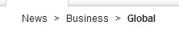

# Style definitions 

Customize your theme with these definitions.

-   **.wpthemeHeader**

    The container element for the theme header that by default displays the top-level navigation and page mode toggle button.

-   **.wpthemeHeaderNav \***

    This style definition controls the look and feel for the top-level navigation located in the theme header.

    

-   **.wpthemeLogo**

    This style definition controls the logo, next to the top-level navigation. By default this style is disabled.

    

-   **.wpthemeBanner**

    The container element for the theme banner that by default displays the primary navigation and common actions.

-   **.wpthemePrimaryNav \***

    The style controls the look and feel for the primary level of navigation located in the theme banner.

    

-   **.wpthemeCommonActions \***

    The style controls the look and feel for the common actions that by default displays the profile management link, actions menu, and login and logout links.

    

-   **.wpthemeBanner.wpthemeBranding \***

    The logo displayed by default in the common actions.

-   **.wpthemeSecondaryBanner**

    The container element for the secondary banner that, by default ,displays the secondary navigation and search form.

-   **.wpthemeSecondaryNav \***

    The style controls the look and feel for the secondary level of navigation located in the theme banner.

    

-   **.wpthemeSearch \***

    The style controls the look and feel for the search form.

    

-   **. wpthemeMainContent**

    The container element for the main content of the page. By default, it displays the navigation breadcrumb trail, status bar, and layout.

-   **.wpthemeCrumbTrail \***

    The style definitions with this scope control the navigation breadcrumb trail displayed before the main content.

    

-   **.wpthemeFooter**

    The container element for the footer of the theme.

**Parent topic:**[Updating your custom style ](../dev-theme/themeopt_cust_styleupdate.md)

