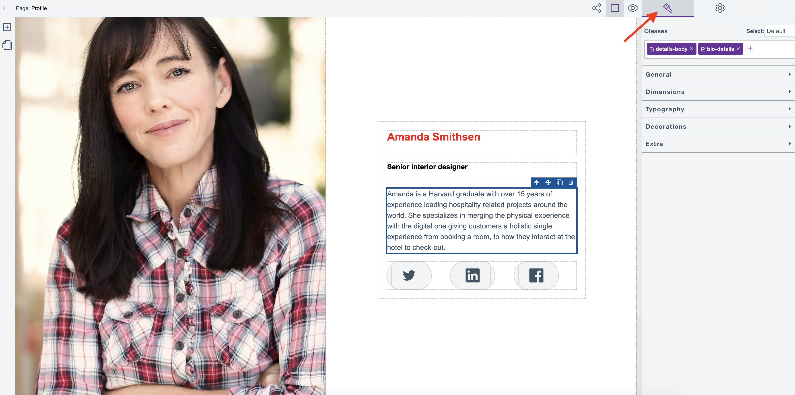
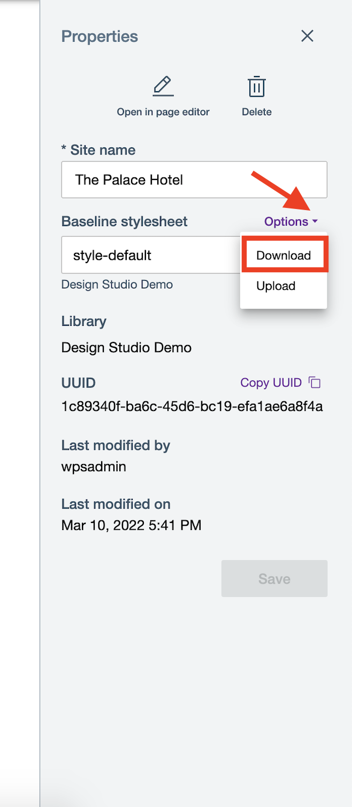

# Craft layouts to pages
This section outlines how you can make the layout of your website pages.

## Styling elements
Sites, pages and containers are each linked to a stylesheet component of their own, which are:

-   site stylesheet
-   page stylesheet; and
-   container stylesheet.

The CSS rules stored in these stylesheet components are managed by the Page editor. Editing the stylesheets managed by the Page editor using external means may result to unknown Page editor behavior and is therefore not recommended even though it is possible via WCM authoring tools and the APIs.

Style rules with class selectors are saved in the site stylesheet. Style rules with id selectors are stored in the stylesheet of its nearest ancestor.

To style an element on the HCL Design Studio (Beta) Page editor:

1.  Select the element on the Page editor canvas. In the example below, the text element labeled `Biography` is selected.

    

2.  Click the **Styles** icon and select **Typography** to open the text element's **Styles** panel.

    

3.  In the **Styles** panel, apply the changes. Using the same example, directly type and enter the font color keyword for hot pink (hex equivalent (<code>#ff69b4</code>) or RGB equivalent (<code>rgb(255,105,180)</code>). You can also toggle the color selector to select hot pink and click **Apply** to apply the changes.

    

    

## Using style selectors
The HCL Design Studio (Beta) Page editor currently only supports using the element ID, classes, class combinations, and some states as selectors.

The **Classes** section at the top of the styles panel is where we can tell the page editor which style rule we want to see and update.

In the Page editor, selectors shown and used by the **Styles** panel depend on which element is selected on the canvas. They have two (2) states: **active** and **inactive**.

The selected element and which selector is active determines which style rule's properties are shown in the style fields in the styles panel. Any changes made to any style properties are updated, added, or removed from the rule.

A class selector's state is represented by a check box on its left side. A checked box means that the class is **active** and vice-versa. When multiple classes are active, they are considered as a combination for a single rule.

On the other hand, if there are no classes or none of the classes present are active in the input field, the selected element's ID is considered to be the active selector.

The Page editor also supports styling elements with some psuedo-classes, which are hover, click or in an even/odd position (nth-of-type). These psuedo-classes are combined with whatever is the active selector of the selected element and then it counts a different rule. They can be activated by picking one of the options in the select field, and can be deactivated by picking *Default* among the options.

## Utilizing the baseline stylesheet
A site has a baseline stylesheet property to which a stylesheet component is assigned to upon creation of the site. The baseline stylesheet could be downloaded, edited externally, and replaced as a means of updating it.

The stylesheet component linked to the site through this property is meant to apply styles to all of the elements within that site. By default, it contains rules that are commonly applied to remove the styles applied by a browser to the page. Those browser-applied styles could lead to discrepancies between what you made in the HCL Design Studio (Beta) Page editor and what is finally rendered.

The HCL Design Studio (Beta) Page editor applies some default styling to new elements dropped or added to the canvas. These styles are also carried over and applied to the rendered HTML. The default styles are meant to enable a smooth drag-and-drop WYSISWYG experience. The default styles varies from element to element.

Layout out elements and WCM elements usually include:

-   a default width and height so that they have a sizeable area where you can drop other elements in them if allowed
-   Typography and Media elements, which also have a default width and height so that they are easily located and their accompanying help text are also readable

At the moment, these default styles are included in the site baseline stylesheet.

Style selectors not supported by the HCL Design Studio (Beta) Page editor can still be applied to the site through the baseline stylesheet. The main point of using the baseline stylesheet is to use store style rules with type selectors. These styles are meant to serve as the default design of your elements before classes and styling are applied to them through the page editor.

However since the stylesheet is used as-is by the site and served during rendering, it is not limited to its main purpose. Here are a few ways to use the baseline stylesheet beyond its main purpose:

1.  Importing a font and applying it through the style rules.
2.  Reusing CSS rules from another stylesheet.
3.  Switching between different stylesheet components for a quick A/B Testing.
4.  Applying styles that are currently unavailable in the page editor such as image background.

## Download the baseline stylesheet of an HCL Design Studio (Beta) site

In HCL Digital Experience 9.5 CF202, the option to download and upload a site's baseline stylesheet is introduced. This option allows users to update or replace the baseline stylesheet file of an HCL Digital Experience 9.5 website without leaving HCL Design Studio (Beta) Design Studio **Sites** overview.

This option can also be accessed via the [WCM Authoring tool](../wcm/wcm_install_cfg.md).

1.  On the **Sites** overview, hover and click the overflow menu of the selected site and select **Properties**.

    

2.  On the site **Properties** panel, navigate to the **Baseline stylesheet** section.

3.  Click the drop-down arrow beside the default baseline stylesheet and select **Download**.

    

## Upload the baseline stylesheet of an HCL Design Studio (Beta\ site

> **Notes:** 
> -   When uploading a file to your site's baseline stylesheet, it replaces the file that exists there. Currently, there is no way to revert back to or retrieve any replaced files. 
> -   Uploading an invalid or non-CSS file to the baseline stylesheet will make the page editor unusable. 
> -   Uploading a valid CSS file that contains invalid values may also break the page editor. 
> -   Back up your latest working baseline stylesheet by downloading it before replacing it by uploading another one to mitigiate the risk of breaking the page editor.

1.  On the **Sites** overview, hover and click the overflow menu of the selected site and select **Properties**.

2.  On the site **Properties** panel, navigate to the **Baseline stylesheet** section.

3.  Click the drop-down arrow beside the default baseline stylesheet and select **Upload**.

    

4.  Select the baseline stylesheet (CSS) file to upload from your local file system.

5.  Click on **Save** to save the new baseline stylesheet file.

## How to present your feedback on HCL Design Studio (Beta)
HCL Digital Experience welcomes your feedback and suggestions on Design Studio (Beta), and encourages you to present your input through cases and discussions with HCL Support DX leaders.

**Parent topic:** [Design Studio (Beta)](../design_studio/design_studio_overview.md)

