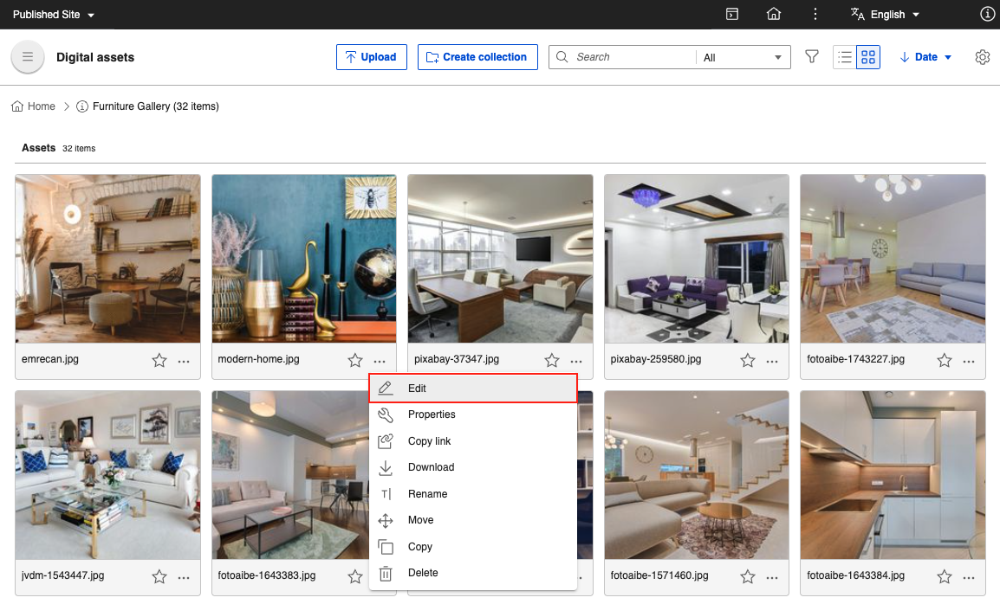
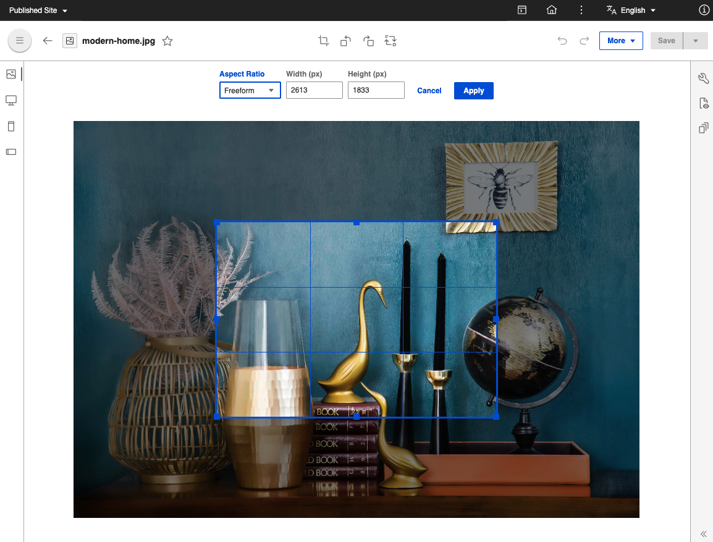
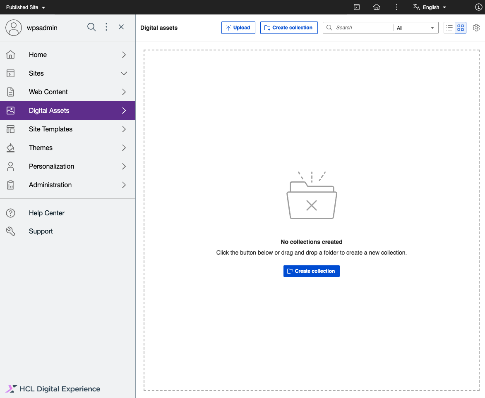

# Generate renditions and versioning

Learn more how to view, edit, and manage media asset renditions and versions with HCL Digital Asset Management \(DAM\).

## Prerequisite

HCL Digital Asset Management should be installed and configured to HCL Digital Experience 9.5 Container Release Update CF181 and higher. See the [Install the HCL Digital Experience 9.5 Container components](../index.md) topic for instructions.

## Access media asset renditions and its versions

Renditions of the assets are system-generated for desktop, tablet, and smartphone displays. However, content creators can apply the asset edit options using HCL Digital Asset Management, select and apply the results to a specific rendition type to optimize that rendition display and create new versions of renditions.

Follow these steps to access renditions of a media asset using HCL Digital Experience 9.5 DAM.

1.  From the HCL Digital Experience 9.5 Digital Asset Management interface, hover over a media asset to access **Edit** options. Select the Edit \(pencil\) icon.

    
    

2.  From the HCL DAM editor user interface, click any of the **Desktop**, **Smartphone** or **Tablet** icons on the left side menu to view the renditions of the selected media asset.

    

3.  After selecting a media asset rendition \(**Desktop**, **Smartphone** or **Tablet**\), you can use the editor to perform the following tasks:

    !!! note 
        Except for supported image files, some of the features will not be available for media assets.

    -   Edit **Desktop**, **Smartphone** or **Tablet** rendition and creating a new version;
    -   Cascade changes \(editing, replacing\) of the original or source rendition to other applicable renditions;
    -   Display metadata information for renditions.

4.  Click **Versions** icon in order to display all versions of a media asset, including older versions.

## Working with versions

You can view, compare, download, and set as current any of image versions available. You can also compare the metadata between versions.

!!! notes

    -   Comparing versions is supported only for the following MIME types:
        -   image/jpeg
        -   image/jpg
        -   image/png
    -   Comparing versions show changes made to the images \(like rotate or crop\) and its metadata.
    -   Comparing versions is currently not supported for video and document file types.

Follow these steps to work with versions of an image using HCL Digital Experience 9.5 DAM.

1.  From the HCL Digital Experience 9.5 DAM user interface, hover over a media asset to access **Edit** options. Select Edit \(pencil\) icon.

    

2.  From the HCL Digital Asset Management editor interface, click any of the **Desktop**, **Smartphone** or **Tablet** icons on the left side menu to view the renditions of the selected media asset.

    

3.  Click **Versions** icon in order to display all versions of a media asset, including older versions.

    

4.  Hover over a version and click on the overflow menu to see options.
    -   **Preview \(eye icon\)** - Previews the selected version.
    -   **More \(3 dots\)** - Provides additional options.

        

        -   **Make current** - Sets the selected version as the current version.
        -   **Compare with current version** - Compares the selected version with the current version.

            !!! note 
                When comparing versions, you can select to only show metadata differences.

        -   **Download** - Downloads the selected version.

## Cascade changes on version restore

You need to save original source rendition before getting cascade changes to other renditions option. Here's how:

1.  From the HCL Digital Experience 9.5 Digital Asset Management interface, hover over a media asset to access **Edit** options. Select the Edit \(pencil\) icon as shown above.
2.  From the HCL Digital Asset Management editor interface on the left, select Source Rendition of the media asset.
3.  On the right, click the **Versions**icon in order to display all versions of a media asset, including older versions.
4.  Select a previous version of the asset you wish to restore, and select **Make current**.
5.  To cascade the changes on version restore, tick **Apply changes to renditions**. You may choose all three renditions, or click "X" to remove the rendition you do not wish to cascade the change to.

    

6. Click **Apply** to apply changes.

## View maximum number of versions

The default maximum number of versions for a media asset is 30. At the moment, there is no way for HCL Digital Experience users to configure the maximum number of media asset versions. To view this:

1.  From the HCL Digital Experience 9.5 DAM user interface, select the gear icon \(for **Settings**\) located at the far top-right of the DAM menu bar.

    

2.  After selecting the **Settings** icon, click the **Versions** tab to view the default maximum number of versions.

    

## HCL Digital Experience Solution Feedback

HCL Digital Experience is interested in your experience and feedback working with HCL Digital Experience 9.5 release software. To offer comments or issues on your findings, please access the [HCL Digital Experience 9.5 Feedback Reporting application](https://www.hclleap.com/apps/secure/org/app/158bbc7c-f357-4ef0-8023-654dd90780d4/launch/index.html?form=F_Form1).

