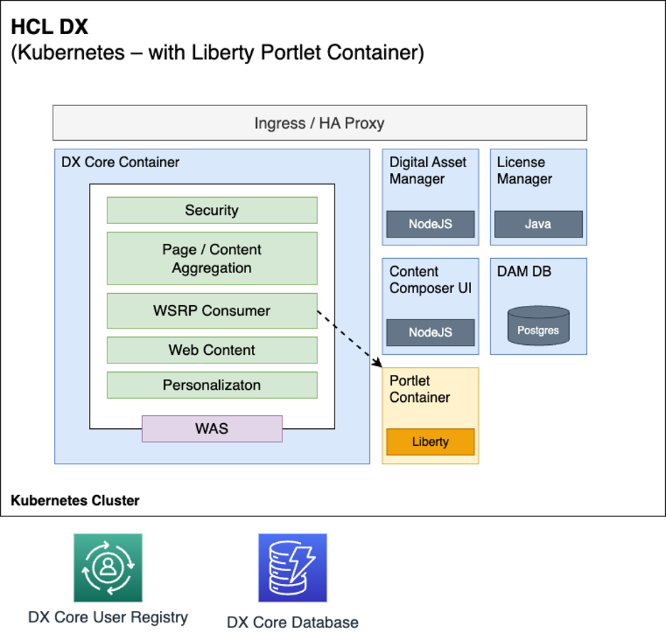

# HCL DX Early Access Program Milestone 1

This topic discusses the Open Liberty Portlet Container, an Early Access Program component.

## Open Liberty Portlet Container 

The [Open Liberty](https://openliberty.io) Portlet Container is a standalone implementation of a [JSR 168 and 286](https://jcp.org/en/jsr/detail?id=286) portlet runtime with a [Web Services for Remote Portlets](https://docs.oasis-open.org/wsrp/v2/wsrp-2.0-spec.html) (WSRP) Producer. The Open Liberty Portlet Container is available as as a separate Docker image from the [HCL DX 9.5 core container images](../deployment/install/container/image_list.md). 

To download components, refer to [Downloading HCL DX Early Access Program components](download_eap_components.md) for instructions.

The Open Liberty Portlet Container is intended to run Java portlet workloads in Kubernetes, with those portlets being consumed on DX Core pages over WSRP. This component includes a set of Helm charts and has been architected to run in a Kubernetes environment, inside the same namespace as an existing DX Kubernetes deployment.

This approach aims to offer a modernized architecture and allow distributed portlet and web apps to be deployed and managed separately while aggregated and rendered through DX. Additional benefits include:

- Use of later JDK and J2EE levels
- Faster start and performance
- Applications that are easier to write, can leverage open software, and work well for cloud native deployments

The Open Liberty Portlet Container image is based on the Open Liberty server runtime rather than the IBM WebSphere Application Server which is [currently used to run HCL DX](../get_started/system_requirements/traditional/supported_config.md) components and services. 

The Open Liberty Portlet Container runs Java portlet workloads in Kubernetes. The portlets are consumed on DX Core pages over WSRP.

In the Early Access Program Milestone 1 version, the underlying technologies and version levels used in the Open Liberty Portlet container are:

- Open Liberty 22.0.0.6 with JavaEE 8
- [Java 11.0.0.21](https://www.oracle.com/java/technologies/javase/11-0-21-relnotes.html)
- Red Hat Universal Base [Image Minimal 8.8-1072](https://catalog.redhat.com/software/containers/ubi8/ubi-minimal/5c359a62bed8bd75a2c3fba8?architecture=amd64&image=6541c626134440daf5b30636)

<!--It is anticipated that these version levels will be increased before general release.-->

## Differences for Portlets running in Open Liberty compared to running in DX Core

Portlets running in the Open Liberty Portlet Container experience a number of differences in their runtime environment compared to those running in the current DX Core:

- Portlets run on a different Open Liberty JavaEE application server, so if they use any APIs specific to [IBM WebSphere Application Server](https://www.ibm.com/products/websphere-application-server?utm_content=SRCWW&p1=Search&p4=43700074488257595&p5=e&gclid=Cj0KCQiAhc-sBhCEARIsAOVwHuT7kzKartxoc4rNstOV88KzDpVRffjM8MWo_9UMQ2iycxgKSuOYvlAaAnuiEALw_wcB&gclsrc=aw.ds), they may find those are no longer available.
- Portlets run on a [newer version of Java](https://www.oracle.com/java/technologies/javase/11-0-21-relnotes.html).
- Portlets do not run on the same JVM as DX Core. They do not have local access to any DX Java APIs such as the Model API or WCM API.

There are also additional differences specific to the Early Access version that are specified in [Limitations and restrictions](eap_limitations_restrictions.md).

