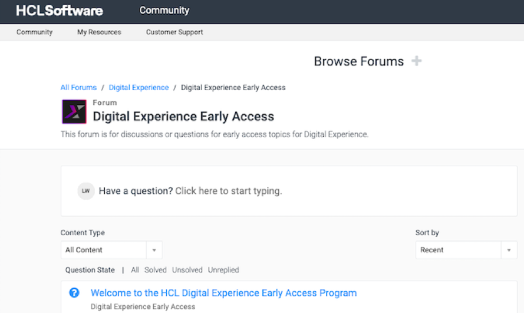

# Suggested areas for evaluation

This topic offers areas and questions to consider when testing the Open Liberty Portlet container with your applications.

As you prepare, deploy, and test standards-based portlets with the Open Liberty Portlet container in your DX Kubernetes evaluation environment, the following areas may be considered for your feedback. Note that this is not an exhaustive list.  

- Do your portlets work in this environment?
- Does this environment match your DX deployment architecture plans?
- What additional features would be useful to you? (for example, JSF Bridge, others)
- Are the deployment instructions clear and easy to follow?
- Are the steps for Helm configuration clear and would additional examples be useful?
- How is the performance of portlet execution in your evaluation environment?

## HCL Digital Experience Early Access Q&A Forum

Your input and feedback are crucial to us. Let us know what you think about the new components and features by submitting your feedback in our [HCL DX Early Access Q&A forum](https://support.hcltechsw.com/community?id=community_forum&sys_id=2ef7245c1b97f990534c4159cc4bcbf3). Discuss your feedback and questions with the HCL DX product, engineering, support, and services leads. Your input areas may include installation and configuration, performance, usability, and related topics.

Note that the HCL DX Early Access Q&A forum is a sub-forum to the HCL Digital Experience Q&A forum.

You can view and register for participation in HCL Software product forums through the [HCL Software community](https://support.hcltechsw.com/community?id=community_home) site.
