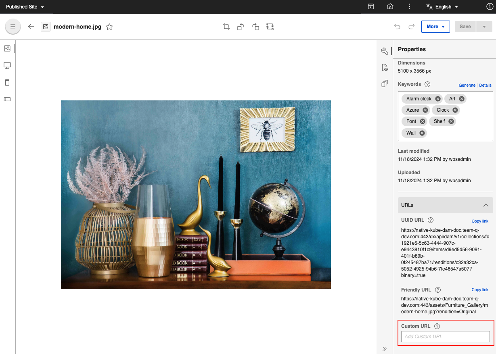
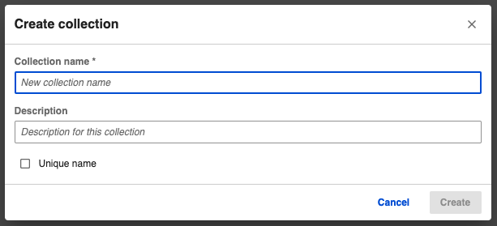
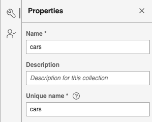

# DAM API for Friendly URLs

This section describes the DAM API that allows you to create a friendly URL for an asset.

!!! note
    -   Starting with CF207, the collection unique-name option is added, which can be used in the friendly URLs instead of the collection IDs.
    -   By default, friendly URL feature is disabled. For instructions on how to enable and configure the friendly URLs, refer [Configure Friendly URLs](../../../manage_content/digital_assets/configuration/configure_dam_friendlyUrl.md).

!!!important "**Important:**"
    -   To set friendly URLs, assets must always have a unique name in a [collection](../../../manage_content/digital_assets/usage/managing_dam/manage_collections.md).
    -   You cannot upload an asset with a file name that already exists in a collection; doing so returns an error message that says you must update the file name and try uploading again.
    -   For existing assets that have duplicate names in a collection, you must rename these assets so you can set friendly URLs.
    -   You can provide a unique name whenever you save the asset as new.

## What is a friendly URL?

A friendly URL makes a web address easy-to-read by using words to describe the content, making it easier to remember. With the DAM API, you can set a friendly URL.

In contrast, a `binaryUrl` you get from **Copy link** on the **Edit** page, consists of a string of characters representing the `collection_id`, `item_id`, and `rendition_id`.


**Sample `binaryUrl`**:

```
/collections/5c11a585-c8e6-4ef7-ba6b-6c79977ee408/items/e0a81aeb-86bb-42a8-8287-338a65e13db1/renditions/8b5e2885-e7ca-4a68-83ed-24faf58ca574?binary=true
```

Meanwhile, a `customUrl` provides the original rendition of an asset. The `customUrl` is not related to a friendly URL.



**Sample `customUrl`**:

```
https://sample-url.com/dx/api/dam/custom/car
```

Using the DAM API explorer, you can set a friendly URL for each asset, individually.

You can get the content of an asset by choosing a specific property such as:

-   The `collection_id` or collection unique-name.
-   The `item_id`, file name, or custom URL of an asset.
-   The `rendition_id` or the rendition type.
-   The version number for each version of a rendition.

Here is a DAM API URL with an item ID, rendition ID, and version ID:

```
/collections/7e86ff73-a12a-4180-9db1-387f59674b6a/items/3ea7e44b-38a1-4abc-bc3b-46584a29efd3/renditions/4ea7e44b-38a1-4abc-bc3b-46584a29efd7/versions/8aa7e44b-38a1-4abc-bc3b-46584a29efd9
```

With a friendly URL for the collection unique-name, asset file name, rendition name, and version number, the DAM API URL looks like this:

```
/collections/collection-one/items/img_1705.jpg/renditions/Desktop/versions/2 
```

## How to set a friendly URL for an asset using DAM API explorer

Before doing the steps in this section, you must have the following information from the asset:

-   The `collection_id` where the asset is located \(required\).
-   The `item_id` of the asset to set the friendly URL for \(required\).
-   The `rendition_id` for the asset rendition \(required, as applicable\).

1.  Open the DAM API explorer.
2.  From the `CollectionController` or `RenditionController`, select the API to use and provide the `collection_id`, `item_id`, or `rendition_id`.
    -   For the collection ID field, you can use the `collection_id` or the collection unique-name.
    -   For the media asset ID field, you can use the `item_id` or the file name of a specified media file.
    -   For the rendition ID field, you can use the `rendition_id` or the rendition type.
3.  Click **Execute** to run the API.
4.  Check the request API URL looks similar to the following:

    ```
    https://sample-url.com/dx/api/dam/v1/collections/collection-one/items/car.jpg/renditions/Desktop/versions/1.
    ```

5.  In the response data, check that the binary, thumbnail, and self URLs have friendly URLs similar to the following:
    -   ```
binaryUrl: /collections/collection-one/items/car.jpg/renditions/Desktop?binary=true.
```

    -   ```
thumbnailUrl: /collections/collection-one/items/car.jpg/renditions/Desktop?thumbnail=true.
```

    -   ```
self: /collections/collection-one/items/car.jpg/renditions/Desktop.
```


## How to change duplicate asset names using DAM

If an asset happens to have the same name with another asset in a collection, a notification is displayed in the **Information** panel.


You can click **Rename** from the notification and provide a unique name.


## What is collection unique-name?
Collection unique-names are the unique identifier for each collection which can be used in friendly url instead of collection UUID to access DAM assets. Collection unique-names supports all languages as per existing system. Collection unique-name does not support any URL reserved characters(e.g. "?!#$&%'*+/;:,=@()\[]").

## How collection unique-names are generated?
- While creating a collection, the user has a provision to enter a custom collection unique-name.



- Collection unique-name is an optional field, If it is not provided by the user, system will generate collection unique-name based on the collection name replacing all URL reserved characters(e.g. "?!#$&%'*+/;:,=@()\[]") with underscores.
- Collection unique-names will follow simple format of adding “_Number” for collections having same collection-names.
- For existing collections, system will generate a collection unique-name based on collection name with migration script.

## How can the user change the collection unique-names?
Once the collection unique-name is generated, user will be able to view/edit the collection unique-name in the collection information panel.



## What happens if collection unique-name already exists while creating collection?
When creating collection, the DAM checks for the duplicate collection unique-name and prompts an error message if the collection unique-name is already being used any other collections.


<!-- **Related information**  
[Using friendly URLs](../admin-system/mp_friendly_url.md)

[HCL Digital Asset Management](../digital_asset_mgmt/digital_asset_mgmt_overview.md)

[Manage collections](../digital_asset_mgmt/manage_collections.md)
 -->
