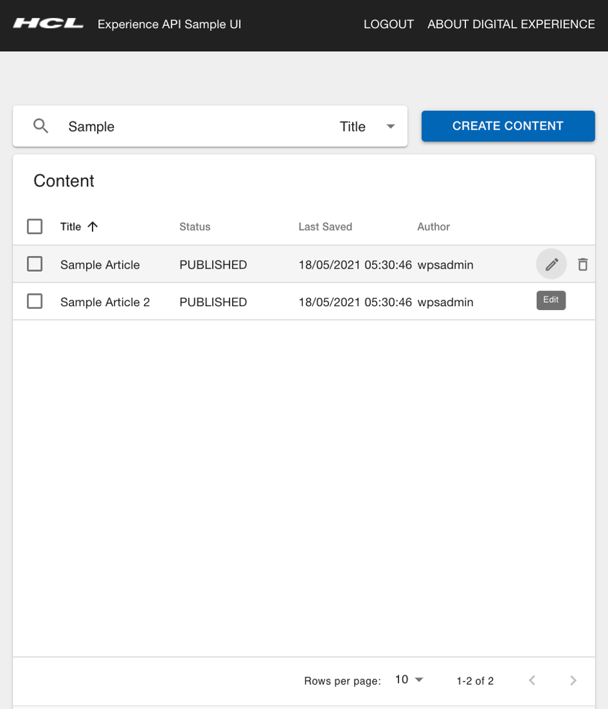

# Sample Content UI

Learn how to use the Sample Content UI application for HCL Experience API.

## Overview

The Sample Content UI is a sample application to show developers how the HCL Experience API can be used to build compelling user interfaces using modern technologies. The core UI frameworks being used in the Sample Content UI are React and Redux.

The Sample Content UI offers simple create, update and delete functionalities for HCL Digital Experience web content management articles and solely uses the HCL Experience API to connect to an HCL Digital Experience instance.

The frameworks used in the Sample Content UI are:

-   React - provides the platform for the development of UI Components to render the look of the web application
-   Redux - provides the means of State Management in the application
-   TypeScript - provides the type safety for the application
-   And Jest and Enzyme – that are test frameworks used to write the test cases for the application.

The Sample UI page shows you the list of contents that corresponds to a search on the word 'Sample', and an option to create a new content:

This shows how to create a new content:

-   **[Sample Content UI prerequisites \| HCL Experience API](../openapi_prerequisites.md)**  
There are certain prerequisites that need to be followed before Sample Content UI application can be used.
-   **[Getting started with Sample Content UI \| HCL Experience API](./getting_started_sample_api.md)**  
Learn how to get started with the Sample Content UI application on HCL Digital Experience 9.5.
<!--
## HCL Software Academy course

For an introduction and a demo on how to use Experience API, go to [Experience API](https://academy.hcltechsw.com/component/axs/?view=sso_config&id=1&forward=https%3A%2F%2Facademy.hcltechsw.com%2Fcourses%2Flesson%2F%3Fid%3D416). To try it out yourself, refer to [Experience API Lab](https://academy.hcltechsw.com/images/Lc4sMQCcN5uxXmL13gSlsxClNTU3Mjc3NTc4MTc2/DS_Academy/DX/Developer/HDX-DEV-100_Experience_API_for_Beginners.pdf) and corresponding [Experience API Lab Resources](https://academy.hcltechsw.com/images/Lc4sMQCcN5uxXmL13gSlsxClNTU3Mjc3NTc4MTc2/DS_Academy/DX/Developer/HDX-DEV-100_Experience_API_Lab_Resouces.zip).

