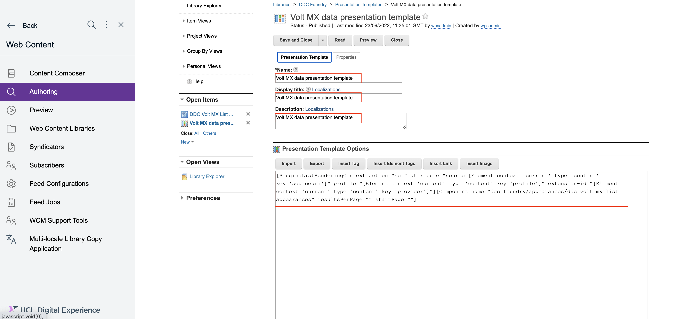
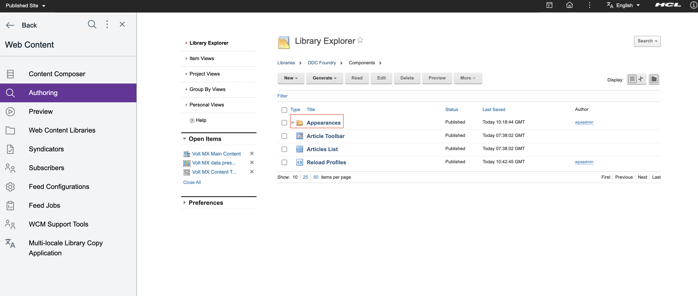
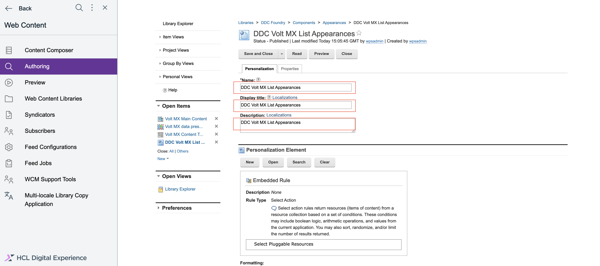
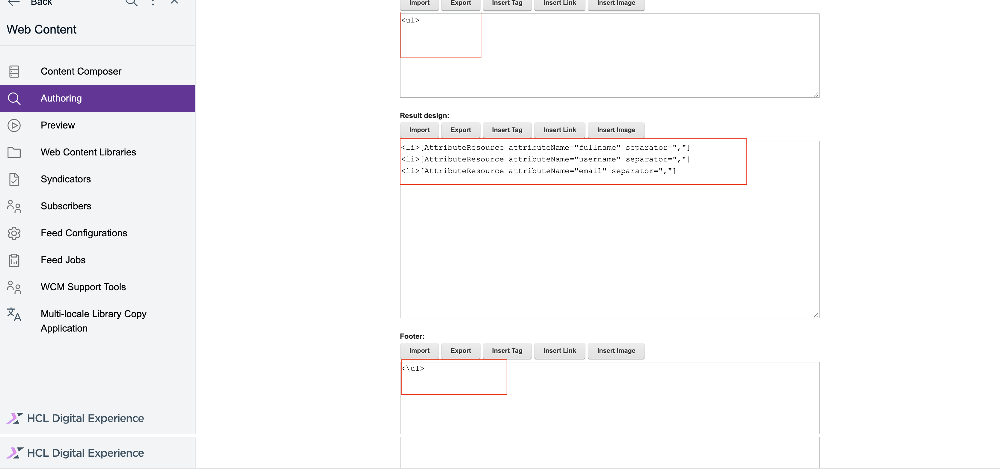
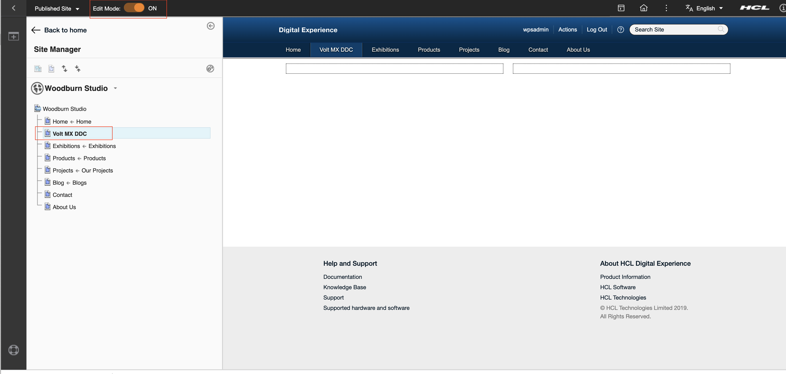
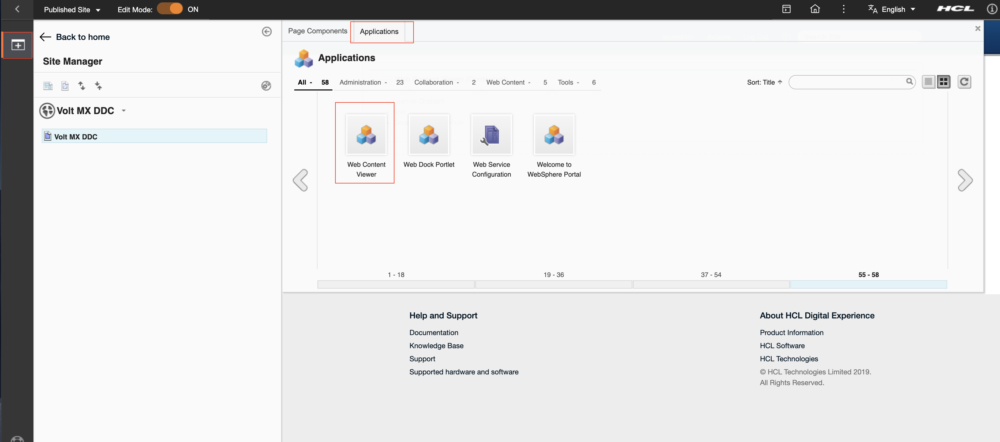
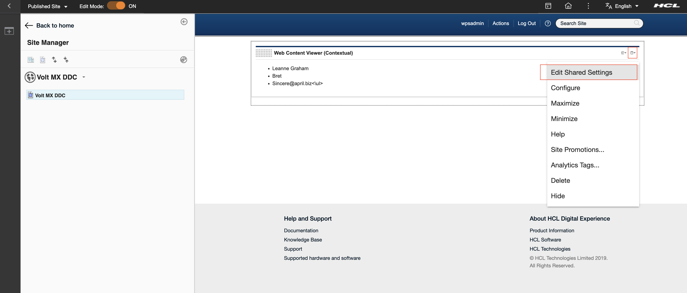
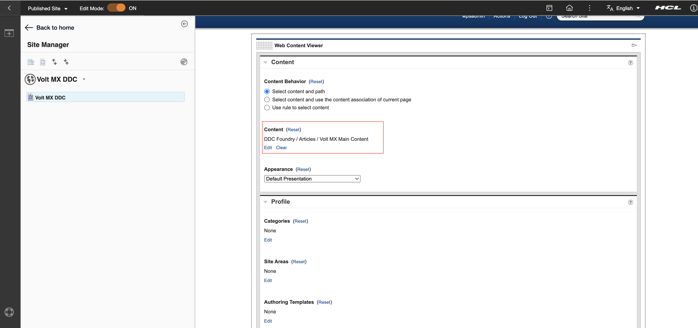

# Connecting to HCL Volt MX Foundry through Digital Data Connector (DDC)

This section provides the steps on using DDC for HCL Portal framework to integrate data from HCL Volt MX Foundry (integrated external data sources) on your portal pages by using HCL Web Content Manager presentation components.

## Prerequisite

Ensure that the your Volt MX Foundry application is configured correctly according to [this guide](./configuring_voltmx_foundry_to_connect_to_ddc.md).

Refer to the HCLSoftware U course [DX Integration with HCL Volt MX for Business Users](https://hclsoftwareu.hcltechsw.com/component/axs/?view=sso_config&id=3&forward=https%3A%2F%2Fhclsoftwareu.hcltechsw.com%2Fcourses%2Flesson%2F%3Fid%3D747) to learn how to more easily manage your sites and applications, as a business user.

Refer to the HCLSoftware U course [DX Integration with HCL Volt MX for Developers](https://hclsoftwareu.hcltechsw.com/component/axs/?view=sso_config&id=3&forward=https%3A%2F%2Fhclsoftwareu.hcltechsw.com%2Fcourses%2Flesson%2F%3Fid%3D1458) to learn further customization for integration, as a developer.

## Creating a mapping for the DDC plug-in for the list-rendering profile

This section describes how to define the set of attributes available in the beans that are contained in bean lists that a DDC plug-in generates in list-rendering profile.

For more information, see [Technical concepts | HCL Digital Experience](https://help.hcltechsw.com/digital-experience/9.5/social/plrf_tech_concepts.html).

The following API end point and response are used to create this sample document:
    
    Sample API end point for **GET**

    

    Sample API end point for **POST**

    

### Creating the list-rendering profile

1. Log in to the WAS console.
    

2. Click **Resources** from side navigation. Then, click **Resource Environment**, then **Resource environment providers**.

    

3. From the list of resources, find **WP ListRenderingProfileService** and click.

    

4. Click **Custom properties** From the **Additional Properties** on right side.

    

5. Click on **New** and add your unique profile (e.g. ddcDemo) and its properties by entering name-value pairs like in the sample below. Click **Apply** then **OK**

    

    !!!note
        The mappings in the `ItemAttribute` section map to the [response output](./configuring_voltmx_foundry_to_connect_to_ddc.md#create-new-integration-service-with-volt-mx-foundry) specified in your integration service.

    | Name                            | Value                    | Type       | Description|
    | ------------------------------- | ------------------------ | ---------- |------------|
    | ddcDemo.Name                    | ddcDemo.profile.json     | String     | The unique name of the list-rendering profile |
    | ddcDemo.BeanListProviderID      | ibm.portal.ddc.json      | String     | The name of the used DDC plugin |
    | ddcDemo.ItemAttribute.id        | id                       | Integer    | This should be mapped to a unique identifier per record |
    | ddcDemo.ItemAttribute.fullname  | name                     | String     | Mapping the name provided by your response output to fullname in the list-rendering profile |
    | ddcDemo.ItemAttribute.email     | email                    | String     | Mapping a simple field |
    | ddcDemo.ItemAttribute.username  | username                 | String     | Mapping a simple field |
    | ddcDemo.ListItemSelection       | .                        | String     | Provides the root node of the JSON response |
    | ddcDemo.Type                    | BasicJSONSelection       | String     | Specifies that dot notation is being used by the plugin to access the fields |

    !!!note
        Instead of using the generic DDC json plugin you can create and deploy your [own DDC plugin](https://help.hcltechsw.com/digital-experience/9.5/social/plrf_crt_dply_cust_beanlst_prvdr.html) best suited for your business needs. 

    !!!note
        `{profile}.ItemAttribute.id` (in this sample `ddcDemo.ItemAttribute.id`) is always required but it could point to any attribute from the external data source as long as it contains unique values.
        If your API does not provide any unique field, you might want to leverage the [Postprocessor of HCL Volt MX](https://opensource.hcltechsw.com/volt-mx-docs/docs/documentation/Foundry/voltmx_foundry_user_guide/Content/Java_Preprocessor_Postprocessor_.html) to add a generated field.

6. Review and save the changes in the master configuration.

    

7. Restart WAS server.

## WCM presentation components

You may use an existing or new WCM library. For this example we have used a new library with default items such as site area and workflow. You will have to create WCM artifacts under 4 folders: Content, Components, Authoring Templates, and Presentation Templates.

Refer to [Creating web content libraries](https://help.hcltechsw.com/digital-experience/9.5/panel_help/wcm_config_wcmlibraries.html) for instructions on how to work with WCM libraries.

### Creating a Presentation Template

Set the context of the DDC content.

Steps to create Presentation Template are as follows:

1. Create a new presentation template with suggested name `Volt MX data presentation template` and under presentation template options, click on `Insert Tag` button:

    


2. Select the type of tag to create, and then define parameters for the selected tag. You can then either copy and paste the tag into your design, or click `OK` to insert the tag at the current cursor location.

    

    Sample Presentation Template Options - 

    ```
    [Plugin:ListRenderingContext action="set" attribute="source=[Element context='current' type='content' key='sourceuri']" profile="[Element context='current' type='content' key='profile']" extension-id="[Element context='current' type='content' key='provider']"][Component name="ddc foundry/appearances/ddc volt mx list appearances" resultsPerPage="" startPage=""]
    ```

    - Under `attribute`, define the data `source` endpoint. The content field set in this example is `sourceuri`, where you saved the **endpoint** in the content item.
    - `profile` refers to the List-Rendering Profile which was saved earlier in the WAS console. The content field that is set in this example is also `profile`, which is saved in the content item with the `ddcDemo.profile.json` value.
    - `extension-id` refers to the DDC plugin ID. The content field set in this example is `provider`, which is saved in the content item with value `ibm.portal.ddc.json`.

3. Save and close.

    !!!note
        If you selected any other **Resource Method** (for example, **POST** from `Advanced` > `Front End API` > `Resource Method`) while creating a new integration service with Volt MX Foundry, you might need the capability to submit data to the API which DDC will try to parse as **sourceParams**. In that case, you must include that in your Presentation Template.

    Sample Presentation Template Options - with params

    ```
    [Plugin:ListRenderingContext action="set" attribute="source=[Element context='current' type='content' key='sourceuri']" attribute="sourceParams=[Element context='current' type='content' key='params']" profile="[Element context='current' type='content' key='profile']" extension-id="[Element context='current' type='content' key='provider']"][Component name="ddc foundry/appearances/ddc volt mx list appearances" resultsPerPage="" startPage=""]
    ```

    - Under `attribute`, define the data `sourceParams`. The content field set in this example is `params`, which is saved in the content item.

    

###  Creating a Content Template

Under Authoring Templates, create a Content Template.

1. Click on `New` button. Then, click `Authoring Template`, then `Content Template` component

    
 
2. Add `Name`, `Display title` and `Description` with suggested name `Volt MX Content Template`. Once you have created your presentation template, you have to set this as the default presentation template `Volt MX data presentation template`.

    

3. Click on `Manage Element` and add the following elements to the content template as follows.

    | Element type                   | Name                                       | Display title              |
    | ------------------------------ | ------------------------------------------ | ---------------------------|
    | Component Reference            | appearance                                 | Appearance                 |
    | Short Text                     | sourceuri                                  | Data Source URI            |
    | Short Text                     | profile                                    | List Rendering Profile     |
    | Short Text                     | provider                                   | DDC Plugin                 |

    

    !!!note
        In case of **GET** resource method, adding **httpmethod** element is not necessary, by default, the connection is initially set to **GET**.
        But if you selected any other **Resource Method** (for example - **POST** from `Advanced` > `Front End API` > `Resource Method`) while creating a new integration service with Volt MX Foundry, then you need to add another element **httpmethod**. This element (**httpmethod**) can be added as **Short Text**, **Text**, or **OptionSelection**. A content created from this content template can then load and render data from data sources using other resource methods. Leaving the optional httpmethod field value **blank** or empty when creating your content, which is based on the content template, would still have the connection fallback to **GET**.

    | Element type                   | Name                                       | Display title              |
    | ------------------------------ | ------------------------------------------ | ---------------------------|
    | Short Text                     | httpmethod                                 | Select Http Method         |

    

4. Click on `Default Content Properties` and add `Express workflow`.

    

5. Save and close.

    !!!note
        If you selected any other **Resource Method** (for example, **POST** from `Advanced` > `Front End API` > `Resource Method`) while creating a new integration service with Volt MX Foundry, you might need the capability to submit data to the API which DDC will try to parse as **sourceParams** using the Presentation Template you created in the previous section. In that case, you must add a content field in your Content Template that will save this. It can have any name but for this example, we're using **params**.

    | Element type                   | Name                                       | Display title              |
    | ------------------------------ | ------------------------------------------ | ---------------------------|
    | Short Text                     | params                                     | Request Body               |

    

### Creating a List Appearance

1. Go to the Library Explorer. The following default items are available: `Content`, `Categories`, `Components`, `Authoring Templates`, `Presentation Templates`,`Workflow Items`, and `Segments`.

    

2. Create an Appearances folder under Components. This is to ensure that your personalization components use the DDC selection rule. Select pluggable resources can be found easily in one place.

    

3. Under Appearances folder, create a new Personalization component.

    1. Click `New` > `Component` > `Personalization`.

        

    2. Enter the name and title. Suggested name: `DDC Volt MX List Appearances`

        

    3. Under `Personalization Element`, click `New`. As a `New Rule`, instead of `Select Web Content`, click on the `Web Content` phrase and select `Pluggable Resources` and click `Save`.

        
 
    4. In the List Presentation Markup, add the following:
        - Header: `<ul>`
        - Result design:
              ```
              <li>[AttributeResource attributeName="fullname" separator=","]</li>
              <li>[AttributeResource attributeName="username" separator=","]</li>
              <li>[AttributeResource attributeName="email" separator=","]</li>
              ```
        - Footer: `</ul>`
        !!!note
            The `attributeName` used here is the last part of the `itemAttribute` you have specified in your [list rendering profile](#steps-to-create-the-list-rendering-profile-are-as-follows). For example, `ddcDemo.ItemAttribute.fullname`.

        

    5. Click `Save and Close`.

### Creating a Content item

1. Under your libraries, click `Content`, then click `Articles`, and create a new **Content** from the Content Template that you created earlier.

    

2. Add `Name`, `Display title`, and `Description` with suggested name `Volt MX Main Content`, and in the content fields / elements, provide the following inputs:

    | Content field title            | Value                                                        |
    | ------------------------------ | ------------------------------------------                   |
    | Appearance                     | auto filled once you've chosen a component                   |
    | Data Source URI                | https://hcl-dx-dev.hclvoltmx.net/services/account/id?id=1    |
    | List Rendering Profile         | ddcDemo.profile.json                                         |
    | DDC Plugin                     | ibm.portal.ddc.json                                          |

    

    !!!note
        If you selected any other **Resource Method** (for example - **POST** from `Advanced` > `Front End API` > `Resource Method`) while creating a new integration service with Volt MX Foundry then you need to provide value for **httpmethod**. Also, the value of **Data Source URI** would be the POST URL endpoint in this case.

    | Content field title            | Value                                                        |
    | ------------------------------ | ------------------------------------------                   |
    | Data Source URI                | https://hcl-dx-dev.hclvoltmx.net/services/account/id         |
    | Select Http Method             | post                                                         |

    

3. Save and close.

    !!!note
        If you selected any other **Resource Method** (for example, **POST** from `Advanced` > `Front End API` > `Resource Method`) while creating a new integration service with Volt MX Foundry, you might need the capability to submit data to the API which DDC will try to parse as **sourceParams** using the Presentation Template you created in a previous section. In that case, you must provide value for **params** in your Content item. You can pass many key-value pairs of data and it should have the format of a URL query string.

    | Content field title            | Value                                                        |
    | ------------------------------ | ------------------------------------------                   |
    | Request Body                   | ?id=2                                                        |

    

## Use in Portal Page

Now you can use all the WCM artifacts that you created on a portal page.

!!!note
    This guide is using an existing page but you can create a completely new Content Root or any child or sibling page on any site. Refer to [Creating a page from the site toolbar](https://help.hcltechsw.com/digital-experience/9.5/dev-theme/themeopt_addpage.html?hl=create%2Cpage) for creating a page.

1. Go to any page (e.g. Volt MX DDC) and enable `Edit mode`.

    

2. Click on `plus` icon in left navigation panel. Then click on `Applications` and add a `Web Content Viewer` on the page.

    

3. Click on `Add To Page` button.
    

4. Inside the `Web Content Viewer`, click on the upper right dropdown button and select `Edit Shared Settings`.

    

5. Under Content, change the mapped content to the Content Item you created above.

    

6. Click `OK`, and the following output page will be displayed.

    

## HCLSoftware U learning materials

For an introduction and a demo on how to integrate DX with HCL Volt MX as a Business User, go to [DX Integration with HCL Volt MX for Business Users](https://hclsoftwareu.hcltechsw.com/component/axs/?view=sso_config&id=3&forward=https%3A%2F%2Fhclsoftwareu.hcltechsw.com%2Fcourses%2Flesson%2F%3Fid%3D747). To try it out yourself, refer to the Lesson Links for Lab in [DX Integration with
HCL Volt MX for Business Users Lab](https://hclsoftwareu.hcltechsw.com/images/Lc4sMQCcN5uxXmL13gSlsxClNTU3Mjc3NTc4MTc2/DS_Academy/DX/Integration/HDX-INT-BU_DX_Integration_with_HCL_Volt_MX_for_Business_Users.pdf).

For an introduction and a demo on how to integrate DX with HCL Volt MX as a Developer, go to [DX Integration with HCL Volt MX for Developers](https://hclsoftwareu.hcltechsw.com/component/axs/?view=sso_config&id=3&forward=https%3A%2F%2Fhclsoftwareu.hcltechsw.com%2Fcourses%2Flesson%2F%3Fid%3D1458). To try it out yourself, refer to the Lesson Links for Lab in [DX Integration with
HCL Volt MX for Developers Lab](https://hclsoftwareu.hcltechsw.com/images/Lc4sMQCcN5uxXmL13gSlsxClNTU3Mjc3NTc4MTc2/DS_Academy/DX/Integration/HDX-INT-DEV_DX_Integration_with_HCL_Volt_MX_for_Developers.pdf).
