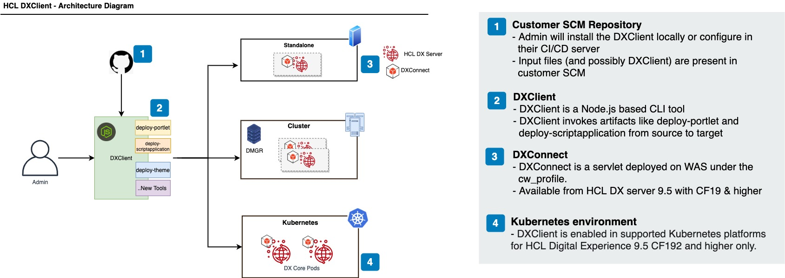

# DXClient

DXClient is a CLI-based tool wrapped in a container image that helps developers and administrators manage tasks, such as uploading one or more portlets or Script Applications, from source development environments to target HCL DX 9.5 deployments. This tool is capable of executing artifacts connecting remotely to DX 9.5 servers deployed to supported on-premises platforms in standalone, cluster, or farm-topologies and supported Kubernetes platforms.

!!! important 
    DXClient version is mostly forward and backward compatible with the DX CF versions, however, in some cases it might not work as expected if the CF versions are different. Ensure that the CF versions of both DXClient and DX Core are the same in your installation.
!!! note
    DXClient is enabled in supported Kubernetes platforms from HCL Digital Experience 9.5 CF192 and later releases:
        -   DXClient is available as a container image from HCL DX 9.5 CF196 and later releases, See the *Installation section* below for more details.
        -   DXClient also exists as [Node.js](https://nodejs.org/en/)-based CLI tool and requires Node.js to be installed as a prerequisite. However, this is deprecated in the HCL Digital Experience Container CF196 release.

## DXConnect

DXConnect is a servlet-based application deployed on top of IBM WebSphere Application Server in the HCL DX 9.5 CF19 and later deployments, under the [Configuration Wizard profile - `cw_profile`](../portal_admin_tools/cfg_wizard/configuration/index.md#configuration-wizard-profile). DXConnect enables the DXClient tool to connect over an HTTP or HTTPS connection from a client development machine or remote server to a source or target HCL DX 9.5 server to execute certain tasks requested via DXClient commands.

## Architecture



!!! notes

    1.  HCL DX 9.5 CF19 or later version is installed on target servers, on [supported on premises platforms](https://support.hcltechsw.com/csm?id=kb_article&sysparm_article=KB0013514&sys_kb_id=17d6296a1b5df34077761fc58d4bcb03)(Microsoft Windows, Linux).
    2.  Beginning with HCL DX 9.5 Container Update CF192 and later releases, the DXConnect Servlet is pre-configured and started on supported Red Hat OpenShift and Kubernetes platforms that DX 9.5 containers are deployed to.
    3.  For supported on premises platforms with HCL DX 9.5 CF19 and later releases, the DXConnect application needs to be installed (refer to [DXConnect Installation](dxconnect.md#dxconnectinstall)) and started under the Configuration Wizard (`cw_profile`) on target servers. For more information on starting the Configuration Wizard, refer to [Accessing the Configuration Wizard](../portal_admin_tools/cfg_wizard/configuration/cw_run.md).

!!! remember
    Configuration Wizard Administrator credentials is required to access the DXConnect application.


## Installing using the container image

### Prerequisites
-   You must ensure that the container image is installed on the workstation.

        !!!note
            When you upgrade to use the DXClient container image, you should first uninstall the DXClient nodejs file.

-   By default, Docker image runtime is supported. However, you may use any container runtime that implements OCI Runtime Specification (ex. Podman).

        !!!note
            To install DXClient using any OCI based Container Runtimes, run the following command before Step 6 under [Installing DXClient container image](#installing-dxclient-container-image):

            ```
            export CONTAINER_RUNTIME=<YOUR_CONTAINER_RUNTIME> 

            ```

            For example:

            ```
            export CONTAINER_RUNTIME=podman
            ```

### Installing DXClient container image
The DXClient container image comes with a script that you can use to run the container image. The script creates a store directory, and copies the input files from the absolute path to the shared volume location.

For more information, see video: [CI/CD – DXClient in Container](https://www.youtube.com/watch?v=IFr_frVlojc)

To install DXClient using a container image:

1.  Navigate to your <working-directory\> folder where you wish to use DXClient from.

<!-- 2.  Download the DXClient.zip file (`DXClient_VX_XXXXXXXX-XXXX.zip`) to a local directory on the local workstation from your HCL Digital Experience 9.5 CF196 or higher entitlements on the HCL Software License Portal.

    !!!note
        If you are upgrading from the node to the container image version of DXClient, you must first uninstall or unlink the current version using the following command before installing the newer version.

    Syntax for Linux and Apple macOS platforms:

        ```
        make unlink
        ```

    Syntax for Microsoft Windows platforms:

        ```
        make_unlink.bat
        ``` -->

2. Run `docker load < dxclient.tar.gz`.

<!-- 3.  Extract the DXClient.zip file locally. -->

3. Add the wrapper script under the bin directory to the PATH variable.

    ```
    export PATH=<working-directory>/bin:$PATH
    ```

    For Microsoft Windows platforms, run `dxclient.batscript` under the bin directory to set the PATH variable.


<!-- 4.  To work with multiple versions of DXClient, update the `IMAGE_TAG` reference in the scripts file under the `/bin` folder. For example, `IMAGE_TAG=v95_CF200_20211201-1021`. By default it will be set in the executable script.

5.  Run docker load < dxclient.tar.gz.

6.  Add the execution shell script to the bin directory to the PATH variable to be able to call DXClient from any directory:

    ```
    export PATH=<working-directory>/bin:$PATH
    ```

    For Microsoft Windows platforms, use `dxclient.bat` script in the bin directory to the PATH variable to call DXClient from any directory. -->

4.  Set the appropriate permission by running the following command:

    ```
    chmod xxx <working-directory>/bin
    ```

5.  Run d`xclient -V` to verify that the DXClient command line is installed.

6. A folder named store is then created in your working directory. This is the shared volume location to your container. If you require to create a new volume directory for different configuration, set the `VOLUME_DIR` to the desired directory name and run your task. 

    For example:

    ```
    export VOLUME_DIR=storeForScriptApplication
    ```

7.  You will be able to find the configuration, logger, output, and sample files under the `location - <working-directory\>/store`.

    Common command arguments can be pre-configured inside the `config.json` file available under `<working-directory>/store` folder. A sample configuration file that could be used on-premises platforms in standalone, cluster platforms is also available under `<working-directory>/store/samples/sample-configurations/default-config.json` for reference.

8. Refer the sample-pipeline provided to find out how to integrate the container image directly (without the bin script) in the automation server.

9. By default, the logs are available in UTC format. If needed, synchronize your local timezone from host to container using an environment variable as given in the example below.

    Example usage:

    ```
    export Timezone=Asia/Kolkata
    ```

    For Microsoft Windows platforms:

    ```
    SET Timezone=Asia/Kolkata
    ```

10. The attribute `-dxConnectHostname` has been deprecated and must be replaced with `-hostname` wherever necessary.

## DXClient installation configuration

Common command arguments can be pre-configured inside the `config.json` file available under `dist/src/configuration` folder. A sample configuration file that could be used for any of the supported Kubernetes platforms is also available under samples/sample-configurations.json for reference.

```
{
    "enableLogger": true,
    "enableBackup": "false",
    "dxProtocol": "",
    "hostname": "",
    "dxPort": "",
    "dxContextRoot":"/wps",
    "xmlConfigPath": "/wps/config",
    "dxSoapPort": "10033",
    "dxProfileName": "wp_profile",
    "dxProfilePath": "",
    "dxConnectHostname": "",
    "dxConnectPort": "10202",
    "dxConnectProtocol": "https",
    "wcmSiteArea": "",
    "wcmContentPath": "",
    "wcmContentName": "",
    "contenthandlerPath": "/wps/mycontenthandler",
    "wcmContentId": "",
    "restoreAsPublished": false,
    "wcmLibraryId": "",
    "virtualPortalContext": "",
    "projectContext": "",
    "wcmLibraryName": "",
    "lastModifiedAfter": "",
    "damAPIPort": "",
    "ringAPIPort": "",
    "damAPIVersion": "",
    "ringAPIVersion": "",
    "wcmProjectName": "",
    "targetHostname": "",
    "targetDxConnectPort": "",
    "targetDxConnectUsername":"",
    "targetDxConnectPassword":"",
    "targetDxProfileName": ""
}

```

## (Deprecated in CF196) Installing using the node package file 

### Prerequisites
Node.js version 12.18.3 is the minimum supported version, and must be installed on the local workstation or automation server.

### Install DXClient using a node package file

For more information, see video: [Getting Started with DXClient on Red Hat OpenShift using HCL Digital Experience Container Update CF194](https://www.youtube.com/watch?v=OphJ8-WcLxY)

!!!note
    You are encouraged to use the DXClient container image package from CF196 onwards for easier installation.

1.  Complete the following steps to install the DXClient tool in your local development workstation or automation server.

    !!!note
        If you are upgrading from CF19, CF191, or later releases, you should first unlink the current version using the following command before installing the newer version.

    Syntax for Linux and Apple macOS platforms:
    ```
    make unlink
    ```

    Syntax for Microsoft Windows platforms:
    ```
    make_unlink.bat
    ```

2.  Ensure that Node.js version 12.18.3 or later version is installed to the local workstation. The DXClient tool is supported on Microsoft Windows, Linux, and Apple macOS workstations and automation servers.

3.  Download the DXClient.zip file (DXClient_VX_XXXXXXXX-XXXX.zip) to a local directory on the local workstation from your DX 9.5 CF19 or later entitlements on the [HCL Software License Portal](https://www.hcltech.com/software/support/release). Reference the [Docker](../../../get_started/system_requirements/docker/index.md) topic for the latest list of HCL DX 9.5 files available for download.

4.  Extract the DXClient.zip file locally.

5.  From the extracted folder, run the following command.

    For Linux and Apple macOS platforms:

    ```
    make install
    ```

    For Microsoft Windows platforms:

    ```
    make_install.bat
    ```

    The following commands are run:

    

6.  Run the following command to link your application to the local npm module in your machine. Refer to the following Notes section before you proceed.

    For Linux and Apple MacOS platforms:

    ```
    make link
    ```

    For Microsoft Windows platforms:

    ```
    make_link.bat
    ```

    !!!note
        -   Avoid using this command when scripting deployments from an automation server (for example, in pipelines) as there is a chance of picking up the wrong dependencies during tool version upgrades.
        -   If the `link` command is not used (such as on automation servers), then use the following command to run the application:<br><br>

        For Linux and Apple MacOS platforms:

        ```
        ./bin/dxclient
        ```

        For Microsoft Windows platforms:

        ```
        node bin/dxclient
        ```

### Uninstall DXClient

To uninstall the DXClient tool, perform the following commands:

For Linux and Apple MacOS platforms:

```
make clean
```

For Microsoft Windows platforms:
```
make uninstall.bat
```

To unlink the DXClient tool, perform the following commands:

For Linux and Apple MacOS platforms:

```
make unlink
```

For Microsoft Windows platforms:

```
make_unlink.bat
```

## Verify the DXClient installation

Successful installation of the DXClient tool can be checked by using the "`dxclient -V`" command, which should show the version of the DXClient tool installed.

Once installed, commands can be executed using the DXClient tool to perform CI / CD actions on HCL DX 9.5 servers.

!!!note 
    Refer to the list of features that were released in the following HCL DX 9.5 Container releases:

    -   HCL DX 9.5 CF201 release:
        
        -   An optional parameter `requestId` added to [Deploy theme](../dxclient/dxclient_artifact_types/themes.md), [Deploy application](../dxclient/dxclient_artifact_types/scriptapplications.md), [Restart DX Core server](../dxclient/dxclient_artifact_types/dxcoreserver.md), and [Manage virtual portals](../dxclient/dxclient_artifact_types/virtualportals.md).
        
        -   Retrieve feature added to the [Resource environment provider](../dxclient/dxclient_artifact_types/resourceenvironments.md).
        
        -   [Accessing ConfigWizard in a container environment](../dxclient/index.md#accessing-the-configwizard-admin-console-in-a-container-environment)
        
        -   Note that a few parameters are deprecated and replaced with new parameters in the DX Core configuration reports. For information, see [DX Core server configuration report](../dxclient/dxclient_artifact_types/dxcoreserver.md#dx-core-server-configuration-report)
    
    -   HCL DX 9.5 CF200 release:
        
        -   [Exporting and Importing WCM libraries](../dxclient/dxclient_artifact_types/wcmlibraries.md)

        -   [DX Core server configuration report](../dxclient/dxclient_artifact_types/dxcoreserver.md#dx-core-server-configuration-report)

    -   HCL DX 9.5 CF199 release:
        
        -   [Sharing or staging DAM Assets](../../../manage_content/digital_assets/configuration/staging_dam/index.md)

        -   [Create credential vault slot](../dxclient/dxclient_artifact_types/credentialvaultslot.md)

        -   [Create syndication relation](../dxclient/dxclient_artifact_types/syndicatorsandsubscribers.md#create-syndication-relation)

        -   [Resource environment provider](../dxclient/dxclient_artifact_types/resourceenvironments.md)

        -   [Personalization rules](../dxclient/dxclient_artifact_types/personalization.md)
    
    -   HCL DX 9.5 CF198 release:

        -   [Listing DAM schemas](../dxclient/dxclient_artifact_types/dam_artifacts/damschemas.md#listing-dam-schemas)
        
        -   [Personalization export and import rules](../../../deployment/manage/staging_to_production/overview_of_staging_to_prod/dep_stage_check.md#personalization-rules-and-campaigns)
        
        -   [Resource environment provider](../dxclient/dxclient_artifact_types/resourceenvironments.md)
        
        -   [Manage virtual portals](../../../build_sites/virtual_portal/mng_vp/index.md)

    -   HCL DX 9.5 CF197 release:
        
        -   [Undeploy portlets](../dxclient/dxclient_artifact_types/portlets.md#undeploy-portlets)
        
        -   [Themes](../dxclient/dxclient_artifact_types/themes.md)
        
        -   [Deploy application](../dxclient/dxclient_artifact_types/scriptapplications.md#deploy-script-applications)
        
        -   [Manage-syndicator get-syndication-report](../dxclient/dxclient_artifact_types/syndicatorsandsubscribers.md)
        
        -   [Restart DX Core server](../dxclient/dxclient_artifact_types/dxcoreserver.md)
        
        -   [Deleting DAM schemas](../dxclient/dxclient_artifact_types/dam_artifacts/damschemas.md#deleting-dam-schemas)

    -   HCL DX 9.5 CF196 release:

        -   [Shared library](../dxclient/dxclient_artifact_types/sharedlibrary.md)

    -   HCL DX 9.5 CF195 release:

        -   [Undeploy theme](../dxclient/dxclient_artifact_types/themes.md#undeploy-theme)

        -   [MLS export and import of WCM library](../dxclient/dxclient_artifact_types/wcm_mls_export_import.md)

    -   HCL DX 9.5 CF193 release:

        -   [Restart DX Core server](../dxclient/dxclient_artifact_types/dxcoreserver.md)

        -   [Deploy application](../dxclient/dxclient_artifact_types/scriptapplications.md#deploy-script-applications)

        -   [Managing syndicators](../dxclient/dxclient_artifact_types/syndicatorsandsubscribers.md#managing-syndicators)

        -   [Managing subscribers](../dxclient/dxclient_artifact_types/syndicatorsandsubscribers.md#managing-subscribers)

    -   HCL DX 9.5 CF192 release:
        
        -   [Undeploy script applications](../dxclient/dxclient_artifact_types/scriptapplications.md#undeploy-script-applications)
        
        -   [Themes](../dxclient/dxclient_artifact_types/themes.md)
    
    -   HCL DX 9.5 CF19 release:
        
        -   [Portlets](../dxclient/dxclient_artifact_types/portlets.md)
        
        -   [Deploy application](../dxclient/dxclient_artifact_types/scriptapplications.md#deploy-script-applications)
        
        -   [XML Access](../dxclient/dxclient_artifact_types/xmlaccess.md)
        
        -   [Restore Script Application](../dxclient/dxclient_artifact_types/scriptapplications.md#restore-script-application)

## DXClient commands

Command syntax conventions:

```
dxclient [command] [options]
```

Use the following command to execute the deploy portlet action:

```
dxclient deploy-portlet [options]
```

Use the following command to execute the undeploy portlet action:

```
dxclient undeploy-portlet [options]
```

Use the following command to execute the xmlaccess action:

```
dxclient xmlaccess [options]
```

Use the following command to execute the *pull* script application action:

```
dxclient deploy-scriptapplication pull [options]
```

Use the following command to execute the *push* script application action:

```
dxclient deploy-scriptapplication push [options]
```

Use the following command to execute the undeploy script application action:

```
dxclient undeploy-scriptapplication [options]
```

Use the following command to execute the restore script application action:

```
dxclient restore-scriptapplication [options]
```

Use the following command to execute the deploy application action:

```
dxclient deploy-application [options]
```

Use the following command to execute the DX Core restart action:

```
dxclient restart-dx-core
```

Use the following command to execute manage-subscriber action:

```
dxclient manage-subscriber -h
```

Use the following command to execute manage-syndicator action:

```
dxclient manage-syndicator -h
```

Use the following command to execute the deploy theme action:

```
dxclient deploy-theme [options]
```

Use the following command to execute the undeploy theme action:

```
dxclient undeploy-theme [options]

```

Use the following command to execute the manage-syndicator get-syndication-report action:

```
dxclient  manage-syndicator get-syndication-report [options]
```

Use the following command to execute the shared-library action:

```
dxclient  shared-library [options]
```

Use the following command to execute the delete DAM schema action:

```
dxclient delete-dam-schema [options]
```

Use the following command to list all DAM schemas present:

```
dxclient list-dam-schemas  [options]
```

Use the following command to export the personalization rules from the target server:

```
dxclient pzn-export  [options]
```

Use the following command to import the personalization rules into the target server:

```
dxclient pzn-import  [options]
```

Use the following command to manage virtual portal tasks in the DX server:

```
dxclient manage-virtual-portal [options]
```

Use the following command to register subscriber:

```
dxclient manage-dam-staging register-dam-subscriber [options]
```

Use the following command to deregister subscriber:

```
dxclient manage-dam-staging deregister-dam-subscriber  [options]
```

Use the following command to trigger manual sync:

```
dxclient manage-dam-staging trigger-staging  [options]
```

Use the following command to create credential vault slot in the DX server:

```
dxclient create-credential-vault  [options]
```

Use the following command to create the syndication relation between syndicator and subscriber in DX server:

```
dxclient create-syndication-relation  [options]
```

Use the following command to create, update, delete, export or import a custom property from an existing Resource Environment Provider:

```
dxclient resource-env-provider [options]
```

Use this command to export WCM libraries

```
dxclient wcm-library-export

```

Use this command to import WCM libraries

```
dxclient wcm-library-import

```

Use the `dx-core-configuration-reports` command to get a summary of the configurations of a single DX server or both source and target DX servers, which users can use to compare.

```
dxclient dx-core-configuration-reports [OPTIONS]
```

## DXClient Help commands

The following commands show the Help documents for DXClient command usage.

Use the following commands to display the Help document for DXClient:

```
dxclient
```

```
dxclient -h, --help 
```

Use the following command to display the DXClient version number:

```
dxclient -V, --version
```

Use the following command to display the detailed help for a specific command:

```
dxclient help [command]
```

## Accessing the ConfigWizard admin console in a container environment

You can access the ConfigWizard admin console in a container environment from your local system. For more information, refer to [Accessing the ConfigWizard admin console in a container environment](https://help.hcltechsw.com/digital-experience/9.5/containerization/helm_access_configwizard.html).


<!-- ???Info "Related information"
[How to translate WCM library content using export and import WCM with DXClient](../wcm/wcm_mls_export_import.md)

[DXClient Artifact Types](../containerization/dxclientartifacts.md)

[Troubleshooting DXClient](../containerization/troubleshooting_dxclient.md)

[DXConnect](../containerization/dxconnect.md)

[Sample Pipelines for use with HCL DXClient and Automation servers](../containerization/sample_pipelines_for_use_with_dx_client_and_automation_servers.md)

[Using DAM staging](../containerization/dam_subscription_staging.md)

[Create or update credential vault slot](../containerization/credentialvaultslot.md)

[Personalization rules](../containerization/personalization.md)

[Portlets](../containerization/portlets.md)

[Themes](../containerization/themes.md)

[Script applications](../containerization/scriptapplications.md)

[Resource environment provider](../containerization/resourceenvironments.md) -->

