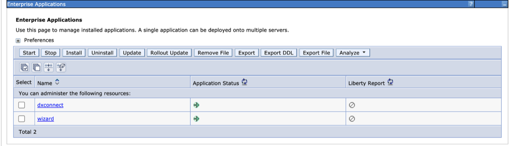

# DXConnect

DXConnect is a servlet-based application deployed on top of IBM WebSphere Application Server in the HCL DX 9.5 CF19 and later deployments, under the [Configuration Wizard profile - `cw_profile`](../../../deployment/manage/portal_admin_tools/cfg_wizard/configuration/index.md). DXConnect enables the DXClient tool to connect over an HTTP or HTTPS connection from a client development machine or remote server to a source or target HCL DX 9.5 server to execute certain tasks requested via DXClient commands.

For supported on-premises platforms with HCL DX 9.5 CF19 and later releases, the DXConnect application needs to be installed (refer to [DXConnect](dxconnect.md)) and started under the Configuration Wizard (`cw_profile`) on target servers. For more information on starting the Configuration Wizard, refer to [Accessing the Configuration Wizard](../../../deployment/manage/portal_admin_tools/cfg_wizard/configuration/cw_run.md).

DXConnect is pre-configured in container environments.

DXConnect has to be installed manually on on-premise environments.

!!!note
    Configuration Wizard Administrator credentials are required to access the DXConnect application.

## Authentication

DXConnect requires the `cw_profile` Administrator security role to access the application servlet APIs.

## DXConnect Installation (only applicable for on-premises installations)

To install DXConnect under Configuration Wizard server, you must issue the command to the ConfigEngine script present under 'wp_profile'.
Navigate to the ConfigEngine script location under 'wp_profile':

```bash
cd /opt/HCL/wp_profile/ConfigEngine/
```

To install DXConnect, use the command below:

```bash
./ConfigEngine.sh install-dxconnect-application
```

This task not only installs the DXConnect application, but it also creates the "DXC\_ConfigSettings" WAS Resource Environment Provider and creates `DXCONNECT_MAX_FILE_SIZE_MB` custom property in that REP. 

!!!note
    `DXCONNECT_MAX_FILE_SIZE_MB` property indicates the maximum file size that is allowed per request. It's **default value is zero**, which means that there are no limits defined, and any file size is acceptable. You can change this by going to [Configuration Wizard](#accessing-the-configuration-wizard-admin-console-in-a-container-environment) > Resources > Resource Environment > Resource Environment Provider > DXC_ConfigSettings > Custom Properties and setting up the `DXCONNECT_MAX_FILE_SIZE_MB` property to the desired value.


To remove DXConnect, use the command below:

```bash
./ConfigEngine.sh remove-dxconnect-application
```

To re-install DXConnect, use the command below:

```bash
./ConfigEngine.sh reinstall-dxconnect-application
```

!!!note
    In on-premise environments setups, you must run the `ConfigEngine` task under the `wp_profile` to have DXConnect installed in the correct location. A restart of the `cw_profile` server may be required.

    To verify if DXConnect is installed on a given HCL DX Server 9.5 with CF19 or later, navigate to the **Configuration Wizard** Admin console and then under **Enterprise Applications**. The `dxconnect` application appears on the console as shown in the example below. For more information on accessing and working with the Configuration Wizard, refer to [Accessing the Configuration Wizard](../../../deployment/manage/portal_admin_tools/cfg_wizard/configuration/cw_run.md) topics.

    

## Accessing the Configuration Wizard admin console in a container environment

Access the ConfigWizard admin console in a container environment from your local system. The ConfigWizard admin console opens to the TCP port number 10203, navigate to the following URL to open the ConfigWizard admin console: [https://localhost:10203/ibm/console](https://localhost:10203/ibm/console).

???+ info "Related information"
    - [DXClient](../dxclient/index.md)
