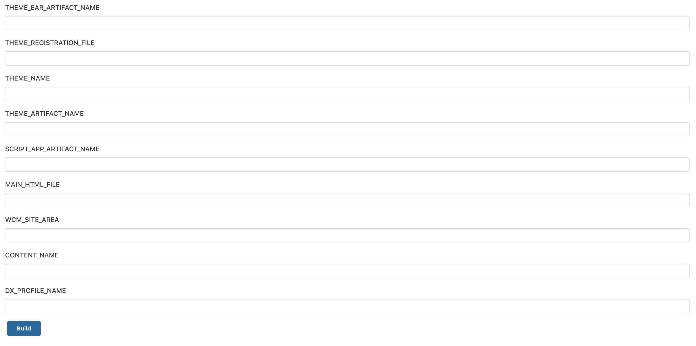
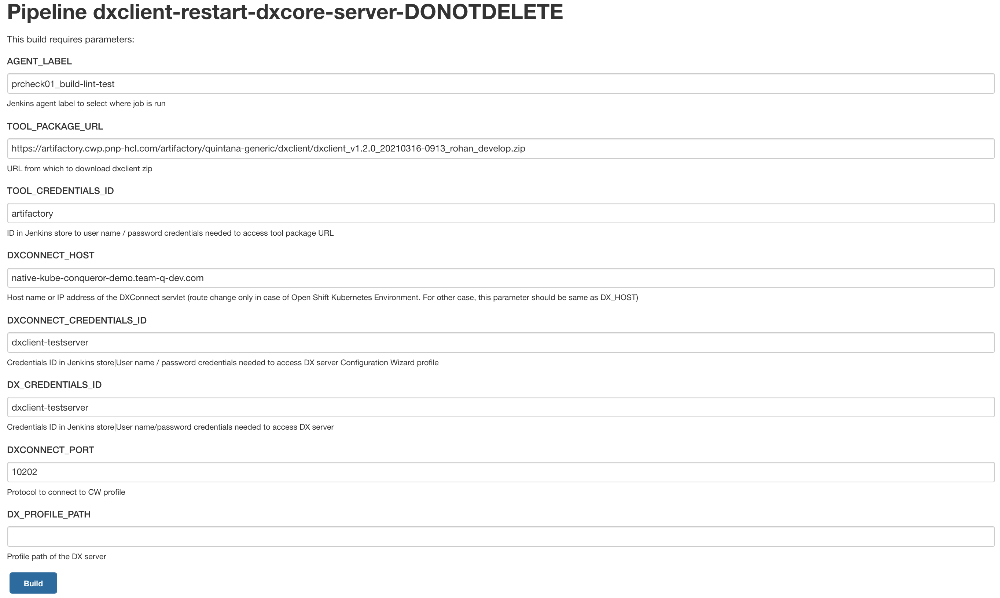

# Sample Pipeline Settings using DXClient

A CI/CD pipeline can help automate processes in the development and test cycle, including deploying code to test and production environments. HCL DX 9.5 provides sample pipelines for use with the DXClient tooling to demonstrate how the deployment of portlets, Script Applications, Themes, DX Application, export and import of WCM libraries, etc., can be automated.

A sample pipeline code that uses container version of dxclient for a combined task run(deploying portlet, theme and script application) is made available under the samples folder in the DXClient root folder. Refer [here](https://github.com/HCL-TECH-SOFTWARE/dxclient-scripts/blob/main/samples/sample-pipeline-files/sample-pipeline.groovy) for the same. Developers and administrators can use this sample as a basis for Jenkins automation server jobs. 

## Parameters for installing DXClient

|Parameter|Value|Notes|
|---------|-----|-----|
|`AGENT_LABEL`|Jenkins agent label|Determines on which agents the pipeline can run|
|`TOOL_PACKAGE_URL`|URL to DXClient zip|Fetched via curl|
|`TOOL_CREDENTIALS_ID`|Credentials ID in Jenkins store|User name / password credentials needed to access tool package URL|
|`ARTIFACT_PATH`|URL (except filenames) for artifacts to be deployed|Artifacts fetched via curl|
|`ARTIFACT_CREDENTIALS_ID`|Credentials ID in Jenkins store|User name / password credentials needed to access artifact URLs|

## Parameters of DX Server Configuration

|Parameter|Value|Notes|
|---------|-----|-----|
|`DX_HOST`|Host name or IP address of DX server|Artifacts will be deployed to this server|
|`DX_PROTOCOL`|Protocol to connect to DX server|http or https|
|`DX_PORT`|Port to connect to DX serve|Port for the DX main profile|
|`DX_CREDENTIALS_ID`|Credentials ID in Jenkins store|User name / password credentials needed to access DX server|
|`DXCONNECT_HOST`|Host name or IP address of the DXConnect servlet (route change only in case of Open Shift Kubernetes Environment. For other case, this parameter should be same as DX_HOST)|Hostname for the DX Configuration Wizard profile|
|`DXCONNECT_PORT`|Port to connect to DXConnect servlet|Port for the DX config wizard profile|
|`DXCONNECT_CREDENTIALS_ID`|Credentials ID in Jenkins store|User name / password credentials needed to access DX server config wizard profile|

## Deploy portlet

This sample shows how to install the DXClient tool in a pipeline and then deploy or update a portlet. It is designed to be run from a Jenkins job that provides the following parameters:

|Parameter|Value|Notes|
|---------|-----|-----|
|`DEPLOY_PORTLET`|Select this to deploy the portlet| |
|`XML_CONFIG_PATH`|URL path to the config servlet for xmlaccess|Defaults to '/wps/config'|
|`CONTENT_HANDLER_PATH`|Alternate path for the portal context root or the content handler servlet|Default to /wps/mycontenthandler/|
|`DX_PROFILE_NAME`|Profile name of the DX server| |
|`DX_PROFILE_PATH`|Profile path of the DX server| |
|`DX_SOAP_PORT`|Soap Port number of the DX server| |
|`PORTLET_WAR_ARTIFACT_NAME`|Filename of WAR to deploy the portlet|Required for deploy portlet|
|`PORTLET_XML_ARTIFACT_NAME`|Filename of xmlaccess script used to deploy the portlet|Required for deploy portlet|

## Deploy theme

This sample shows how to install the DXClient tool in a pipeline and then deploy or update a theme. It is designed to be run from a Jenkins job that provides the following parameters:

|Parameter|Value|Notes|
|---------|-----|-----|
|`DEPLOY_THEME`|Select this to deploy the theme| |
|`XML_CONFIG_PATH`|URL path to the config servlet for xmlaccess|Defaults to '/wps/config'|
|`CONTENT_HANDLER_PATH`|Alternate path for the portal context root or the content handler servlet|Default to /wps/mycontenthandler/|
|`DX_PROFILE_NAME`|Profile name of the DX server| |
|`DX_PROFILE_PATH`|Profile path of the DX server| |
|`DX_SOAP_PORT`|Soap Port number of the DX server| |
|`THEME_EAR_APPLICATION_NAME`|Application name for the EAR file to deploy the theme|Required for EAR theme deployment|
|`THEME_EAR_ARTIFACT_NAME`|File name of EAR application to deploy theme|Required for EAR theme deployment|
|`THEME_REGISTRATION_FILE`|File name of XML file to register the theme|Required for theme registration|
|`THEME_NAME`|WEBDAV theme name|Required for WEBDAV theme deployment|
|`THEME_ARTIFACT_NAME`|WEBDAV theme zip file name|Required for WEBDAV theme deployment|

## Deploy script application

This sample shows how to install the DXClient tool in a pipeline and then deploy a Script Application. It is designed to be run from a Jenkins job that provides the following parameters:

|Parameter|Value|Notes|
|---------|-----|-----|
|`DEPLOY_SCRIPT_APPLICATION`|Select this to deploy the script application| |
|`CONTENT_HANDLER_PATH`|Alternate path for the portal context root or the content handler servlet|Default to /wps/mycontenthandler/|
|`DX_PROFILE_NAME`|Profile name of the DX server| |
|`DX_PROFILE_PATH`|Profile path of the DX server| |
|`SCRIPT_APP_ARTIFACT_NAME`|Filename of zipped script application to deploy|Required for deploy script application|
|`MAIN_HTML_FILE`|File name of Main HTML file within the script application|Required for deploy script application|
|`WCM_SITE_AREA`|SiteArea of the Script Application content|Required for deploy script application|
|`CONTENT_NAME`|Name of the Script Application instance to be created or updated|Required for deploy script application|

## Some more Sample Pipeline Settings

### Restore script application

This sample shows how to install the DXClient tool in a pipeline and then restore an existing script application to any of its specified previous version. It is designed to be run from a Jenkins job that provides the following parameters:

|Parameter|Value|Notes|
|---------|-----|-----|
|`AGENT_LABEL`|Jenkins agent label|Determines on which agents the pipeline can run|
|`TOOL_PACKAGE_URL`|URL to DXClient zip|Fetched via curl|
|`TOOL_CREDENTIALS_ID`|Credentials ID in Jenkins store|User name/password credentials needed to access tool package URL|
|`DX_HOST`|Host name or IP address of DX server|Artifacts will be deployed to this server|
|`DX_PROTOCOL`|Protocol to connect to DX server|HTTP or HTTPS|
|`DX_PORT`|Port to connect to DX server|Port for the DX main profile|
|`DX_CREDENTIALS_ID`|Credentials ID in Jenkins store|User name/password credentials needed to access DX server|
|`CONTENT_ID`|WCM content item unique ID|Script application will be stored in this content item|
|`VERSION_NAME`|Version name of script application|Name of the version that should store the script application|
|`RESTORE_AS_PUBLISHED`|Selected version to restore or draft|Restore as a draft or replace the published version|

### Deploy DX application

This sample shows how to install the DXClient tool in a pipeline and then deploy or update a DX application. It is designed to be run from a Jenkins job that provides the following parameters:

|Parameter|Value|Notes|
|---------|-----|-----|
|`AGENT_LABEL`|Jenkins agent label|Determines on which agents the pipeline can run|
|`TOOL_PACKAGE_URL`|URL to DXClient zip|Fetched via curl|
|`TOOL_CREDENTIALS_ID`|Credentials ID in Jenkins store|User name/password credentials needed to access tool package URL|
|`ARTIFACT_PATH`|URL \(except filenames\) for artifacts to be deployed|Artifacts fetched via curl|
|`ARTIFACT_CREDENTIALS_ID`|Credentials ID in Jenkins store|User name/password credentials needed to access artifact URLs|
|`DX_CREDENTIALS_ID`|Credentials ID in Jenkins store|User name/password credentials needed to access DX server|
|`DXCONNECT_CREDENTIALS_ID`|Credentials ID in Jenkins store|User name/password credentials needed to access DX Server Configuration Wizard profile|
|`DX_PROTOCOL`|Protocol to connect to DX server|HTTP or HTTPS|
|`DX_HOST`|Host name or IP address of DX server|Artifacts will be deployed to this server|
|`DX_PORT`|Port to connect to DX server|Port for the DX main profile|
|`DXCONNECT_HOST`|Host name or IP address of the DXConnect servlet \(route change only in case of Open Shift Kubernetes Environment. For other case, this parameter should be same as DX\_HOST\)|Hostname for the DX Configuration Wizard profile|
|`DXCONNECT_PORT`|Port to connect to DXConnect servlet|Port for the DX Configuration Wizard profile. Default to 10202|
|`APPLICATION_FILE`|File name of EAR application to deploy|Required for EAR deployment|
|`APPLICATION_NAME`|Application name for the EAR file to deploy|Required for EAR deployment|
|`DX_SOAP_PORT`|Soap Port number of the DX server|Required for EAR deployment|
|`DX_PROFILE_PATH`|Profile path of the DX server|Required for EAR deployment|

### Restart DX Core server

This sample shows how to restart the DX Core server using the DXClient tool in a pipeline. It is designed to be run from a Jenkins job that requires the following parameters:

|Parameter|Value|Notes|
|---------|-----|-----|
|`AGENT_LABEL`|Jenkins agent label|Determines on which agents the pipeline can run|
|`TOOL_PACKAGE_URL`|URL to DXClient zip|Fetched via curl|
|`TOOL_CREDENTIALS_ID`|Credentials ID in Jenkins store|User name/password credentials needed to access tool package URL|
|`DX_CREDENTIALS_ID`|Credentials ID in Jenkins store|User name/password credentials needed to access DX Core server|
|`DXCONNECT_CREDENTIALS_ID`|Credentials ID in Jenkins store|User name/password credentials needed to access DX Core Server Configuration Wizard profile|
|`DXCONNECT_HOST`|Host name or IP address of the DXConnect servlet \(route change only in case of Open Shift Kubernetes Environment. For other case, this parameter should be same as DX\_HOST\)|Hostname for the DX Configuration Wizard profile|
|`DXCONNECT_PORT`|Port to connect to DXConnect servlet|Port for the DX Configuration Wizard profile. Default to 10202|
|`DX_PROFILE_PATH`|Profile path of the DX Core server|Required for restarting the DX Core server|

### Manage syndication

This sample shows how to install the DXClient tool in a pipeline and then enable or disable the syndicator or subscriber. It is designed to be run from a Jenkins job that requires the following parameters:

|Parameter|Value|Notes|
|---------|-----|-----|
|`AGENT_LABEL`|Jenkins agent label|Determines on which agents the pipeline can run|
|`TOOL_PACKAGE_URL`|URL to DXClient zip|Fetched via curl|
|`TOOL_CREDENTIALS_ID`|Credentials ID in Jenkins store|User name/password credentials needed to access tool package URL|
|`DX_CREDENTIALS_ID`|Credentials ID in Jenkins store|User name/password credentials needed to access DX server|
|`DX_PROTOCOL`|Protocol to connect to DX server|HTTP or HTTPS|
|`DX_HOST`|Host name or IP address of DX server|Artifacts will be deployed to this server|
|`DX_PORT`|Port to connect to DX server|Port for the DX main profile|
|`CONTENT_HANDLER_PATH`|Alternate path for the portal context root or the content handler servlet|Default to /wps/mycontenthandler/|
|`SYNDICATOR_OR_SUBSCRIBER`|This can be syndicator or subscriber| |
|`UUID_FOR_SYNDICATION`|UUID of the syndicator/subscriber instance| |
|`ENABLE`|Use true or false to enable or disable the syndicator/subscriber| |

## HCLSoftware U learning materials

For an introduction and a demo on DX staging, go to [Staging for Beginners](https://hclsoftwareu.hcltechsw.com/component/axs/?view=sso_config&id=3&forward=https%3A%2F%2Fhclsoftwareu.hcltechsw.com%2Fcourses%2Flesson%2F%3Fid%3D505){target="_blank"}.

To learn how to use staging tools such as DXClient, Syndication, XMLAccess, ReleaseBuilder/Solution Installer, and ConfigEngine, go to [Staging for Intermediate Users](https://hclsoftwareu.hcltechsw.com/component/axs/?view=sso_config&id=3&forward=https%3A%2F%2Fhclsoftwareu.hcltechsw.com%2Fcourses%2Flesson%2F%3Fid%3D3328){target="_blank"}. You can try it out using the [Staging Lab for Intermediate Users](https://hclsoftwareu.hcltechsw.com/images/Lc4sMQCcN5uxXmL13gSlsxClNTU3Mjc3NTc4MTc2/DS_Academy/DX/Administrator/HDX-ADM-200_Staging_Lab.pdf){target="_blank"} and corresponding [Staging Lab Resources](https://hclsoftwareu.hcltechsw.com/images/Lc4sMQCcN5uxXmL13gSlsxClNTU3Mjc3NTc4MTc2/DS_Academy/DX/Administrator/HDX-ADM-200_Staging_Lab_Resources.zip){target="_blank"}.

???+ info "Related information" 
    - [How to translate WCM library content using export and import WCM with DXClient](../dxclient/dxclient_artifact_types/wcm_mls_export_import.md)
    - [Sample Pipelines for use with HCL DXClient and Automation servers](sample-pipeline-settings-using-dxclient.md)
