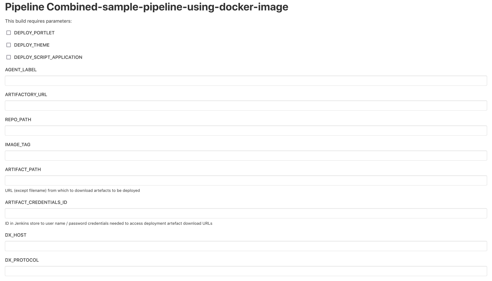
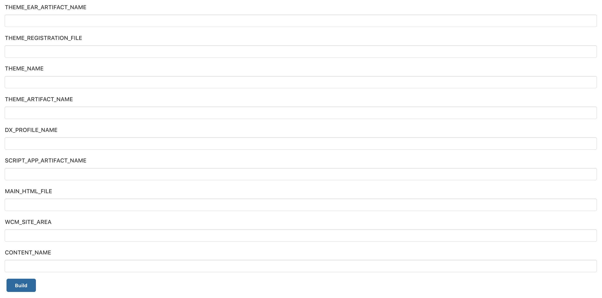

# Sample Pipelines for the DXClient Docker image file

This sample shows how to pull DXClient docker image from the given artifactory, run the DXClient tool in the docker and then deploy a portlet, theme, and script application. It is designed to be run from a Jenkins job that provides the following parameters:

|Parameter|Value|Notes|
|---------|-----|-----|
|`DEPLOY_PORTLET`|Select this to deploy the portlet| |
|`DEPLOY_THEME`|Select this to deploy the theme| |
|`DEPLOY_SCRIPT_APPLICATION`|Select this to deploy the script application| |
|`AGENT_LABEL`|Jenkins agent label|Determines on which agents the pipeline can run|
|`ARTIFACTORY_URL`|URL to DXClient docker image file|Docker image will be pulled out from this URL|
|`REPO_PATH`|Repository path of the DXClient docker image|Docker image will be pulled out from this folder|
|`IMAGE_TAG`|docker image tag|Docker image will be pulled out using this image tag|
|`ARTIFACT_PATH`|URL (except filenames) for artifacts to be deployed|Artifacts fetched via curl|
|`ARTIFACT_CREDENTIALS_ID`|Credentials ID in Jenkins store|User name / password credentials needed to access artifact URLs|
|`DX_HOST`|Host name or IP address of DX server|Artifacts will be deployed to this server|
|`DX_PROTOCOL`|Protocol to connect to DX server|http or https|
|`DX_PORT`|Port to connect to DX serve|Port for the DX main profile|
|`DX_CREDENTIALS_ID`|Credentials ID in Jenkins store|User name / password credentials needed to access DX server|
|`DXCONNECT_HOST`|Host name or IP address of the DXConnect servlet (route change only in case of Open Shift Kubernetes Environment. For other case, this parameter should be same as DX_HOST)|Hostname for the DX Configuration Wizard profile|
|`DXCONNECT_PORT`|Port to connect to DXConnect servlet|Port for the DX config wizard profile|
|`DXCONNECT_CREDENTIALS_ID`|Credentials ID in Jenkins store|User name / password credentials needed to access DX server config wizard profile|
|`XML_CONFIG_PATH`|URL path to the config servlet for xmlaccess|Defaults to '/wps/config'|
|`CONTENT_HANDLER_PATH`|Alternate path for the portal context root or the content handler servlet|Default to /wps/mycontenthandler/|
|`DX_PROFILE_NAME`|Profile name of the DX server| |
|`DX_PROFILE_PATH`|Profile path of the DX server| |
|`DX_SOAP_PORT`|Soap Port number of the DX server| |
|`PORTLET_WAR_ARTIFACT_NAME`|Filename of WAR to deploy the portlet|Required for deploy portlet|
|`PORTLET_XML_ARTIFACT_NAME`|Filename of xmlaccess script used to deploy the portlet|Required for deploy portlet|
|`THEME_EAR_APPLICATION_NAME`|Application name for the EAR file to deploy the theme|Required for EAR theme deployment|
|`THEME_EAR_ARTIFACT_NAME`|File name of EAR application to deploy theme|Required for EAR theme deployment|
|`THEME_REGISTRATION_FILE`|File name of XML file to register the theme|Required for theme registration|
|`THEME_NAME`|WEBDAV theme name|Required for WEBDAV theme deployment|
|`THEME_ARTIFACT_NAME`|WEBDAV theme zip file name|Required for WEBDAV theme deployment|
|`SCRIPT_APP_ARTIFACT_NAME`|Filename of compressed script application to deploy|Required for deploy script application|
|`MAIN_HTML_FILE`|File name of Main HTML file within the script application|Required for deploy script application|
|`WCM_SITE_AREA`|SiteArea of the Script Application content|Required for deploy script application|
|`CONTENT_NAME`|Name of the Script Application instance to be created or updated|Required for deploy script application|

???+ info "Related information" 
    - [How to translate WCM library content using export and import WCM with DXClient](../dxclient/dxclient_artifact_types/wcm_mls_export_import.md)
    - [Sample Pipelines for the DXClient Docker image file](sample_pipelines_docker_dxclient.md)
    - [Sample Pipelines for the DXClient node package file](sample_pipelines_node_dxclient.md)
    - [Sample Pipelines for use with HCL DXClient and Automation servers](sample_pipelines_for_use_with_dx_client_and_automation_servers.md)

