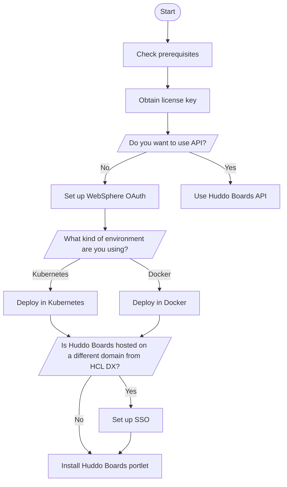

# Integrating Huddo Boards with HCL Digital Experience

Huddo Boards is a team collaboration tool from Huddo that can make teams more productive.  Using the capabilities, users can view an activity as a board, giving them the option to drag and drop their Tasks and Entries and filter the content by person, priority, color, and more. For more information on the services and capabilities, see [Huddo Boards](https://www.huddo.com/boards).
<!--

-->
-   **[Installing Huddo Boards in HCL DX](Install_huddo_boards.md)**  
Install Huddo Boards in HCL Digital Experience.
-   **[Configuring Huddo Boards in HCL DX](Configuration_huddo_boards.md)**  
Configure Huddo Boards in HCL Digital Experience.
-   **[Limitations](limitations.md)**  
See the limitations when integrating Huddo Boards with HCL Digital Experience.