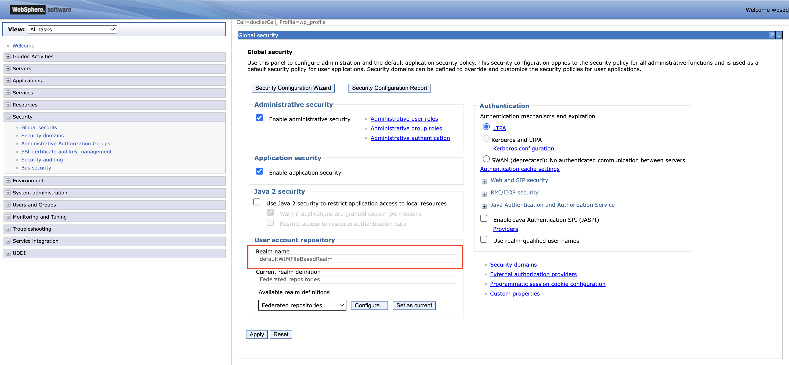

# Configuring HCL Leap for integration with HCL DX

This page provides information on how to configure the integration of HCL Leap with the existing Digital Experience (DX) environment.

## Access Layer for HCL DX and HCL Leap

You have two options for implementing the Access Layer in the DX deployment and Leap: [Ingress](#ingress-for-hcl-dx-and-hcl-leap) and [Gateway API](#gateway-api-for-hcl-dx-and-hcl-leap). Choose the option that fits your specific needs and preferences.

### Ingress for HCL DX and HCL Leap

Refer to the following steps to implement a generic Ingress on your Kubernetes cluster for use with DX and Leap. The actual implementation might vary depending on the cluster's setup and configuration.

#### Prerequisites

Ensure you follow the guidelines provided in the [optional Ingress documentation](../../../deployment/install/container/helm_deployment/preparation/optional_tasks/optional-configure-access-layer.md#ingress-implementation-for-dx-deployments) to set up Ingress for DX.

#### Implementing Ingress for HCL DX and HCL Leap

1. Create a separate Ingress resource for Leap or extend the existing DX Ingress configuration. In Kubernetes, Ingress resources manage how external HTTP(S) traffic is routed to services within the cluster. You can either define a dedicated Ingress for Leap or incorporate its routes into the existing DX Ingress.

2. Ensure the Ingress resource is configured to match Leap’s deployment path. The specified path (for example, `/apps`) should align with Leap’s context route so that incoming requests are correctly routed to the Leap service as accessed by end users.

The following YAML file demonstrates how to define an Ingress resource that routes traffic to the Leap backend service based on a specific path (for example, `/apps`):

```yaml
apiVersion: networking.k8s.io/v1
kind: Ingress
metadata:
    name: custom-routes
spec:
    ingressClassName: nginx
    tls:
    - secretName: dx-tls-cert
        hosts:
        - your-kube-deployment.com
    rules:
    - host: your-kube-deployment.com
        http:
        paths:
        - path: /apps
            pathType: Prefix
            backend:
            service:
                name: leap-deployment-leap
                port:
                number: 9080
```

- The `metadata` section identifies the Ingress resource.
- The `spec` section outlines the routing configuration.
- The `tls` block sets up HTTPS for the specified domain.
- Within the `rules` section, requests to the `/apps` path (including sub-paths) for the defined host are directed to the Leap service deployed in the cluster.

### Gateway API for HCL DX and HCL Leap

Refer to the following steps to configure the optional Gateway API for DX and Leap. The Gateway API allows you to route requests to both products under the same hostname, enhancing the deployment's efficiency and management.

#### Prerequisites

Ensure you follow the guidelines provided in the [optional Gateway API documentation](../../../deployment/install/container/helm_deployment/preparation/optional_tasks/optional-configure-access-layer.md#gateway-api-implementation-for-dx-deployments) to set up the Gateway API for HCL DX.

#### Implementing Gateway API for HCL DX and HCL Leap

1. Create a separate Gateway API resource for Leap or extend the existing DX Gateway configuration. The Gateway API offers a more flexible and expressive approach to traffic management than traditional Ingress. Consolidating routing for both DX and Leap under a single configuration can simplify access layer management.

2. Ensure the Gateway API configuration accurately reflects the context route used in the Leap deployment (for example, `/apps`). This ensures that incoming requests to that path are properly routed to the Leap backend service.

The following YAML file demonstrates how to define a Gateway API `HTTPRoute` resource for routing requests to the Leap backend service:
  
  ```yaml
  apiVersion: gateway.networking.k8s.io/v1
  kind: HTTPRoute
  metadata:
    name: leap-http-api-route
  spec:
    parentRefs:
    - name: gateway
      sectionName: https
    hostnames:
    - your-kube-deployment.com
    rules:
    - matches:
      - path:
          type: PathPrefix
          value: /apps
      backendRefs:
      - name: leap-deployment-leap
        port: 9080
  ```

- The `metadata` section assigns a name to the HTTPRoute resource.
- The `spec` section outlines the routing configuration.
- The `parentRefs` section links the route to a specific Gateway and its section (for example, `https`).
- The `hostnames` section indicates the domain this route is intended for.
- Within `rules`, the `matches` block defines the path prefix condition (such as `/apps`)
- The `backendRefs` section specifies the target backend service and port where Leap is hosted.

## Enabling SSO between HCL Leap and HCL DX in Kubernetes


You can enable single sign-on (SSO) between HCL Leap and HCL Digital Experience (DX) in Kubernetes by using either the [Lightweight Third-Party Authentication (LTPA)](#implementing-ltpa-sso) protocol or the modern [OpenID Connect (OIDC)](#implementing-oidc-sso) protocol.

### Implementing LTPA SSO

This guide explains how to enable SSO between HCL DX and HCL Leap on Kubernetes using LTPA. The process works by sharing a single LTPA encryption key between the DX and Leap pods. By storing this common key in a Kubernetes Secret, both applications can trust each other's login tokens, allowing users to sign in once and access both platforms seamlessly. The following steps are based on [a community post](https://support.hcltechsw.com/community?id=community_blog&sys_id=ba541e4b1b820614f37655352a4bcbc4){target="_blank"} from the HCLSoftware Community:

1. Ensure both DX and Leap use an identical user registry configuration.
    - For DX, please refer to the doc on [User Registry Options](../../../get_started/plan_deployment/traditional_deployment/user_registry_consideration/plan_ureg_ov.md) for details.
    - For Leap, please refer to [the Leap documentation](https://opensource.hcltechsw.com/leap-doc/latest/helm_configure_ldap.html) for details.

2. Ensure both DX and Leap use the same realm name.
  
    To set the realm name for DX:

    1. Log in to the WebSphere Integrated Solutions Console (`your-domain.com/ibm/console`) as an administrator.
    2. Click **Security > Global Security > User Account Repository > Realm Name**.
    3. Under **User account repository**, set the **Realm name** (for example, `defaultWIMFileBasedRealm`).

        

    4. Click **Apply**.
    5. Click **Save** at the top of the console messages.

    To set the realm name for Leap:

    1. Edit the `configOverrideFiles` section in your Helm chart's `values.yaml` file. In the following example, the realm name for Leap is set to `defaultWIMFileBasedRealm`, similar to the realm name set in DX.

        ```yaml
        configuration:
            leap:  
                configOverrideFiles:
                    mycustomoverride: |
                        <server description="leapServer">
                        <federatedRepository id="leapRepo">
                            <primaryRealm name="defaultWIMFileBasedRealm" allowOpIfRepoDown="true">
                            <participatingBaseEntry name="o=defaultWIMFileBasedRealm" />
                            </primaryRealm>
                        </federatedRepository>
                        <basicRegistry id="leapRegistry" realm="defaultWIMFileBasedRealm" ignoreCaseForAuthentication="true">
                            <user id="<my-user-id>" name="uid=<my-user-id>,o=defaultWIMFileBasedRealm" password="<my-password>" />
                        </basicRegistry>
                        </server>
        ```

    2. Perform a Helm upgrade to apply your changes.

    !!!note
        For more information regarding Leap's `configOverrideFiles` parameter, refer to [Open Liberty server customizations](https://opensource.hcltechsw.com/leap-doc/latest/helm_open_liberty_custom.html?h=configoverridefile).

3. Ensure both DX and Leap use the same DNS domain. Refer to [these steps](./installation.md) for details.

4. Ensure LTPA cookies flow only over HTTPS.

    To limit the flow of LTPA cookies to SSL only on the traditional WebSphere Application Server (WAS):

    1. Log in to the WebSphere Integrated Solutions Console (`your-domain.com/ibm/console`) as an administrator.
    2. Click **Security > Global security > Web and SIP security > Single sign-on (SSO)**.
    3. Select the **Requires SSL** checkbox.
    4. Click **Apply**.
    5. Click **Save** at the top of the console messages.

    To limit the flow of LTPA cookies to SSL only on Liberty:

    1. Add the following parameter to the `configOverrideFiles` section of your `values.yaml` file

        ```
        <webAppSecurity ssoRequiresSSL="true"/>
        ```

    2. Perform a Helm upgrade to apply your changes.

5. Ensure both DX and Leap use the same LTPA keys.

    1. Export the LTPA keys from WAS:
        1. Log in to the WebSphere Integrated Solutions Console (`your-domain.com/ibm/console`) as an administrator.
        2. Click **Security > Global security > LTPA**.
        3. In the Cross-cell single sign-on section, enter values for the following fields:
            1. Under **Password**, enter and confirm a secure password. You will require this password later.
            2. Under **Fully qualified key file name**, specify a name for the file that holds the exported keys (for example, `ltpa.keys`).
        4. Click **Export keys**.
    2. Look for the exported `ltpa.keys` in your DX core pod.
        1. In your cluster, run `kubectl exec -it <your-dx-core-pod-name> -- sh`.
        2. Run `find / -name ltpa.keys` to find the location of the ltpa.keys file, e.g. `/opt/HCL/profiles/prof_95_CF229/ltpa.keys`.
        3. Run `cat <ltpa.keys-location>` to print the file's contents into the terminal.
    3. Copy the content of the exported LTPA key file into a file named `ltpa.keys` in your cluster. This file will be used to create the Kubernetes secret.
    4. Exit the DX Core pod shell by running `exit`.
    5. Run the following command in your cluster to create the Kubernetes secret:

        ```
        kubectl create secret generic my-custom-ltpa-key --from-file=/path/to/ltpa.keys --namespace=<namespace>
        ```

    6. Update `ltpa-key` in the Leap custom Helm `values.yaml` file, then run a helm upgrade:

        ```yaml
        configuration: 
            leap: 
                customSecrets: 
                    ltpa-key: my-custom-ltpa-key
        ```

    7. Look for `ltpa.keys` in your Leap pod (steps are similar to those that you did to find it in the DX pod). Check that its contents are the same as the ltpa.keys exported in DX. Note the location of the ltpa.keys file for the next step.
    8. Update the LTPA `keysFileName` and `keysPassword` parameters by adding this line to the `configOverrideFiles` section of your Leap `values.yaml` file: 

        ```
        <ltpa keysFileName="/path/to/ltpa.keys" keysPassword="<myLtpaKeyPassword>" />
        ```

    9. Perform a Helm upgrade to apply your changes.

    !!! note
        For more details on using custom secrets as key file, refer to [Using custom secrets as key file](https://opensource.hcltechsw.com/leap-doc/latest/helm_admin_customsecret.html?h=ltpa#using-custom-secrets-as-key-file){target="_blank"}.

    See the resulting `values.yaml` file after adding the `<webAppSecurity ssoRequiresSSL="true"/>` and `<ltpa keysFileName="/path/to/ltpa.keys" keysPassword="<myLtpaKeyPassword>" />` lines to the `configOverrideFiles` section:

    ```yaml
    ### Leap custom values file
    configuration:
      leap:  
        configOverrideFiles:
          mycustomoverride: |
            <server description="leapServer">
            <webAppSecurity ssoRequiresSSL="true"/>
            <ltpa keysFileName="/path/to/ltpa.keys" keysPassword="<myLtpaKeyPassword>" />
            <federatedRepository id="leapRepo">
                <primaryRealm name="defaultWIMFileBasedRealm" allowOpIfRepoDown="true">
                <participatingBaseEntry name="o=defaultWIMFileBasedRealm" />
                </primaryRealm>
            </federatedRepository>
            <basicRegistry id="leapRegistry" realm="defaultWIMFileBasedRealm" ignoreCaseForAuthentication="true">
                <user id="<my-user-id>" name="uid=<my-uid>,o=defaultWIMFileBasedRealm" password="<my-password>" />
            </basicRegistry>
            </server>
    ```

6. Restart HCL Leap and HCL DX. You should now be able to log in to DX and open Leap without having to log in again.

### Implementing OIDC SSO

This guide explains how to enable SSO between HCL DX and HCL Leap on Kubernetes using OIDC. The [OIDC](./../../../deployment/manage/security/people/authentication/oidc/index.md) approach connects directly to the preferred Identity Provider (IdP) such as Keycloak, Azure Active Directory (AD) or Okta. By configuring DX and Leap to trust your central IdP, users get a seamless "login once" experience and security is managed in a single place. Refer to the following steps:

1. Choose and configure your IdP.

    1. Create a client registration for each product (DX and Leap). Your IdP will serve as the single point of truth for credential inputs.

    2. (Optional) Customize the IdP access UI. Refer to [IdP Customization and Consideration](./../../../deployment/manage/security/people/authentication/oidc/dx-oidc-customization-considerations.md) for more information.

2. Enable OIDC in HCL DX.

    Refer to [Updating WebSphere to support OIDC Authentication for DX](./../../../deployment/manage/security/people/authentication/oidc/dx-update-websphere-for-oidc.md) to enable OIDC on the HCL DX Websphere Application Server.

3. Enable OIDC in HCL Leap.

    Leap can be configured to leverage OIDC as the primary authentication mechanism, turning it into a Relying Party (RP) to your IdP. When OIDC is used, the user and group lookup feature of Leap is not available and must be disabled as part of the configuration.

    1. Configure the necessary certificates for secure OIDC communication.

        As part of the configuration process for your identity provider, you will have created or obtained a digital certificate for configuring HTTPS. This certificate will also need to be deployed to Leap so that the two servers can communicate with each other.

        !!! note
    The SSL certificate (`.crt`) and public key (`.key`) must be in PKCS12 format.

    2. After copying the `.key` and `.crt` to the Kubernetes image, create a secret using the following command:

        ```bash
        kubectl -n <namespace> create secret tls <tls_secret> --key="/tmp/oidc.key" --cert="/tmp/oidc.crt"
        ```

        This secret can be referenced in the `values.yaml` file using the following configuration:

        ```yaml
        configuration:
            leap:
                customCertificateSecrets:
                    idpCert: <tls_secret>
        ```

    3. Add the OIDC definition as a server customization in the `values.yaml` file.

        The properties that you need to specify will depend on your identity provider's configuration. For additional information, refer to [Open Liberty documentation on OIDC](https://openliberty.io/docs/latest/reference/config/openidConnectClient.html){target="_blank"}

        Before proceeding, verify that the discovery endpoint URL (usually ending with `/.well-known/openid-configuration`) is valid by opening it in a browser. Then update the `values.yaml` file with appropriate values for client ID and secret obtained from your IdP.

        Example of an OIDC definition:

        ```yaml
        # Replace placeholder values with your actual OIDC configuration
        configuration:
            leap:
                configOverrideFiles:
                    openIdConnect: |
                        <server description="leapServer">
                        <openidConnectClient id="<unique-oidc-id>"
                            clientId="<your-client-id>"
                            clientSecret="<your-client-secret>"
                            signatureAlgorithm="RS256"
                            authFilterRef="interceptedAuthFilter"
                            mapIdentityToRegistryUser="false"
                            httpsRequired="true"
                            scope="openid"
                            userIdentityToCreateSubject="preferred_username"
                            discoveryEndpointUrl="<your-idp-discovery-endpoint>">
                        </openidConnectClient>
                        <authFilter id="interceptedAuthFilter">
                            <requestUrl id="authRequestUrl" matchType="contains" urlPattern="/apps/secure|/apps/secured"/>
                        </authFilter>
                        <httpEndpoint id="defaultHttpEndpoint"
                            host="*"
                            httpPort="9080"
                            httpsPort="9443">
                            <samesite none="*" />
                        </httpEndpoint>
                        </server>
        ```

        For more details on defining a server customization, refer to [Open Liberty server customizations](https://opensource.hcltechsw.com/leap-doc/latest/helm_open_liberty_custom.html){target="_blank"}.

        !!!important
            The openIdConnectClient redirects to `https://<your-domain>/oidcclient/redirect/<unique-oidc-id>` after authentication. Make sure that your valid redirect URIs in the IdP include an entry that matches this pattern, and that you're using a different ID than what you're using for DX. You may also need to modify your Ingress/Gateway API configuration so that `/oidcclient/redirect/<unique-oidc-id>` redirects to the Leap service.

    4. Add the following config properties related to OIDC in the `values.yaml` file.

        The following properties must be set to complete the OIDC configuration:

        - `userLookups`: Set this to `false` to disable user lookups, which is not available when configured with OIDC.
        - `userGroups`: Set this to `false` to disable group lookups, which is not available when configured with OIDC.
        - `postLogoutRedirectURL`: Set this to the URL to which Leap will redirect the browser after a user logs out. This is necessary to complete the authentication flow with your IdP.

        ```yaml
        configuration:
            leap:
                leapProperties: |
                    ibm.nitro.NitroConfig.userLookup=false
                    ibm.nitro.NitroConfig.userGroups=false
                    ibm.nitro.LogoutServlet.postLogoutRedirectURL=<your-idp-logout-endpoint>?client_id=<your-client-id>&post_logout_redirect_uri=https://<your-domain>/apps/secure/org/ide/manager.html
        ```

        For more details on setting Leap properties, refer to [Leap properties](https://opensource.hcltechsw.com/leap-doc/latest/helm_leap_properties.html){target="_blank"}.

    5. Perform a Helm upgrade to apply your changes.

    6. Delete the Leap pod using the following command:

        ```bash
        kubectl -n <namespace> delete pod <leap-pod-name>
        ```

        After successful configuration, users accessing Leap will be redirected to your IdP's authentication page.