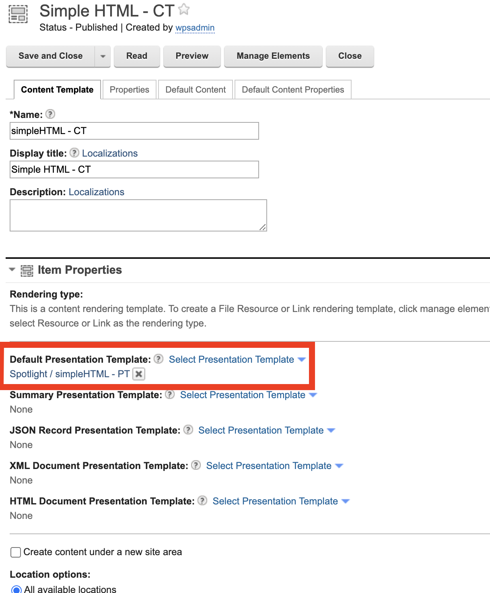
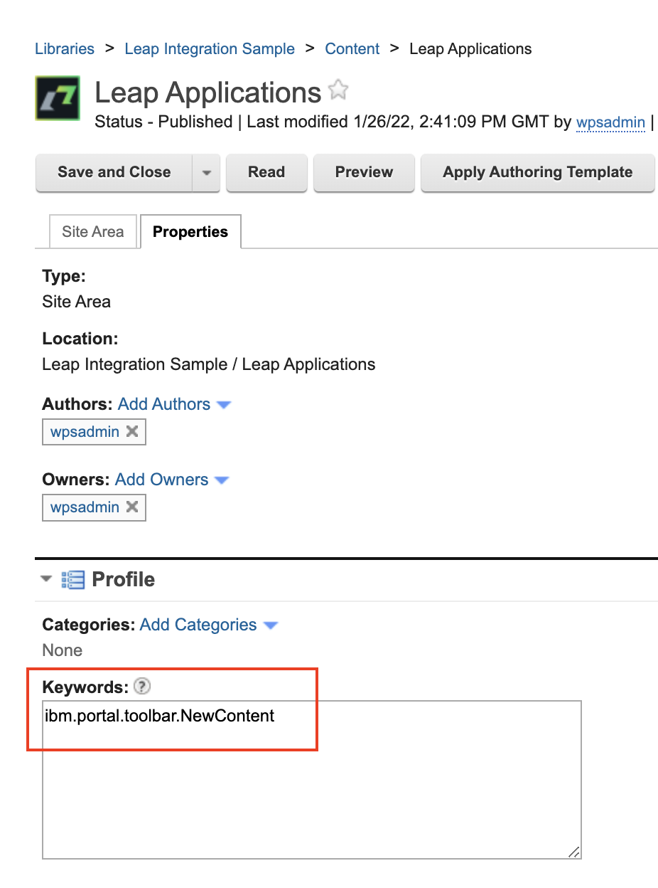
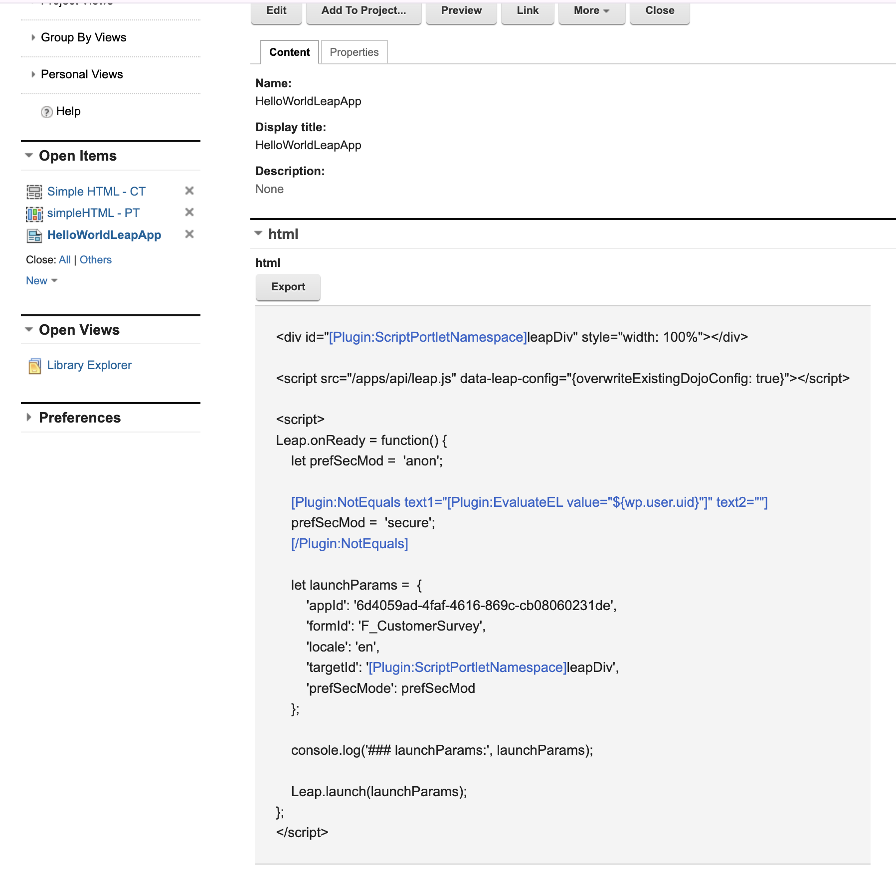

# Sample integrations of HCL Leap with HCL Digital Experience

This section provides an overview of the possibilities offered by the integration of HCL Leap and HCL Digital Experience. Follow the [Installation](../installation/index.md) and [Configuration](../configuration/index.md) steps before following the example guide.

## Showing HCL Leap data on HCL Digital Experience pages 

In this example, you can integrate data from HCL Leap to your HCL Digital Experience pages using the Digital Data Connector. For more information, see [Digital Data Connector](../../../ddc/index.md).

## Integrating the HCL Leap application in HCL Digital Experience

There are several ways to integrate HCL Leap applications into HCL Digital Experience.

### Integrating HCL Leap applications using the embedded JavaScript API

These steps will enable you to embed a Leap application onto a DX site using Leap's Embedding API. For further details, refer to [Embedding API](https://help.hcltechsw.com/Leap/9.3/ref_embedding_api.html) in the HCL Leap documentation. It is recommended that you take the following HCL Software U lessons to properly implement this: 

  - The [HDX-INTRO](https://hclsoftwareu.hcltechsw.com/courses/course/hcl-digital-experience-introduction) and [HDX-BU-100 HCL Digital Experience for Business Users (Beginners)](https://hclsoftwareu.hcltechsw.com/component/splms/course/hdx-bu-100-dx-business-user-beginner) are prerequisites as they familiarize the learner with the basic functions of DX. The “Digital Assets” and “Content Targeting” lessons are optional if we just want to embed a simple Leap app onto a DX site.
  - [HDX-DEV-100 HCL Digital Experience for Developers (Beginners)](https://hclsoftwareu.hcltechsw.com/component/splms/course/hdx-dev-100-dx-developer-beginner) explains the DX features targeted towards Developers. For the basic embedding we only made use of information from the Introduction and Web Content lessons.
  - This HCL Software U [lesson](https://hclsoftwareu.hcltechsw.com/component/splms/lesson/?id=1821) introduces how to make leap applications.


1\. Create your leap app. 

2\. A Leap property must be added to the Helm values to enable anonymous access of your apps. It is described [here](https://opensource.hcltechsw.com/leap-doc/9.3.8/co_configuration_properties.html#section_blockanonaccess). Under configuration > leap > leapProperties in your Leap custom values file, add this property: `ibm.nitro.NitroConfig.blockAnonAccess=disabled`. After saving the file, do a helm upgrade. You might have to recreate the Leap pod to apply your changes

```yaml
configuration:
  leap:
    leapProperties: ibm.nitro.NitroConfig.blockAnonAccess = disabled
```

3\. Check that your app is accessible without having to log in. 

4\. **Create a new library** via Practitioner Studio > Web Content > Web Content Libraries. Enable viewing it in Authoring by going to Authoring > Preferences > Shared Settings > Library Selection and add your new library to the Selected Libraries box.

5\. Inside your new Library, **create a presentation template** and put this under “Presentation Template Options”: `[Element context="current" type="content" key="html"]`

6\. **Create a content template** and give it the name `Simple HTML - CT`. Under Manage Elements, add an HTML element without default content. Set the content template's default presentation template to the presentation template you made in the previous step:
  


7\. **Create a site area** (you can use the default template and use any name for the site area, eg Leap Applications). Under the Properties tab > Profile > Keywords, add `ibm.portal.toolbar.NewContent`.



8\. Inside the Site Area you created, create the Content based on your `Simple HTML - CT` content template. Click on the “Remove Workflow” button. For the HTML value, use the script below, replacing the `***` with the appropriate values, depending on your app. The Launch link of your Leap app should have the details you need; refer to the pattern `sample-hostname.com/.../app/<appId>/launch/index.html?form=<formId>`, that is, your appId should come after the word "app" in your link, whereas the formId should come after "form=".
```
<div id="[Plugin:ScriptPortletNamespace]leapDiv" style="width: 100%"></div>

<script src="/apps/api/leap.js" data-leap-config="{overwriteExistingDojoConfig: true}"></script>

<script>
Leap.onReady = function() {
    let prefSecMod =  'anon';

    [Plugin:NotEquals text1="[Plugin:EvaluateEL value="${wp.user.uid}"]" text2=""]
    prefSecMod =  'secure';
    [/Plugin:NotEquals]

    let launchParams =  {
        'appId': ‘***’,
        'formId': ‘***’,
        'locale': 'en',
        'targetId': '[Plugin:ScriptPortletNamespace]leapDiv',
        'prefSecMode': prefSecMod
    };

    console.log('### launchParams:', launchParams);

    Leap.launch(launchParams);
};
</script> 
```


9\. Go to your site (eg Woodburn Studio) and **embed the Leap app** by doing the following. Open Edit Mode. (If using Woodburn Studio, create a new page before embedding; otherwise you might get errors). On the new page, click the Add page components and applications button, then pick the Site Area you created (ours is called “Leap Applications”). 


10\. Click on the Content, then Add Page.

11\. Your app should now be embedded on the page. Check that the app works by turning off Edit Mode, submitting the form, and checking via the Leap admin board whether the data got submitted.

### Integrating HCL Leap applications with Web Application Bridge

Web Application Bridge uses reverse proxy technology to integrate web-based content providers such as HCL Leap with HCL Digital Experience. Administrators must first create the content providers profiles, policies, and web dock applications. More details are available in [Web Application Bridge](../../wab/index.md).

!!!warning
    As described in [Troubleshooting the Web Application Bridge](../../wab/trouble_wab.md), the Web Application Bridge exposes the proxied application on the same context root as the original **Resource path**. This can cause overlaps in the routing if the application (in this case Leap) is deployed and exposed on the same host as HCL Digital Experience.

    To prevent this, use and configure an [Ingress Controller](../../../../deployment/install/container/helm_deployment/preparation/optional_tasks/optional-configure-access-layer.md) to expose the applications on different host names or subdomains.


1. Create Content Provider Profiles.

    For information on how to create content provider profiles, policies, and connections, refer to the following:

      - [Content provider profile](../../wab/wab/h_wab_provider.md)
      - [Content provider profile policy](../../wab/wab/h_wab_policy.md)
      - [Content provider policy requests and responses](../../wab/wab/h_wab_response.md)
      - [Content provider policy single sign-on](../../wab/wab/h_wab_auth.md)

    Follow these steps to create the profile:

      1. In the **Profile Host**, you can set a **Unique profile title** (for example `Leap Content Provider Profile`).
      2. For the **Hostname or IP address**, enter `http://hostname:port/` which is the host (and port, if required) of the Leap environment. 
        If the Leap deployment is deployed in the same Kubernetes cluster as HCL Digital Experience, the [Kubernetes Service DNS name](https://kubernetes.io/docs/concepts/services-networking/dns-pod-service/#a-aaaa-records){target="_blank"} can be used here to only access the application through the Web Application Bridge proxy. 
      3. **Save** the content provider profile.

2. Create Web Dock Applications. 

    For information on how to create web dock applications, refer to [Web Dock application](../../wab/wab/h_wab_dock.md).
    
    1. Add a **Unique web dock application title** (for example, `Leap`). Make sure the title describes the Web Dock portlet you want to add to the page.
    2. In the **Content provider profile** dropdown, select the newly created profile `Leap Content Provider Profile`.
    3. Add a path to the Leap page to display as the **Resource path** (for example, `/apps/landing/org/app/8a667f9a-aa60-4691-829a-9a8bf4220c04`).
    4. **Save** the web dock application.

3. Add the created Web Dock Application to the DX Page.
    1. Enable **Edit mode** on the DX page you want to include Leap on or create a new page.
        To create a new page, click the menu icon on the right of the Web Dock Application to open the Context menu. You can create either a child or a sibling page. 
    2. Click the plus icon on the left navigation panel to **Add page components and applications** to the page. In the navigation panel, go to the **Applications** tab and search for the newly created web dock application (in this case, `Leap`).
    3. Click the **Add To Page** button.

The HCL Leap Page should be visible within the HCL Digital Experience page.

Support for this feature is not available in the HCL Support Center. For questions and issues, reach out either in the [DXers - The HCL DX User Group](https://ptb.discord.com/channels/787019554173485067/802205783962026034){target="_blank"} on Discord or in the [HCL DX forum](https://support.hcltechsw.com/community?id=community_forum&sys_id=02c5dcf01b32f70cc1f9759d1e4bcb43){target="_blank"}.

## HCLSoftware U learning materials

For an introduction and a demo on how to integrate DX with HCL Leap as a business user, go to [DX Integration with HCL Leap for Business Users](https://hclsoftwareu.hcltechsw.com/component/axs/?view=sso_config&id=3&forward=https%3A%2F%2Fhclsoftwareu.hcltechsw.com%2Fcourses%2Flesson%2F%3Fid%3D953){target="_blank"}. To try it out yourself, refer to [DX Integration with HCL Leap for Business Users Lab](https://hclsoftwareu.hcltechsw.com/images/Lc4sMQCcN5uxXmL13gSlsxClNTU3Mjc3NTc4MTc2/DS_Academy/DX/Integration/HDX-INT-BU_DX_integration_with_HCL_Leap_for_Business_Users.pdf){target="_blank"} and corresponding [DX Integration with HCL Leap for Business Users Lab Resources](https://hclsoftwareu.hcltechsw.com/images/Lc4sMQCcN5uxXmL13gSlsxClNTU3Mjc3NTc4MTc2/DS_Academy/DX/Integration/HDX-INT-BU_DX_integration_with_HCL_Leap_for_Business_Users_Lab_Resources.zip).

For an introduction and a demo on how to integrate DX with HCL Leap as a developer, go to [DX Integration with HCL Leap for Developers](https://hclsoftwareu.hcltechsw.com/component/axs/?view=sso_config&id=3&forward=https%3A%2F%2Fhclsoftwareu.hcltechsw.com%2Fcourses%2Flesson%2F%3Fid%3D1455){target="_blank"}. To try it out yourself, refer to [DX Integration with HCL Leap for Developers Lab](https://hclsoftwareu.hcltechsw.com/images/Lc4sMQCcN5uxXmL13gSlsxClNTU3Mjc3NTc4MTc2/DS_Academy/DX/Integration/HDX-INT-DEV_DX_integration_with_HCL_Leap_for_Developers.pdf){target="_blank"}.
