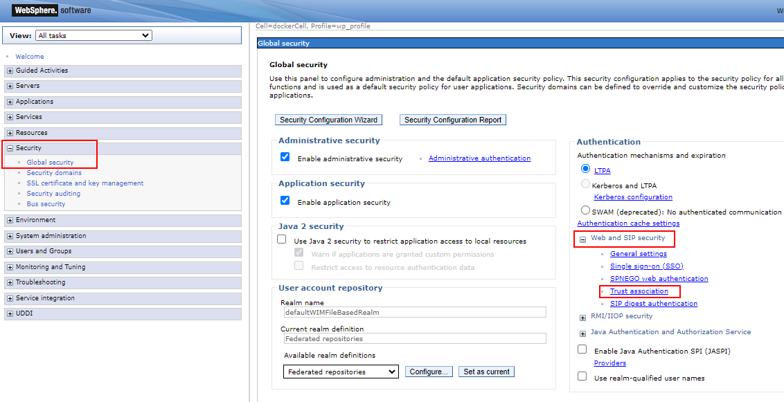
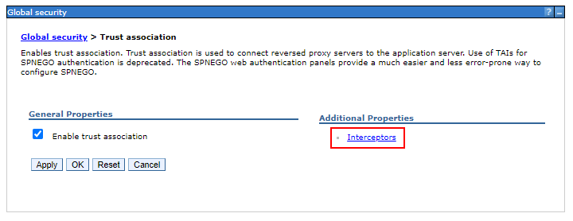
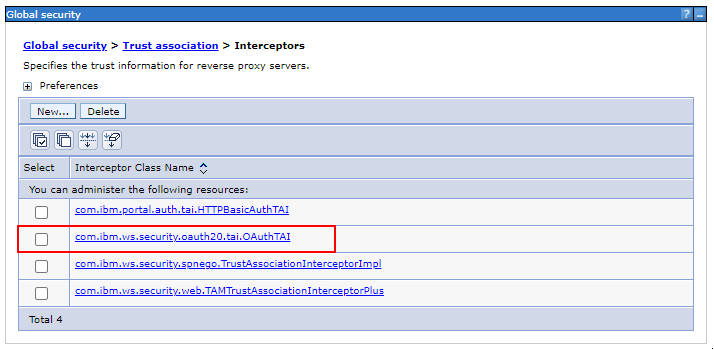
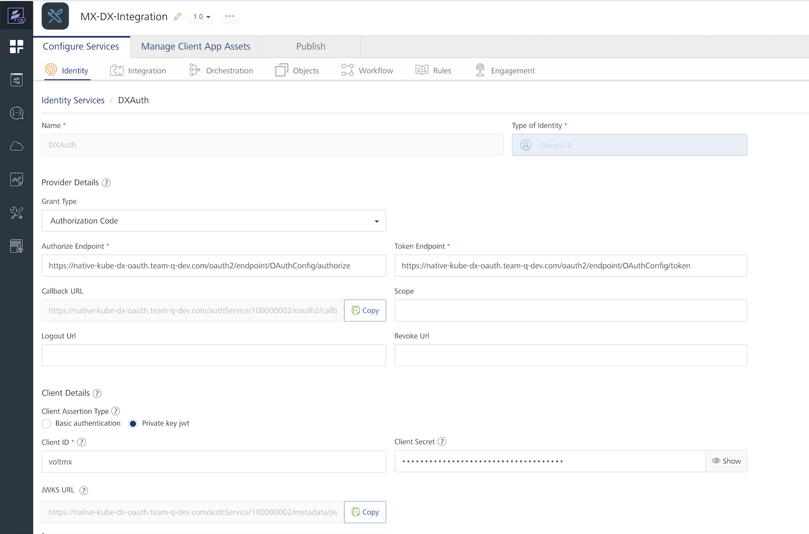

# Enabling SSO between HCL DX and HCL Volt MX Foundry

This topic explains how to enable Single Sign-On (SSO) between HCL Digital Experience (DX) and HCL Volt MX Foundry, where DX acts as the OAuth 2.0 service provider.

## Prerequisites

To enable SSO, ensure you have:

- DX and Volt MX Foundry deployed and accessible
- Access to the WebSphere Application Server
- Access to the Kubernetes CLI
- TLS certificates
- Admin credentials for both DX and Volt MX Foundry

## Setting up SSO

1. Create the OAuth service provider in HCL DX

    1. Access the DX Core Pod using the following command:

        ```bash
        kubectl exec -it <core-pod> core -n <namespace> -- sh
        ```

    2. Run the `wsadmin` utility using the following command to create the OAuth provider:

        ```bash
        cd /opt/HCL/AppServer/bin
        ./wsadmin.sh -lang jython -username <username> -password <password>

        AdminTask.createOAuthProvider('[-providerName OAuthConfig -fileName /opt/HCL/AppServer/properties/DXProvider.xml]')
        AdminConfig.save()
        quit
        ```

        - `<OAuthProviderName>` is the OAuth provider name (typically OAuthConfig).
        - `<ProviderConfigFile>` is the full path to the OAuth provider configuration file. Download and use the [DXProvider.xml](./DXProvider.xml){target="_blank"} configuration file which includes Auto Authorize setup for the VoltMX client.

    3. Verify the configuration file using the following command:

        ```bash
        # Ensure it exists at:
        /opt/HCL/wp_profile/config/cells/dockerCell/oauth20/OAuthConfig.xml
        ```

    4. Restart WebSphere Portal using the following command:

        ```bash
        ./stopServer.sh WebSphere_Portal -profileName wp_profile -username <username> -password <password>
        ./startServer.sh WebSphere_Portal -profileName wp_profile
        ```

2. Configure Trust Association Interceptors (TAI).

    1. Log in to the WebSphere Integrated Solutions Console as an administrator.

    2. Navigate to **Security > Global security > Web and SIP security > Trust association > Interceptors**.

        

        

    3. Ensure `com.ibm.ws.security.oauth20.tai.OAuthTAI` is in the list of Interceptors.

        

        If it is not on the list:

        1. Click **New...**.
        2. Under **Interceptor class name**, enter `com.ibm.ws.security.oauth20.tai.OAuthTAI`.
        3. Under **Custom properties**, add the following property:
            - **Name**: `provider_1.name`
            - **Value**: `OAuthConfig`
        4. Click **New** to add a new line. Then, add the following property:
            - **Name**: `provider_1.filter`
            - **Value**: `Authorization%=Bearer`

            

        5. Click **Apply**.
        6. Click **Save** at the top of the console messages.

3. Register the OAuth client.

    1. Copy the default client definitions using the following command:

        ```bash
        cp /opt/HCL/AppServer/properties/base.clients.xml /opt/HCL/wp_profile/config/cells/dockerCell/oauth20/
        ```

    2. Open the `base.clients.xml` file using the following command:

        ```sh
        vi /opt/HCL/wp_profile/config/cells/dockerCell/oauth20/base.clients.xml
        ```

    3. Add the following client definitions to the file to add Volt MX:

        ```
        <client id="voltmx" component="<OAUTH_PROVIDER_NAME>" secret="<OAUTH_SECRET>" displayname="Volt MX" redirect="https://<VOLT_MX_HOST>/<CALLBACK_URL_ENDPOINT>" enabled="true">
        </client>
        ```

        - `<OAUTH_PROVIDER_NAME>` is the name of the specified provider (for example, OAuthConfig).
        - `<OAUTH_SECRET>` is a complex, random secret (for example, a UUID). This secret will be required later.
        - `<VOLT_MX_HOST>` is the URL of the Volt MX deployment.
        - `<CALLBACK_URL_ENDPOINT>` endpoint found in the **Callback URL** under [Indentity Service](#image-section) configuration page.

        For example:

        ```
        <client id="voltmx" component="OAuthConfig" secret="a2e3d8c3-7875-4512-a0da-8b5fd61f2245" displayname="Volt MX" redirect="https://<voltmx-env.com>/authService/100000002/oauth2/callback" enabled="true">
        </client>
        ```

4. Install the OAuth application.

    1. Install the OAuth 2.0 provider app using the following command:

        ```bash
        ./wsadmin.sh -f ./installOAuth2Service.py install dockerNode WebSphere_Portal -profileName wp_profile -username <username> -password <password>
        ```

    2. Enable OAuth TAI using the following command:

        ```bash
        ./wsadmin.sh -lang jython -username <username> -password <password>
        AdminTask.enableOAuthTAI()
        AdminConfig.save()
        quit
        ```

    3. Restart the portal again.

5. Configure Identity Services in Volt MX.

    1. Create an application in Volt MX Foundry.

        For instructions, refer to [How to Add Applications](https://help.hcl-software.com/voltmx/v9.5/Foundry/voltmx_foundry_user_guide/Content/Adding_Applications.html){target="_blank"}.

    2. Configure the Identity Service settings:

        For instructions, refer to [Configure Identity Service](https://help.hcl-software.com/voltmx/v9.5/Foundry/voltmx_foundry_user_guide/Content/ConfigureIdentiryService.html){target="_blank"}.

        - Type: OAuth
        - Authorize Endpoint:

            ```bash
            https://<dx-host>/oauth2/endpoint/OAuthConfig/authorize
            ```

        - Token Endpoint:

            ```bash
            https://<dx-host>/oauth2/endpoint/OAuthConfig/token
            ```

        - Client ID / Secret: Use values from the OAuth client registration.

        {#image-section}

    3. Click **Test login** and confirm the OAuth login screen appears.

        

        !!! tip
            If the test login fails due to an SSL handshake error about a missing certification path, you need to add the certificates for the HCL DX host in the administrator console.

        To resolve this error, follow these steps:

        1. Log in to the WebSphere Integrated Solutions Console as an administrator.
        2. Navigate to **Security > SSL certificate and key management > Key stores and certificates > NodeDefaultTrustStore > Signer certificates > Retrieve from port**.
        3. Enter the HCL DX **Host**, **Port**, and **Alias**.
        4. Click **Retrieve signer information** then **Apply**.
        5. Click **Save** at the top of the console messages.

    4. Enable SSO in Volt MX.

        Go to **Identity Service > More Actions > Enable SSO**.

        

    For more information on Volt MX Foundry identity services, refer to [Configure Identity Service](https://help.hcl-software.com/voltmx/v9.5/Foundry/voltmx_foundry_user_guide/Content/ConfigureIdentiryService.html){target="_blank"}.

    !!!note
        If VoltMX and HCL DX environments are hosted on separate instances, there might be issues with Cross-Origin Resource Sharing (CORS). For more information, see the topic [CORS Configuration](https://help.hcl-software.com/voltmx/v9.2/Foundry/vmf_integrationservice_admin_console_userguide/Content/Runtime_Configuration.html#cors-configuration){target="_blank"}.

6. Enable SSO in the Iris application.

    1. Ensure the Iris is connected to the Foundry application which contains the SSO configurations. For more information on how to create an application, refer to [Getting started with Iris](https://help.hcl-software.com/voltmx/v9.5/Iris/iris_tutorials/Content/Module/getting_started_iris.html){target="_blank"}.

    2. Create login form in Iris using the guide reffered in [Getting started with Iris](https://help.hcl-software.com/voltmx/v9.5/Iris/iris_tutorials/Content/Module/getting_started_iris.html){target="_blank"}. 
    
    3. Add the following code to form init:

        ```javascript
        if (!VMXFoundry) return;
        var voltmxIdent = VMXFoundry.getIdentityService("DXAuth");
        var options = {};
        options.loginOptions = { isSSOEnabled: true };

        voltmxIdent.login(options,
        function(res) {
            alert("SSO success: " + JSON.stringify(res));
            var nav = new voltmx.mvc.Navigation("frmHome");
            nav.navigate();
        },
        function(err) {
            alert("SSO failed: " + JSON.stringify(err));
        }
        );
        ```

    4. Deploy the Iris application to HCL DX.

        For more information, see [How to Deploy Volt MX portlet into HCL DX](../example/integrate_mx_portlet_to_dx.md).

        After deploying the application, when the user goes to a web page, a window appears asking for permission to allow the client Volt MX to access the data. Click **Yes** to allow the portlet to login for single sign-on.

You have now successfully enabled SSO integration between HCL DX and Volt MX Foundry.
