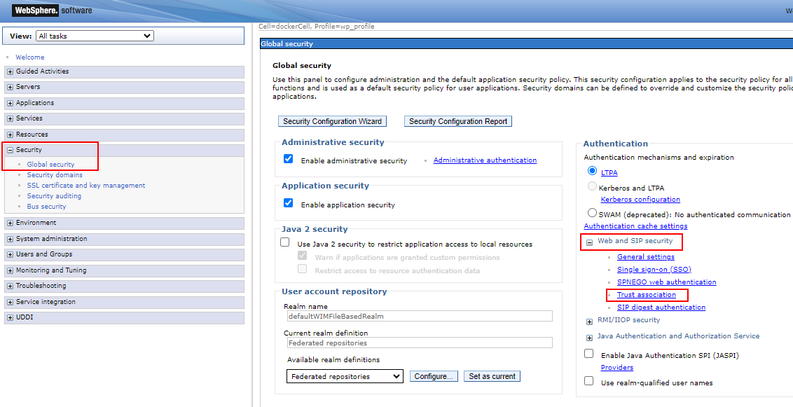
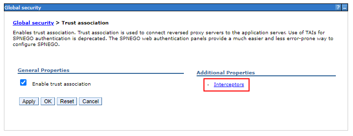
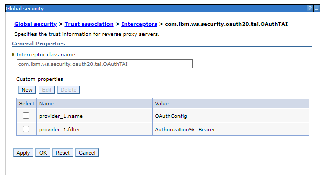
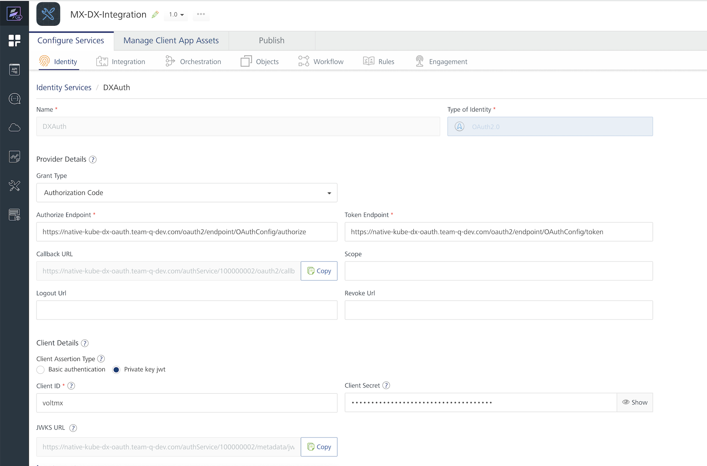
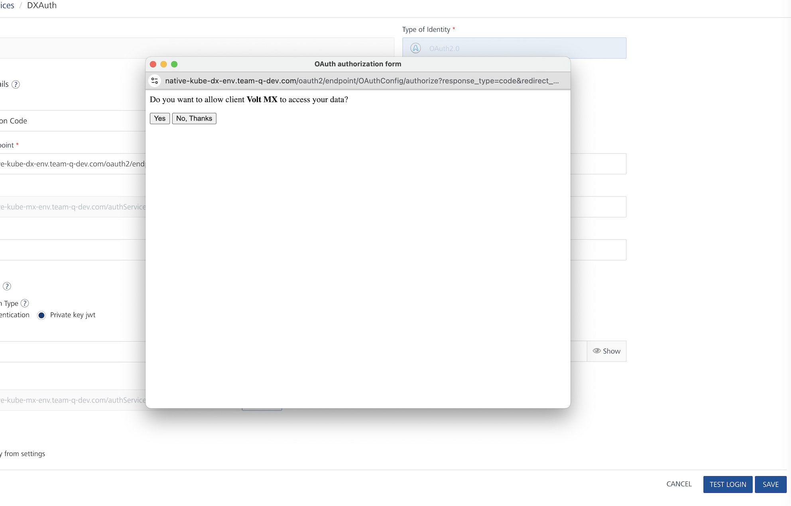
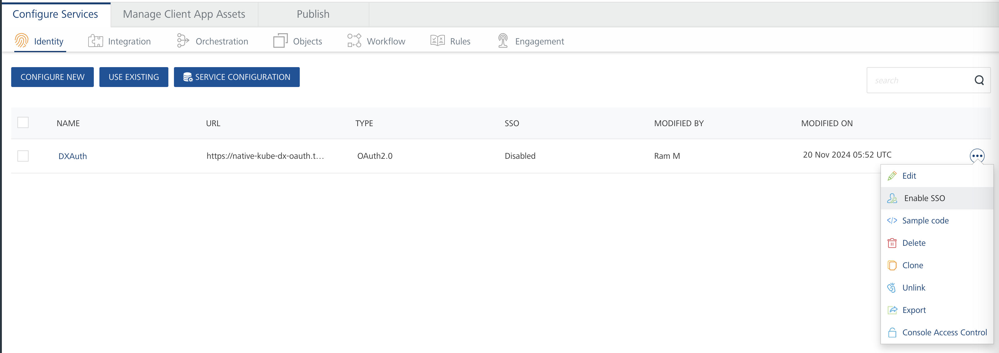

# Configuring HCL Volt MX Foundry for integration with HCL Digital Experience

## Configuring Ingress for HCL Digital Experience and HCL Volt MX Foundry

You can use an [optional Ingress](../../../../deployment/install/container/helm_deployment/preparation/optional_tasks/optional-configure-ingress.md) with HCL Digital Experience. While an Ingress is not required to run HCL Digital Experience, it can be configured to be reused by HCL Volt MX Foundry to handle the routing for both products and make them available on the same host.

1. Set up the Ingress for HCL Digital Experience. For more information, refer to the [optional Ingress documentation](../../../../deployment/install/container/helm_deployment/preparation/optional_tasks/optional-configure-ingress.md).
2. Configure HCL Volt MX Foundry to use the existing Ingress controller. The following sample values for HCL Volt MX Foundry configure the Ingress to use an SSL connection using the provided custom certificates. 
     - The certificate in `customCert` must match the certificate used for the Ingress configuration of HCL Digital Experience. The `cer` and `key` file must be located in the `apps/certs` directory of the MX Helm chart.
     - The `class` in this configuration refers to the class name of the deployed Ingress controller.
     - The `serverDomainName` must match the hostname that the Ingress is available at:
    
         ```yaml
         ingress:
           enabled: true
           protocol: "https"
           port: "443"
           class: "nginx"
           tls:
             enabled: true
             customCert:
               cert: "certs/your-ssl-cert.cer"
               key: "certs/your-ssl-cert.key"
         serverDomainName: "your-mx-and-dx-host.com"
         ```
         
     Refer to the [HCL Volt MX Foundry Configuration documentation](https://opensource.hcltechsw.com/volt-mx-docs/95/docs/documentation/Foundry/voltmxfoundry_containers_helm/Content/Installing_Containers_With_Helm.html#configuration) for more details on the used values.
     
After applying the configuration, both HCL Digital Experience and HCL Volt MX Foundry can be accessed using the provided hostname.

## Enabling SSO between HCL DX and Volt MX

This section provides information on how to enable single sign-on (SSO) for DX and Volt MX Foundry. HCL DX will act as the OAuth service provider. Therefore, you must configure OAuth in WebSphere to authenticate with HCL DX. The following steps outline the process to enable SSO:

1. [Create the OAuth service provider](#creating-the-oauth-service-provider).
2. [Configure TAI properties](#configuring-tai-properties).
3. [Register the OAuth client](#registering-the-oauth-client).
4. [Install the OAuth application](#installing-the-oauth-application).
5. [Add a new application in VoltMX Foundry](#adding-a-new-application-in-volt-mx-foundry).
6. [Add SSO in Iris](#adding-sso-in-iris).


### Creating the OAuth service provider

Follow the steps to create the OAuth service provider.

1. Connect to the HCL DX core pod using the following command:

    ```sh
      kubectl exec -it hcl-dx-dev1-core-0 core -n hcl-dx-dev1 -- sh
    ```

2. Create the OAuth provider by using the wsadmin utility.

    ```
    cd /opt/HCL/AppServer/bin
    ./wsadmin.sh -lang jython -username <username> -password <password>

    AdminTask.createOAuthProvider('[-providerName <OAuthProviderName> -fileName <ProviderConfigFile>]')
    ```

    Where:

    - `<OAuthProviderName>` is the OAuth provider name (typically OAuthConfig).
    - `<ProviderConfigFile>` is the full path to the OAuth provider configuration file. Download and use the [DXProvider.xml](../configuration/DXProvider.xml) configuration file which includes Auto Authorize setup for the VoltMX client.

    For example:

    ```
    AdminTask.createOAuthProvider('[-providerName OAuthConfig -fileName /opt/HCL/AppServer/properties/DXProvider.xml]')
    AdminConfig.save()
    quit
    ```

    This command copies the configuration file to `<was_profile_root>/config/cells/<cell_name>/oauth20`.

    Confirm the OAuth file exists. For example, `/opt/HCL/wp_profile/config/cells/dockerCell/oauth20/OAuthConfig.xml`.

3. Restart the WebSphere Application Server using the following command:

    ```sh
    cd /opt/HCL/AppServer/bin
    ./stopServer.sh WebSphere_Portal -profileName wp_profile -username <username> -password <password>
    ./startServer.sh WebSphere_Portal -profileName wp_profile
    ```

### Configuring TAI properties

Follow the steps to configure the Trust Association Interceptors (TAI) properties.

1. In the IBM WebSphere console, go to **Security > Global security**. 

2. In **Global security**, expand **Web and SIP security** and click **Trust association**.

    

3. Under **Additional Properties**, click **Interceptors**.

    

4. Make sure the `com.ibm.ws.security.oauth20.tai.OAuthTAI` exists.

    

5. (Optional) If the `com.ibm.ws.security.oauth20.tai.OAuthTAI` does not exist, add an Interceptor.
    
    1. Click **New**. 
    2. In the **Interceptor class name** field, enter `com.ibm.ws.security.oauth20.tai.OAuthTAI`.
    3. Under **Custom properties**, click **New**. Add the following custom properties:
        
        ```
        provider_1.name=OAuthConfig
        provider_1.filter=Authorization%=Bearer
        ```

        
    
    4. After the custom properties are added, click **OK**.

### Registering the OAuth client

Follow the steps to register the OAuth client.

1. Copy the default client definitions using the following command:

    ```
    cp <app_server_root>/properties/base.clients.xml <was_profile_root>/config/cells/<cell_name>/oauth20oauth20/
    ```

    For example:
    ```
    cp /opt/HCL/AppServer/properties/base.clients.xml /opt/HCL/wp_profile/config/cells/dockerCell/oauth20/
    ```

2. Edit the `base.clients.xml` file to include Volt MX client using the following commands:

    ```sh
    vi /opt/HCL/wp_profile/config/cells/dockerCell/oauth20/base.clients.xml
    ```

    ```
    <client id="voltmx" component="<OAUTH_PROVIDER_NAME>" secret="<OAUTH_SECRET>" displayname="Volt MX" redirect="https://<VOLT_MX_HOST>/auth/dx/<BASE_64_ENCODED_DX_HOSTNAME>/callback" enabled="true">
    </client>
    ```

    Where:

      - `<OAUTH_PROVIDER_NAME>` is the name of the specified provider (for example, OAuthConfig).

      - `<OAUTH_SECRET>` is a complex, random secret (for example, a UUID). This secret will be required later.
      
      - `<VOLT_MX_HOST>` is the URL of the Volt MX deployment. [Redirect URL](#add-a-new-app-in-foundry) should be available in Volt MX Foundry (for example, voltmx-env.com).

      - `<BASE_64_ENCODED_DX_HOSTNAME>` is a base64 (dx-hostname) encoded string.

    For example:

    ```
    <client id="voltmx" component="OAuthConfig" secret="a2e3d8c3-7875-4512-a0da-8b5fd61f2245" displayname="Volt MX" redirect="https://<voltmx-env.com>/authService/100000002/oauth2/callback" enabled="true">
    </client>
    ```

### Installing the OAuth application

Follow the steps to install the OAuth 2.0 service provider application.

1. Install the OAuth 2.0 service provider application using the following command:

    ```
    cd /opt/HCL/AppServer/bin
    ./wsadmin.sh -f ./installOAuth2Service.py install dockerNode WebSphere_Portal -profileName wp_profile -username <username> -password <password>
    ```

2. Enable OAuth 2.0 TAI using the following command:

    ```sh
    cd /opt/HCL/AppServer/bin
    ./wsadmin.sh -lang jython -username <username> -password <password>
    AdminTask.enableOAuthTAI()
    AdminConfig.save()
    quit
    ```

3. Restart the WebSphere Application Server using the following command:

    ```sh
    cd /opt/HCL/AppServer/bin
    ./stopServer.sh WebSphere_Portal -profileName wp_profile -username <username> -password <password>
    ./startServer.sh WebSphere_Portal -profileName wp_profile
    ```

### Adding a new application in Volt MX Foundry

1. Create a new application and configure the identity services as type OAuth. For instructions, refer to [How to Add Applications](https://opensource.hcltechsw.com/volt-mx-docs/95/docs/documentation/Foundry/voltmx_foundry_user_guide/Content/Adding_Applications.html){target="_blank"}.

    

    Refer to the following list for the field values:

    - **Authorize Endpoint**: ```https://<dx-host>/oauth2/endpoint/OAuthConfig/authorize```

    - **Token Endpoint**: ```https://<dx-host>/oauth2/endpoint/OAuthConfig/token```

    - The values for **Client Id** and **Secret** are the same. The value is provided when you [registered the OAuth client](#registering-the-oauth-client) in the `base.clients.xml`.

    For the **Authorize Endpoint** and **Token Endpoint** fields, replace `<dx-host>` in the URLs with the HCL DX hostname.
  
2. Click **Test login**. The OAuth authorization form appears. 

    !!! note
        If the test login fails due to an SSL handshake error about a missing certification path, add the certificates for the HCL DX host in the administrator console. Go to **Security > SSL certificate and key management > Key stores and certificates > NodeDefaultTrustStore > Signer certificates > Retrieve from port**. Enter the HCL DX host, port, and alias. Click **Retrieve signer information** and then **Save**.

3. When asked if you want to allow client Volt MX to access your data, click **Yes**. 

    

4. Click **Save** to finish the identity service configurations.

5. To enable SSO for the identity service, navigate to the service, click the **More actions** icon (three dots menu), and select **Enable SSO**.

  

For more information on Volt MX Foundry identity services, refer to [Configure Identity Services](https://opensource.hcltechsw.com/volt-mx-docs/95/docs/documentation/Foundry/voltmx_foundry_user_guide/Content/ConfigureIdentiryService.html){target="_blank"}.

!!! note
    If VoltMX and HCL DX environments are hosted on separate instances, there might be issues with Cross-Origin Resource Sharing (CORS). For more information, see the topic [CORS Configuration](https://opensource.hcltechsw.com/volt-mx-docs/docs/documentation/Foundry/vmf_integrationservice_admin_console_userguide/Content/Runtime_Configuration.html#cors-configuration){target="_blank"}. 


### Adding SSO in Iris

Follow the steps to add SSO in Iris.

1. Create a login page in Iris and add the following code in form init. Ensure the Iris is connected to the Foundry application which contains the SSO configurations. For more information on how to create an application, refer to [Getting started with Iris](https://opensource.hcltechsw.com/volt-mx-docs/95/docs/documentation/Iris/iris_tutorials/Content/Module/getting_started_iris.html){target="_blank"}.

    ```
      if(!VMXFoundry) return;
      var voltmxIdent = VMXFoundry.getIdentityService("DXAuth");
      var options = {};
      var loginOptions = {};
      loginOptions.isSSOEnabled = true;
      options.loginOptions = loginOptions;
      voltmxIdent.login(options, function(res) {
        alert("SSO user store success" + JSON.stringify(res));
        var ntf = new voltmx.mvc.Navigation("frmHome");
        ntf.navigate();
      },
        function(res) {
          alert("SSO user store failed" + JSON.stringify(res));
        }
      );
    ```

2. Deploy the Iris application to HCL DX. For more information, see [Deploying Volt MX portlet into HCL DX](../example/mx_portlet_in_dx.md).
         After deploying the application, when the user goes to a web page, a window appears asking for permission to allow the client Volt MX to access the data. 

3. Click **Yes** to allow the portlet to login for single sign-on.

