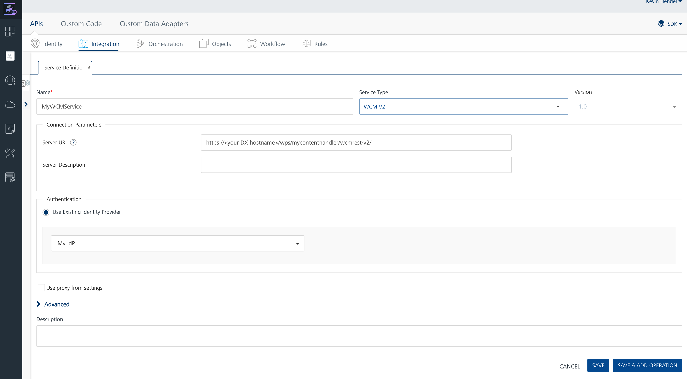
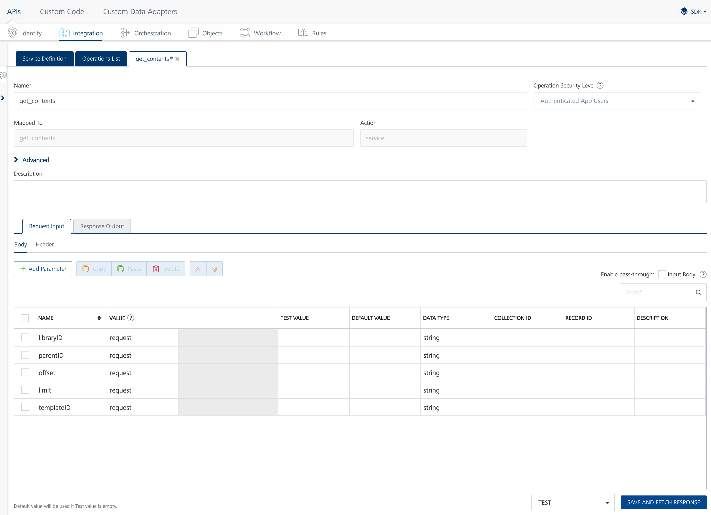

# Using HCL DX Experience APIs in HCL Volt MX Foundry

[Custom Data Adapters](https://opensource.hcltechsw.com/volt-mx-docs/95/docs/documentation/Foundry/voltmx_foundry_user_guide/Content/CustomDataConfig.html) are used in HCL Volt MX Foundry to integrate external services. These adapters act as reusable services with a defined set of operations. Starting CF218, a new custom data adapter called HCL DX Content Adapter is available. With this custom adapter, you can access the DX Experience APIs easily and you can create services in HCL Volt MX Foundry with predefined request and response schemas. All available endpoints are included in the HCL DX Content Adapter and you can use them when creating services.

## HCL DX Content Adapter for REST service for WCM REST V2

The Web Content Manager V2 (WCM REST V2) HCL DX Content Adapter includes all endpoints of the [WCM REST V2 APIs](../../../../manage_content/wcm_development/wcm_rest_v2/index.md).

Support for this feature is not available in the HCL Support Center. For questions and issues, reach out either in the [DXers - The HCL DX User Group](https://ptb.discord.com/channels/787019554173485067/992504153328861184) on Discord, the [HCL DX forum](https://support.hcltechsw.com/community?id=community_forum&sys_id=02c5dcf01b32f70cc1f9759d1e4bcb43) or in the [Volt MX Marketplace Forum](https://support.hcltechsw.com/community?id=community_topic&sys_id=941a3aabdbb43010cc426275ca961923).

### Downloading and importing the HCL DX Content Adapter in HCL Volt MX Foundry

To download and import HCL DX Content Adapter, there are two options:

- If you are using the SaaS offer of HCL Volt MX, import the HCL DX Content Adapter directly from the [HCL Volt MX Marketplace](https://marketplace.hclvoltmx.com/items/hcl-dx-content-adapter) using the Volt MX Foundry user interface. For instructions on how to consume a Custom Data Adapter from the Marketplace, see the [HCL Volt MX Foundry documentation](https://opensource.hcltechsw.com/volt-mx-docs/95/docs/documentation/Iris/iris_tutorials/Content/Module/consuming_data_adapter_from_marketplace.html).

- For [Helm deployments](../installation/index.md) of HCL Volt MX Foundry, download the the HCL DX Content Adapter from the [HCL Volt MX Marketplace](https://marketplace.hclvoltmx.com/items/hcl-dx-content-adapter) and import in the HCL Volt MX Foundry console by going to **API Management > Custom Data Adapters > Import**.

!!! note
    Make sure that the version of the HCL DX Content Adapter matches the version of your HCL DX deployment.

### Preparing the HCL DX environment

1. To make authenticated requests against the WCM V2 API, the recommended setup is for the HCL DX environment to use an [OIDC Identity Provider for authentication](../../../../deployment/manage/security/people/authentication/oidc/index.md).

2. Configure the WCM REST V2 API to use the identity provider instead of Basic Authentication. To change this, access the WebSphere Administration console and navigate to **Security > Global Security > Web and SIP security > Trust association > Interceptors > com.ibm.portal.auth.tai.HTTPBasicAuthTAI**.

3. Either remove `/wps/mycontenthandler*` from the `urlWhiteList` property or remove the property completely if it is the only entry. 

4. Restart the Websphere Application Server or all Core Pods after applying the change.

Preparing the HCL DX environment allows HCL Volt MX Foundry to use the same identity provider and forward the authentication to the backend API.

### Preparing the HCL Volt MX Foundry environment

In HCL Volt MX Foundry, set up an [OAuth 2.0 identity provider](https://opensource.hcltechsw.com/volt-mx-docs/95/docs/documentation/Foundry/voltmx_foundry_user_guide/Content/Identity10_VoltMX_OAuth2.html). This identity provider must be connected to the same identity provider as the HCL DX environment.

### Creating a Service using the HCL DX Content Adapter

To configure a new Service in HCL Volt MX Foundry using the HCL DX Content Adapter:

1. Create a new Integration Service. Refer to the [HCL Volt MX Foundry Documentation](https://opensource.hcltechsw.com/volt-mx-docs/95/docs/documentation/Foundry/voltmx_foundry_user_guide/Content/ConfigureIntegrationService.html) for instructions. Select the newly imported WCM V2 HCL DX Content Adapter as the **Service Type**.

2. For the **Server URL**, set the URL to your HCL DX environment. For example, `https://<your DX hostname>/wps/mycontenthandler/wcmrest-v2/`. 

3. For **Authentication**, set the Identity provider configured in the [Prepare the HCL Volt MX Foundry environment](#prepare-the-hcl-volt-mx-foundry-environment) section.

4. Click **Save & Add Operation** to confirm. 

In the next section, you can choose from the list of **Operations** to add the WCM REST V2 endpoints. For a detailed description of all available endpoints, refer to [WCM V2 API specification](https://opensource.hcltechsw.com/experience-api-documentation/wcm-api/).

### Testing the Service

In the HCL Volt MX Foundry console, you have the option to test each operation after creating it. You can test an operation by clicking the **Save and Fetch response** button at the bottom of each operation. A new window appears where you can log in to your identity provider. The result of the request is logged at the bottom of the console.

After confirming the request is successful, you can use the WCM REST V2 endpoints in accordance to the Volt MX Integration Service documentation.

For additional information on HCL Volt MX Foundry Services, refer to the following topics:

- [Integration introduction](https://opensource.hcltechsw.com/volt-mx-docs/95/docs/documentation/Foundry/voltmx_foundry_user_guide/Content/Services.html)
- [Configure Integration Service](https://opensource.hcltechsw.com/volt-mx-docs/95/docs/documentation/Foundry/voltmx_foundry_user_guide/Content/ConfigureIntegrationService.html)
- [Advanced Configurations](https://opensource.hcltechsw.com/volt-mx-docs/95/docs/documentation/Foundry/voltmx_foundry_user_guide/Content/Advanced_Configurations.html)

## HCLSoftware U learning materials

For an introduction and a demo on how to integrate DX with HCL Volt MX as a business user, go to [DX Integration with HCL Volt MX for Business Users](https://hclsoftwareu.hcltechsw.com/component/axs/?view=sso_config&id=3&forward=https%3A%2F%2Fhclsoftwareu.hcltechsw.com%2Fcourses%2Flesson%2F%3Fid%3D747){target="_blank"}. To try it out yourself, refer to [DX Integration with
HCL Volt MX for Business Users Lab](https://hclsoftwareu.hcltechsw.com/images/Lc4sMQCcN5uxXmL13gSlsxClNTU3Mjc3NTc4MTc2/DS_Academy/DX/Integration/HDX-INT-BU_DX_Integration_with_HCL_Volt_MX_for_Business_Users.pdf){target="_blank"}.

For an introduction and a demo on how to integrate DX with HCL Volt MX as a developer, go to [DX Integration with HCL Volt MX for Developers](https://hclsoftwareu.hcltechsw.com/component/axs/?view=sso_config&id=3&forward=https%3A%2F%2Fhclsoftwareu.hcltechsw.com%2Fcourses%2Flesson%2F%3Fid%3D1458){target="_blank"}. To try it out yourself, refer to [DX Integration with
HCL Volt MX for Developers Lab](https://hclsoftwareu.hcltechsw.com/images/Lc4sMQCcN5uxXmL13gSlsxClNTU3Mjc3NTc4MTc2/DS_Academy/DX/Integration/HDX-INT-DEV_DX_Integration_with_HCL_Volt_MX_for_Developers.pdf){target="_blank"}.

You can also use the dedicated course [HCL Volt MX Integration with HCL DX](https://hclsoftwareu.hcltechsw.com/courses/course/hvmx-int-hdx-integrate-hcl-volt-mx-with-hcl-digital-experience){target="_blank"}. This course explains the benefits of integrating HCL Volt MX with HCL DX and provides integration guidance for business users, developers, and administrators.
