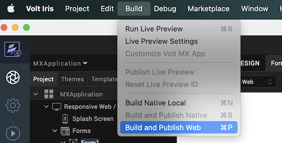

# Deploying HCL Volt MX portlets into HCL DX

This guide shows you how to generate a Volt MX portlet using Iris, deploy it into HCL Digital Experience (DX), and verify that the portlet renders correctly on a DX page.

## Prerequisites

To follow this guide, ensure you have:

- HCL Volt MX Iris installed
- An active HCL DX deployment
- Access to credentials and hostname for your DX environment
- An existing or new Volt MX Web App project

## Generating and deploying HCL Volt MX portlets

1. Create or use a Web App project in Iris.

    1. Open HCL Volt MX Iris.
    2. Create a new Web App project or open an existing one.

        For more on creating and managing projects in Iris, refer to [Create, Migrate, or Import a Project](https://opensource.hcltechsw.com/volt-mx-docs/95/docs/documentation/Iris/iris_user_guide/Content/CreateMigrateOrImportProject.html){target="_blank"}.

2. Configure the HCL DX host in Iris.

    In the Iris project settings, configure the DX host details such as:

    - Hostname of the DX deployment
    - Port and protocol (for example, `https://dx-hostname.com`)

    

3. Build and publish the Volt MX portlet.

    1. From the **Build** dropdown menu, select **Build and Publish Web**.

        

    2. In the **Post Build Actions**, choose:
        - **Build and Publish Portlet to DX**
        - Check the **Clean Build** box.

        

    3. Click **Build** to generate and deploy the portlet to DX.

        For more information, refer to [Publishing a Web App in Volt MX Iris](https://opensource.hcltechsw.com/volt-mx-docs/95/docs/documentation/Iris/iris_user_guide/Content/WebPublish.html#overview){target="_blank"}.

4. Add the portlet to a DX page.

    1. Log in to HCL DX as an administrator.
    2. Toggle **Edit Mode** from the site toolbar.
    3. Navigate to the page where you want to place the portlet.
    4. Click **Add page components and applications**.

        

    5. Under the **Applications** tab, use the search bar to locate the deployed Volt MX portlet.
    6. Click the **Add (+)** icon next to the desired portlet.

        

    7. Exit **Edit Mode** and verify that the portlet renders correctly on the page.

5. (Optional) Enable SSO for the portlet

    If your Volt MX app contains a login page but you want to use SO using HCL DX, follow the steps in [How to Enable SSO Between HCL DX and Volt MX](../configuration/enable_sso.md).

You have successfully deployed and verified the HCL Volt MX portlet in HCL DX.
