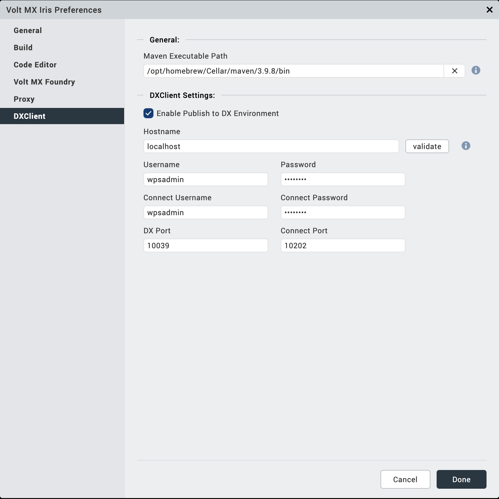
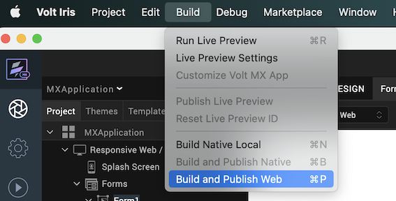
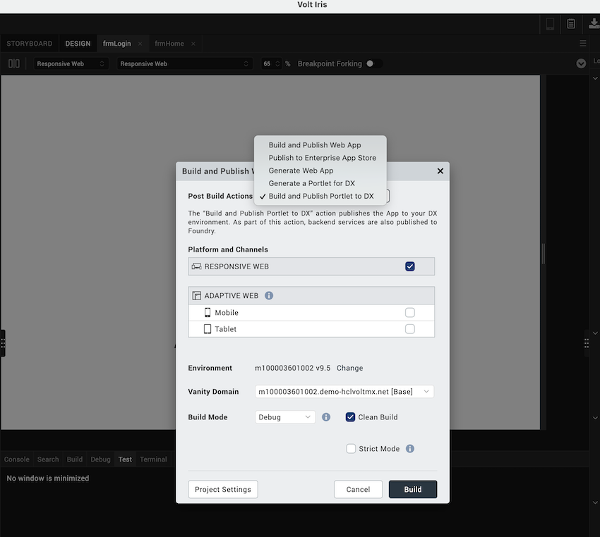
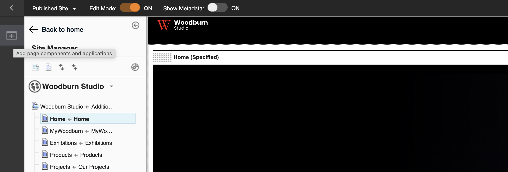
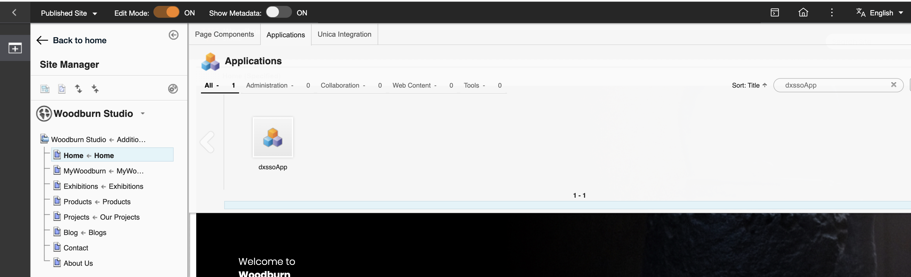

# Deploying HCL Volt MX portlets into HCL DX

The following example provides the steps to generate the Volt MX portlet through Iris, deploy the portlet in HCL Digital Experience (DX), and verify the portlet deployed.

## Creating a Volt MX portlet and deploying in HCL DX

1. Create a new or use an existing **web app** project in Iris. For more general information about projects in Iris, refer to [Create, Migrate, or Import a Project](https://opensource.hcltechsw.com/volt-mx-docs/95/docs/documentation/Iris/iris_user_guide/Content/CreateMigrateOrImportProject.html){target="_blank"}.

2. Configure the HCL DX host details in Iris. See the following example:

    

3. Once the App is created in Iris, choose **Build and Publish Web** option from **Build** menu.
    

4. Choose **Build and Publish Portlet to DX** from the drop-down of **Post Build Actions**. Select the **Clean Build** checkbox and click on **Build**.
    
    

This creates a Volt MX portlet with the project name and deploys the same portlet in HCL DX.

For additional details about publishing portlets to HCL DX, refer to the relevant sections of [Publishing a Web App in Volt MX Iris](https://opensource.hcltechsw.com/volt-mx-docs/95/docs/documentation/Iris/iris_user_guide/Content/WebPublish.html#overview) 

## Adding the Volt MX portlet to HCL DX and verifying the portlet
1. Log in to HCL DX.

2. Go to the site menu and turn on **Edit Mode**.

3. Navigate to the page where you want to add the Volt MX portlet.

4. Click the **Add page components and applications** icon.

    

5. Under the **Applications** tab, search for the deployed Volt MX portlet in the search bar.

6. Hover over the portlet you want to add and click **Add** (+). 

    

7. Turn off **Edit Mode** and verify if the portlet is properly rendered. 

8. (Optional) If the app contains a login page but you prefer using single sign-on (SSO) with HCL DX credentials, you can configure SSO using the steps in [Enabling SSO between HCL DX and Volt MX](../configuration/index.md#enabling-sso-between-hcl-dx-and-volt-mx).

