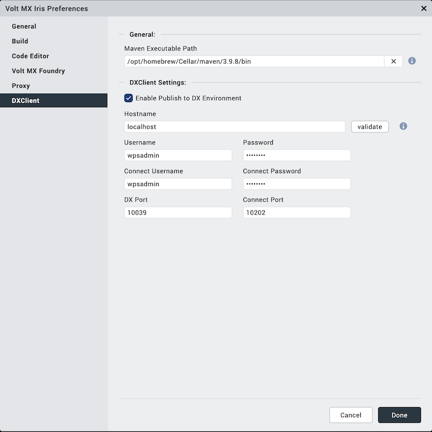

# Deploy Volt MX portlet into HCL DX

This example shows step by step process of generating the portlet via Iris, deploying it in HCL DX and verifying

## Creating the Volt MX portlet and deploying in HCL DX

1. Create a new project in Iris. Refer this [link](https://opensource.hcltechsw.com/volt-mx-docs/docs/documentation/index.html) for more details.
2. Configure the HCL DX host details in Iris.

3. Once the App is created in Iris, choose build and publish web option from build menu.

4. This will create an Volt MX portlet with the project name and deploy the same in HCL DX.

## Add Volt MX portlet to HCL DX and verify
1. Login to the DX Application. 
2. Go to the site menu, turn edit mode on and navigate to the page where the Volt MX portlet should be added. 
3. click on `Add page components and application` option

4. Search for the deployed Volt MX portlet in the `Applications` tab and add it to the page.

5. Turn off edit mode and verify if the portlet is properly rendered. If the app contains a login page but single sign-on using HCL DX credentials is preferred, refer to this [link](../configuration/index.md#enable-sso-for-dx-and-mx) for configuring SSO.

