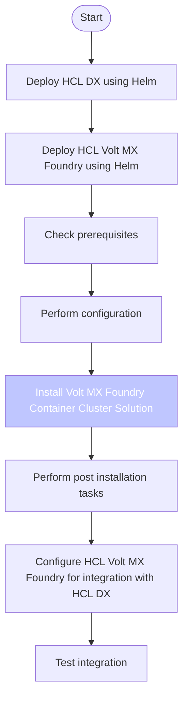

# Integrating HCL Volt MX Foundry with HCL Digital Experience

Volt MX Foundry is a back-end service provider that helps developers build omni-channel digital applications. Volt MX Foundry ensures that developers build mobile applications quickly and obtain secured back-end services instantly. Volt MX Foundry has multiple features, such as - Identity, Integration, Objects, Orchestration, and Engagement Services. These features can be accessed through a common, centralized VoltMXFoundry Console. For more information, see the [HCL Volt MX documentation](https://opensource.hcltechsw.com/volt-mx-docs/docs/documentation/Foundry/voltmxFoundryFundamentals.html).

The HCL Digital Experience (DX) Cloud Native offering includes the Volt Foundry files, HCL Volt Foundry Container installer (Kubernetes cluster), and HCL Volt Foundry Container deployment tool that should be used to deploy Volt Foundry for use with DX on supported K8s platforms. Platform-specific Foundry deployment files are not provided. To deploy Volt Foundry with HCL DX Cloud Native 9.5.x deployments on supported Kubernetes platforms, the latest versions of the following Foundry files are provided:

- `HelmChart-9.5.15.8_GA.zip`
- `VoltFoundtryContainersOnPrem-9.5.15.8_GA.zip `
- `mfcli_9.5.3.4_GA.jar`

!!! note
    This guide only applies to HCL Digital Experience 9.5 Container Deployments in combination with HCL Volt MX Foundry Helm installations.
    The currently supported version combination is:

      - HCL Digital Experience CF213 and later versions
      - HCL Volt MX Foundry 9.5.3.0

    Note that the specified HCL Volt MX Foundry version is the tested version. Using later versions will most probably work but it is not guaranteed.

Follow the installation and configuration steps to integrate HCL Digital Experience to work with HCL Volt MX Foundry. 
<!--

-->

-   **[Install HCL Digital Experience and HCL Volt MX Foundry using Helm](./installation/index.md)**
-   **[HCL Volt MX Foundry configuration for the integration with HCL Digital Experience](./configuration/index.md)**  
-   **[Test the integration using example integrations](./example/index.md)** 
-   **[Considerations and limitations](./considerations/index.md)**

## HCLSoftware U learning materials

For an introduction and a demo on how to integrate DX with HCL Volt MX as a business user, go to [DX Integration with HCL Volt MX for Business Users](https://hclsoftwareu.hcltechsw.com/component/axs/?view=sso_config&id=3&forward=https%3A%2F%2Fhclsoftwareu.hcltechsw.com%2Fcourses%2Flesson%2F%3Fid%3D747){target="_blank"}. To try it out yourself, refer to [DX Integration with
HCL Volt MX for Business Users Lab](https://hclsoftwareu.hcltechsw.com/images/Lc4sMQCcN5uxXmL13gSlsxClNTU3Mjc3NTc4MTc2/DS_Academy/DX/Integration/HDX-INT-BU_DX_Integration_with_HCL_Volt_MX_for_Business_Users.pdf){target="_blank"}.

For an introduction and a demo on how to integrate DX with HCL Volt MX as a developer, go to [DX Integration with HCL Volt MX for Developers](https://hclsoftwareu.hcltechsw.com/component/axs/?view=sso_config&id=3&forward=https%3A%2F%2Fhclsoftwareu.hcltechsw.com%2Fcourses%2Flesson%2F%3Fid%3D1458){target="_blank"}. To try it out yourself, refer to [DX Integration with
HCL Volt MX for Developers Lab](https://hclsoftwareu.hcltechsw.com/images/Lc4sMQCcN5uxXmL13gSlsxClNTU3Mjc3NTc4MTc2/DS_Academy/DX/Integration/HDX-INT-DEV_DX_Integration_with_HCL_Volt_MX_for_Developers.pdf){target="_blank"}.

You can also use the dedicated course [HCL Volt MX Integration with HCL DX](https://hclsoftwareu.hcltechsw.com/courses/course/hvmx-int-hdx-integrate-hcl-volt-mx-with-hcl-digital-experience){target="_blank"}. This course explains the benefits of integrating HCL Volt MX with HCL DX and provides integration guidance for business users, developers, and administrators.
