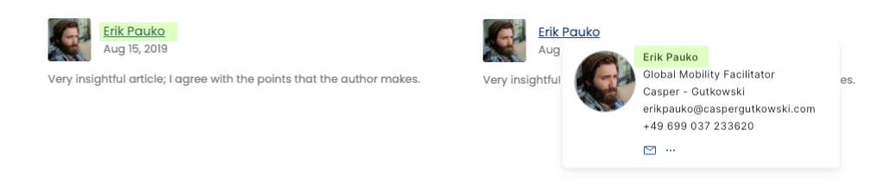
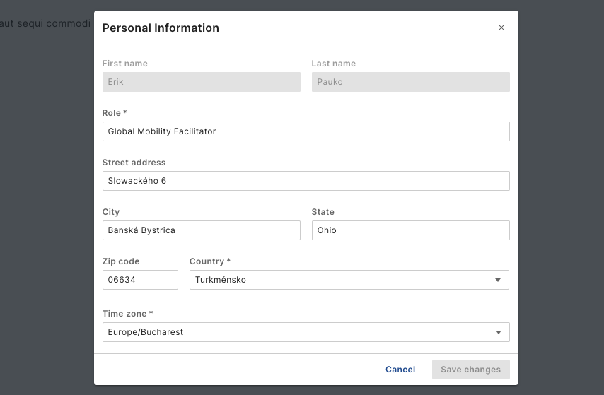

# Working with people profiles

!!! Notes
    Write doc about how to work with and relate to user profiles. This includes much of the information in here, likely in more catered order. I.e., what the profile shows, how to find and edit my own profile (w/ different sections, validation and image), how to work with tags.

Profiles are a central entity in the people service. They provide a way to manage and access information about people, including their personal information, skills, and more. Individual users are enabled to manage their own profiles by adding or updating information such as their profile image, contact details, a professional summary, their job title, and tags.

## Accessing user profiles

Depending on the integration mode of the people service, user profiles can be accessed in different ways. In a standalone mode, the people service provides a user interface that allows users to search for and view profiles. In an integrated mode, user profiles can be accessed through the integrated application, such as a digital experience platform.

In DX, for example, user profiles are referenced via portlets or via components or hooks that DX practicioners can use to integrate user profiles into their DX content and pages. In addition, they can be accessed through the people service business card component, which provides a quick overview of a user's profile information. Refer to the section about [working with business cards](business-card-guide.md) for more information.

## Managing your own profile

Users can manage their own profiles by adding or updating information. To edit your profile, navigate to your profile page. To do so, log in to DX and click on the "My Profile" link in the DX navigation. This brings you to the profile page, where you can view and edit your profile information.

The profile page is divided into different sections, such as contact information, personal information, and professional summary. You can update your profile image, contact details, and other information by clicking the "Edit" button in the respective section. Adjust the information as needed and click "Save" to save your changes.

### Field validation

Where applicable, field validation is in place to ensure that the information you provide is accurate and complete. For example, email addresses are validated to ensure they are in the correct format. Error messages will be displayed in the edit form if there are any issues with the information you provide.

### Read only fields

Some fields in your profile may be read-only, meaning that you cannot edit them. These fields are typically populated from an external source, such as a user directory, and are managed by an administrator. If you need to update information in a read-only field, contact your administrator for assistance.

### Profile image

Your profile image is an important part of your profile, as it helps other users identify you. To update your profile image, click on the "Edit profile image" button in the profile image section. You can upload a new image or remove the existing one. Make sure to select an image that is clear and professional to represent you appropriately.