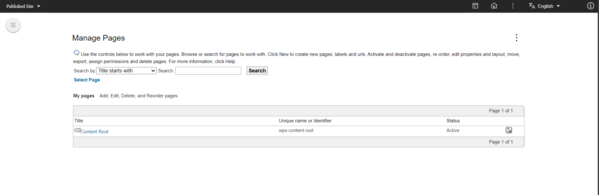
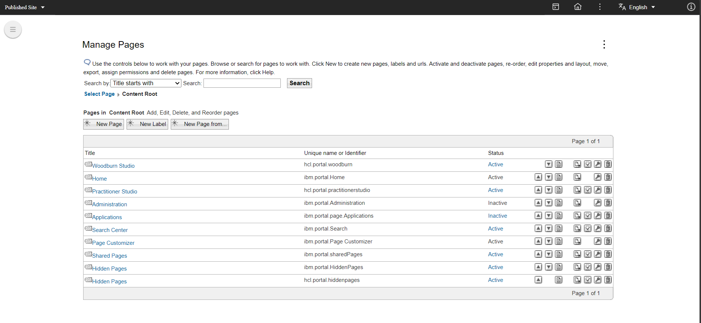

# Creating My Profile link

You can add a link to your pages that takes you to your profile. There are many ways to achieve this. In the context of this document, we will provide guidance on how to add a "My Profile" link to Woodburn.

## Creating the "My Profile" link

1. Click **Administration** on the Practitioner Studio Home Page.
    
2. Select the **Site Management** section.
    
3. Click the **Content Root** link.
    
4. Click the **Woodburn Studio** link.
    
5. Click the **New URL** link and add the following details, then click **OK**:
    - **Title**: My Profile
    - **Friendly URL name**: myprofilepage
    - **A link to the following portal page**:
        - **Select a top-level page**: Practitioner Studio
        - **Select a child page**: hcl.portal.peopleservice

    
    

## Verifying the "My Profile" link

To verify the link, follow these steps:

1. Go to the **Woodburn Studio** Home Page.
    - You will see the **My Profile** link in the top navigation menu.
      
2. Click on the **My Profile** link.
    - You will be navigated to the logged-in user's profile page.
      

