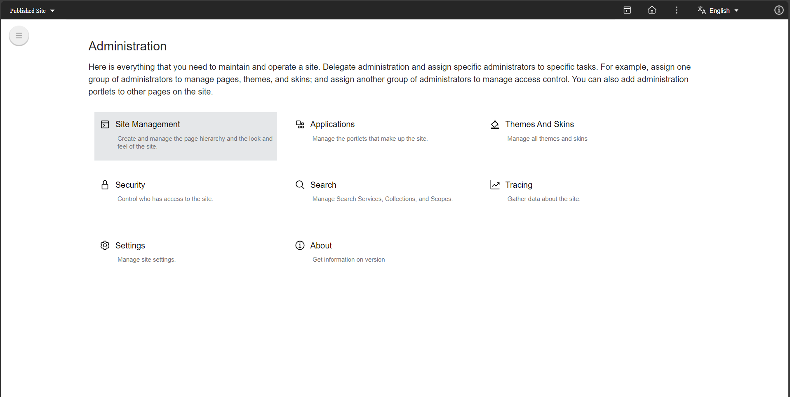
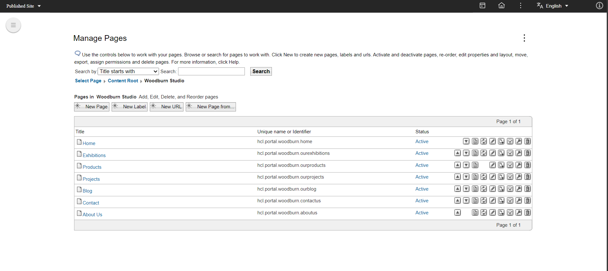
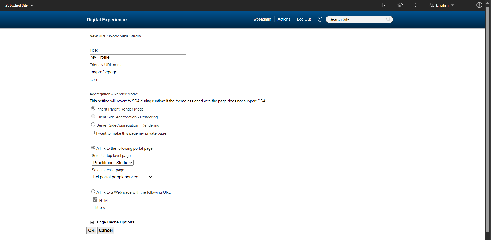
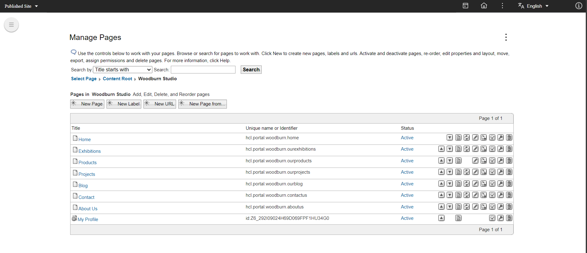
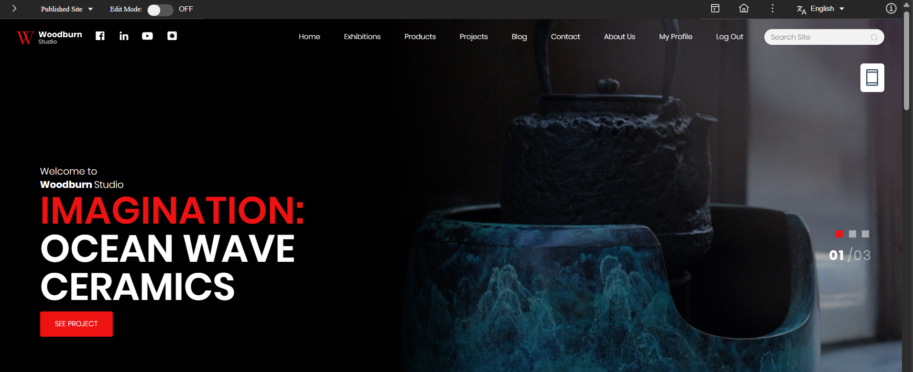
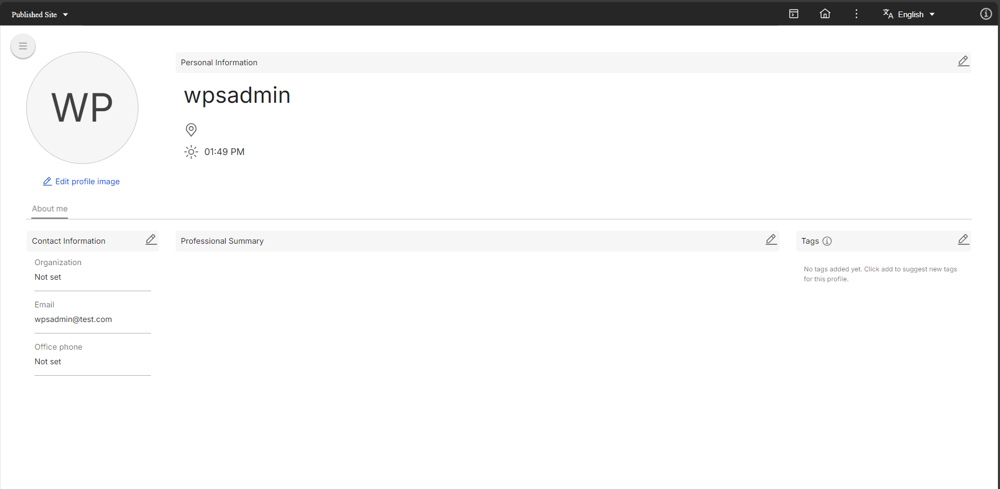

# Creating My Profile links

You can add a link to your pages that takes you to your profile. There are many ways to achieve this. In the context of this document, we will provide guidance on how to add a **My Profile** link to Woodburn Studio.

## Creating a My Profile link

To create a link to your **My Profile** page, follow these steps:

1. In the Practitioner Studio homepage, go to **Applications menu** > **Administration** > **Site Management**.
    
    
2. Click **Content Root > Woodburn Studio**.
    
    
3. Click **New URL** and add the following details, then click **OK**:

    - **Title**: My Profile
    - **Friendly URL name**: myprofilepage
    - **A link to the following portal page**:
        - **Select a top-level page**: Practitioner Studio
        - **Select a child page**: hcl.portal.peopleservice
        
    
    
    After saving, the **My Profile** link will be listed in **Manage Pages**.
    

## Verifying the "My Profile" link

To verify the link, perform the following steps:

1. Go to the **Woodburn Studio** homepage. You should see the **My Profile** link in the top navigation menu.
      
      
2. Click **My Profile** to view your profile page.
      

