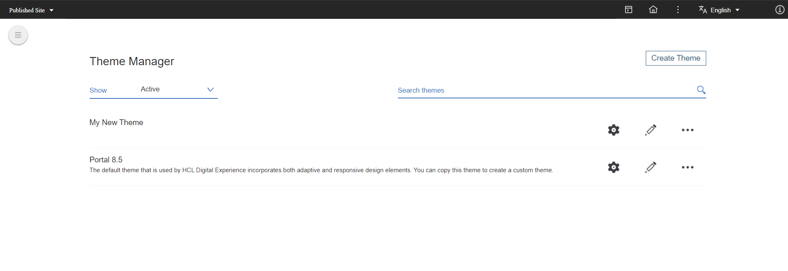
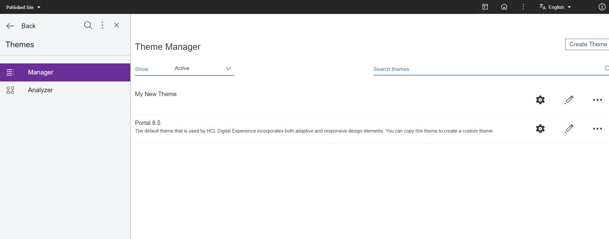

# Verifying and Linking People Service System Modules in HCL Digital Experience

This guide provides step-by-step instructions on enabling the people service resources on a theme in HCL Digital Experience (DX) and verifying their integration.

## Enabling People Service Resources on a Theme

To enable people service resources on a theme in HCL Digital Experience (DX), follow these steps:

 1. Access the Themes Section:
    - Click **Themes** in the Practitioner Studio Home Page.
        

 2. Open the Theme Editor:
    - Click the **Menu** button at the upper left most part of the screen.
        
    - Click the **Manager** menu icon in the top-left corner.
        
    - Click the pencil icon on the right side of the theme you want to use.
        

 3. Edit the Theme Profile:
    - In the theme editor, open the file `profiles > profile_deferred.json`.
        
    - In the `moduleIDs` section, add the `dx_peopleservice_js` ID to the array.
        

 4. Save the Changes:
    - Click on the Save button (disc icon) in the upper right area.

## Verifying the People Service Module in HCL Digital Experience

To verify that the people service module is correctly integrated, follow these steps:

 1. Access the Analyzer:
    - Click the **Analyzer** menu, then click the **Examine Modules > All Modules** 
        

 2. Locate the System Modules:
    - Open **System Modules**.
        

 3. Find the People Service Module:
    - Locate the module `dx_peopleservice_js` in the list of modules.
        

 4. Verify the Module Contribution:
    - In the contribution section, click on the listed Location.
        
    - Ensure the link that opens shows the expected JavaScript resource (Web component).

## Important information

The profile to which you add the module depends on your usage of themes within DX pages. You may need to add the theme definition to another profile and ensure the pages that require the resource match your theme configuration.

