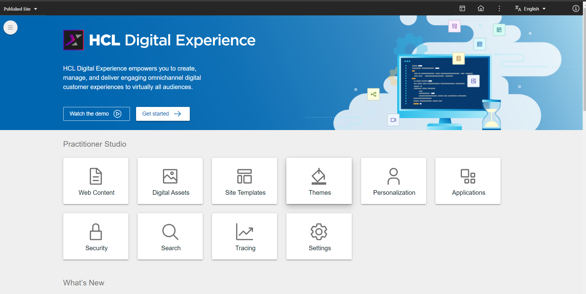
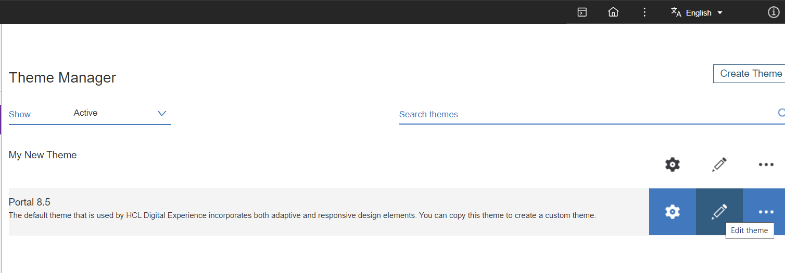
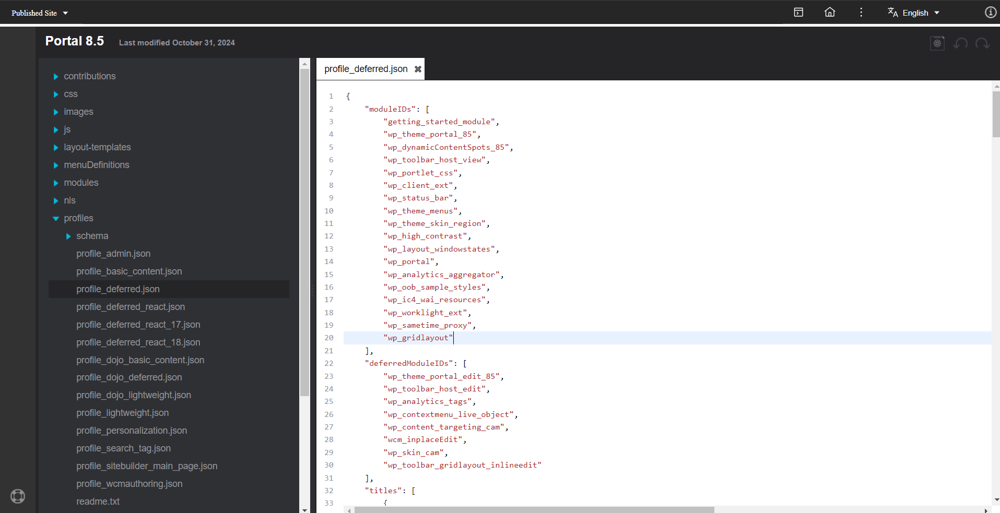
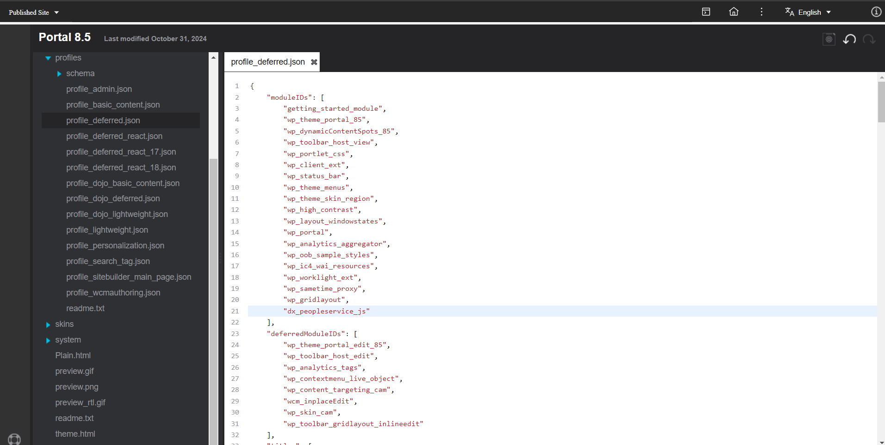
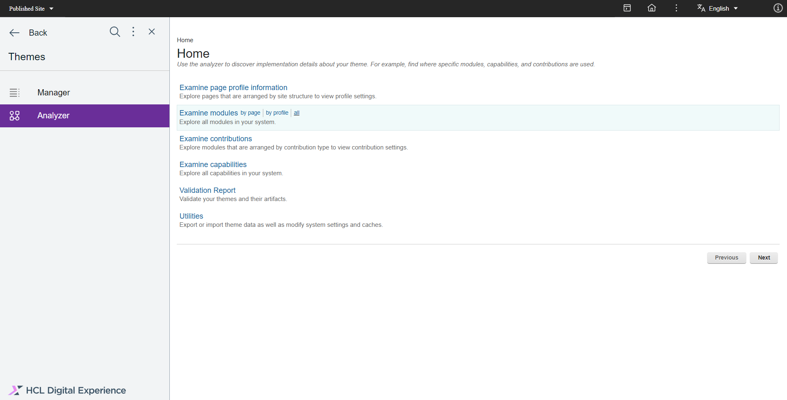
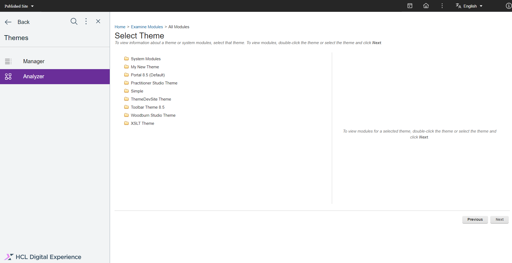
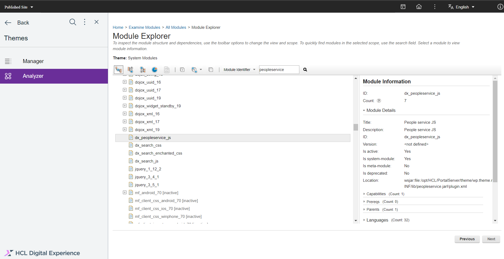
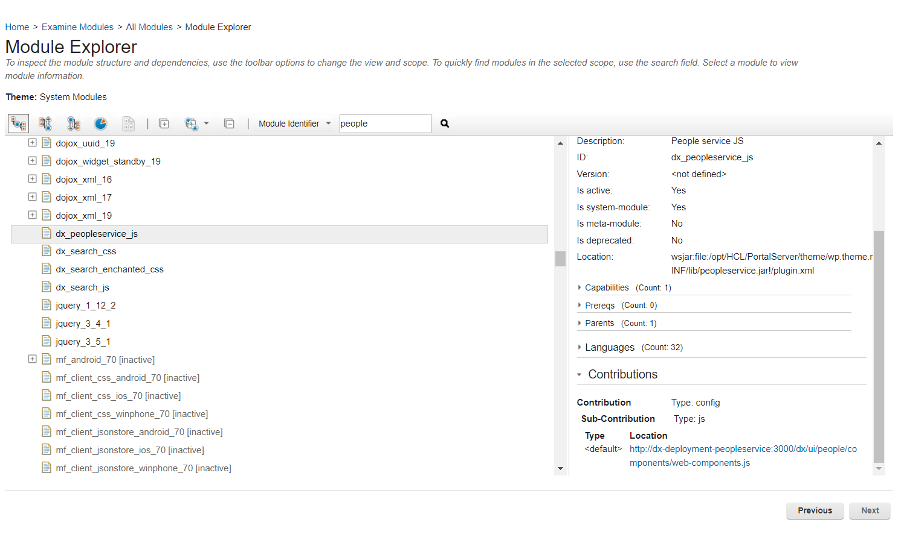

# Verifying and Linking People Service System Modules in HCL Digital Experience

This guide provides step-by-step instructions on enabling People Service resources on a theme in HCL Digital Experience (DX) and verifying their integration.

!!! Note
    The profile where you add the module depends on your theme configuration within DX pages. You may need to add the theme definition to another profile and ensure the pages that require the resource match your theme configuration.

## Enabling People Service Resources on a Theme

To enable People Service resources on a theme in HCL Digital Experience (DX), follow these steps:

 1. In the Practitioner Studio Home Page, go to **Themes**.
        

 2. Click the **Edit theme** pencil icon on the theme you want to use.
        

 3. Edit the **Theme Profile**.
    1. In the **Theme Editor**, open the file **profiles > profile_deferred.json.**
        
    2. In the `moduleIDs` section, add the `dx_peopleservice_js` ID to the array.
        

 4. Click the **Save** disc icon on the upper-right corner to save your changes.

## Verifying the People Service Module in HCL DX

To verify that the People Service module is correctly integrated, follow these steps:

 1. Click the **Menu** icon on the upper-left corner and go to **Analyzer > Examine Modules > All Modules**.
        

 2. Click the **System Modules** folder.
        

 3. In the **Module Explorer**, locate and select the **dx_peopleservice_js** module.
        

 4. Scroll down to the **Contributions** section on the right side and click the listed **Location**. Ensure that the link shows the expected JavaScript resource (Web component).
        

